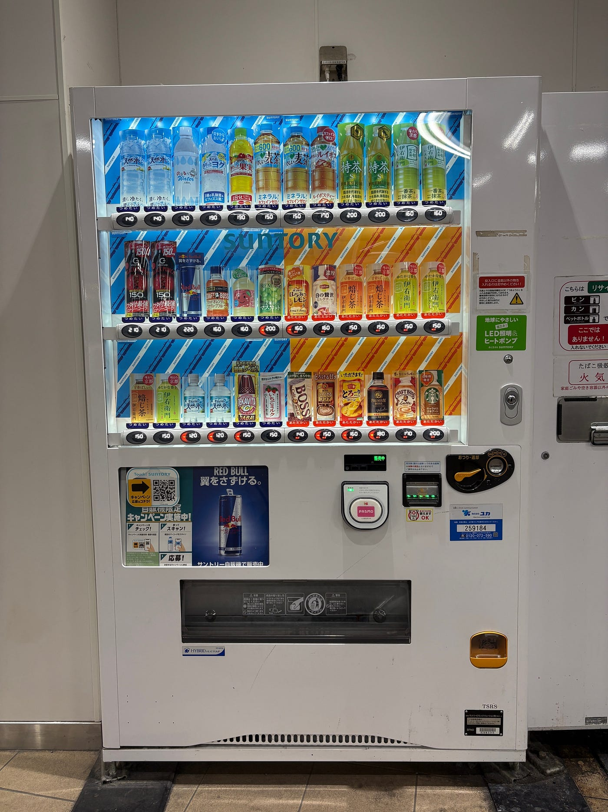
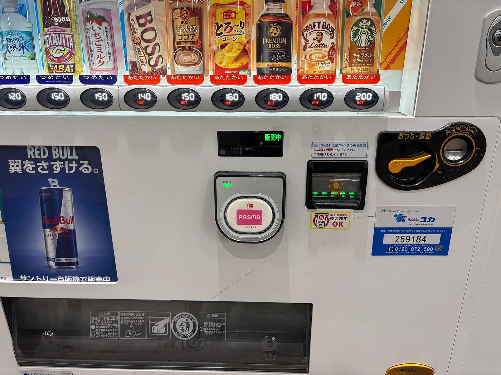
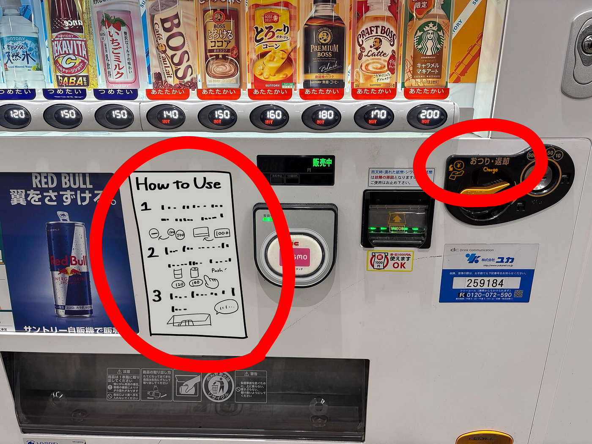
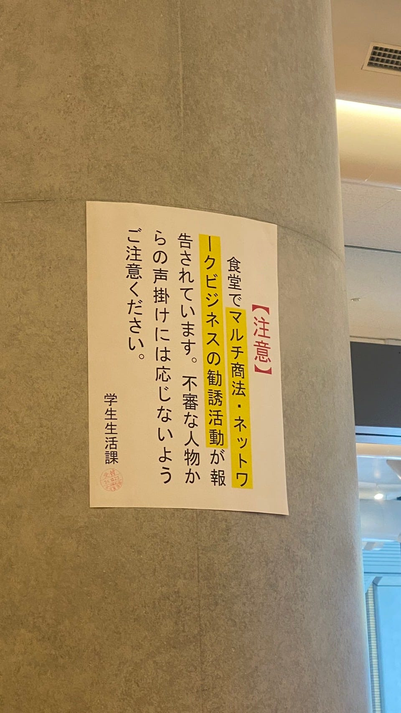
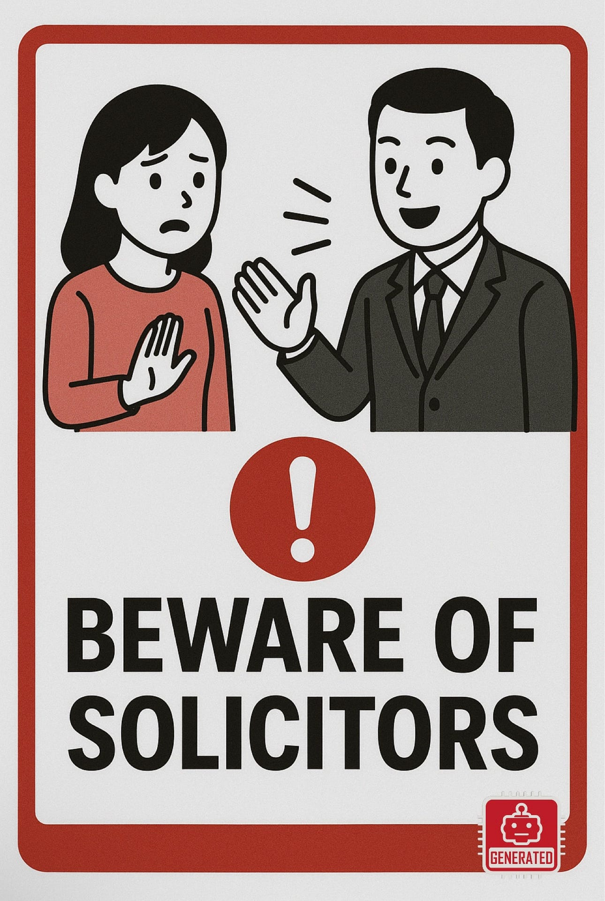
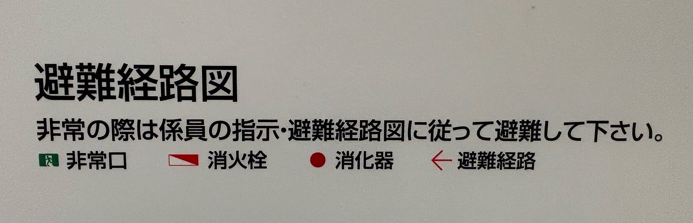
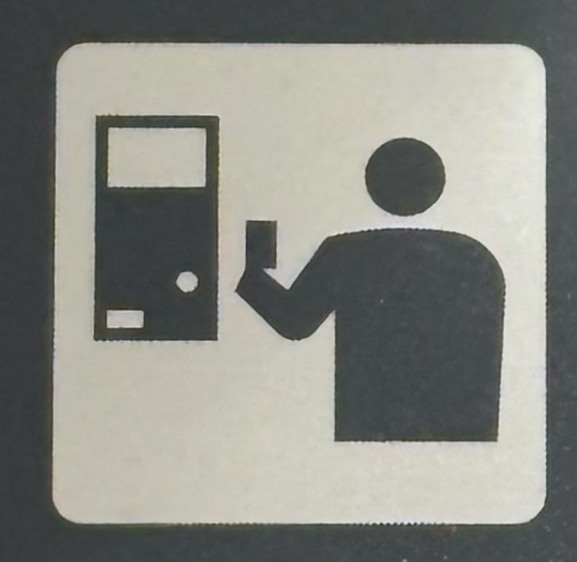
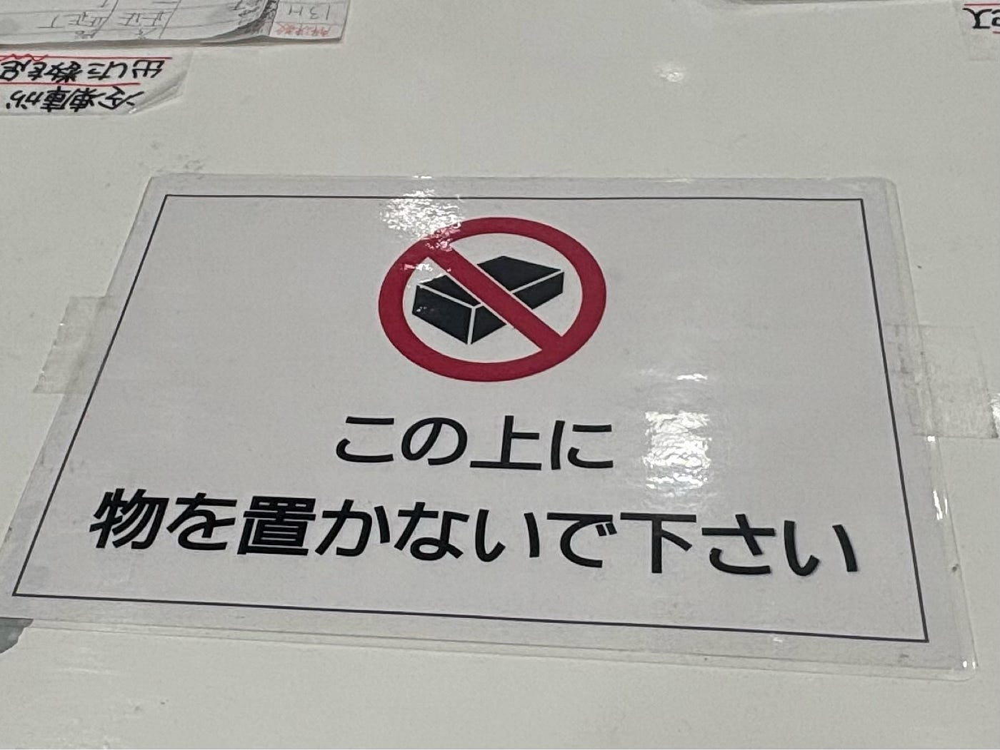
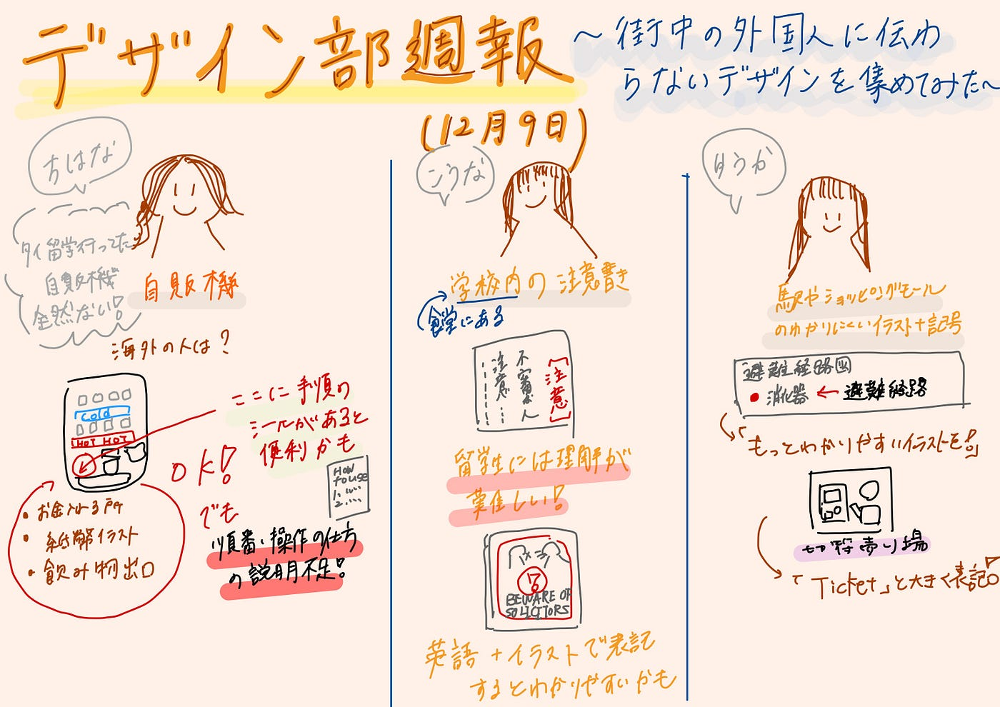

街中の外国人に伝わらないデザインを集めてみた【デザイン部12/9週報】

こんにちは、臼井です。

12月に入ってからもう既に1週間経過していることが未だに信じられません。今年がもう終わってしまう…...！

今回は学校や駅にある張り紙や看板などに含まれる、外国人に伝わらないのでは？というデザインを集めて、改善案を考えてみました。

それではさっそく見ていきましょう。

#### ちはな

私は日本ではどこにでも存在する自販機に着目してみました！

私はタイに留学に行ったのですが、そもそも自販機が見当たらないのに加え、お金を認識してくれない、お金が返ってこないなどのトラブルに遭遇しました。

海外では割とこういうトラブルは多いらしく、また、セキュリティの観点から自販機の数がそこまで多くないようです。

つまり、海外の人は自販機の使い方が良く分からない人もいるのではないでしょうか？

この写真は街でよく見かける飲み物の自動販売機です。日本人であれば一度は使ったことがあるし、何も違和感はないと思います。

しかし、海外の人からしてみるとどうでしょうか。

お金を投入するところはそれぞれ硬貨と紙幣のイラストがあり、飲み物の受け取り口には缶を取り出す様子も書かれているので問題はないように思えます。

しかし、どのような順番で操作したらいいか書いてあるわけではありません。お釣りや返却のレバーは日本語の説明しかありません。

実際に自販機の使い方が分からない人は多いらしく、買い方の説明がネットに載っています。

そこで改善案として、英語で購入方法を記したシールなどを自動販売機に掲載する、おつりのところにピクトグラムを載せるという2つを考えました。

このように買い方や機能がイラストや英語で説明されていれば、外国人にとっても分かりやすいのではないでしょうか。

……ここまで考えてネットで調べて見たのですが、最近は外国人向けに使い方や表示が英語で書かれた自販機もあるようです。

[多言語ガイド表示付き自動販売機 | 日本コカ・コーラ
コカ・コーラ社の多言語情報表示自動販売機を日本に導入。 多言語に対応した革新的な自動販売機により、観光客や外国語を話す人も簡単に飲み物を購入できます。www.coca-cola.com](https://www.coca-cola.com/jp/ja/media-center/vending-machine-multilingual)

今後は様々な場所でこのような取り組みが見られるといいなと感じました！

#### こうな

私が注目したのは学校の食堂にある注意書きです。

大学内では留学生が多く、簡単なひらがなや漢字なら理解可能でも、このような注意書きは翻訳等なしでは理解が難しいのではと感じました。(もしかしたら、話しかけて来た人は勧誘だと知らずに、大学内の人だと思って信じちゃう可能性も！)

これの横に英語を書くことや絵を加えることでより理解しやすい形にできるといいのではと考え、ChatGPTにデザインを作成してもらいました。雰囲気こんな感じで横に貼ったりできると理解しやすいのではと思っています。

生成に使用したサイト：ChatGPT

バージョンGPT-5.1、12月7日生成

#### ゆうか

私が注目したのは駅やショッピングモールの分かりにくいイラストや記号です。

まずはこちら

大きな建物によくある避難経路図ですが、日本語の分からない外国人からしてみれば何が何だか分からなそうです。

非常口は人が逃げているイラストなので分かりやすいものの、消火栓や消化器、避難経路の記号は正直これだと分からないのではないかと思います。今はGoogle翻訳などを使用すれば日本語の意味を理解できるため大丈夫ですが、避難時にはその様な暇もないため、もう少し分かりやすいイラストなどを横につけるといいような気もします。

次はこの絵です。これを見ただけでは切符売り場の絵だと分からないように感じました。少し自動販売機のようにも見えます。

しかし、隣に英語で「Ticket」と大きく表記されていることや、駅の改札前に位置していること、切符購入やPASMO・Suicaチャージ用の機械がそばにあることから、外国人はピクトグラム以外の要素で察知することができるように思います。

おまけです！

こちらは最寄りの駅ビルに入っていたお菓子屋さんの業務用冷凍庫の上に貼ってあった表示です。

日本語が分からない、もしくは読めないような外国人が見た時には、「この上に置かない」ということが分からなさそうな絵だと感じました。

いかがでしたか？

私は、普段は意識しない、外国人の視点を持って街を歩いてみると歩きなれている道でも新鮮に感じました！

それと同時にどのような場所で外国人がつまづくのか、日本人である我々が完全に理解することの難しさも感じました。

今後は「私たちが当たり前に感じることでも、他の人には伝わらないことがある」という事を念頭に置きながら、誰にでも伝わりやすいデザインについてもっと考えてみたいです！

#### グラレコ

