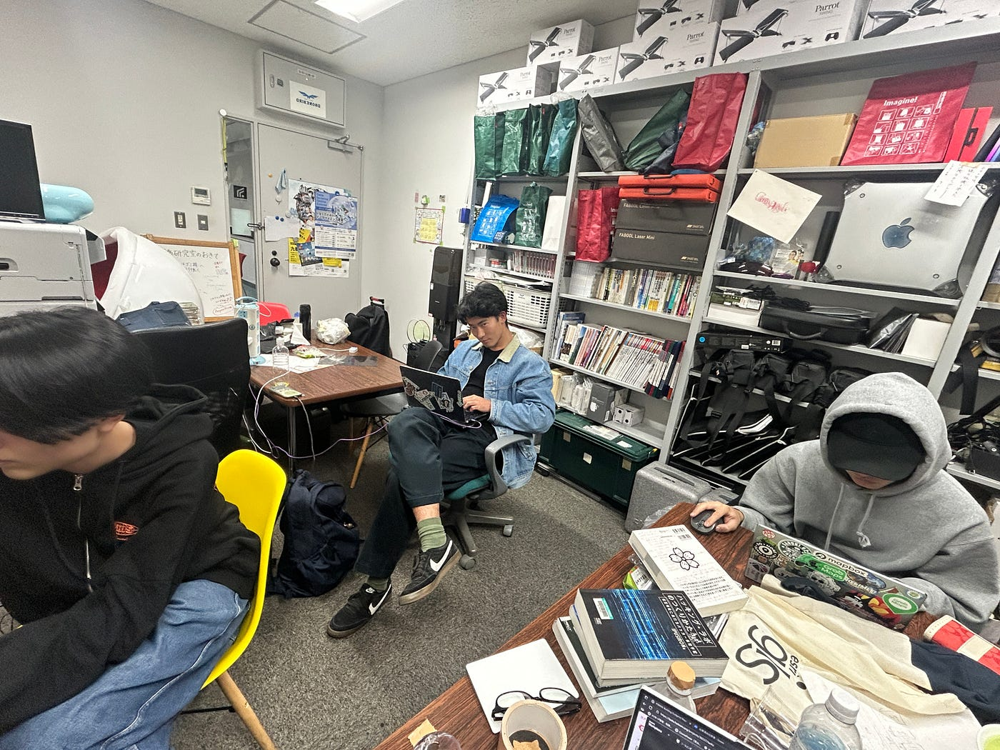
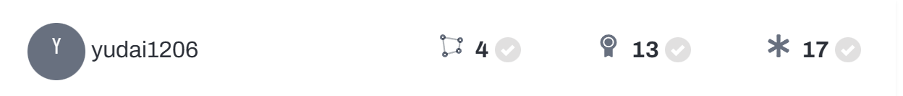
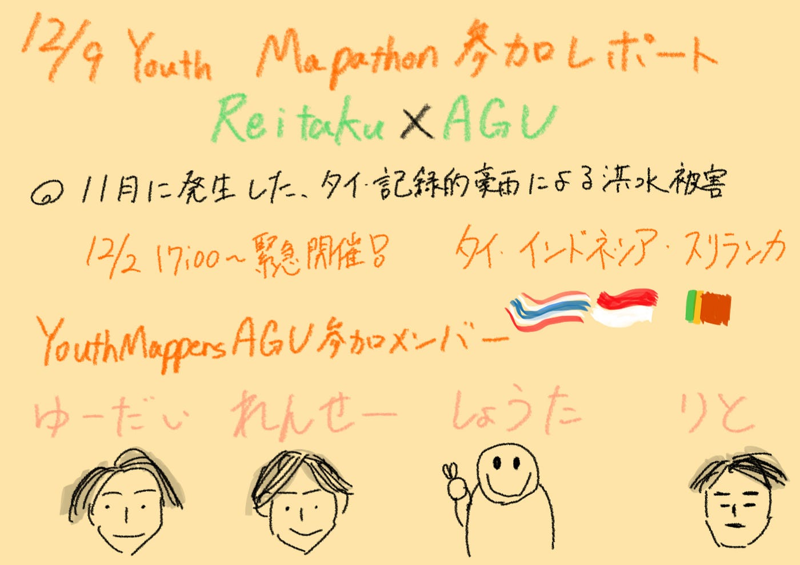

### 【12/9 Youth週報】Humanitarian Mapathon for the Southern Thailand Floods参加レポート

こんにちは！YouthMappersの荒川です。最近服が増えすぎて、クローゼットに入らなくなってきたので、フリーマーケットに出店しようと思っています。でもどの服も愛着があるのできっと売れません。

今週の週報では、12/2に緊急開催されたHumanitarian Mapathon for the Southern Thailand Floodsの参加レポートを書きたいと思います。

#### Mapathon概要

11月下旬にタイ南部を襲った記録的豪雨により、大規模な洪水が発生しています。また、ベトナム・マレーシア・インドネシア・スリランカ・フィリピンといった東南アジアの国々にも、同様の洪水被害が発生しています。

（関連記事：[タイで日本人も被災「本気でやばい…」東南アジアの豪雨 犠牲者1100人超え インドネシア・スリランカでも甚大な被害【news23】（TBS NEWS DIG Powered by JNN） — Yahoo!ニュース](https://news.yahoo.co.jp/articles/a7f9ea8e400f721f991d090e8f3ccae9ee4bea57)）

今回のMapathonは、この洪水被害に迅速に対応するために立ち上がったプロジェクトです。タイだけではなく、インドネシア・スリランカのプロジェクトにも取り組みました。

詳しい経緯や概要については、古橋先生の記事をご覧ください。

[洪水が来てもマップは沈まない ― 2025アジアクライシスマッピング奮闘記
それは2026年11月27日の大学授業5限が終わる頃に届いたFacebookの Notification から始まった。medium.com](https://medium.com/furuhashilab/%E6%B4%AA%E6%B0%B4%E3%81%8C%E6%9D%A5%E3%81%A6%E3%82%82%E3%83%9E%E3%83%83%E3%83%97%E3%81%AF%E6%B2%88%E3%81%BE%E3%81%AA%E3%81%84-2025%E3%82%A2%E3%82%B8%E3%82%A2%E3%82%AF%E3%83%A9%E3%82%A4%E3%82%B7%E3%82%B9%E3%83%9E%E3%83%83%E3%83%94%E3%83%B3%E3%82%B0%E5%A5%AE%E9%97%98%E8%A8%98-4caf48f06014)

#### レポート

緊急開催のマッパソンだったこともあり、YouthMappersAGUからは加藤・井上・荒川・山崎がオンラインでの参加となりました。

全員研究室から参加し、コミュニケーションがとりやすい環境にあったため、Validation担当やタイ担当・スリランカ担当といった分担を行いました。

**加藤成果**

タイ

スリランカ

ゆーだいは、タイのValidationメインで頑張ってくれました！

**井上成果**

タイ

れんせーは途中参加だったため少なめですが、一緒に頑張りました！

**荒川成果**

タイ

インドネシア

私は、途中からインドネシアのタスクに回りました。Validationもバランスよく行うことを意識しました。

**山﨑成果**

山﨑も途中から参加し、タイのタスクでValidationを担当しました。

マッパソンは一時間ほどでしたが、前後の時間にも取り組んだので合計二時間ほどみんなで活動しました。SOTM2025以来のマッパソンでした。コミュニケーションを取りながら効率よくマッピングできたのではないかなと思います。

三年生へ

そろそろ中級マッパーに昇格しなきゃだからみんながんばろうネ☆

