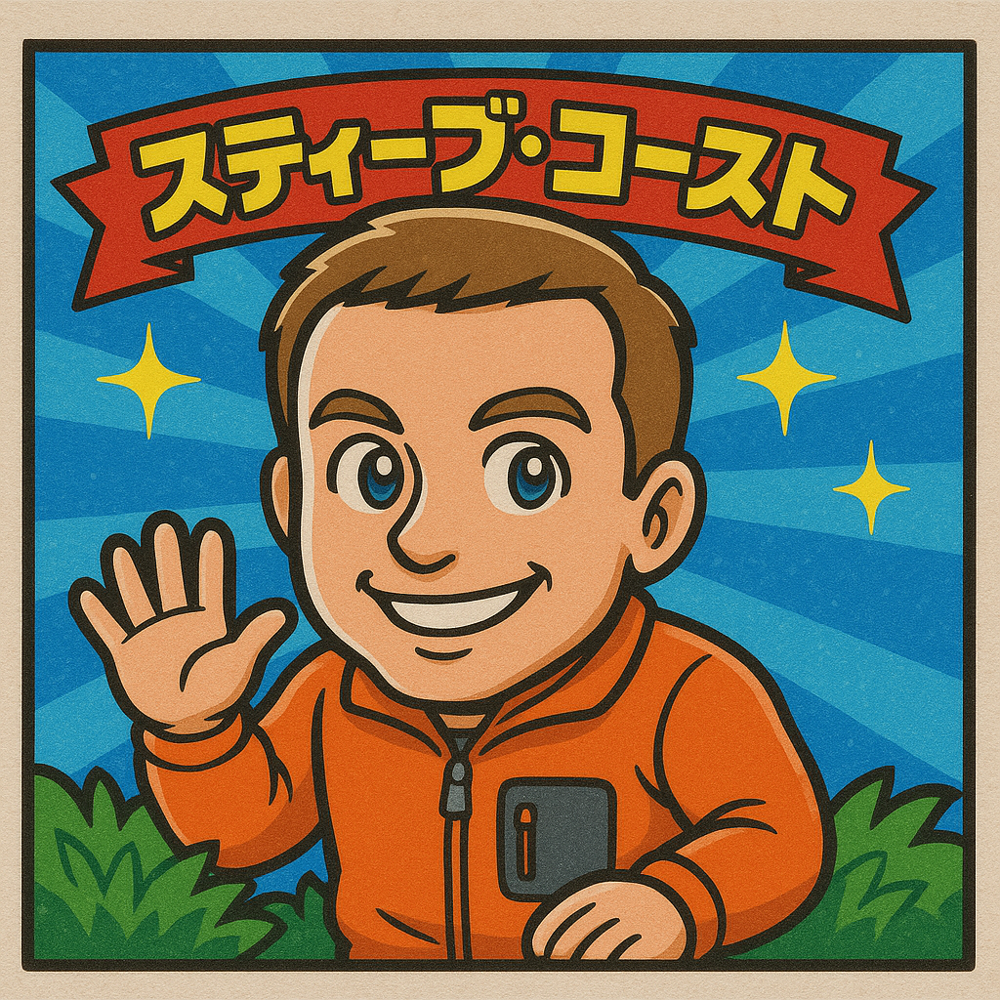
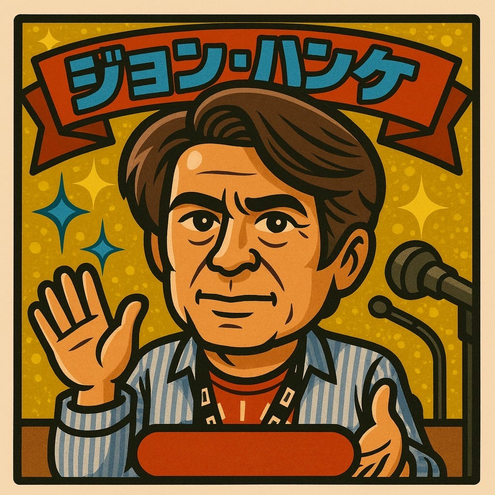
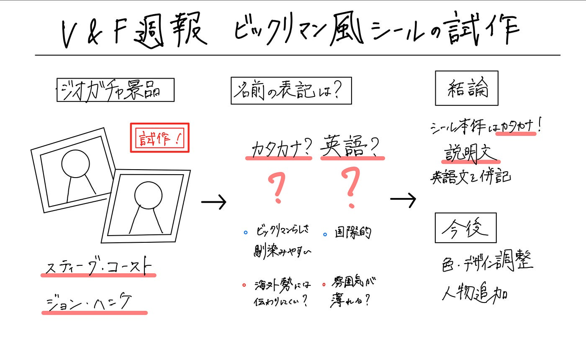

### 【V&F週報】ビックリマン風シール試作 -スティーブ・コースト & ジョン・ハンケ

こんにちは。古内です。今週は前回に引き続き、来年度のジオガチャ景品案として、「スティーブ・コースト & ジョン・ハンケ **ビックリマン風シール」** のプロトタイプを作ってみました。

以下が実際に生成したものです。

### 画像生成について

これまでのシール案の延長で、地理界の代表的な人物をシール化してみようということで、まずはこのお二人で作成してみました。

- スティーブ・コースト（OpenStreetMap 創始者）

- ジョン・ハンケ（Niantic／Google Earth／Google Maps など）

ビックリマン風の雰囲気を出しつつ、どこまでキャラクターとして成立するかを試した段階です。

### 名前表記について

作っていて迷ったのが、名前を英語表記にするかカタカナ表記にするかという点です。

カタカナの方がビックリマンシールっぽく、本物感も出て日本語利用者には馴染みやすいのですが、海外の人に読み方が伝わりにくいという問題があります。
 英語表記にすれば国際的には通じやすい一方で、少し雰囲気が薄れてしまう気もしています。

現状は、シール本体はカタカナ表記にしておき、説明文で英語名を併記する形が良さそうだと考えています。説明文は別に作る予定なので、そこで補完できればと。

### まとめ

今回はスティーブ・コーストとジョン・ハンケのシールを簡単に試作し、名前表記の方向性も少し考えてみました。次は色味やデザインの細部を調整したり、人物を増やしていくことを考えています。

### グラレコ

