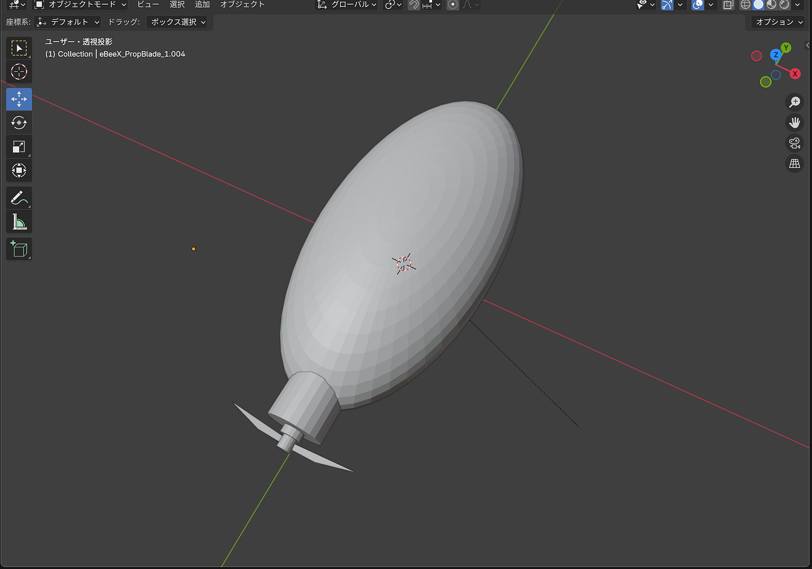
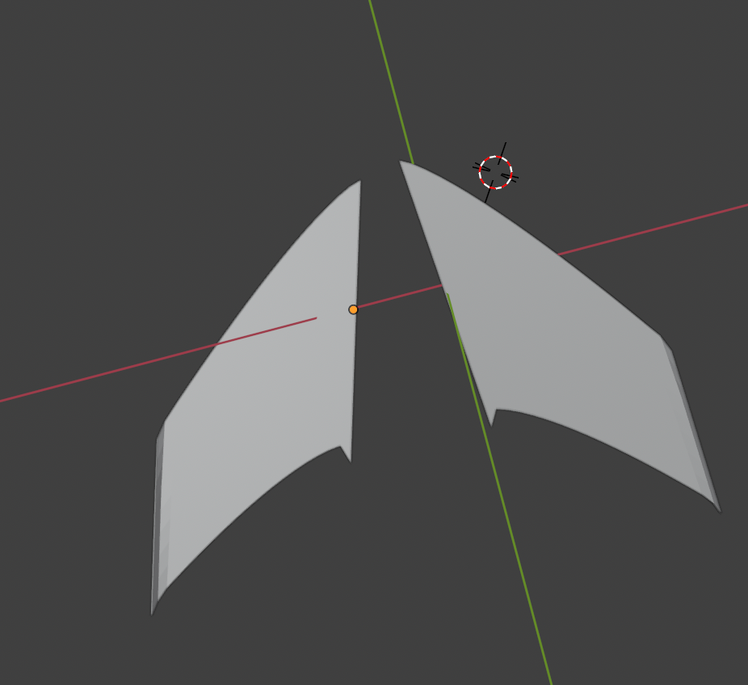
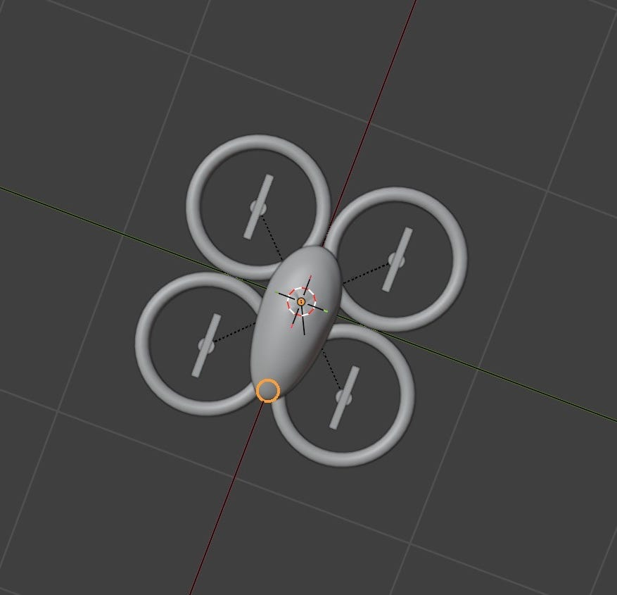
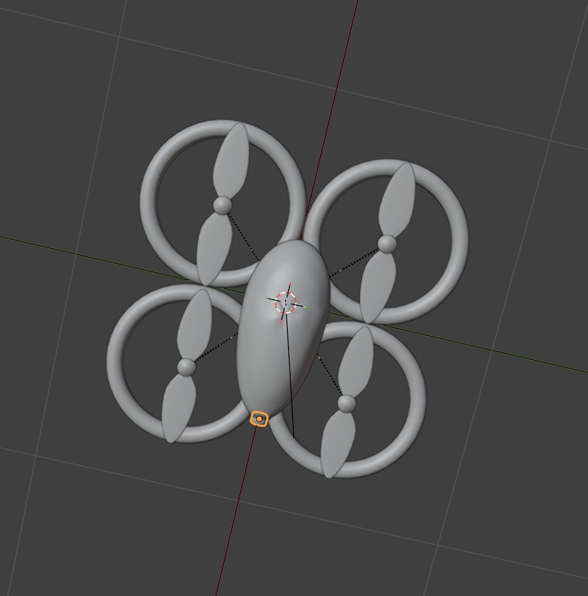
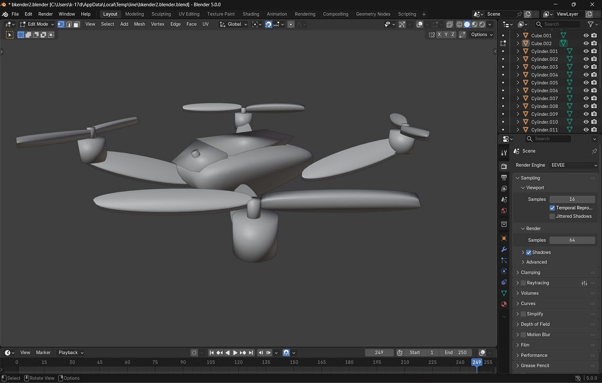
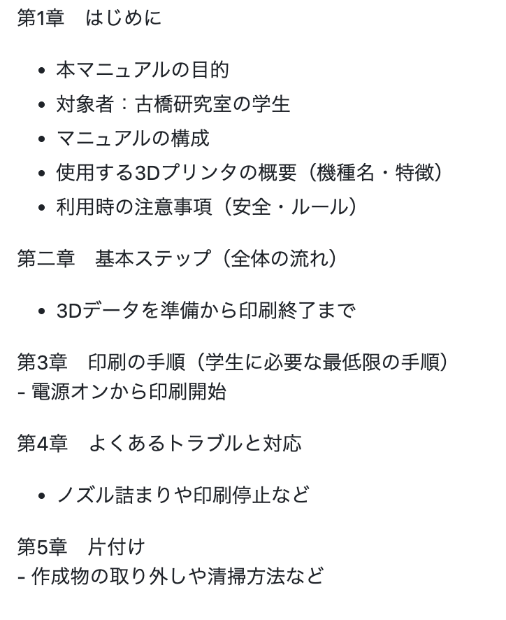
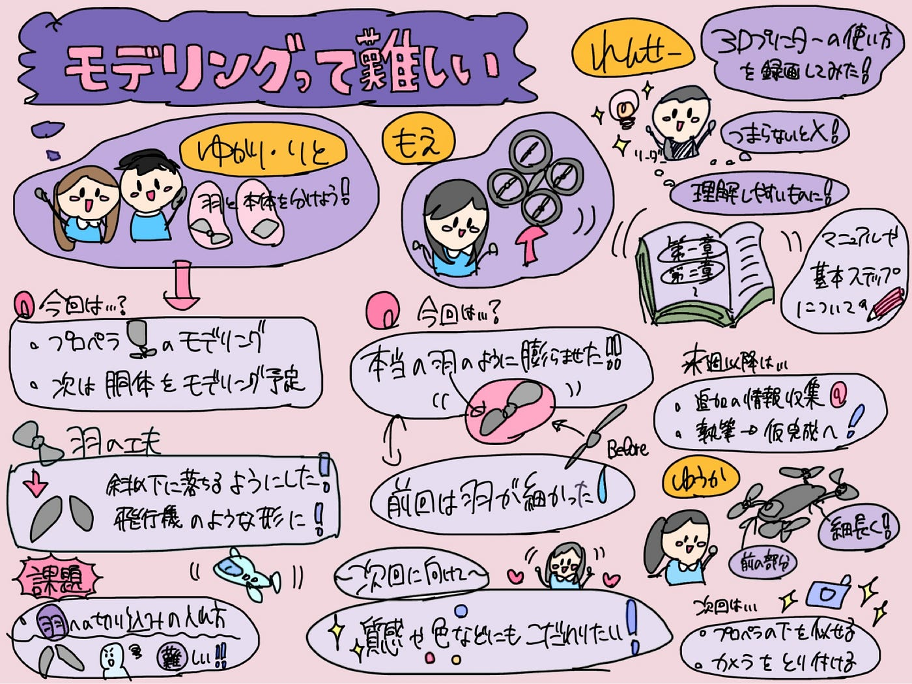

### モデリングって難しい

こんにちはドローン部１の山﨑です
今日はドローン部１がどんな進捗報告が上がるか楽しみ！！

早速みてみましょう、、、、

#### ゆかり・りと

こちら、ゆかり、りとチーム
話を聞いてみると、コードで作るのには限界がありそうで、、もう諦めることにしたそうです
作業の効率化を図るために羽と本体を分けることに

ー本体ー

- プロペラ部分をモデリングした

- 次回は滑らかさを追求し、胴体のデザインをモデリングしたい

ー羽ー

先週までは、羽が横に伸びている棒みたいだったのですが
今回は羽が斜め下に落ちるようにして、端を折り曲げて、飛行機の羽っぽくしました。課題としては、羽根に切り込みをどのように入れるのかが分からないそうです。

#### 萌の進捗報告

前回までは羽が棒状で細かったので、それを今回は本当の羽のように膨らませて、リアルにしてみました！

次回は質感や色などにもこだわっていきたいと思います。

#### ゆうかの進捗報告

今週は前回Chat GPTで生成した写真を参考に、自身が作成していたドローンの上部分をDJI Matorice4に寄せてみました。

しかし、まだそれぞれのプロペラの下にある細長い棒状の部分や下部のカメラなどは着けられていないので、修正していきたいです。

#### れんせーの進捗は如何に！？

３Dプリンターをどうやって使うのか 実際に学生が動かしているのを録画しました！！

マニュアルって読む側がすんなり理解できることが大切だけど、つまらないと良くない！！そんなことを考えつつ
今回は構成だけとりあえず考えてみました！！

**来週以降の取り組み**
‐ 追加の情報収集（研究室独自のルール（安全・利用・片付け）、初心者がつまずくポイントの具体例）
‐ 執筆＆仮完成を目指します！！

#### まとめ

色々あった1週間があっという間に過ぎて、ハッカソンがまた始まるから意外と完成までに時間がないんじゃねってなっているドローン１ですが、頑張っていきますよ〜！！

がんばろう！！みんな！風邪ひかないように体調管理もしっかり！

