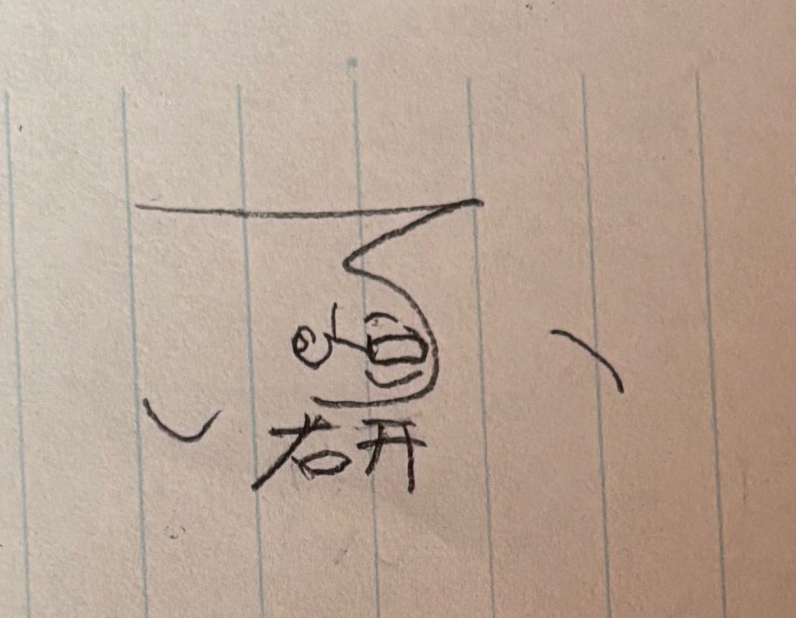
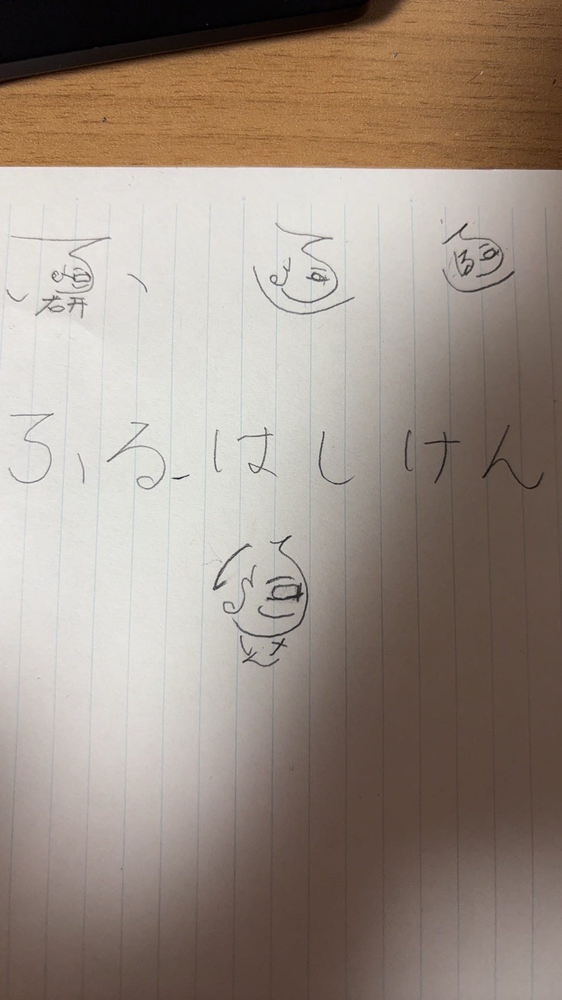
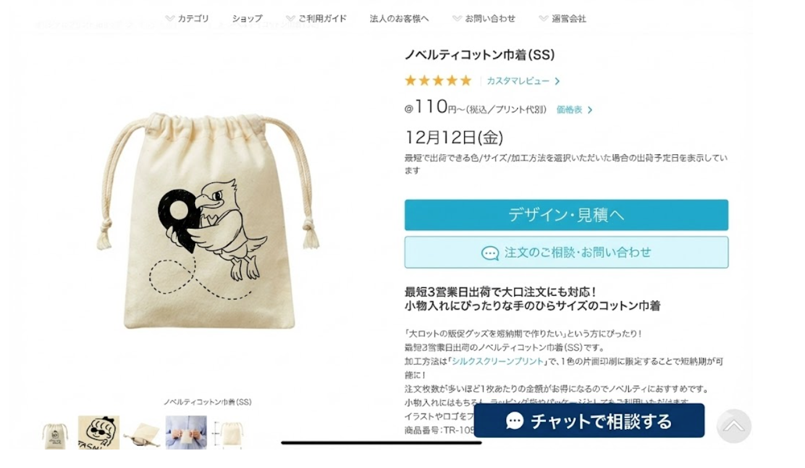
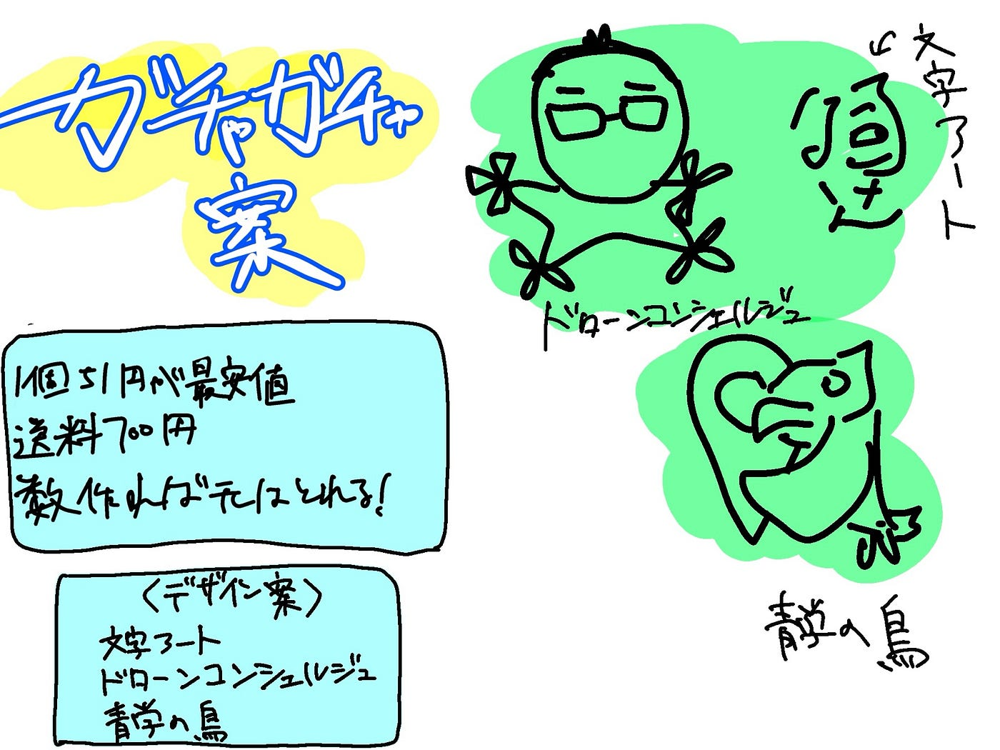

### 【ドローン部2】 巾着袋案

こんにちは。本吉です。

今回はガチャガチャの案として巾着袋がイケそうだったのでさらにデザインの洗練と最安値での費用の計算をしなおしてみました。

### 最安値

まず、最安値の計算です。研究室のプリンタを使用してデザインをすると考えると、一般的なオリジナル巾着袋よりもさらに安くすることができます。

見つけた最安値は以下の通り

・一個51円

・送料700円

・最低注文数の記載はなし

送料が700円取られてしまいますが、14個以上注文して売り捌けば簡単に元が取れます。計算は以下の通り。

15(売る数)x51(巾着袋代)-700(送料)(ガチャガチャ代)

[巾着の名入れが安い｜コットン素材のおすすめバッグへのプリント
※在庫の回転が速い商品になりますので、ご納期に猶予を持ってお申込み下さい。 ※非常に安価な商品の為、あまり高品質ではありません。 物販用としては適しておりません。無料配布等の用途でご利用頂けます。…www.robinfactory.co.jp](https://www.robinfactory.co.jp/?product=kr572&gad_source=1&gad_campaignid=23224623243&gbraid=0AAAAAD_LL-MRmuFfY3Ti3F0bnnmFyMFWO&gclid=Cj0KCQiA6NTJBhDEARIsAB7QHD3FrqXxnF6jfnwMJtmpm4ODeT8Y9nyVVGQt4Tsv3bK2kTDcbkog3kQaAmazEALw_wcB)

### デザイン

デザインも一種類ではつまらないので案を持ち寄って考えました。

これに関してはかなり権利的に怪しいものがあるので、もしこれを採用する場合は青学とのすり合わせが必要そうです。その場合はこちらにコンタクトを取ることが必要になります。

知的資産連携機構03–3409–6732

### グラレコ

