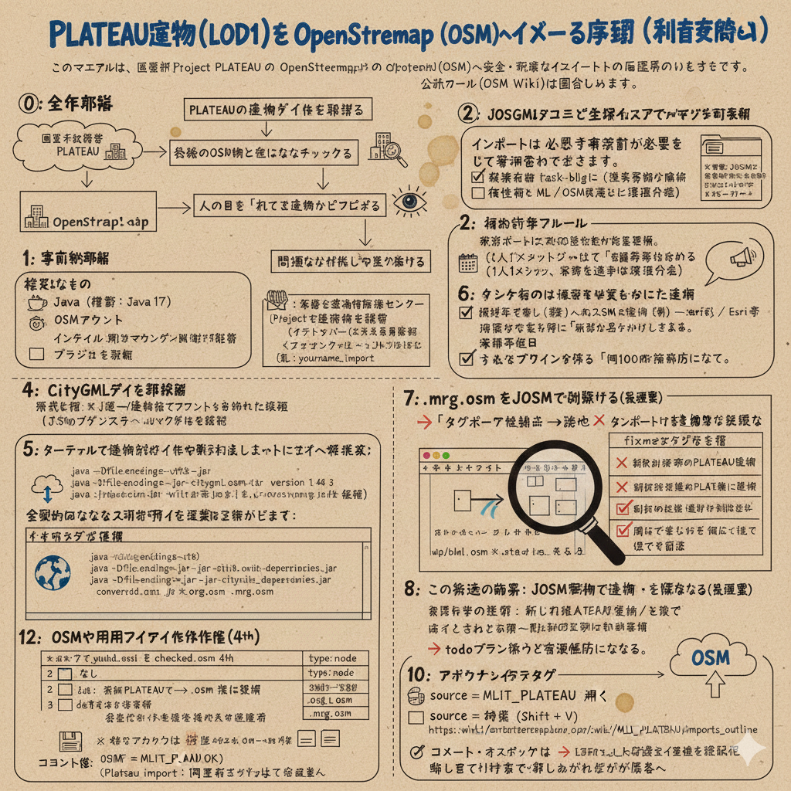
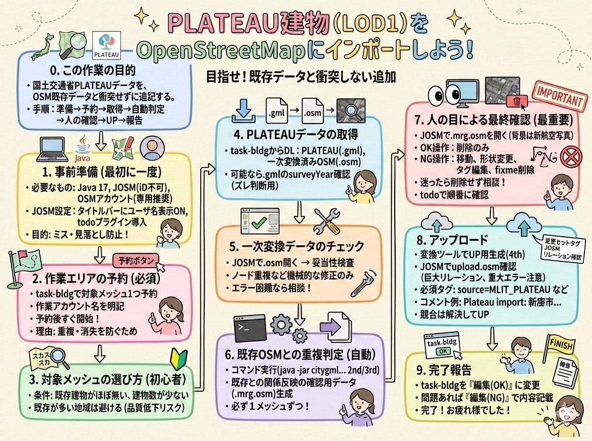
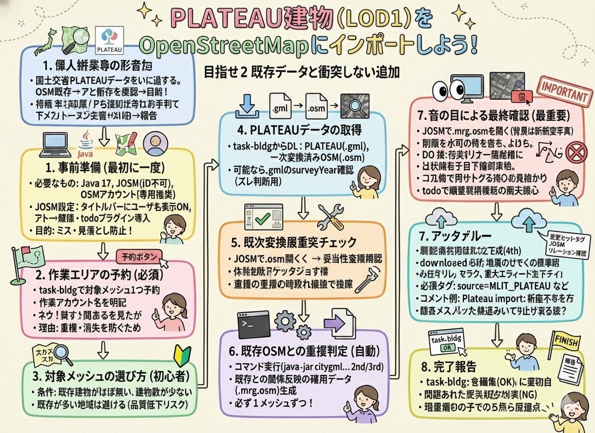
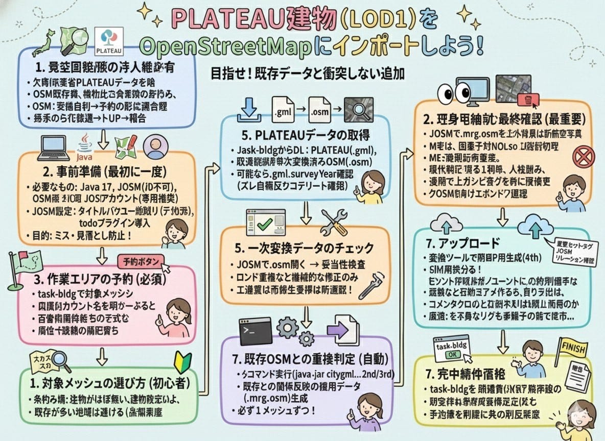
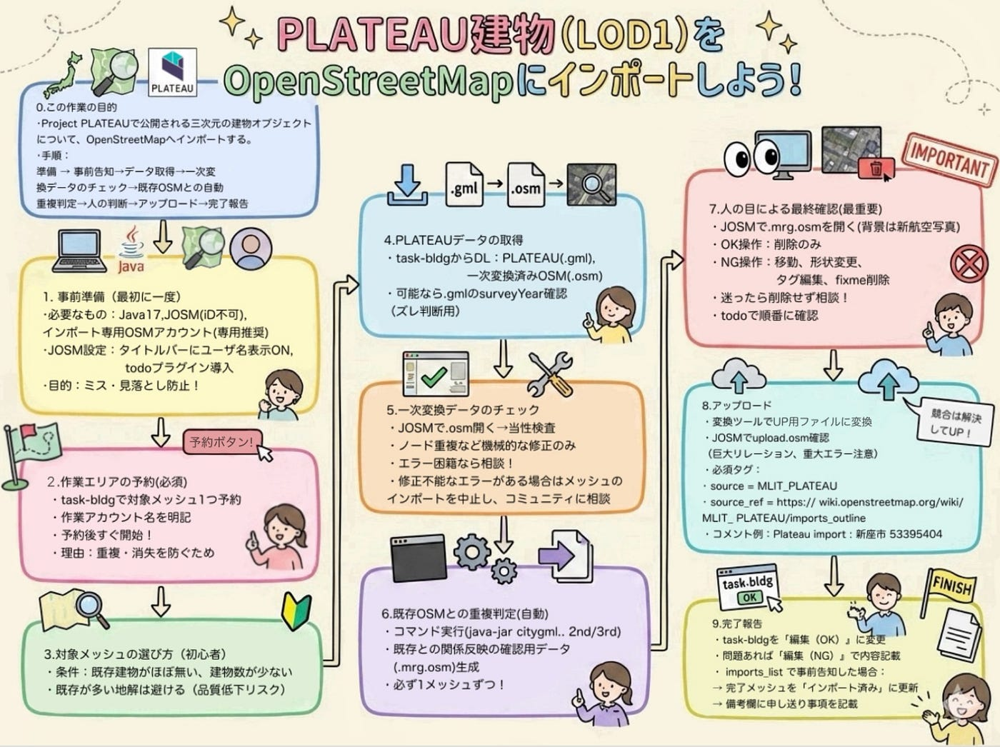
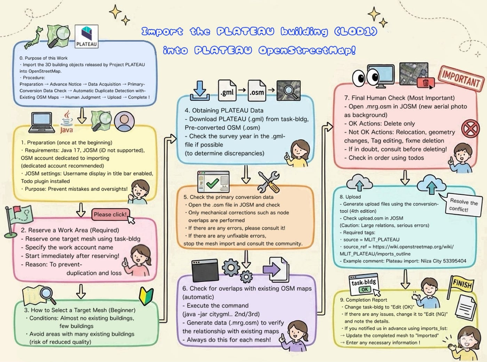
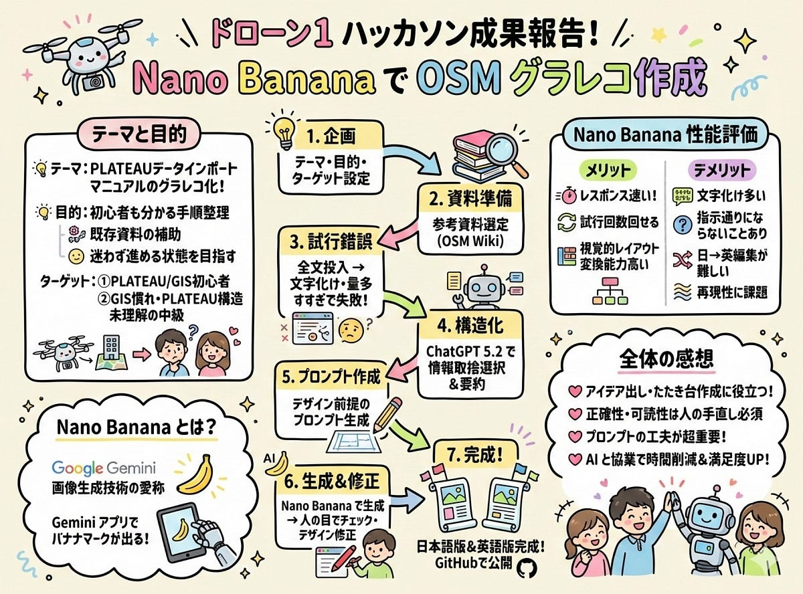

### 【12月ハッカソン】今話題のGoogle GeminiのNano Banana。実際の精度はどうなの！？

こんにちは。ドローン1です！12月ハッカソンの成果を報告します！

ドローン1はれんせー、ゆうか、りと、もえ、ゆかりの5人です！

### 12月のハッカソン概要

GitHub（ハッカソン）:

[古橋研究室オンラインハッカソン2025-2026 · Issue #40 · furuhashilab/README
2025 Apr "International Humanitarian Mapathon"github.comは](https://github.com/furuhashilab/README/issues/40#issuecomment-3630048852)

#### ハッカソンテーマ

> Google Gemini の Nano Banana 性能がバク上がり中なので、画像系生成AIを活用して、OpenStreetMap に関するなにか、特定のテーマのグラレコ風マニュアルを作成（日本語版・英語版の両方）する。

#### 詳細

> ゼミ内サークルごとに、OpenStreetMapの活動で深堀りしたり、初心者向けにわかりやすい解説グラレコを作成する。

> グラレコは日本語版と英語版の両方をつくること。

> 使用したプロンプトもいくつか共有すること。

> 最終的に人間が直接修正・手直ししても良い。

> 成果物はそれぞれ GitHub のリポジトリをつくって共有すること。

> 成果物の品質レベルは、そのまま印刷して配布して利用価値が高いもの（文字化け、表記ミスは手作業で修正すること）。

### そもそも[Google Gemini](https://gemini.google.com/?hl=ja)のNano Bananaとは！？

Nano Bananaは、Googleが開発した画像生成・編集技術「Gemini 2.5 Flash Image」の愛称。Geminiアプリで画像制作の機能を選ぶと、バナナのマークが現れることから、ユーザーの間で「Nano Banana」という呼び名が広まった。

参考資料：[【2025】Nano Bananaとは？注目の理由や特徴・使い方・料金まで徹底解説！ | DX/AI研究所](https://ai-kenkyujo.com/software/generative-ai/nano-banana/)

### ドローン1のテーマはこれだ！

#### テーマ

- **[Project PLATEAU](https://www.mlit.go.jp/plateau/) **建物データを[OpenStreetMap](https://www.openstreetmap.org/)(OSM)にインポートする手順のグラレコ化!!

今回このテーマを選ぶにあたり以下の目的、ターゲットを想定し、グラレコを作成しました。

【目的】

- PLATEAUの建物データをOSMへインポートする基本手順を、初心者にもぱっとみて分かる形で整理する

- 既存の手順資料の補助資料として使え、初めての人でも「何を確認し、どこに注意して、どう進めるか」が迷わず分かる状態を目指す

【ターゲット】

① PLATEAU／GIS初心者

② GISには慣れているが、PLATEAU特有のデータ構造は未理解の中級

### グラレコ風マニュアル完成までの手順

ドローン1では以下の手順でグラレコ風マニュアルを行いました。

1.テーマ目的、ターゲットなどを詳細に考える（上記で説明）

2.プロンプトに投げる必要な資料を探す、1ターン目のプロンプト案の考案

3.Nano Bananaで画像生成

4.作成したものの情報精査

5.デザインの修正

### グラレコ風マニュアル完成までの過程を解説！！

#### 1. 参考資料の選定

まずは、グラレコ化する元となる資料を探しました。今回、主に参考にしたのは以下です。

- [JA:MLIT PLATEAU/imports outline/manual — OpenStreetMap Wiki](https://wiki.openstreetmap.org/wiki/JA:MLIT_PLATEAU/imports_outline/manual)

#### 2. 資料を情報そのまま入れての生成を試す→課題が発生

最初にNano Bananaに上記資料の文章を全文入れて「グラレコ風マニュアル」を作るよう命令しました。
 しかしその結果、以下の問題が発生しました。

- グラレコ内の文章量が多くなり、全体がうまくまとまらない

- 文字化けが大量に発生して、可読性が大きく下がる

- デザインがグラレコっぽくない

このままでは成果物として使いづらいと判断し、方針を変更しました。

#### 3. [ChatGPT 5.2](https://chatgpt.com/?utm_source=microsoft&utm_medium=paidsearch_brand&utm_campaign=MSFT_C_SEM_BBR_Core_CHT_BAU_ACQ_PER_MIX_ALL_APAC_JP_JA_110625&utm_term=chat%20gpt&utm_content=1172081385498000&utm_ad=&utm_match=e&msclkid=0939bfc24d9d1f6e97a7d68245dad152)で「取捨選択（要約・構造化）」を実施

そこで、ChatGPT5.2(Auto)を使い、元資料の内容から「グラレコとしてまとめるのに必要な情報は何か？」を整理してもらいました。

- 会話履歴：[PLATEAU建物OSMインポート](https://chatgpt.com/share/693ffbef-2d9c-800b-b7f1-b75e8284983a)

ここで、情報の取捨選択を行い、グラレコに載せる内容を絞りました。

#### 4. グラレコ用のデザイン前提プロンプトを作成

情報の取捨選択ができたので、次に見やすいグラレコの構図になるように、ChatGPTに「デザインを前提にしたプロンプト」を生成してもらいました。

- 会話履歴：[https://chatgpt.com/share/693c8b22-d0d8-800b-8f97-abf80caa7b9f](https://chatgpt.com/share/693c8b22-d0d8-800b-8f97-abf80caa7b9f)

#### 5. Nano Banana（Google Gemini）で再度挑戦

Google Geminiの Nano Bananaを使って、元資料を短縮化した文章とデザイン案のプロンプトを入れ、グラレコを生成しました。

なお、今回Nano Bananaの会話履歴については、GSCのGoogleアカウントでは共有リンクを作成できなかったため、実際に入力したプロンプトをGoogleドキュメントに整理して保存しました。

- Google ドキュメント：[Nano Banana プロンプト](https://docs.google.com/document/u/0/d/10BoHNmQC0eIvNGgTTg5CQwJ08UY-C-Twv9GISANN0WE/mobilebasic?urp=gmail_link)

#### 6. 日本語版いったん完成 → 生成結果（画像）

この状態で一度完成したものが、以下の画像です。

#### 7. 英語版も同じ構成で作成→問題が発生

続けて、同じデザイン構成で英語版も作成しました。
しかし、以下の問題が起きました。

- 英語テキストに変換されない。文字化けが起こる。

- デザインが日本語版と同じように反映されず、レイアウトが崩れる

そのため英語版に関しては、画像の上から他のツールを使用して、デザインを調整する方針に切り替えました。

#### 8. デザイン修正の前に、人の目で内容チェック

日本語、英語版でデザインを直す前に、まずは人の目で内容の正確性を確認しました。
具体的には以下をチェックしています。

- アイコンが正しいか

- 漢字ミス・表記揺れがないか

- 手順や説明に誤りがないか（情報の正確性）

#### 9. 最終調整 → 完成

上記の修正と確認を踏まえて、後は人力でデザインを調整し、最終版として完成させました。使用したのはBeautyCamの消しゴム機能とibisPaint Xです。
以下が成果物です！！

- **完成作品（日本語版）**

- **完成作品（英語版）**

- **GitHub リポジトリ**：[furuhashilab/Drone1_PLATEAU_Data-Import: 12月のハッカソンとしてPLATEAUの建物データをOSMにインポートする基本的な方法をまとめた](https://github.com/furuhashilab/Drone1_PLATEAU_Data-Import)

### 我々が考えたNano Bananaに対する性能評価

メリットとデメリットを簡単に洗い出してみました。

#### メリット

・ChatGPTの画像生成機能と比べると体感的に画像生成のレスポンスが速く、無料でも試行回数を多く回せる点は性能的に優れていると感じた

・テキスト情報を視覚的レイアウトに変換する能力が高い

#### デメリット

・文字化けが起こりやすい

・指示した日本語通りに文字が生成されない（情報の抜け漏れ等）

・日本語から英語への画像編集がうまくいかない

・同一プロンプトでも出力の揺らぎがあり、再現性に課題がある

### 得られた知見・感想

Nano Bananaなどの画像生成AIを使ったグラレコ作成は、デザインのアイデア出しやたたき台作成の段階でとても役に立つと感じました。
 一方で、情報量の多い技術文書をまとめる場合や、内容の正確さや文字の読みやすさを重視する場合は、最後に人が確認して手直しする作業が必須だと思いました！

また、プロンプトをどう書くかが成果を大きく左右する点も重要だと感じました。情報をそのまま投げるだけでは理想の形になりにくく、結果的に修正の手間が増えてしまいます。
 そのため、今回のようにデザイン用のプロンプト案もAIに手伝ってもらいながら一緒に考えることで、短時間で満足のいく成果物を作りやすくなり、作業全体の時間削減にもつながると思いました。

### グラレコ

今回はNano Bananaの活用法を学んだので、Nano Bananaを活用してグラレコを作成してみました！！

