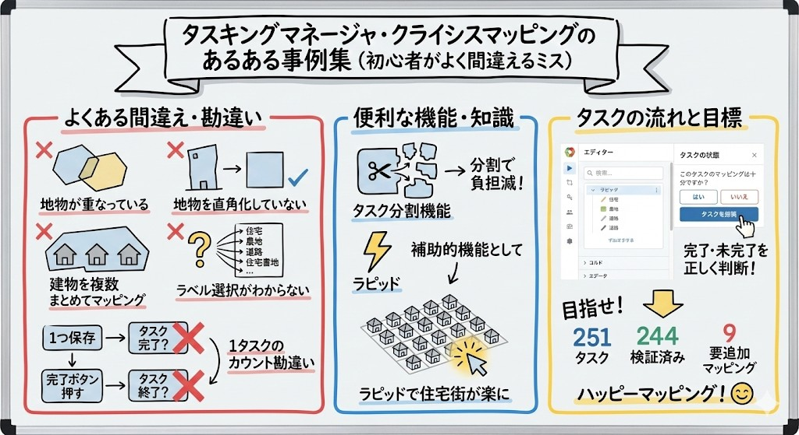
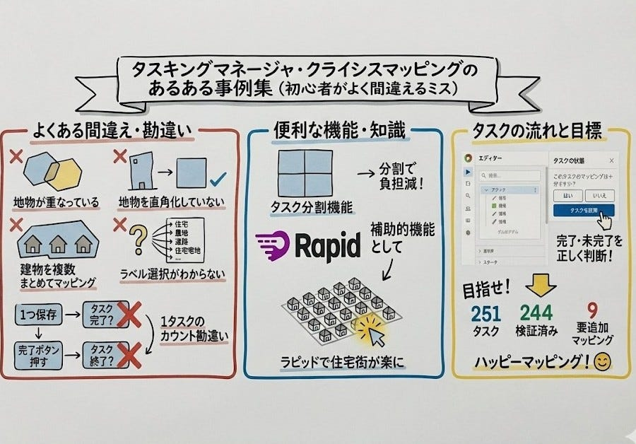
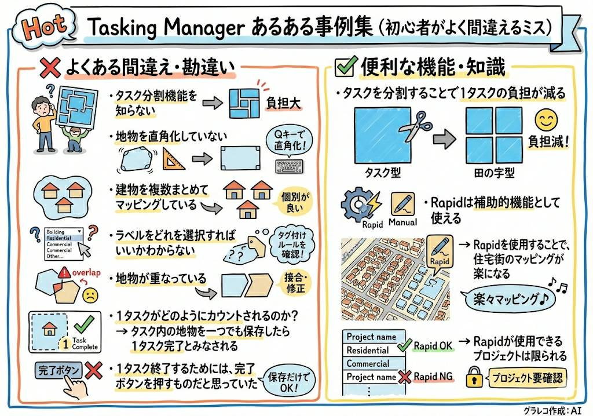
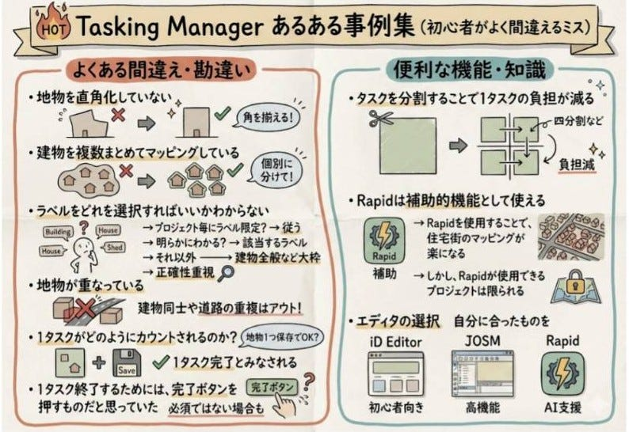
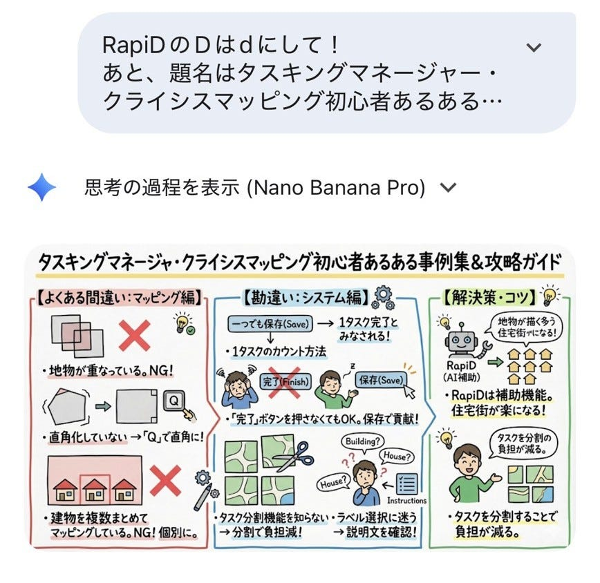
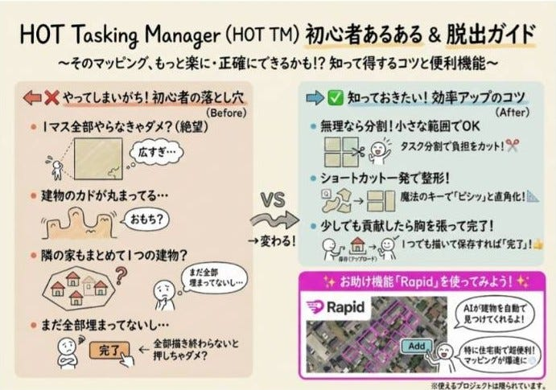
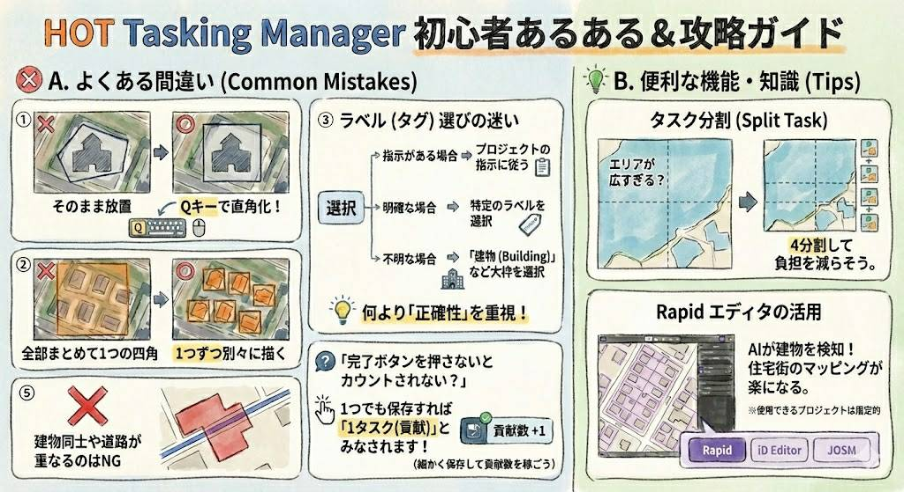
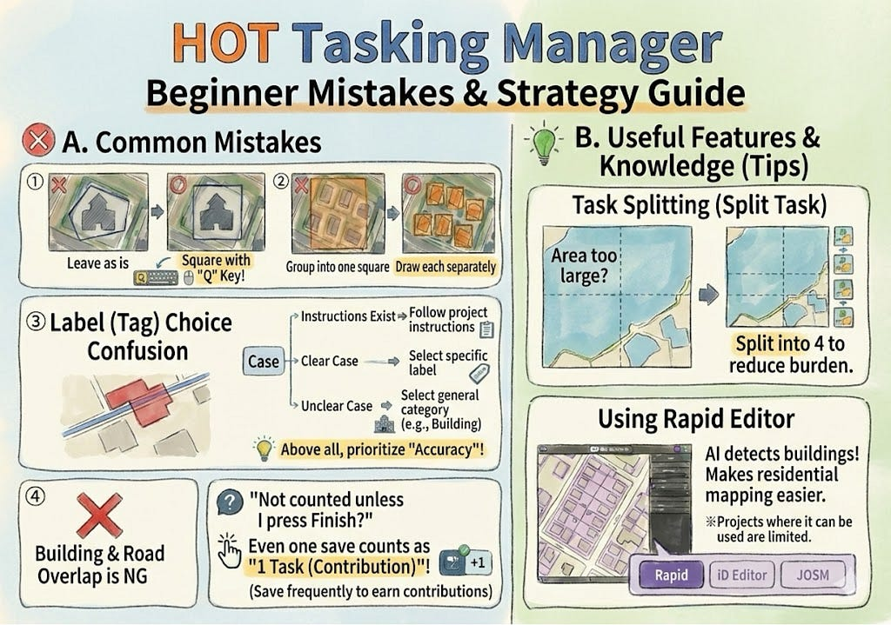
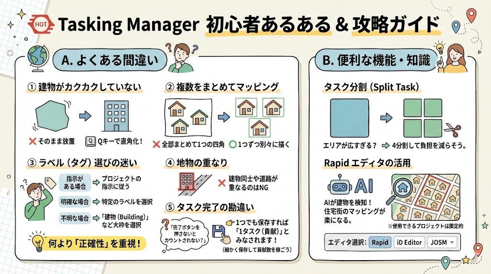

### Nano Bananaにグラレコ描かせてみた！ドローン2週報

こんにちは。ドローン2です。
今回は、GeminiのNano Bananaを使用してグラレコを生成してみました。

#### **グラレコのテーマ**

タスキングマネージャ・クライシスマッピングのあるある事例集（初心者がよく間違えるミス）

#### **プロンプト1**

～よくある間違え・勘違い～
・地物が重なっている。
・1タスクがどのようにカウントされるのか。→タスク内の地物を一つでも保存したら１タスク完了とみなされる。・1タスク終了するためには、完了ボタンを押すものだと思っている。
・タスク分割機能を知らない。
・建物を直角化していない
・建物を複数まとめてマッピングしている。
～解決策～
・タスクを分割することで1タスクの負担が減る。
・ラピッドは補助的機能として使える
・ラピッドを使用することで、住宅街のマッピングが楽になる。

#### Rapidのマークがイナズマになっていたので変更＆タスク分割の絵を変更するプロンプトを作成

HOT Tasking Managerのintermediateになるまでの道のりをグラレコにまとめていて、現在はこのようになっています。分割するところの絵を、一つの正方形が4つの正方形に分かれて田の字に分かれているようにしてグラレコを作成して

#### プロンプト2

Hot Tasking Manager のあるある事例集（初心者がよく間違えるミス）
横A4サイズで以下の内容からグラレコを生成してください。
よくある間違え・勘違い
・タスク分割機能を知らない。
・地物を直角化していない
・建物を複数まとめてマッピングしている。
・ラベルをどれを選択すればいいかわからない。
・地物が重なっている。
・1タスクがどのようにカウントされるのか？
→タスク内の地物を一つでも保存したら１タスク完了とみなされる。
・1タスク終了するためには、完了ボタンを押すものだと思っていた。
便利な機能・知識
・タスクを分割することで1タスクの負担が減る。
→正方形が田の字になるような分割方法をイメージした画像を生成してください
・Rapidは補助的機能として使える
→Rapidを使用することで、住宅街のマッピングが楽になる。
→Rapidが使用できるプロジェクトは限られる

#### Hot Tasking Manager のあるある事例集（初心者がよく間違えるミス）

横A4サイズの手書き風グラレコを以下の内容で生成してください。

よくある間違え・勘違い

・地物を直角化していない

・建物を複数まとめてマッピングしている。

・ラベルをどれを選択すればいいかわからない。

→プロジェクト毎にラベル限定されている場合はそれに従う。明らかにわかるものは該当するラベルを選択。それ以外は建物全般など大枠でとらえたラベルを選択

→正確性重視

・地物が重なっている。

→建物同士や道路が重なっているのはアウト

・1タスクがどのようにカウントされるのか？

→タスク内の地物を一つでも保存したら１タスク完了とみなされる。

・1タスク終了するためには、完了ボタンを押すものだと思っていた。

便利な機能・知識

・タスクを分割することで1タスクの負担が減る。

→正方形が四分割になるような分割方法をイメージした画像を生成してください

・Rapidは補助的機能として使える

→Rapidを使用することで、住宅街のマッピングが楽になる。

→しかし、Rapidが使用できるプロジェクトは限られる

エディタの選択でRapid, iD Editor, JOSM

#### 完成形

HOT Tasking Manager らしさが不足していたので、以下のプロンプトを投げかけた。

#### プロンプト3

**タイトル:** HOT Tasking Manager 初心者あるある & 攻略ガイド

**A. よくある間違い (Common Mistakes)**

- **① 建物がカクカクしていない**
 — ❌ そのまま放置 ➡ ⭕ **Qキー**で直角化！
- **② 複数をまとめてマッピング**
 — ❌ 全部まとめて1つの四角 ➡ ⭕ **1つずつ**別々に描く
- **③ ラベル（タグ）選びの迷い**
 — 指示がある場合 ➡ プロジェクトの指示に従う
 — 明確な場合 ➡ 特定のラベルを選択
 — 不明な場合 ➡ 「建物 (Building)」など大枠を選択
 — 💡 **何より「正確性」を重視！**
- **④ 地物の重なり**
 — ❌ 建物同士や道路が重なるのはNG
- **⑤ タスク完了の勘違い**
 — ❓「完了ボタンを押さないとカウントされない？」
 — 👉 **1つでも保存すれば「1タスク（貢献）」とみなされます！**
 — （細かく保存して貢献数を稼ごう）

**B. 便利な機能・知識 (Tips)**

- **タスク分割 (Split Task)**
 — エリアが広すぎる？ ➡ **4分割**して負担を減らそう。
- **Rapid エディタの活用**
 — AIが建物を検知！住宅街のマッピングが楽になる。
 — *※使用できるプロジェクトは限定的*
 — （エディタ選択：Rapid / iD Editor / JOSM）

#### グラレコ

感想

細かなところを直してと依頼しても、直してくれないことが多い。

修正を依頼すればするほど、おかしな方向へ行く。

「A4サイズ横向きにしてください」と指示しても同じ画像をそのまま生成してきた。
