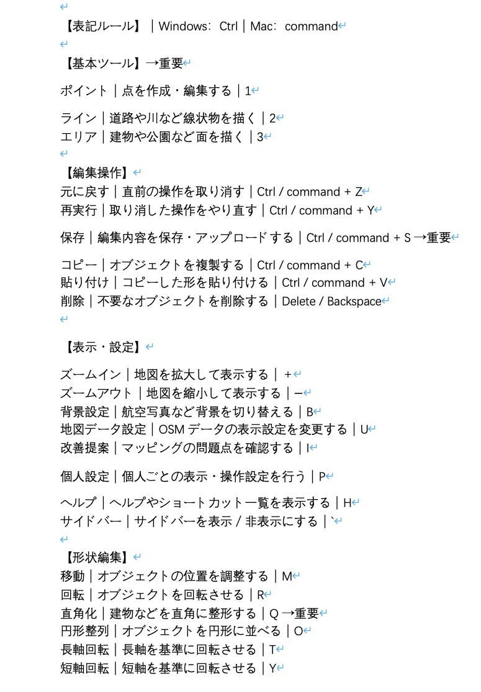
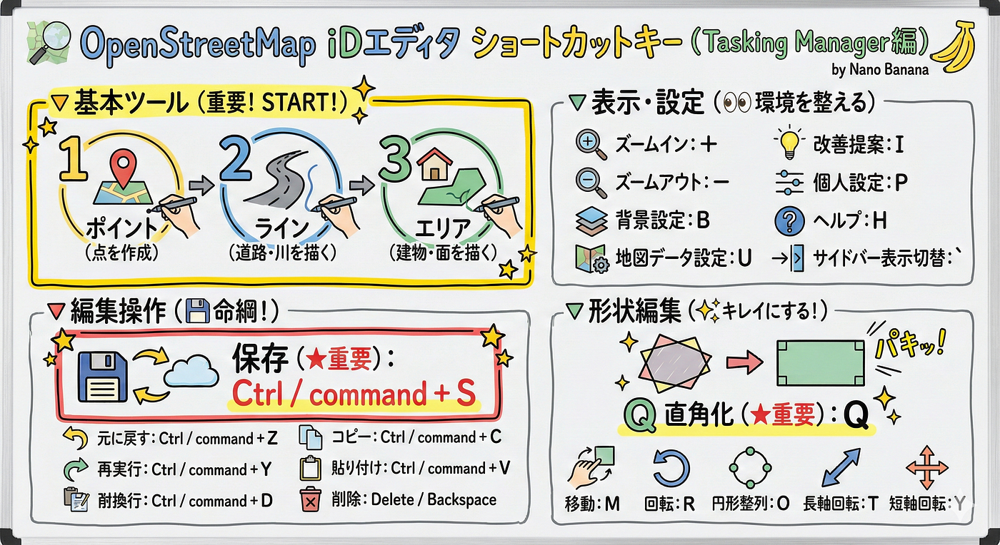
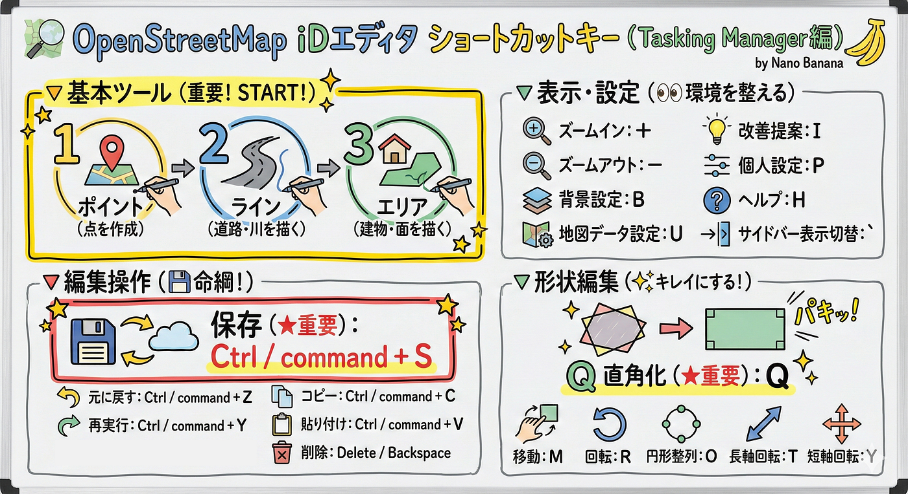
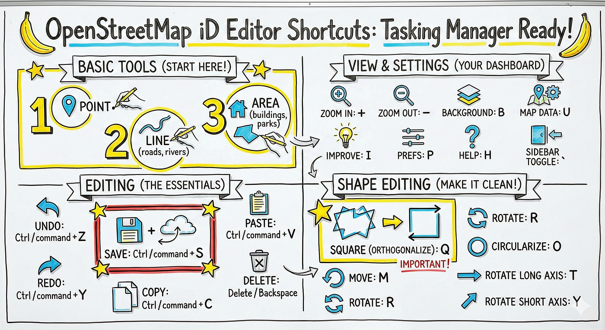
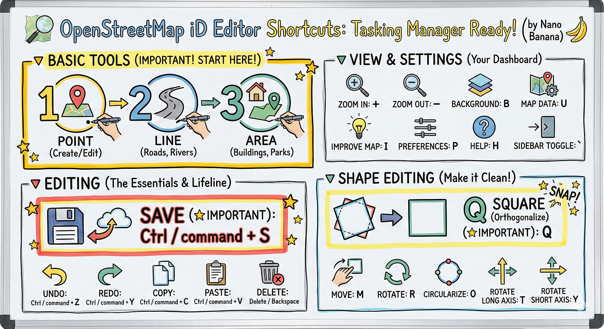
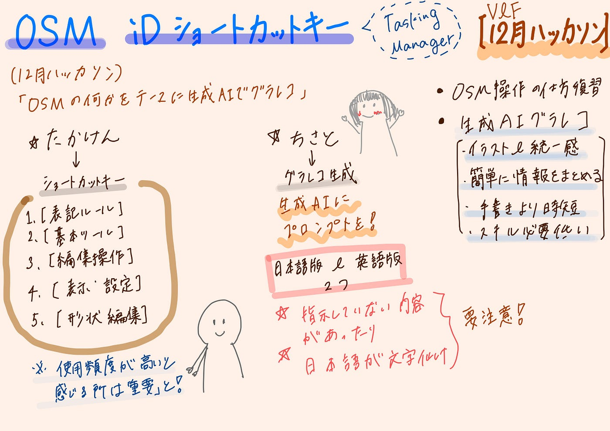

### OpenStreetMap IDエディタ ショートカットキー（Tasking Manager）グラレコを生成AIで作ってみた！【12月ハッカソンV＆F】

こんにちは、四年の福田です！

12月のハッカソンは「[OSM](https://ja.wikipedia.org/wiki/%E3%82%AA%E3%83%BC%E3%83%97%E3%83%B3%E3%82%B9%E3%83%88%E3%83%AA%E3%83%BC%E3%83%88%E3%83%9E%E3%83%83%E3%83%97)の何かについて生成AIグラレコ」というテーマの元、私たちのグループは[Tasking Manager](https://wiki.openstreetmap.org/wiki/JA:Tasking_Manager)のショートカットキーについてまとめ、生成AIでグラレコを作ってみました。

> _[Githubレポジトリ_](https://github.com/furuhashilab/VF_HOT_shortcutkey)

ちなみにメンバーは、たかけん、ちさと、しょうた、こうなです。

#### ショートカットキーのまとめ

まずはたかけんがショートカットキーをまとめてくれました！

前提として、id Editorでのショートカットキーで↓

ショートカットキーの後ろに重要と書いてあるものがあります。これらは実際にマッピングしていて、使用頻度が高いと感じたものでグラレコでも表現したいので、「重要」と書いてわかりやすくしました。

#### グラレコ生成

これを元にちさとがグラレコを生成AIで作りました！

生成AI→[Google Gemini](https://gemini.google.com/)

バージョン→Gemini3.0 ProのNano banana pro

生成日にち→2025/12/15

生成AIに投げた情報はこちらになります↓

【作業概要】
Google Gemini（Nano Banana）を使って、
OpenStreetMap Tasking Manager における
**iD Editor のショートカットキーをテーマにした
グラレコ風マニュアル（1枚完結）を作成。

日本語版・英語版の両方を作成。

— — — 
【使用したプロンプト①：日本語ver（※そのまま）】

あなたは「グラフィックレコーディング（グラレコ）」が得意なビジュアルデザイナー兼、OpenStreetMapの熟練マッパーです。

以下の条件をすべて満たす「グラレコ風マニュアル（1枚完結）」を作成してください。

【テーマ】
Google Gemini の Nano Banana を使用して、
OpenStreetMap の Tasking Manager における
「iD Editor のショートカットキー」を解説するビジュアルマニュアル

【表現スタイル】
・手描き風、スケッチ風のグラレコ
・アイコン＋短い日本語テキスト中心
・説明は最小限、見ただけで直感的に理解できる構成
・全体を「基本ツール／編集操作／表示・設定／形状編集」でゾーニング
・初心者でも「まずこれを使えばOK」が一目でわかる構成

【重要表記の工夫（必須）】
「重要」と指定されたショートカットは、
・★マーク
・太枠
・強調色（他より目立つ）
などを使って、明確に視覚強調すること

【表記ルール】
Windows：Ctrl
Mac：command
※必ず併記すること

【前提】
・すべて iD Editor のショートカットキー
・Tasking Manager での実作業を想定

【掲載内容】

▼ 基本ツール（重要）
・ポイント：点を作成・編集する｜1
・ライン：道路や川など線状物を描く｜2
・エリア：建物や公園など面を描く｜3

▼ 編集操作
・元に戻す：Ctrl / command + Z
・再実行：Ctrl / command + Y
・保存：Ctrl / command + S（★重要）
・コピー：Ctrl / command + C
・貼り付け：Ctrl / command + V
・削除：Delete / Backspace

▼ 表示・設定
・ズームイン：＋
・ズームアウト：−
・背景設定：B
・地図データ設定：U
・改善提案：I
・個人設定：P
・ヘルプ：H
・サイドバー表示切替：`

▼ 形状編集
・移動：M
・回転：R
・直角化：Q（★重要）
・円形整列：O
・長軸回転：T
・短軸回転：Y

【仕上げ条件】
・「マッピング作業中に横に置いて見られる」実用性
・教育・ワークショップで使えるデザイン
・文字量は少なめ、視覚優先

この条件で、完成イメージを出力してください。

【1回目の日本語版の課題】
・最初に生成されたものでは
 → 編集操作に Command + D（指示していない操作） が含まれていた
 → 説明文の日本語が文字化けしていた
・それらを修正したものが「2枚目の画像」【使用したプロンプト②：英語ver（※そのまま）】

次に英語Verです。生成AIに投げた情報はこちらになります⇩

You are a visual designer specialized in Graphic Recording (sketchnote style)
and an experienced OpenStreetMap mapper.

Please create a **one-page graphic recording style manual**
that visually explains **iD Editor shortcut keys used in OpenStreetMap Tasking Manager**.

【Theme】
Using Google Gemini (Nano Banana),
create a graphic recording style shortcut manual
for OpenStreetMap Tasking Manager (iD Editor).

【Visual Style】
・Hand-drawn / sketch / graphic recording style
・Icons + very short English text
・Minimal explanations, visual-first design
・Clearly grouped sections:
Basic Tools / Editing / View & Settings / Shape Editing
・Beginner-friendly: “what to use first” should be obvious at a glance

【Important Shortcuts (Must Highlight)】
Shortcuts marked as “IMPORTANT” must be visually emphasized using:
・Star icons
・Bold frames
・Accent colors
or similar visual techniques

【Notation Rules】
Windows: Ctrl
Mac: command
(always show both)

【Assumptions】
・All shortcuts are for iD Editor
・Designed for real mapping work in Tasking Manager

【Contents】

▼ Basic Tools (IMPORTANT)
・Point: Create/Edit points｜1
・Line: Draw roads, rivers, linear features｜2
・Area: Draw buildings, parks, areas｜3

▼ Editing
・Undo: Ctrl / command + Z
・Redo: Ctrl / command + Y
・Save: Ctrl / command + S (★IMPORTANT)
・Copy: Ctrl / command + C
・Paste: Ctrl / command + V
・Delete: Delete / Backspace

▼ View & Settings
・Zoom In: +
・Zoom Out: −
・Background: B
・Map Data Settings: U
・Improve Map: I
・Preferences: P
・Help: H
・Sidebar Toggle: `

▼ Shape Editing
・Move: M
・Rotate: R
・Orthogonalize (Square): Q (★IMPORTANT)
・Circularize: O
・Rotate Long Axis: T
・Rotate Short Axis: Y

【Final Requirements】
・Usable while mapping (reference-style)
・Suitable for workshops and education
・Less text, more visual clarity

Please output the final visual concept based on these instructions.

【英語版の課題】
・Shape Editing 内でRotate が2つ生成されてしまった
・そこを整理・修正したものが「4枚目の画像」↓

今回の作業でTasking Managerのショートカットキーを復習（よくみたら知らないのもあった）することができました。また、AIが生成するイラストやレイアウトは統一感があり、簡単に情報を伝えることや手書きに比べ時間とスキルが少なく、便利だと感じました。（AIでここまで綺麗にグラレコを作れるんだなと思ったりも）

その反面、情報が多くなり、文字化けに注意しながら、手直しが必要になることや指示していない情報が含まれたりなどチェックに時間がかかることもあります。生成された内容を信頼しすぎないように確認しながら使う必要があると感じました。

これからもどのように活用できるか考えていきたいと思います！

#### グラレコ

