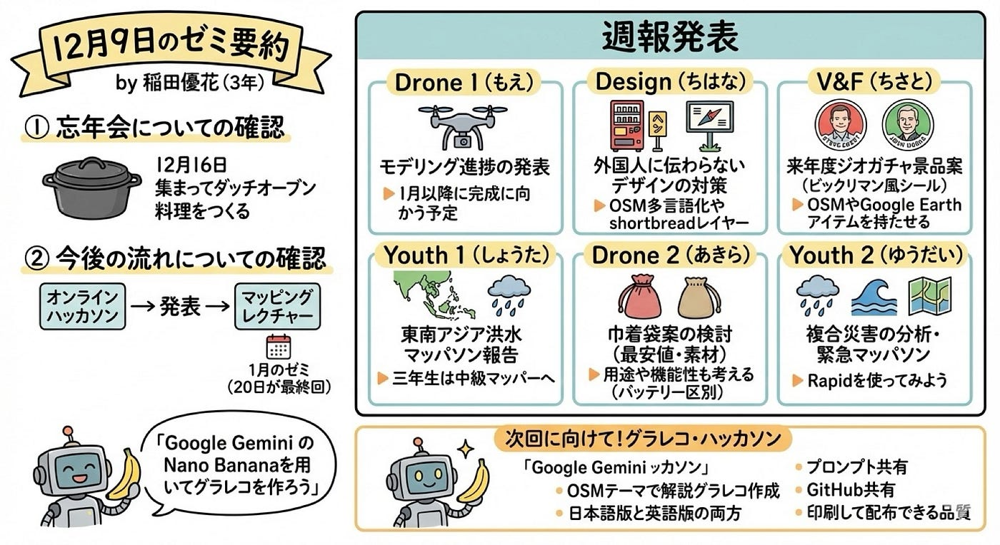

## 12月9日のゼミ要約

3年の稲田優花です。先週は授業を欠席してしまったため、古橋研究室の録画動画を視聴して前回の要約・グラレコをまとめさせていただきます。

〈全体の流れ〉

①忘年会についての確認

・12月16日に集まりダッチオーブン料理をつくる

②今後の流れについての確認

・ハッカソン→発表→マッピングレクチャー

・1月のゼミについて(20日が最終回)

③週報発表、来週のハッカソンについて

> **・ドローン1 （発表: もえ）**

**◎ドローンのモデリング進捗の発表**

・ゆかり、りと

プロペラ部分や羽のモデリングを行った

・もえ

羽をリアルな見た目に編集し直した

・ゆうか

生成画像をもとにDJI Matorice4に寄せた

・れんせい

3Dプリンター使い方マニュアルの全体構成作成

▶️1月以降に完成に向かう予定

> **・デザイン（発表: ちはな）**

**◎外国人に伝わらないデザインや対策を考える**

・ちはな

自販機の使いにくさ(操作・流れ)

・こうな

食堂にある注意書き（留学生には難しい）

・ゆうか

避難経路図、切符売り場など

▶️OSM→多言語化やshortbreadレイヤーのお話

> **・V&F（発表: ちさと）**

**◎来年度のジオガチャ景品案について**

スティーブ・コースト、ジョン・ハンケのビックリマン風シール作成

→画像生成における名前の表記はカタカナに！

▶️OSMやGoogle Earthなどのアイテムを持たせる

> **・Youth1（発表: しょうた）**

◎**12月2日に開催されたマッパソンの報告**

「Humanitarian Mapathon for the Southern Thailand Floods」

タイやベトナム、マレーシア、インドネシア、スリランカ、フィリピンなどの東南アジア諸国にて発生している洪水被害に対し、迅速に対応するべく立ち上がったもの

→緊急開催であったため今回は研究室でオンライン参加

→スリランカ・インドネシア、タイなどのタスクを選びつつvalidationも担当した

▶️三年生は中級マッパーになるために頑張ろう

> **・ドローン2(発表: あきら)**

**◎来年度のジオガチャ景品案について**

先週に引き続き巾着袋案について考えていった

最安値や送料の算出、素材について、デザインについて

▶️巾着袋のデザインは良いが、用途や機能性についても考えるべき

▶️ドローンの小物入れ（充電済みバッテリーか否かを区別できるなど）

> **・Youth2（発表: ゆうだい）**

**◎東南アジア諸国にて発生している大規模洪水被害について**

HOT Tasking Managerを用いて麗澤大学と合同緊急マッパソンを実施

今回の洪水は３つの要因が重なった「複合災害」

①半年分という異次元の降水量

②満潮の時期と重なり深刻化

③国境をまたぐ広域被害となった

ゆうだいは中級マッパーであったためvalidationを担当

→正確な地図データを供給することができた

▶️グラレコではグラレコ的な表現にするべき

▶️建物密度が多いとマッピングが大変→rapidを使ってみよう

> **・Dec OpenStreetMap グラレコ・ハッカソン**

**◎「Google Gemini の Nano Bananaを用いてグラレコを作ろう」**

※画像系生成AIを活用して、OpenStreetMap に関する特定のテーマのグラレコ風マニュアルを作成

- ゼミ内サークルごとに、OpenStreetMapの活動で深堀りしたり、初心者向けにわかりやすい解説グラレコを作成する。

- * グラレコは日本語版と英語版の両方をつくること。

- * 使用したプロンプトもいくつか共有すること。

- * 最終的に人間が直接修正・手直ししても良い。

- * 成果物はそれぞれ GitHub のリポジトリをつくって共有すること。

- * 成果物の品質レベルは、そのまま印刷して配布して利用価値が高いもの（文字化け、表記ミスは手作業で修正すること）。

> 参考資料

- OSM Wiki: https://wiki.openstreetmap.org/

- * WeeklyOSM: https://weeklyosm.eu/ja/

- * SotM Japan 2025: https://stateofthemap.jp/2025/

> 古橋先生からのアイディア

- タスキングマネージャー・クライシスマッピングあるあるのトラブル事例集（初心者がやらかすミス事例など）

- * Project PLATEAUデータインポートマニュアルのグラレコ化

- * OpenStreetMap のデータ抽出方法（Overpass Turbo API とか）

- * Wheelmap などアクセシビリティマッピングマニュアル

- * OSMスマホアプリ虎の巻（Go Map!!、 Organic Maps、 Every Door、 MapSwipe）

(今回の要約をNano Bananaで生成してみました)
