### [12月ハッカソン]Nano Bananaでグラレコ描かせたらどうなる？

こんにちは、クリスマスが近づいてきて、友達のクリスマスプレゼントや、親へのクリスマスプレゼントを買っていたら出費が嵩み、頭を抱えている、4年の林です。

メンバー：まゆ、りこ、みく、ゆうだい、ちはな

#### [内容](https://github.com/furuhashilab/README/issues/40#issuecomment-3630048852)

Google GeminiのNano Banana(画像系生成AI)を活用して、OpenStreetMapに関する特定のテーマを設定し、ゼミ内サークル毎に、グラレコ風マニュアルを作成する。

・初心者向けにわかりやすいグラレコの作成。

・日本語版と英語版

・成果物は、そのまま印刷して配布できるぐらいの完成度に仕上げる。

#### テーマ

私たちのチームは、OSMアプリの使い方を初心者の人でもわかるようなグラレコを作成しました。

今回、これらのアプリの使い方の解説グラレコを生成しました。

・Go Map!!

・Organic Maps

・Every Door

・MapSwipe

#### グラレコ生成

[[使用したプロンプト](https://gemini.google.com/share/e1858038245d)]

初心者にもわかりやすいようにOSMのアプリ「（アプリ名）」についてのグラレコを作成してください。文字を少なめにしてシンプルで伝わりやすいグラレコを作ってください

GitHubレポジトリ：[https://github.com/furuhashilab/Youth_OSMapps](https://github.com/furuhashilab/Youth_OSMapps/tree/main)

生成されたグラレコ（日本語版）

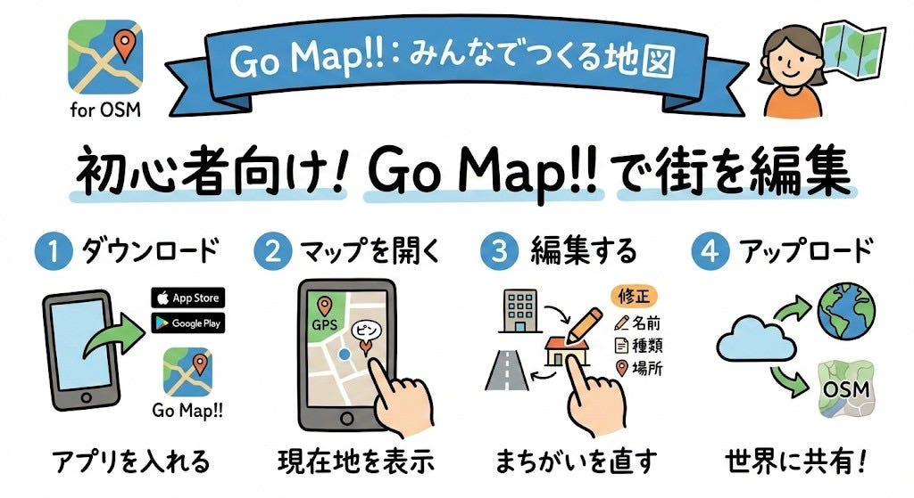

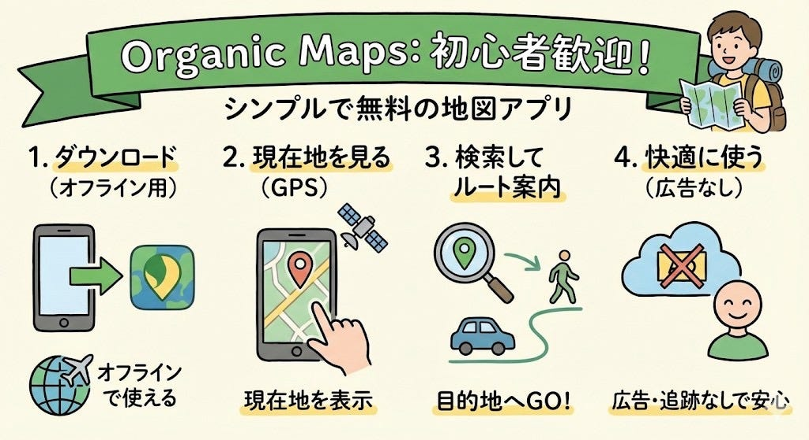

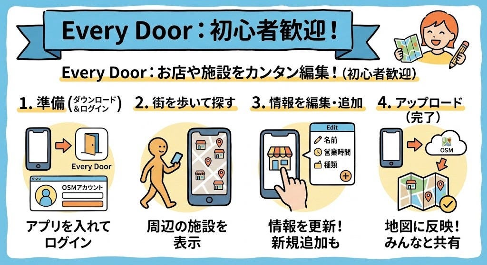

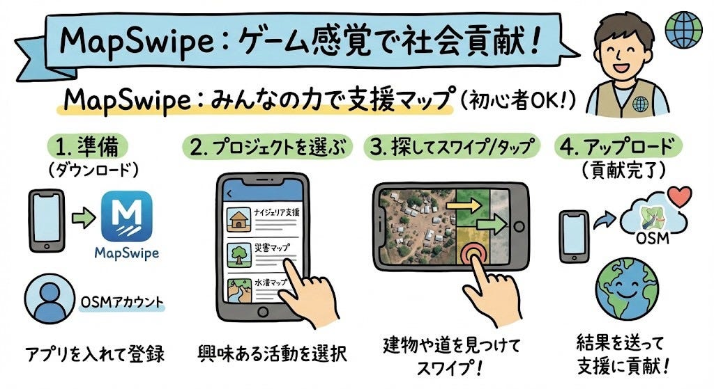

生成されたグラレコ（英語版）

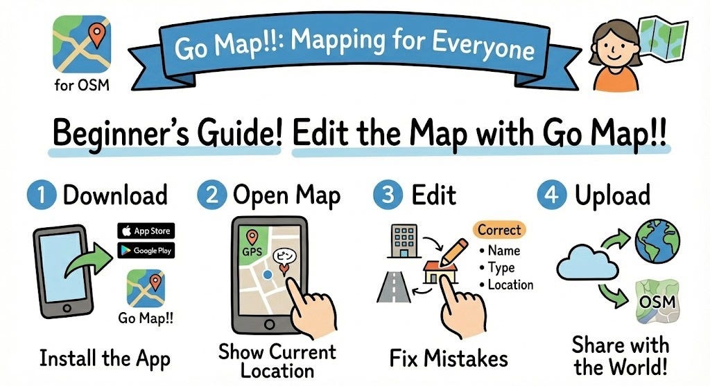

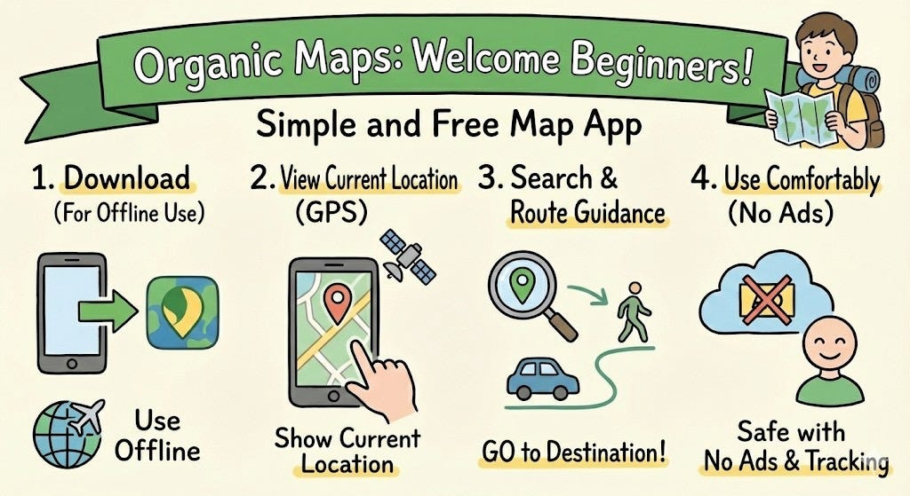

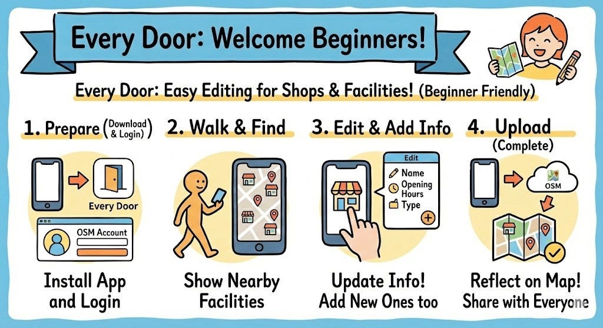

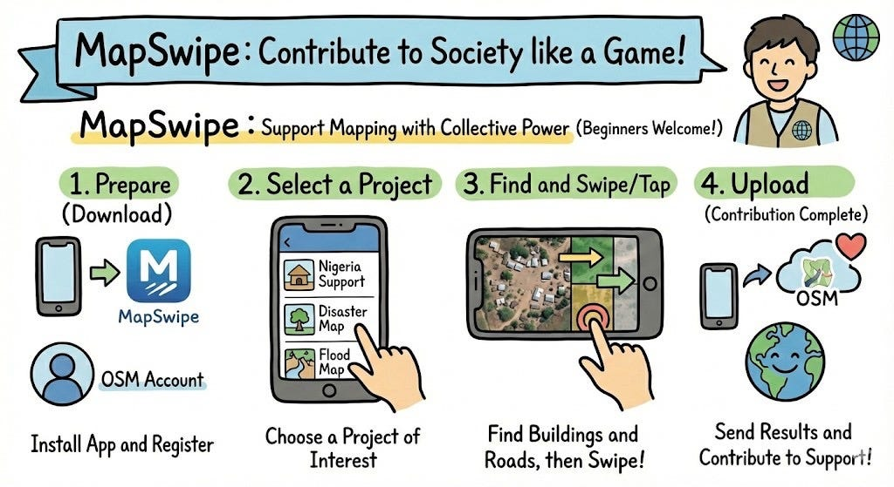

#### 訂正

生成されたグラレコにハルシネーションが起きていないか再度チェックしました。

確認する際に、気をつけた箇所は以下の通りです。

・日本語、英語の表現

・アイコンの再現性

これらを中心に確認した際、アイコンが正確に生成されていなかったため、手書きで修正しました。

修正後のグラレコ

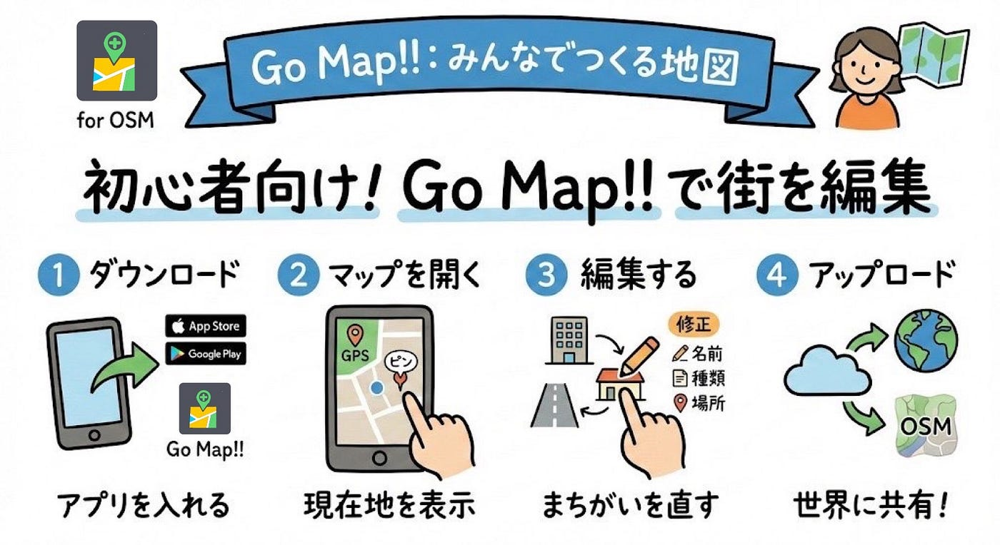

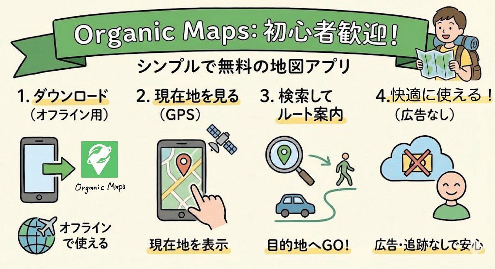

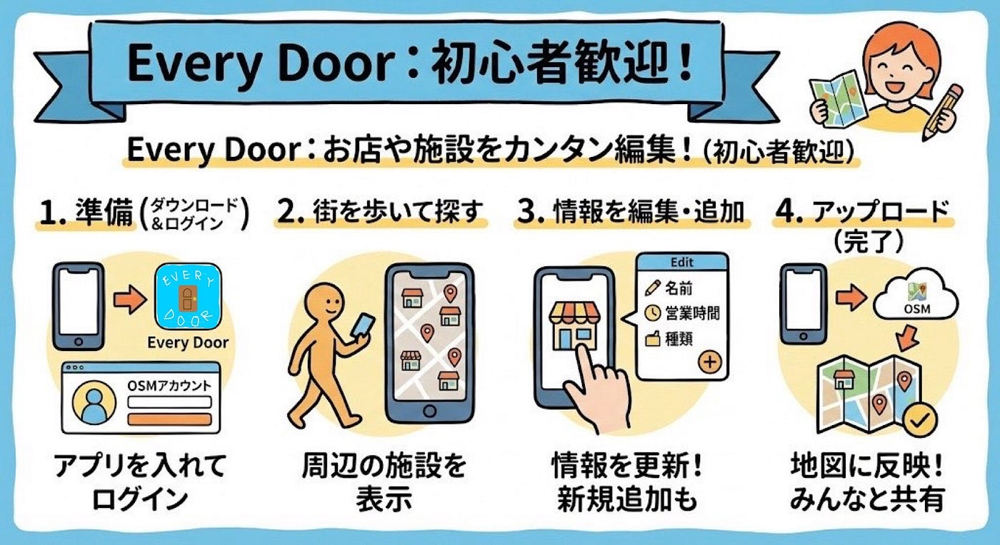

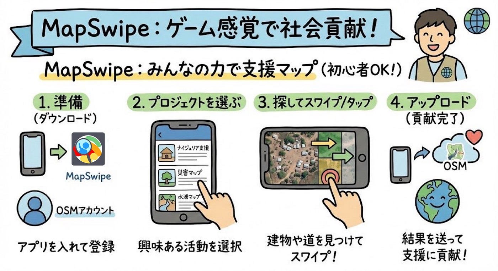

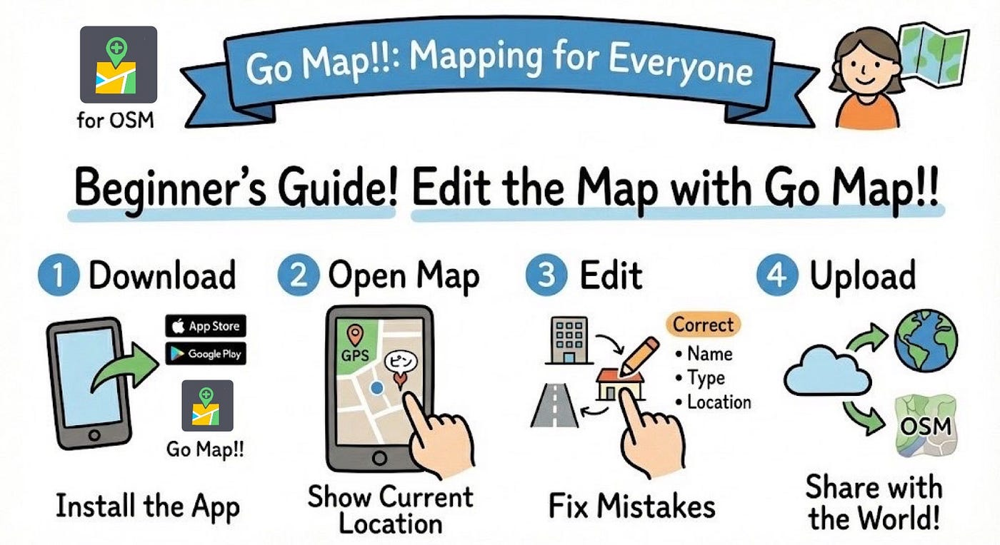

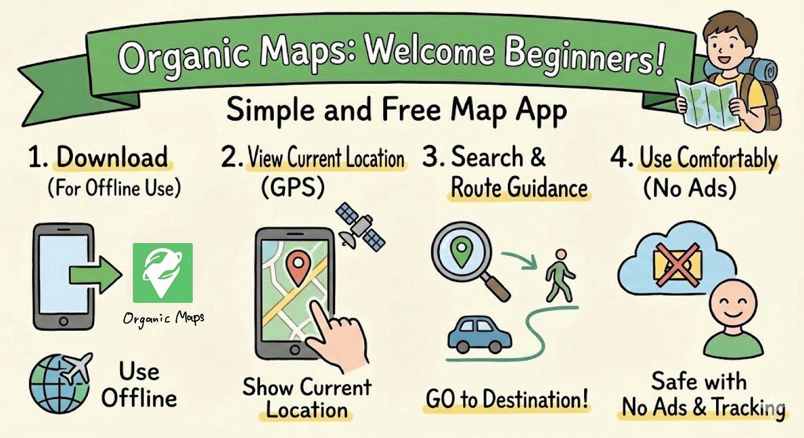

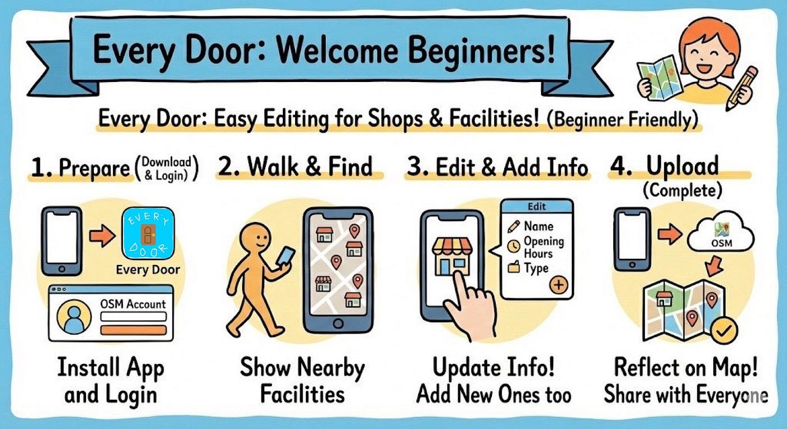

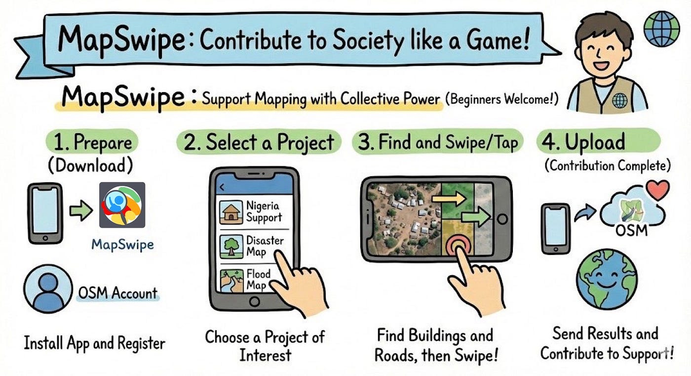

#### 検証

実際に、このグラレコからこれらのアプリを使えるのか、わかりやすいのかを検証しました。

・Go Maps

編集したものをアップロードするには、OSMアカウントにログインが必要。また、アップロードは、画面右下にある雲マークをタップする。

・Organic Maps

検索などを行いたい場合は、地図をアプリ上でダウンロードする必要がある。

などが実際に使ってみてわかりました。

#### 感想

今までAIの画像生成はどこかしら文字やイラストにおかしな部分が出てしまうイマージを個人的に持っていましたが、Nano Bananaの誕生でそのイメージは完全に覆されました。実際にグラレコを描かせてみて、簡単なプロンプトでも自分らが求めている内容をドンピシャで提示してくれてAI技術の進歩を体感できました。（ゆうだい）
