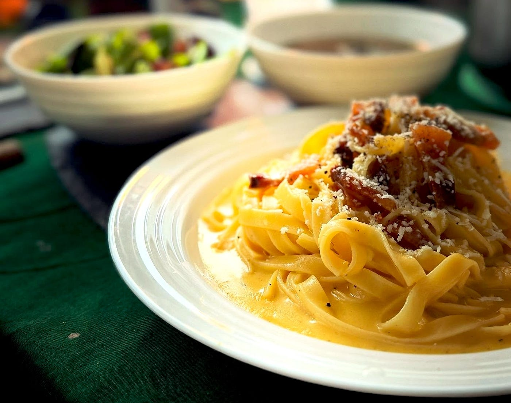
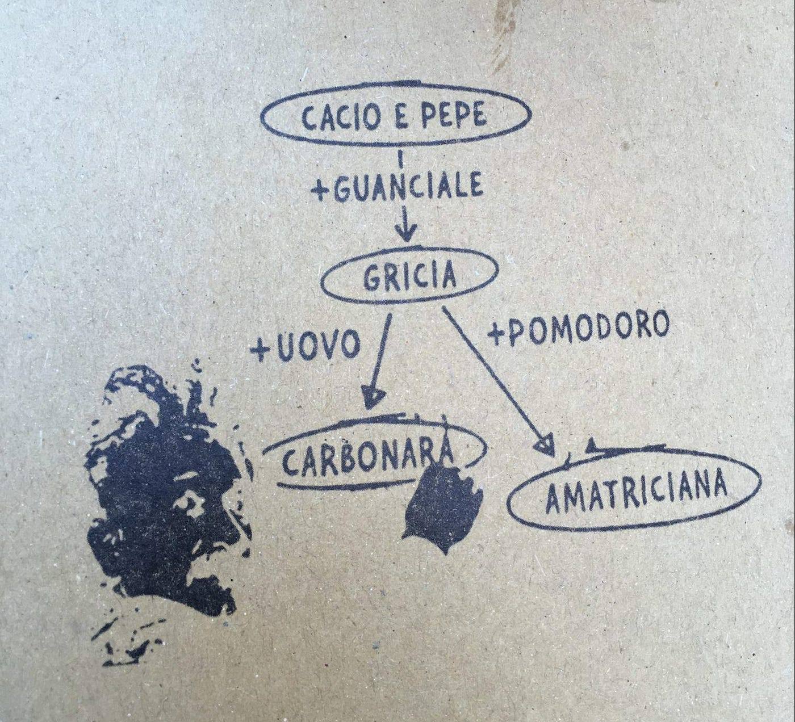
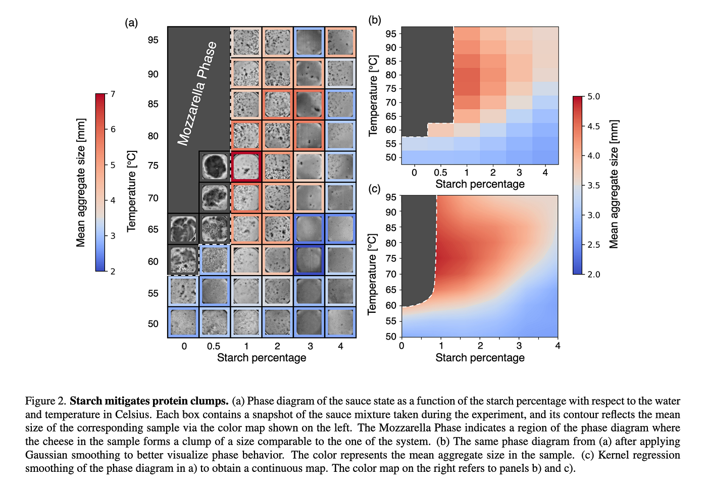
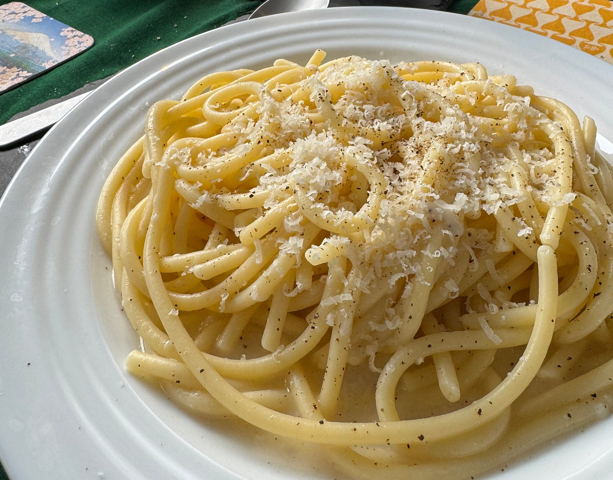
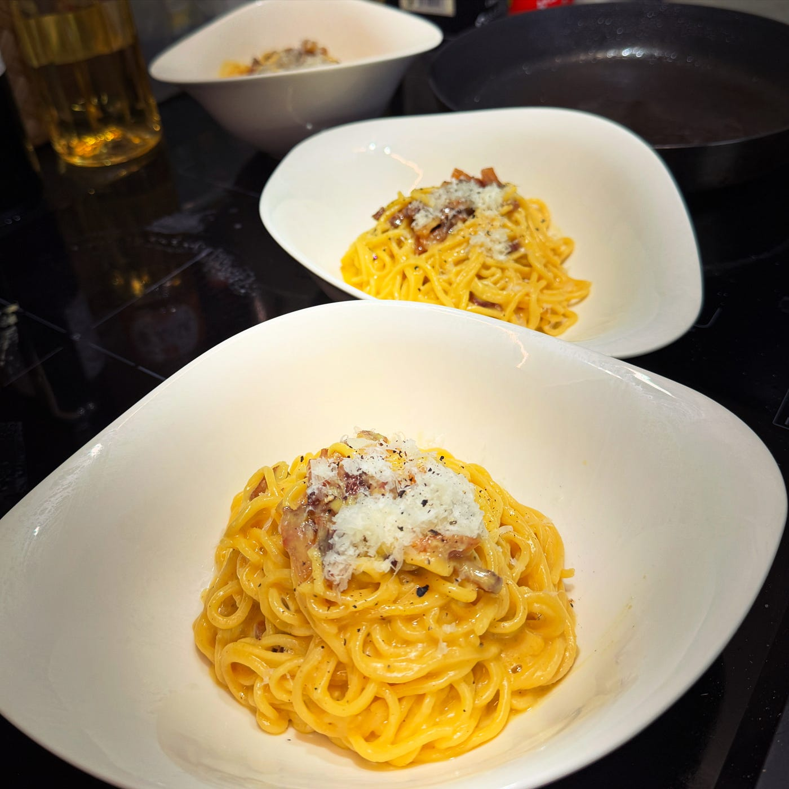
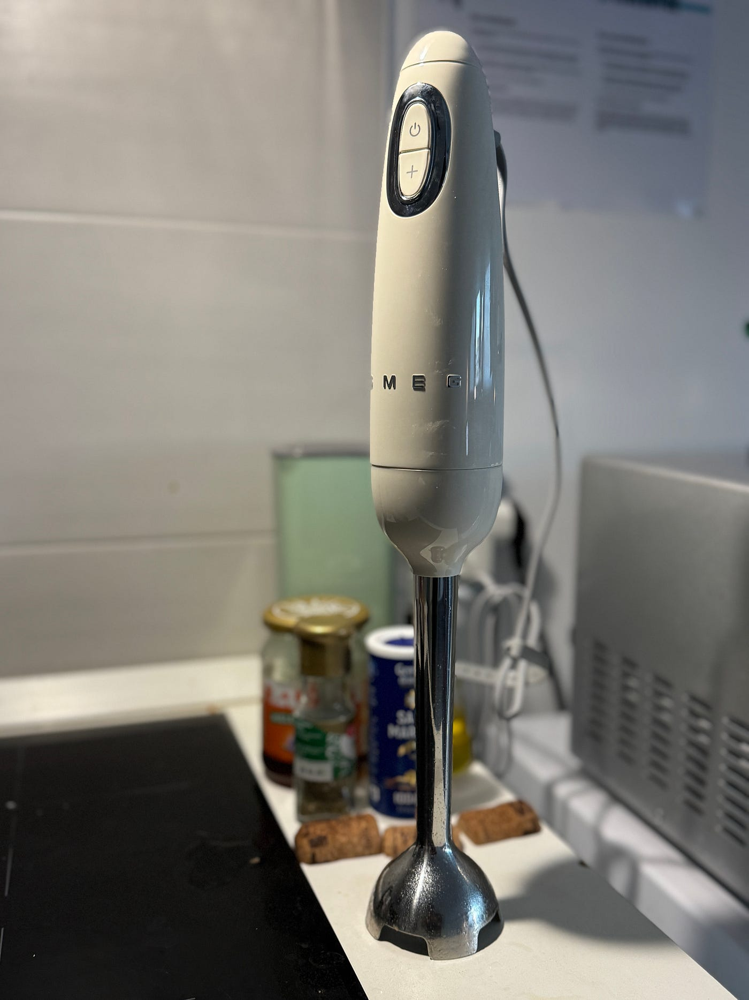

### 乳化を制する者がパスタを制す。

**カルボナーラを極めたい！**

１年間のイタリア・ミラノ工科大学でのサバティカル在外研究という人生にとって貴重な機会をいただけたので、本業である地理空間情報技術に関する研究に集中することはもちろん、すっかり円安となり、滞在期間中の食費を楽しく有意義にコストダウンするために、趣味の範囲でイタリア料理を可能な限り極めようと、スーパーでの食材買い出しは週50€(約8,000円)までと上限設定をしながらパスタやリゾット、ピザ等の自炊料理に毎日精を出した。

ここでは、イタリアでの１年間に身につけたイタリア料理のコツをシェアしてみようと思う。

まずはパスタのコツだ。

アルデンテや、塩加減など、いくつか重要な要素があるが、ここではイタリアに来るまで意識していなかった「**乳化（にゅうか）**」について紹介しよう。

### ドロっとした濃厚なソースをつくる

「**牛乳はなぜ白いのか？**」

高校の化学で習った人は覚えているかもしれない。牛乳は**水と油が混ざった白濁した液体で、疎水性と親水性を持つタンパク質（特にカゼインミセルと呼ばれる球状コロイド粒子）と脂肪の微粒子の作用による「油-in-水型」の乳化液（emulsion）**といわれている。

化学を学んでいないと専門用語が多くて理解しがたいかもしれないが、要は**本来分離するはずの水と油が混ざった状態**で安定しているのだ。

パスタの乳化は牛乳よりも、マヨネーズに近い「油-in-水型」の乳化液。混ざり合わないはずの**水（茹で汁）と油（グアンチャーレやオリーブオイルなど）にパスタから溶け出したデンプンなどが乳化剤として働き、とろみのある一体的なソースに変わる。これこそが本質的な化学的特徴**である。

[https://en.wikipedia.org/wiki/Emulsion](https://en.wikipedia.org/wiki/Emulsion)

と、頭ではわかっていても、これがなかなかに難しい。

カルボナーラの場合はまだ卵を乳化剤としてある程度強制的に乳化することができるが、カルボナーラも含めたローマ料理の代表格であるパスタの系譜をたどると、その祖先である伝説のパスタ「カチョエペペ（Cacio e Pepe）」に行き着く。ペコリーノ・ロマーノチーズと塩・胡椒そして茹で汁というシンプルな材料のみで、とろみのある乳化ソースに仕立てるカチョエペペは「乳化」がうまくできなければ美味しさは必然的にダウングレードとなる。

逆に、**カチョエペペを極めれば乳化マスター**として、カルボナーラやアマトリチャーナ、グリーチャへの応用がいくらでもできる。

ここでタイミングよく、興味深いカチョエペペに関する研究論文が発表された。

[Phase behavior of Cacio e Pepe sauce
Pasta alla Cacio e pepe'' is a traditional Italian dish made with pasta, pecorino cheese, and pepper. Despite its…arxiv.org](https://arxiv.org/abs/2501.00536)

この[Bartolucci et al. (2025](https://arxiv.org/abs/2501.00536)) では、カチョエペペの理想的な乳化を再現する条件を化学的に実験し、その結論が共有されている。乳化テクニックを自分のものにしたいタイミングでこの論文に出会い、色々と目からウロコである。

曰く、**チーズと茹で汁の配分は1：1の比率。約60℃付近**で調理することが安定したソースを作るための重要な条件である。そして**茹で汁のデンプン濃度**がソースの安定性に決定的な役割を果たし、デンプン濃度が1％未満である場合はソースが分離（モッツアレラ相が発生）し、4％を超えると冷めた時にチーズのタンパク質が凝集してソースが固くなる。

とはいえ、60℃の温度管理は料理を作る側からするとストレスで、なかなかうまくいかない。茹でたてのパスタにペコリーノ・ロマーノチーズを混ぜるといとも簡単に分離してモッツアレラ相が発生する。

そこで、もう一つのポイントであるデンプン濃度のコントロールに舵を切った。

### パスタの茹で汁は捨ててはいけない

デンプン濃度を高くするには、しっかりパスタを茹でること。そして湯切りをしたときの茹で汁を捨てずにとっておくことだ。イタリアにやってくるまでは、このパスタの茹で汁の重要性をまったく認識していなかった。余力があれば、茹で汁を煮詰めてデンプン濃度を濃いめにコントロールしても良い。

繊細なカチョエペペはもちろん、カルボナーラのソースもドロドロソースからサラサラソースまでコントロールするには、この茹で汁をどのくらい入れるかで制御できる。

大事なことなので繰り返す。

**パスタの茹で汁は捨ててはいけない。しかもできるだけ濃いめの茹で汁をキープせよ。**

### 力技で乳化させる最強のツール

どうしても濃いめの茹で汁だけで乳化がうまく行かない場合、奥の手がある。ブレンダーだ。これされあれば、そのままだと分離するオリーブオイルなどの油と茹で汁を強制的に撹拌し、問答無用で乳化状態を作ることができる。ある意味禁じ手だが、ここではプライドは捨てよう。

最終的に美味しくなればなにも問題ないのだ。

「**ブレンダーは全てを解決する。**」

**君もパスタをつくらないか？
**Arrivederci, Ciao Ciao!

### Reference

[Bartolucci, G., Busiello, D. M., Ciarchi, M., Corticelli, A., Di Terlizzi, I., Olmeda, F., … & Schimmenti, V. M. (2025). Phase behavior of Cacio e Pepe sauce. _Physics of Fluids_, _37_(4).](https://arxiv.org/abs/2501.00536)

この投稿は以下のアドベントカレンダー2025記事として作成しました。

[Furuhashi Lab. - Qiita Advent Calendar 2025 - Qiita
Calendar page for Qiita Advent Calendar 2025 regarding Furuhashi Lab..qiita.com](https://qiita.com/advent-calendar/2025/furuhashilab)

[青山学院大学 GSC Advent Calendar 2025 - Adventar
Image](https://github.com/user-attachments/assets/e4ca1f13-e5db-4fe2-90a9-8edfa8a50700) **[青山学院大学…adventar.org](https://adventar.org/calendars/12051)
