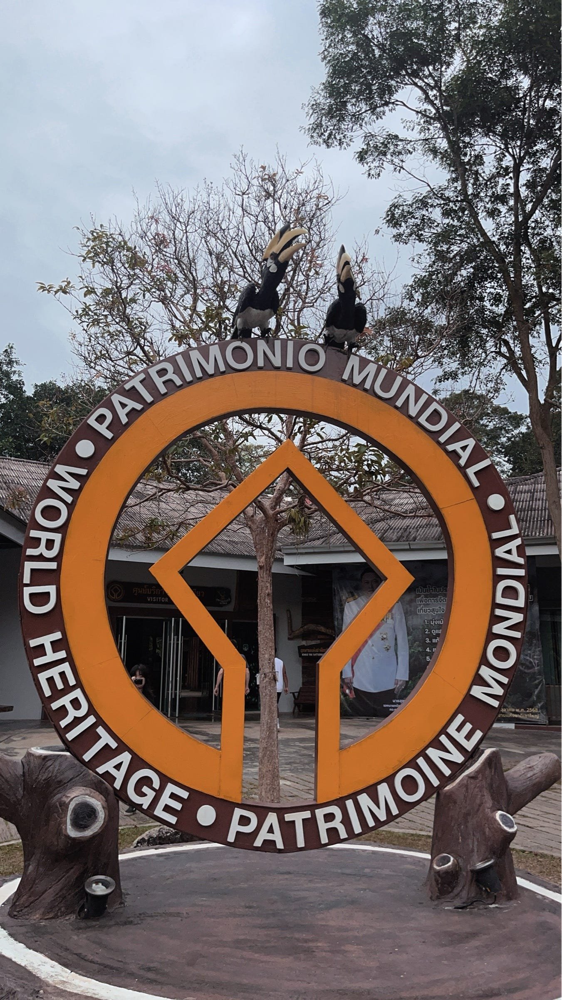

## タイ留学マッピング@khao Yai National Park

2年田邊湊士です。タイのKassetsart Universityに留学をした際の記録です。

[strava.app.link](https://strava.app.link/tazMKL79iZb)

Stravaでカオヤイ国立公園Trail.2のマッピングを記録しました。

カオヤイ国立公園は、東京都より少しだけ小さい、広さ2168平方キロメートルほどある国立公園であり、2005年7月に世界自然遺産に登録され、テナガザルやアジアゾウ、希少な野鳥や植物が生息しており、トレッキングやキャンプ、ナイトサファリなどを楽しむことができるタイの国立公園です。

https://www.thailandtravel.or.jp/khao-yai-national-park/

私は寮のルームメイトとツアーに参加し、おじちゃんガイドとスペインお姉さんと韓国人と計5人で比較的難易度の低いとされるコース2を歩きました。滝を見て、キャンプ場周辺に寄り、昼食を食べてコース2を歩くというツアーでした。

滝周辺では猿と、キャンプ場では亀や鹿と会うことができました。コース2では特に動物に遭遇することはなかったのですが、ワニ出没注意の看板があったり、川を倒れた木を使って渡ったりと冒険感満載のコースでした。マッピングした道は、道らしい道ではなかったのですが、ジャングルっぽさと南国の鳥の鳴き声の演出が非日常を感じさせる最高の体験でした。トレイルのゴール地点もタイらしくない涼しさと、いい意味の気味悪さがあって良かったです。

https://www.mapillary.com/app/?pKey=1930658231183642

実はカオヤイ国立公園が初めてのマッピングではなく、その前にタイのエラワン国立公園と、ムアンボーランという観光地でも試したのですが、エラワン国立公園ではMapillaryが上手く使えず、ムアンボーランは写真撮っても面白さに欠けたのでカオヤイ国立公園を選びました。国立公園は道が表示されないことが多かったり、航空写真から得られる情報が少なかったり、道が整備されていないために直線で描ける地点が少なかったりするため、実際に自分でマッピングしに行く価値のあるテーマだと感じ、題材選びは成功だと思いました。また、Stravaを見ると、等高線や川に沿ってトレイルが敷かれており、私のマッピングを見た人が植生に変化が少ないことや比較的歩きやすい道だと推測することができると思い、マッピングのやりがい的なものを感じることもできました。Stravaによるマッパーにとっても自分が通った道が記録されることで、遭難する可能性を下げたり、地理情報を自分の記憶と照らし合わせることができたりするため利用価値があるなとも感じました。

カオヤイ国立公園の世界遺産モニュメントです。

Mapillaryはブレずに360°写真を撮影することが特に課題だと思いました。せっかく撮った写真も見づらかったら情報がを正しく読み取りにくいので。

最後にGoogle Earthのプロジェクトです。

[Google Earth
Aw snap! Google Earth isn't supported on your browser. You may need to update your browser or use a different browser…earth.google.com](https://earth.google.com/earth/d/1OiDX6CKwPzC80GwxiT9fCN6OZezRMG_H)

[Mapillary
Street-level imagery, powered by collaboration and computer vision.www.mapillary.com](https://www.mapillary.com/app/?pKey=901780745517768)

[カオヤイ国立公園 (正式名称:ドン・パヤーイェン・カオヤイ森林群) | 【公式】タイ国政府観光庁
【公式】カオヤイ国立公園 (正式名称:ドン・パヤーイェン・カオヤイ森林群) Khao Yai National Park（Dong Phayayen-Khao Yai Forest…www.thailandtravel.or.jp](https://www.thailandtravel.or.jp/khao-yai-national-park/)
