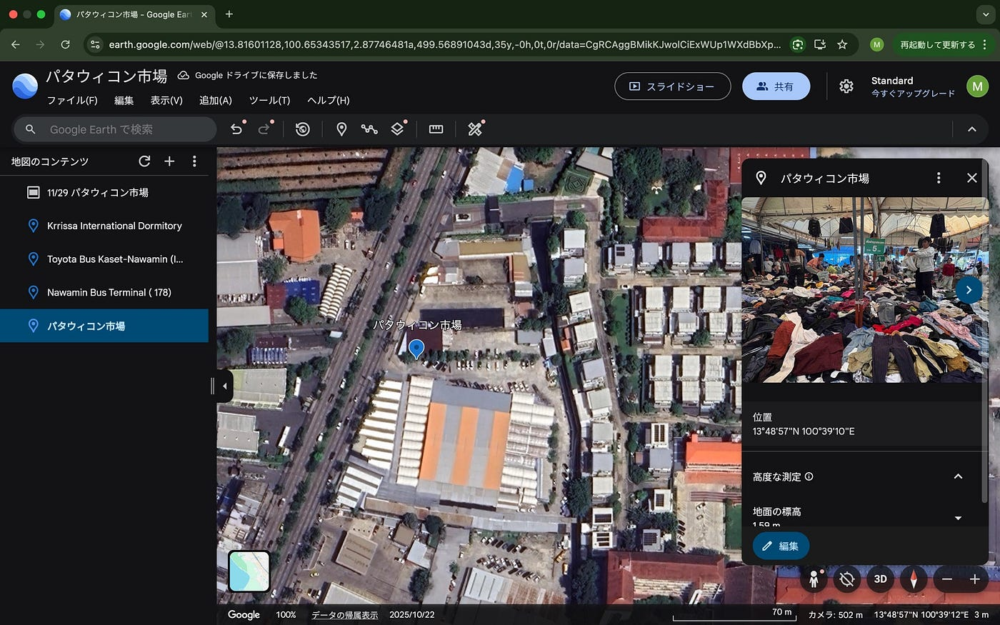

## タイ・ストーリーテリング地図

## 〜パタウィコン市場〜

初めまして。2年の米久保美和です。

私は8月から12月までの4ヶ月間、タイのカセサート大学に留学をしていました。

今回は11月に行ったタイ最大の古着屋マーケット・パタウィコン市場への記録を公開します。

[Google Earth
Aw snap! Google Earth isn't supported on your browser. You may need to update your browser or use a different browser.…earth.google.com](https://earth.google.com/earth/d/1YJuYwAmzOz1_r7Nx5stwKcyyJqXS5fxo)

まずは、Google Earthを使用してストーリーテリング地図を作成しました。

パタウィコン市場は、私が通っていたカセサート大学から約7km離れた場所に位置しています。今回はカセサート大学駅から少し歩いた場所にあるバス停から、パタウィコン付近のバス停まで乗車しました。

[strava.app.link](https://strava.app.link/JGzSjhf6pZb)

旅行中はStravaとMapillaryで記録を取りました。

バスから見た景色は、バンコクの都会な雰囲気とは全く違って、ローカルでタイ独特の雰囲気を感じました。そしてバスの料金が8バーツ（日本円で約40円）と、格安で乗れたことも衝撃を受けました。

[Mapillary
Street-level imagery, powered by collaboration and computer vision.www.mapillary.com](https://www.mapillary.com/app/user/Miwa?lat=20&lng=0&z=1.5)

こちらがMapillaryでの記録になります。

タクシー配車サービスを利用することも１つの手段ではありましたが、パタウィコン市場自体が、バンコクの中でも交通の便が悪く、タクシーが捕まりにくいというリスクもあったため、バスでの移動手段を利用しました。

タイで初めてのバス旅は、地元の方々が多く英語も通じなかったため、パタウィコン市場の写真を見せながら目的地を伝え、バスの中でチケットを販売していた乗務員に現金で払いました。「タイ語」というタイ独自の言語理解に留学中何度も苦しみましたが、その分現地の人々の優しさにも救われました。今回の旅も、迷った時助けてくれたタイの人々のおかげで辿り着けました。

最後に私のお気に入りのスクリーンショットです。

ご覧頂けるように、パタウィコン市場は倉庫のような形をしていて、服の山が何ヶ所かに分けられていました。

パタウィコン市場の周りにはいくつかショッピングモールが存在し、市場で古着を探すのに疲れた観光客向けのレストランなどが多く設置されていたのも印象的でした。

観光するには少し遠いため、訪れるには勇気がいるパタウィコン市場でしたが、服が好きな観光客やタイの人々を、楽しませるための素敵な場所でした。

今回利用したツールは全て初めてだったため、使い方が分からず、何度も苦戦してしまいました。特にMapillaryは、撮り方やアップロードの仕方に苦戦したため、これからの課題になりました。また、ストーリーテリング地図というのも初めて作成したため、訪れた場所を自分の言葉で説明する難しさを感じました。

またこれからゼミに参加していく上で、多くの知識を取り入れ、より良いストーリーテリング地図を作れるようになりたいと思いました。
