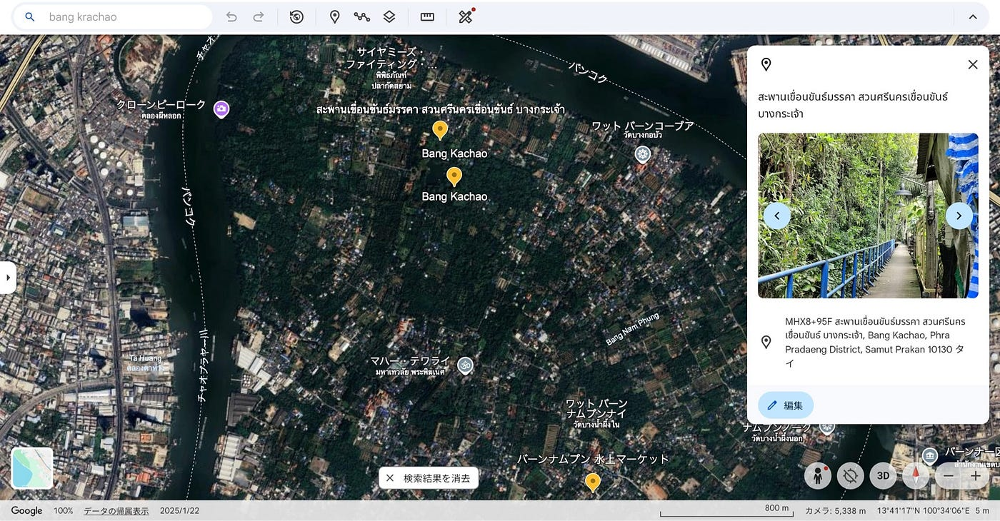

## タイ留学ストーリーテリング@Bang Krachao

こんにちは。2年生の加藤麗杏羅(かとうれあら)です。

私は8月から12月にかけて、タイのカセサート大学に留学していました。今回、その授業のフィールドワークの一環として訪れたBang Krachaoでのサイクリングの記録を公開します。

まず、Google earthを使いストーリーテリング地図を作成しました。当日は、クローントーイ埠頭からボートに乗って島まで行きました。到着するとすぐ近くに自転車をレンタルできるお店があり、そこからサイクリングをスタートしました。

[Google Earth
Aw snap! Google Earth isn't supported on your browser. You may need to update your browser or use a different browser.…earth.google.com](https://earth.google.com/earth/d/1h8-JOw1WGfU2SFk9-LcL9OInz8XpfzJm)

Bang Krachaoは、バンコク近郊に存在する人工島で、チャオプラヤー川の湾曲部と西端の運河によって形成されています。地図で見ると肺のような形をしていることから「バンコクの肺」と言われているそうです。バンコク中心部は高層ビルが立ち並び、非常に発展していますが、Bang Krachaoには島内面積の約60%に手付かずの自然が残っています。(引用 https://runbkk.net/bang-krachao/)

島内にはバーンナムプン水上マーケットがあり、私たちはここでスムージーやご飯を食べて休憩をしました。

サイクリング中はStravaを使ってアクティビティを記録しました。この記録からもBang Krachaoがタイの中でも特に自然に溢れていることが分かります。また、サイクリング中は先生が先導してくださっていたため、あまり道順を意識せず着いて行っていました。後からStravaの記録を確認すると、シーナコーンクアンカン公園を一周していたことや、想像以上に広範囲の道を走っていたことに気づき、とても感動しました。

[strava.app.link](https://strava.app.link/OmkNDbPXsZb)

自転車に乗るのは小学生ぶりで細い道を進んで行くことに不安はありましたが、怪我なく走り終えることが出来ました。久々に自然を感じ、運動もできてとても楽しい経験でした。

最後にMapillaryの写真のデータと私のお気に入りの地点のスクリーンショットです。

この写真から、Bang Krachao がいかに自然豊かな場所であるかを感じ取ってもらえたら嬉しいです。写真の撮影地点は道が舗装されていますが、場所によっては未舗装の細い道も多く、スリルを感じながら走るサイクリングとなりました。自然に囲まれた環境の中で進む体験は、都市部のバンコクでは味わえない魅力だと感じました。
