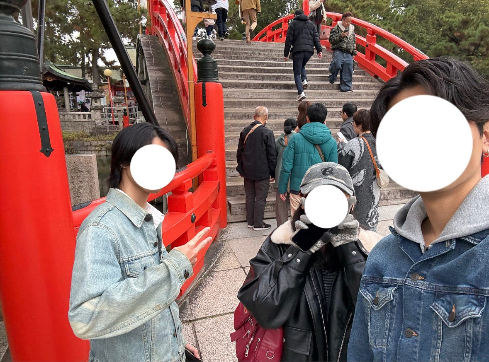

## 手ぶらで京都・大阪(2泊3日)フィールドワーク

こんにちは、2年の中川幸咲です。

私はマレーシアへの留学を辞退したため、12/29〜12/31で横浜市内から京都・大阪を観光した2泊3日の旅程の記録を公開します。

合計の移動距離は1100kmを超え、濃い３日間でした。ぜひ最後までご覧ください。

### 1.Google Earth

[Google Earth
Aw snap! Google Earth isn't supported on your browser. You may need to update your browser or use a different browser.…earth.google.com](https://earth.google.com/earth/d/1_qT76ivy8ccIjinJSWwLpjQJePnivgyi)

地図上には私が訪れた飲食店や神社、今回泊めさせていただいた友人の実家の最寄駅などが記録されています。高校生の時に修学旅行で京都と大阪には訪れたことがあったので、主要な観光地は避けて回りました。

京都駅周辺は私が以前訪れたコロナ禍の時よりも外国人の方が多く、お店のメニューも英語で書かれている店舗が多い印象でした。

また、今回私は家を出発する直前まで宿をとっておらず、野宿でもしようかと考えていたのですが、年末なのにも関わらず友人が実家に泊めてくれることになりました^_^

### 2.Strava

以下がStravaによる移動記録になります。移動手段は京都駅までは新横浜駅から新幹線を使用し、以降は在来線と徒歩、友人の車で移動をしました。京都駅周辺では徒歩で鴨川を中心に観光しました。

今回の旅は、リュック一つで最低限の荷物しか持ってきていなかったため、1日目の最後に京都駅前のGUで服を調達しました。

どこの商業施設にもコインロッカーが多く並んでいて、カラオケ店でも荷物の預かりサービスをしていることから、京都駅が観光の中心地であることを再確認しました。

[strava.app.link](https://strava.app.link/qvwJFvH5xZb)

[strava.app.link](https://strava.app.link/9EmybHI5xZb)

### 3.MapilLary

[Mapillary
Street-level imagery, powered by collaboration and computer vision.www.mapillary.com](https://www.mapillary.com/app/?pKey=1368681574474753)

[Mapillary
Street-level imagery, powered by collaboration and computer vision.www.mapillary.com](https://www.mapillary.com/app/?pKey=4293728820847674)

[Mapillary
Street-level imagery, powered by collaboration and computer vision.www.mapillary.com](https://www.mapillary.com/app/?pKey=870655939021812)

上から順に鴨川、大阪駅、住吉神社のMapilLary記録になります。鴨川では川辺に沿ってカップルが並んでいる有名な風景を実際に見ることができました。ここは、私の好きなドラマであるグランメゾン東京で見たことのある風景でもあり、印象深い場所となりました。

### 4.キメの写真

キメの写真は住吉神社での一枚、2025年を彩ってくれた友人たちとの写真です。

住吉神社は縁結びの御利益などで有名です。来年も良い縁に結ばれるよう祈念してきました。

この旅行を通して、地図や写真で多くの記録を取ったことにより一つ一つの場所に愛着が湧き、良い旅になりました。

最後までご覧いただきありがとうございました。良いお年を！！
