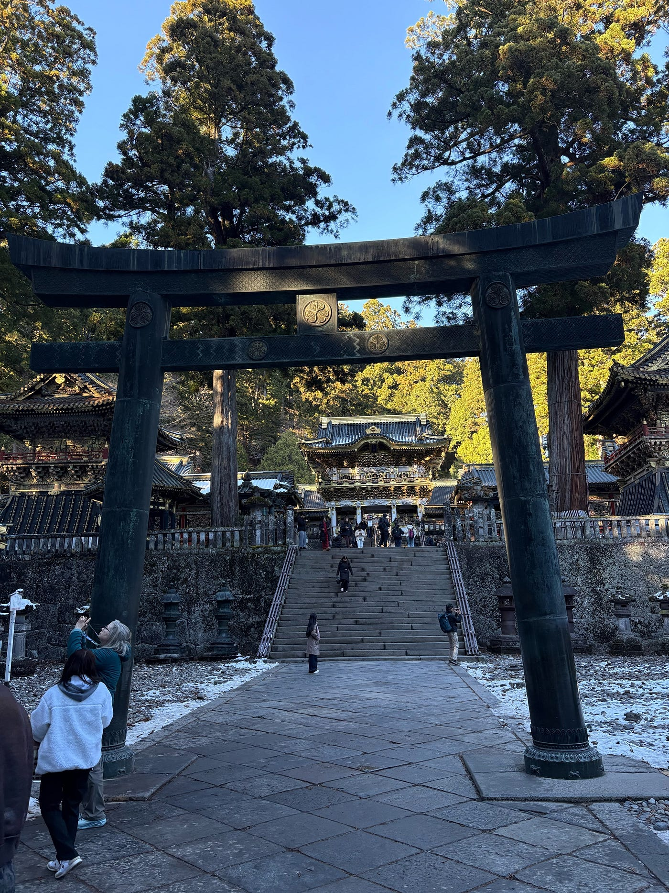

## 日光とスキー場を巡るストーリーテリング

こんにちは、２年の片田 強太です。

私は今回、留学に行っていないメンバー向けの代替課題として、１２月に栃木県日光市へ１泊２日フィールドワークに行ってきました。また、課題で指定されていたMapillaryの記録を補完するために、別の日程で長野県の小丸山スキー場でもログを取ってきたので、あわせて報告します。

[Google Earth
Aw snap! Google Earth isn't supported on your browser. You may need to update your browser or use a different browser.…earth.google.com](https://earth.google.com/earth/d/1tZwTrCbXGkiVoMjSa43W-Gzl1j4adhGG)

日光は東京から特急で２時間くらいで行ける場所ですが、徳川家康のお墓をはじめとした江戸幕府の聖地としての歴史であったり、険しい山岳地形に位置していて、独特の雰囲気があります。今回は特に、世界遺産の日光東照宮周辺を自分の足で歩いてみて、地形が歴史的な場所にどう影響しているのかを探ってみました。

東照宮を散策した際、Stravaを使って移動の軌跡を記録しました。

[strava.app.link](https://strava.app.link/2MirVmsrxZb)

ログを見返して驚いたのは、わずかほどしか６５０m歩いていないのにも獲得標高が　６２mあったことです。

日光東照宮は、大谷川と稲荷川に挟まれた「河岸段丘」という階段状の高台に建てられているのですが、実際に歩いてみると数字以上に急な坂と階段の連続でした。一段ずつ上っていくうちに、街のガヤガヤした感じが消えて、どんどん「神域」に入っていくような不思議な感覚があったのですが、それはこの急峻な地形のおかげなんだなとデータを見て改めて納得しました。

今回の課題ではMapillaryを使った景観記録も重要でしたが、日光での徒歩移動中にうまく撮りきれなかった部分があったため、後日、長野県の小丸山スキー場でリベンジしてきました。

[strava.app.link](https://strava.app.link/RufzjmEnxZb)

スキー場でのStrataログは、リフトで一気に上がって滑走で一気に下りるというスキー場ならではの面白い形になりました。この移動中にMapillaryを使い、雪山ならではの開けた視界や斜面の様子をパノラマで記録しました。

日光のような「歴史が作り替えた地形」とスキー場のような「自然そのものの急斜面」を両方データで残すことができたのは、ツールを使い分ける練習としてすごく良い経験になりました。

[Mapillary
Street-level imagery, powered by collaboration and computer vision.www.mapillary.com](https://www.mapillary.com/app/?pKey=1427676395380365)

この旅で一番心に残っているのは、やはり日光東照宮の社殿そのものです。

Stravaのログにも表れていた通り、東照宮はかなり厳しい斜面に沿って建物が並んでいます。大きな杉の木に囲まれた中で、あの豪華な陽明門がパッと現れる様子は圧巻でした。こんな山奥の険しい場所にこれほど精巧な建物を作り、何百年も維持してきた人たちの執念みたいなものを感じて、ただの観光以上に圧倒されました。

いろいろなツールを使って旅行を記録してみると、ただ「楽しかった」だけで終わらず、自分の移動を客観的に見返せるのが面白いなと感じました。また、Stravaで標高の変化を数字で見たり、Mapillaryでその場の景色を切り取ったりすることで、その土地の歴史と地形がどう繋がっているのかを深く考えるきっかけになり、とても充実したフィールドワークになりました。
