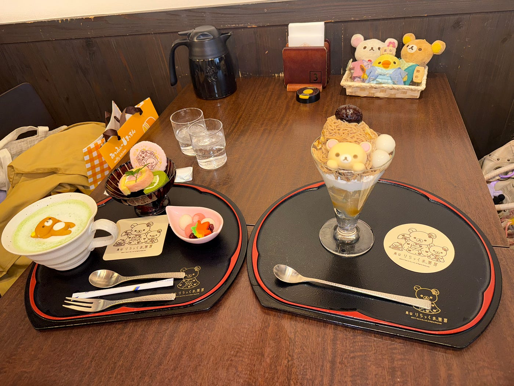
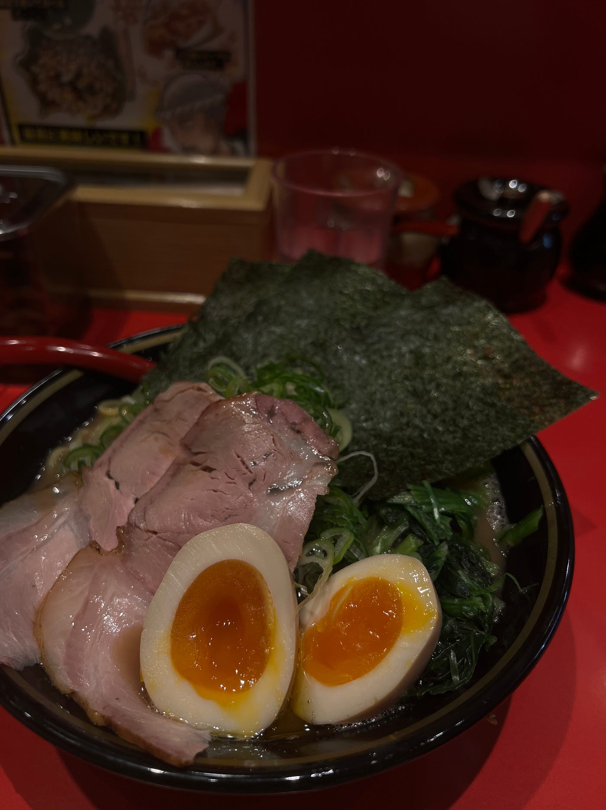

### バンコクの病院から京都のラーメン屋まで：インフルに邪魔された私のストーリーテリング

こんにちは。２年の愛甲智也です。

私は2025年の8月から12月半ばまでタイのカセサート大学に留学をしていました。留学終盤にタイ、アユタヤでの記録を予定していましたが、インフルエンザにかかってしまい、病院までの行動記録しか取れず、データも不十分なため、帰国後、京都でのデータ採取も追加で行いました。

まずはタイで病院を受診した時の記録を公開します。

今回訪れたのはバムルンラード・インターナショナル病院です。バンコク市内の中心に位置し、BTSスクンビットラインのPhloen Chit駅とNana駅の間に位置しています。とても大きな病院で現地の方だけでなく私のような外国籍の方もたくさん訪れていました。

[Google Earth
Aw snap! Google Earth isn't supported on your browser. You may need to update your browser or use a different browser…earth.google.com](https://earth.google.com/earth/d/1n1HLlx6GJQSCyQbBHuWbEj6T9BpauoXA?usp=sharing)

今回は[Google Earth Web](https://earth.google.com/web/)を使ってストーリーテリング地図を作成しました。

大学の寮から病院まではタクシーで移動し、受診後も体調不良のためタクシーで帰寮しました。お昼の時間帯、というのもあり、バンコク特有の渋滞に巻き込まれ、30分で着く距離を1時間以上かけて帰宅しました。

[Lunch Walk | Strava
View Tomoya Aiko's walk on December 13, 2025 | Stravawww.strava.com](https://www.strava.com/activities/16728661413)

[Strava](https://www.strava.com/)の記録はApple Watch SEで記録を取りました。

本来ここで[Mapillary](https://www.mapillary.com/)の撮影データを撮るはずでしたが、撮ることを失念してしまい、データがないため、タイでの記録はここまでとなります。

このままでは不十分なため、追加で帰国後、京都での行動記録も共有します。

日本・京都

相模原キャンパスの近くに住んでいるため、スタートは淵野辺駅からになります。京都までの移動方法は、まずJR横浜線で淵野辺駅から新横浜駅、新幹線に乗り換えて京都駅まで移動しました。今回の旅もGoogle Earth Webを使ってストーリーテリング地図を作成しました。

[Google Earth
Aw snap! Google Earth isn't supported on your browser. You may need to update your browser or use a different browser…earth.google.com](https://earth.google.com/earth/d/1o6nmfEIu2fD_IyxbSaGwLEItsrsx0TQt?usp=sharing)

新幹線の記録は電波の問題なのかスピードの問題なのかうまくデータを取れず、直線になってしまいました。

[Kyoto travel 12/24-26 | Strava
View Tomoya Aiko's walk on December 24, 2025 | Stravawww.strava.com](https://www.strava.com/activities/16843289031)

今回の京都旅行のメインは嵐山での食べ歩きでした。湯葉チーズを食べたり京ばあむを食べたり。本命はりらっくま茶房でかわいいのを食べることでした。

こちらがMapillaryの撮影データです。りらっくま茶房、竹林での撮影を行いました。

[Mapillary
Street-level imagery, powered by collaboration and computer vision.www.mapillary.com](https://www.mapillary.com/app/user/TomoyaAiko?lat=35.018678043488&lng=135.67423342559&z=17&pKey=1580362519646519)

最後に京都でおすすめのラーメン屋を紹介します。そのお店はズバリ総代 麺屋 芥川です。この店舗は京都大学の近く、百万遍にあり、家系のお店となってます。濃いめの家系で幸福度の上がる素晴らしいラーメンとなっておりますので皆様京都を訪れた際はぜひ啜ることをおすすめします。

今回初めてこのような行動記録をつけましたが、地図上に自分の足跡が残ることで、記憶がより鮮明に蘇ることを知りました。 予定変更やハプニングの連続でしたが、バンコクの渋滞の記憶も、京都での美味しい思い出も、こうして地図とデータで振り返ると客観的な視点で見ることができ、新鮮な体験でした。トラブル続きの記録となってしまいましたが、それもまたリアルな「旅の記録」として楽しんでいただければ幸いです。
