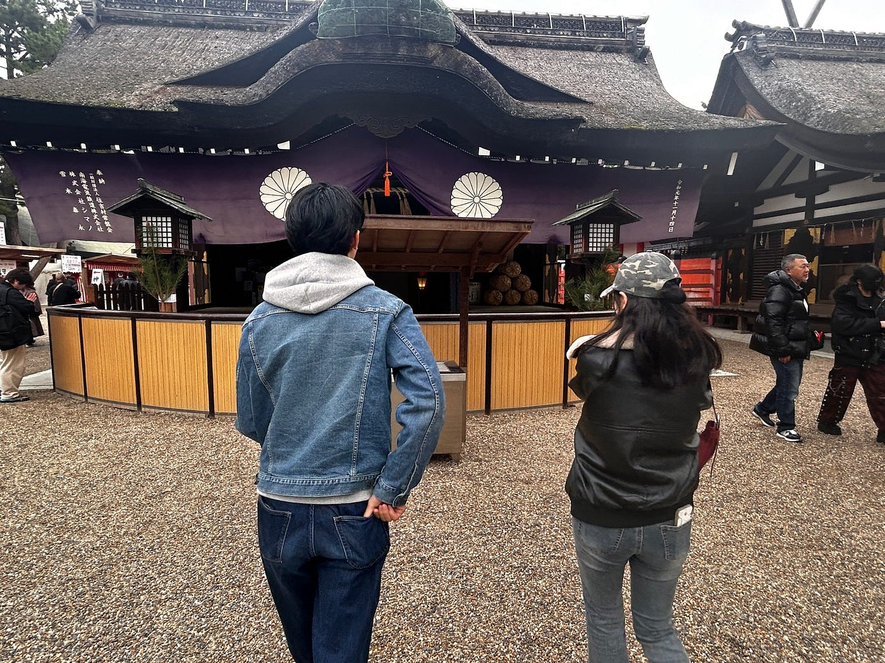

## 京都・大阪マッピング

こんにちは。2年の渡辺優斗です。

今回は、留学中課題の代替として、京都の実家に帰省している間、2日間に渡ってマッピングを行いました。

以下にstravaのリンクを添付します。

常にstravaを起動していると、充電の消費が激しく、モバイルバッテリーは手放せませんでした。

[strava.app.link](https://strava.app.link/1Cpg6EM4xZb)

### 1日目

1日目の12月29日は、京都市内をドライブし、観光名所である鴨川-河原町をはじめ、観光地からは少し外れた地元などを散歩し京都の街並みを感じました。

・鴨川 mapillary

https://www.mapillary.com/app/?pKey=25651592671123615

幼い頃から慣れ親しんだ京都は、街を歩いていると自然と頭に地図が浮かんできますが、幾度もmapillaryを確認していると、案外ここの通りからここの通りまでは距離があり体感と乖離があるだとか、この小さい通りに名称があるのだとか、新たな発見があり、地理情報に意識を配りながら散策することは新鮮で、なかなか面白かったです。

実家から軽自動車に乗り込み、観光地である京都市の中心部に向かったのですが、年末という時期のせいか、交通量が非常に多く、また、大通りから少し逸れると、まず神奈川では走ることなないような狭い道ばかりで、精神をすり減らしました。現地のタクシーがすれ違う際に、熟年の車幅感覚が成せる技なんでしょうが、こちらからすると衝突するんじゃないかと冷や汗をかく程に距離を詰めてきて、もうしばらく京都で運転はしたくないですね。

観光地は外国人観光客でごった返しており、街を歩くにも思うように進めず、折角の古都京都の雰囲気を感じるには不適当であったため、観光地を離れ地元をブラブラと散策していました。なにやら大きな建物が連なっていると思ったら、そこは京都大学病院だったので、ふと思い出してmapillaryを撮ったのですが、1度mapillaryを起動すると20連写程する上に、毎回シャッター音が鳴るのです。深夜に病院前でパシャパシャと何枚も写真を撮っている人は怪しすぎるので、シャッター音に急かされて早く終われ、早く終われと高速回転したのですが、案の定、ブレていて綺麗に撮れませんでした。これは精神力も鍛えられる良いアプリですね。来年も古橋ゼミで写真を沢山撮ることになるでしょうから、そう考えると、次の機種変更もiPhoneでいいやと思っていた私は再考の余地がありそうです。

### 2日目

2日目の12月30日には、14時頃、大阪梅田に友人らと集合し、年末詣に住吉大社を訪れました。今年の感謝と、新年に向けての祈願を行いました。

・住吉大社 mapillary

https://www.mapillary.com/app/?pKey=1524760555306469

住吉大社の建築様式は、ほとんど住吉大社以外では見られない固有の建築様式である「住吉造」といい、仏教や中国建築が日本に入ってくる以前の、日本最古級の建築様式だそうです。装飾が少なく、建築が直線的で、神社の原点ともいえる建築だそうで、シンプルながらも厳かで日本の歴史を感じられる、雰囲気ある場所でした。

住吉大社を後にして向かったのは、駅を挟んで反対側に位置する住吉公園です。綺麗な花壇と噴水を抜けると、木造風のとても雰囲気の良いカフェがありました。一息つこうと団子を2本注文し席に着きました。すると、レビューを投稿したらテイクアウトのお団子2本プレゼントというなんとも素晴らしいサービスが目に入ってきたのです。注文すると2本で450円なのに、たった1分で終わるレビューの投稿で更に2本が無料で貰えるということで、もちろん星5を押して投稿し、これは得したなと上機嫌で団子の出来上がりを待ちました。いざ出来上がった団子を食べると、これまた感動に値する美味しさだった訳ですが、しかし、食べ終わると、ここから追加で2本は、もう要らないかなと感じるのです。友人と、これが1本無料なら逆に貰ってたねと、2本無料の巧みな戦略性にまんまとハマってしまい、負けを認めざるを得ませんでした。

カフェを出ると時刻は5時をまわっており、大阪駅に戻ってショッピングと夜ご飯を頂きました。丁度2日前の28日は私の誕生日だったので、友人らがお祝いにと、アクセサリーを一緒に選んでくれました。思案の末に、これしかないと気に入った商品は、かなりの高額でしたので私も金額の足しに幾らか出したのですが、あいにく祖父から貰った旧札しか持ち合わせていなかったため、恐る恐る「これ使えますか？、、」と差し出してみたのですが、不安とは裏腹に、むしろ、店員さんは額面以上の価値があるお宝ではないかと興奮した様子でした。残念ながら、事前に骨董価値は殆ど無く額面通りの紙幣であるとサーチ済みなので、それだから会計に出した訳ですが、持ち上げられる度にそんなお宝じゃないのにやめてくれと、後から店員さんが調べて落胆することに不安が募ってしまいました。

とにかく、友人らと会するのも今日が今年最後になりますし、こうやって祝ってくれる友人の存在に改めて有り難さを感じた1日となりました。

最後にお気に入りの1枚です。

こちらの写真は、住吉大社でお賽銭をしている場面です。丁度良い小銭が無かったので、ご(5)縁がありますようにと、祖父に貰った500円札を賽銭箱に投げ入れました。一人暮らしで節約している中、奮発したのでその分ご利益があれば嬉しいです。2026年も古橋ゼミでの活動含め最高の1年になりますように。

最後にGoogleEarthのリンクになります。

https://earth.google.com/earth/d/195d_tIYixFKQlQtgxLj19UuopJueAk8g
