### 新年をGPSアートで祝おう！

### Mappy New Year!!

あけましておめでとうございます。本吉です。気づけば2026年となりました。新年一発目の週報、何か特別で楽しいことがしたい！と思い、何をしようか考えた結果、GPSアートに行きつきました。

### 0.GPSアートとは

> **GPS（グローバルポジショニングシステム）を使用して現在位置を記録しながら移動し、その軌跡で大規模な地上絵を描くアクティビティ**のことです

[https://gpsart.info/gpsart-jp/](https://gpsart.info/gpsart-jp/)

### GPSアート作成

#### 1.テーマを決めよう

まずはGPSアートで何を描くか決めます。まずはアイデア出しから。アイデアとして出たのは以下の四つです。

2026、馬の絵、午、鏡餅

ふむ、決め難い。と言うことで、Google Mapの地図をもとにどんなGPSアートができそうか、ChatGPTに聞いてみました。

> この地図からGPSアートをしたい。何かできる？想定ルートを地図の青色の道をなぞって書いて

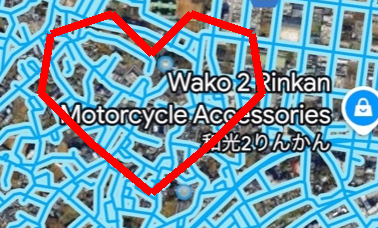

たわけ者。そんなに都合のいい道はない。

まだAIにはGPSアートをさせるのは難しいようです。Geminiにも聞いてみましたが、同じ結果となりました。

と言うことで、話は振り出しに戻ります。地図と睨め合いっこをしながらどんなものが書けそうか考えた結果、テーマは以下のようになりました。

_**「2026 午」_**

Google Map上に道をなぞり、イメージ図を作成しました。

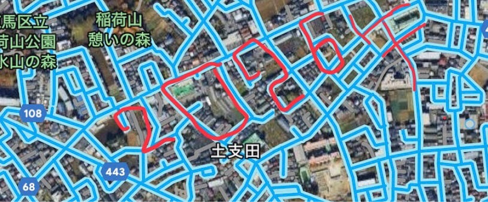

なかなか綺麗にできたと思います。

#### 2.Google Earth Proで計画を立てよう

なぞっただけではクオリティが低いので、Google Earth Proを使い、パスを描くことでより完成度を高めます。

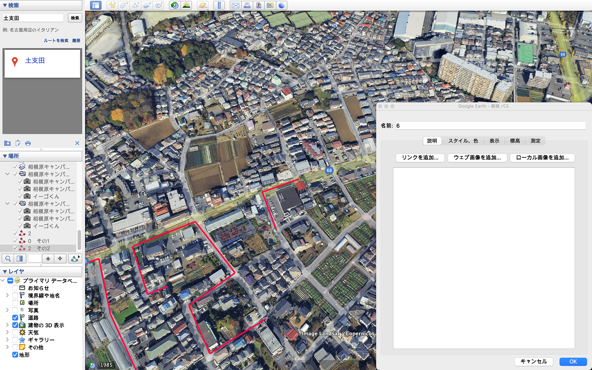

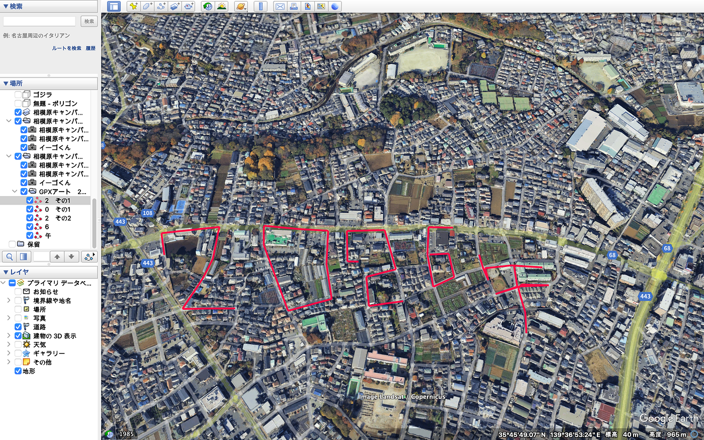

これで下準備は完了です。

#### 3.いざ、出発

データログはStravaで取ります。作成したGoogle Earthの画像をもとに線をなぞりながら移動します。

まず、愛車紹介です。交通ルールにとらわれない最強の移動手段として選ばれたのは我が家の電チャリです。今年で三年目になります。

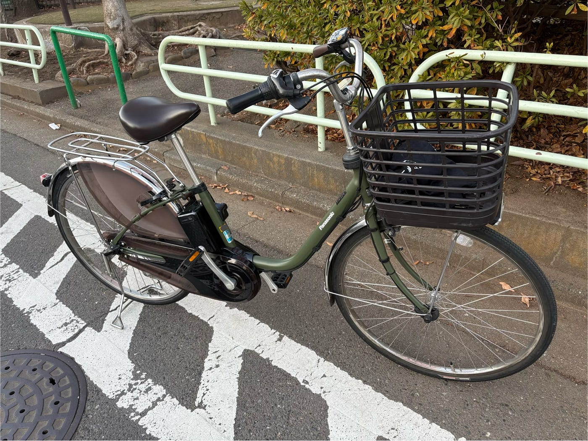

愛車に乗って、練馬の街を駆け巡ります。データの計測には30分ほどかかりました。

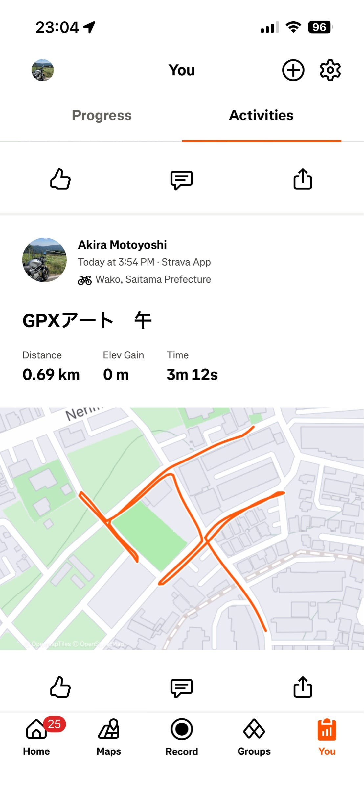

ようやく全ての文字を描き終えました。

[GPXアート 2その1 | Strava
View Akira Motoyoshi's ride on January 4, 2026 | Stravawww.strava.com](https://www.strava.com/activities/16930709898)

[https://www.strava.com/activities/16930709898/overviewGPXアート 0 | Strava
View Akira Motoyoshi's ride on January 4, 2026 | Stravawww.strava.com](https://www.strava.com/activities/16930693537)

[GPXアート 2その2 | Strava
View Akira Motoyoshi's ride on January 4, 2026 | Stravawww.strava.com](https://www.strava.com/activities/16930680457)

[GPXアート 6その2 | Strava
View Akira Motoyoshi's ride on January 4, 2026 | Stravawww.strava.com](https://www.strava.com/activities/16930655128)

[GPXアート 午 | Strava
View Akira Motoyoshi's ride on January 4, 2026 | Stravawww.strava.com](https://www.strava.com/activities/16930643597)

#### 4.ログを一個のデータにしよう

Stravaでとった5文字の別々のデータを一つの地図の上にまとめる必要があります。まず、StravaのデータをGPXファイルでダウンロードし、TrackのみをQGIS上に広げます。プロセシングツールボックスから**ベクタレイヤをマージ**を選択。そして**ラインをマージ**。全てのTrackのファイルを選択し、実施をクリックします。これで、全てのデータが一枚のレイヤーにまとまりました。

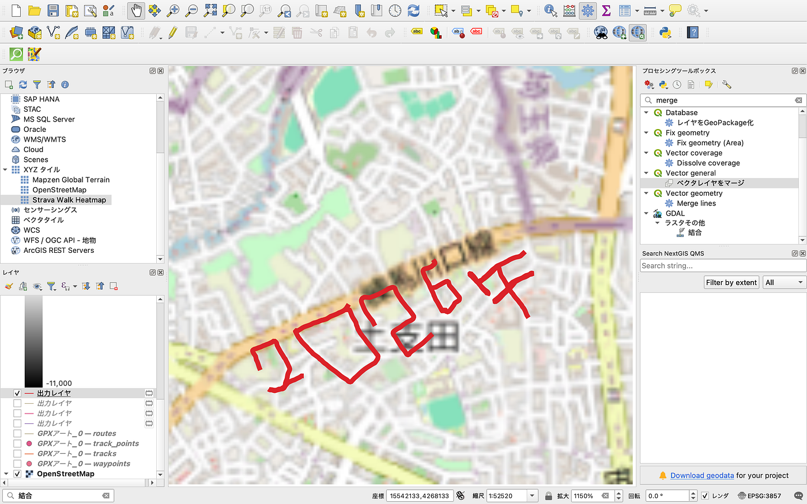

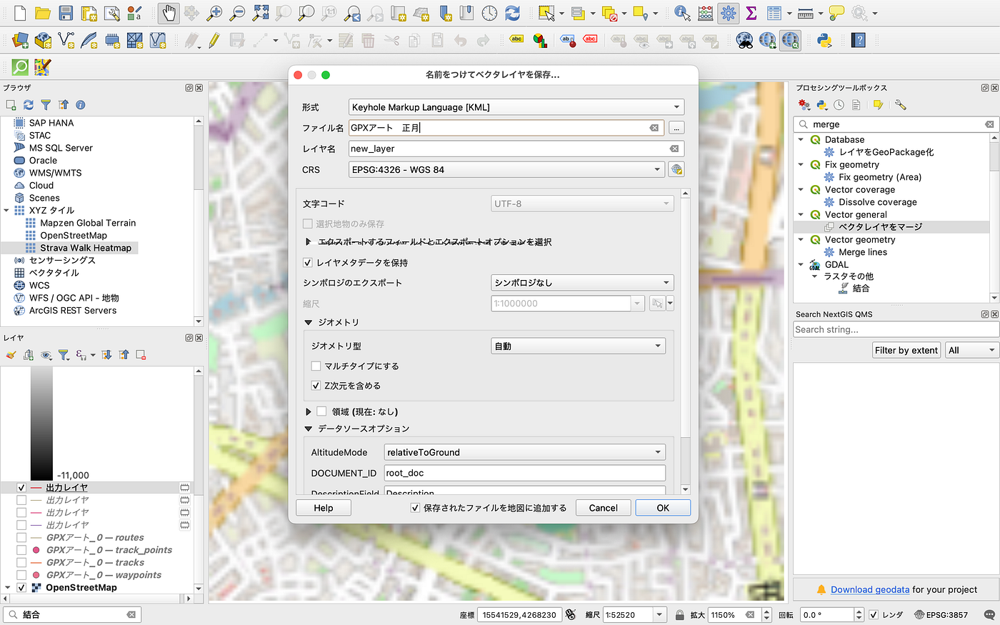

これで完成！と思いましたが、ふと気がつきました。**「背景がやけに引き伸ばされて画質が荒くないか**」。実際の画像がこちら

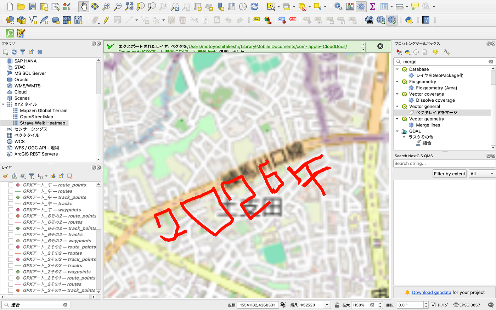

これではせっかく頑張ったのに綺麗に見せることができません。

#### 5.綺麗な背景にしよう

調べてみると、QGIS上のOSMには拡大に限度があり、あまり綺麗にすることができないとのこと。ならば、Google Earth でみてみましょう。

保存したKMLファイルをGoogle Earth Proで読み込んでみました。

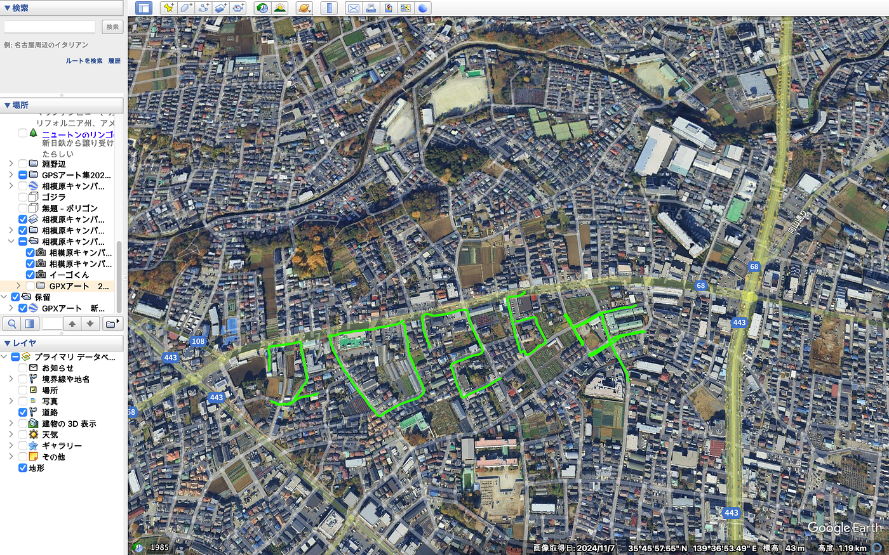

綺麗！いい感じにできています。さて、当初の計画として書いたパスにどれだけ正確にできたか比べてみましょう。

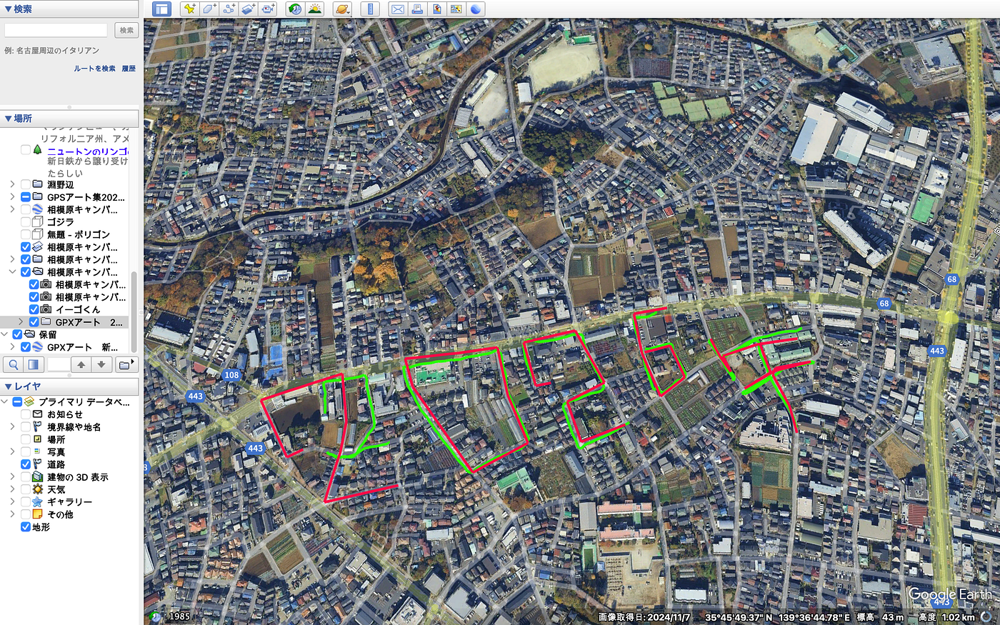

**あ！！！！2が小さい！！！**

やらかしてしまいました。2を当初に計画していたものと違うルートで描いてしまいました。これでも悪くないけど…

ここから僕が立てなおれるかどうかはわかりません。気が向いたらもう一回2だけログを撮りに行くと思います。

### 感想

1. GPSアートを描く場合は規模を大きくするか住宅地で行うと描きやすいと言う発見がありました。規模を大きくすると多少の細かい問題は無くなり、住宅地で行うと格子状に道が広がっているので角張っているものであれば楽に描くことができます。

1. 計画通りの道を通るのは難しいと言うことがわかった。いざ、ログを始めてみるとどこで曲がるべきか、今自分がどこにいるかがわからなくなってしまいました。それが今回の2のミスにもつながりました。Google Map上にそのまま落書きするような機能があればすごく楽になると思います。

#### 番外編

やり直しました！2がどうしても気に食わなかったので、翌日にやり直しました。これで綺麗になりました！！

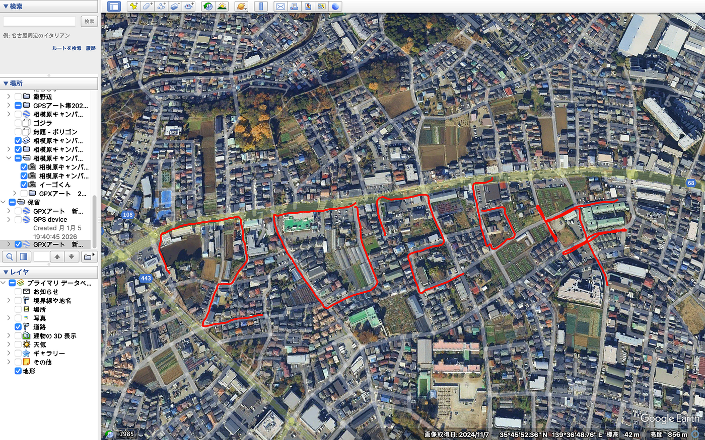

### グラレコ

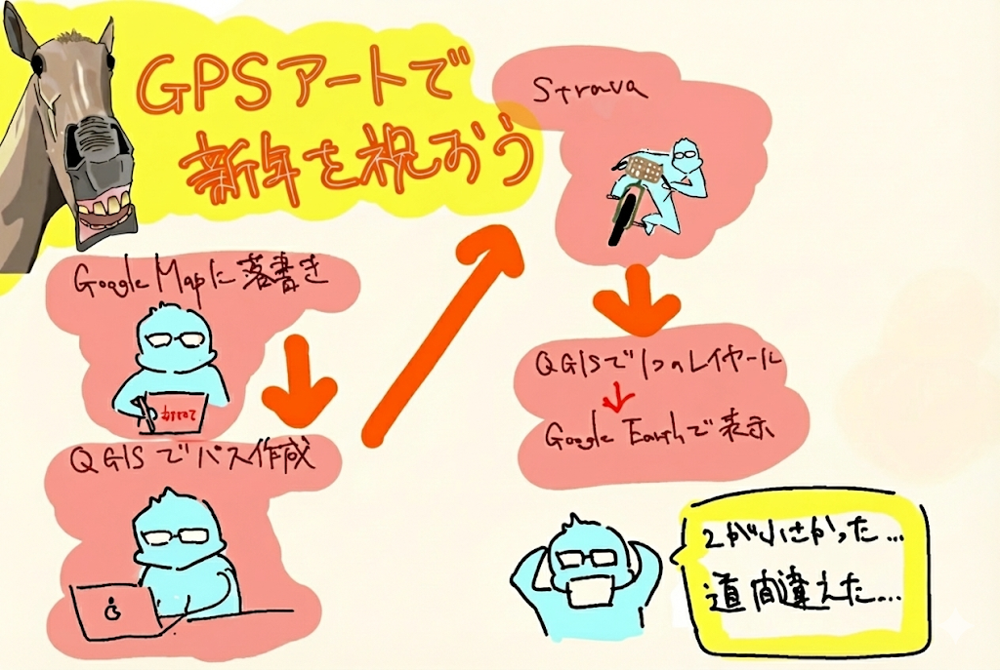
