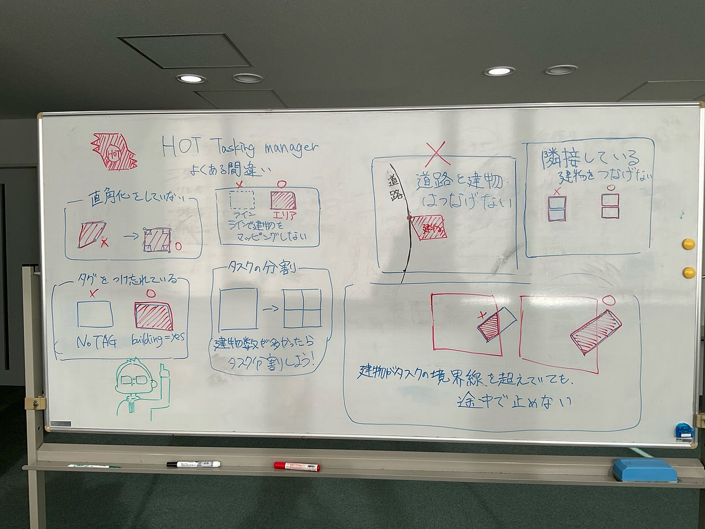
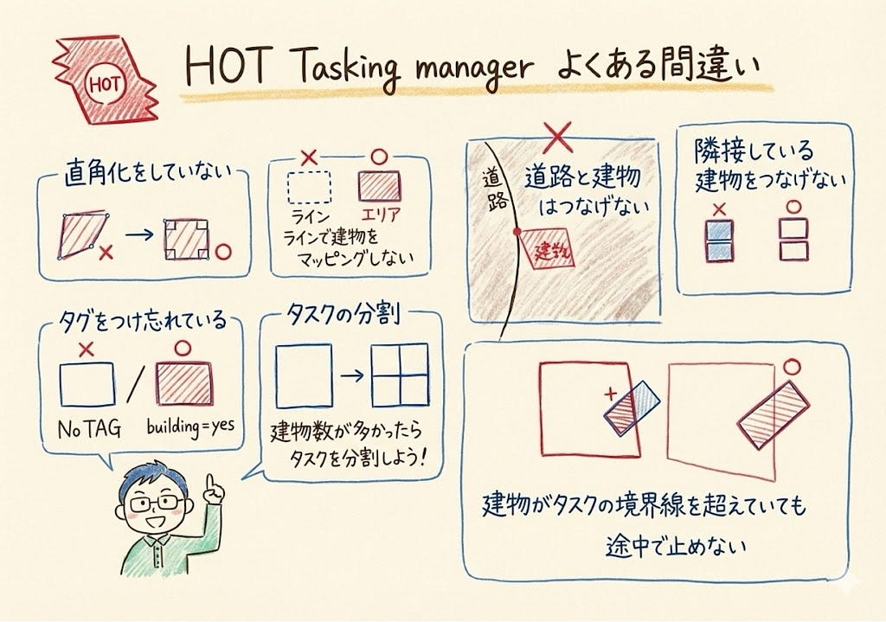
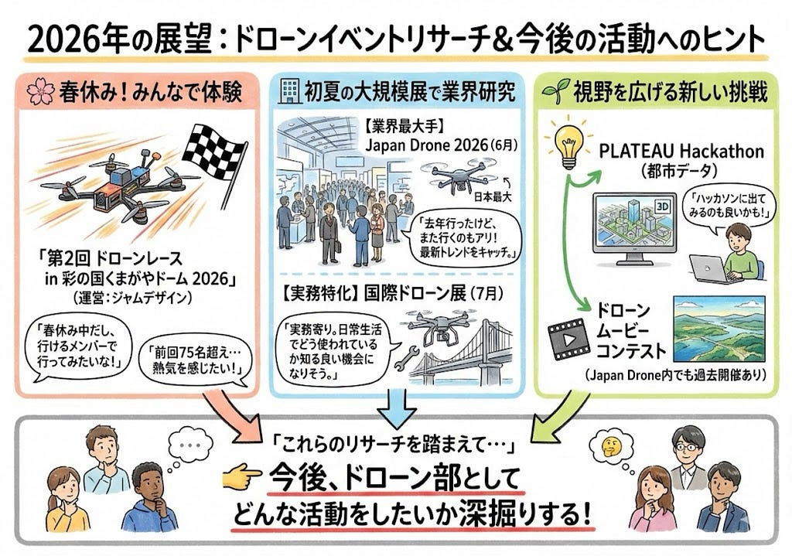

## 2026 ドローンイベント【ドローン部２週報】

あけましておめでとうございます！

大学生最後の一年に対して驚きと共に年々一年があっというまに終わってしまい怖いです、、今年もいろんなことに挑戦して沢山成長できる一年にしたいです。

まず最初に、年末のハッカソンで様々なご指摘をいただいたグラレコの修正をしました。

先生にもアドバイスをいただきながら、ホワイトボードに下書きをした上で、写真を撮ってGemini Nano 🍌にグラレコを作ってもらいました。

ホワイトボードのままグラレコ化してもらいました。シンプルで見やすいグラレコになったのではないかと思います。

続いては、今年はどのような活動をしたいか考えたときに前からドローンイベントに行きたいと考えていたので、今後開催予定のイベントを調べてみました。

#### 1. 【埼玉】第2回 ドローンレース in 彩の国くまがやドーム 2026

運営会社による公式開催発表ページです。詳細なスケジュールやエントリー情報は今後こちらで更新される予定です。

[第2回「ドローンレース in 彩の国くまがやドーム 2026」開催決定！ | 株式会社ジャムデザイン
2024年11月に第1回が行われた「ドローンレース in 彩の国くまがやドーム 2024」。参加人数75名を超jamdesign.co.jp](https://jamdesign.co.jp/news/20251021news_dronerace/)

春休み中だったので、行けるメンバーで行ってみたいなと思いました。

#### 2. 大規模展示会（6月〜7月）：研究・業界動向

**Japan Drone 2026**

- 日本最大のドローン専門展示会です。

[ジャパンドローン 2026 / Japan Drone 2026
日本で初めての本格的な民間ドローン専門展示会＆コンファレンスの単独イベント、Japan Drone 2026。キーワードは「- 各産業界で期待されるドローンの利活用 -…ssl.japan-drone.com](https://ssl.japan-drone.com/)

このイベントは去年行ったので、また行ってみるのも良さそうです。

国際ドローン展（メンテナンス・レジリエンスTOKYO 2026 内）

- インフラ点検・建設技術などがメインの展示会の中で開催されます。

[メンテナンス・レジリエンス 2026｜日本能率協会
「メンテナンス」「レジリエンス」に関する専門展示会である「メンテナンス・レジリエンス」公式サイト。2026年7月15日（水）〜17日（金）東京ビッグサイトにて開催予定。www.jma.or.jp](https://www.jma.or.jp/mente/)

実務よりのイベントで日常生活でどのようにドローンが使われているのか知れる良い機会になると思います。

#### 3. PLATEAU（プラトー）Hackathon などの都市データ活用イベント

→ ハッカソンイベントに出てみるのも良いかと思いました。

[記事一覧 | PLATEAU [プラトー]
記事の一覧ページです。www.mlit.go.jp](https://www.mlit.go.jp/plateau/tag/?tag=hackathon)

他に、ドローン部としてどのような活動をしたいか考えてみたいと思います。

グラレコ

