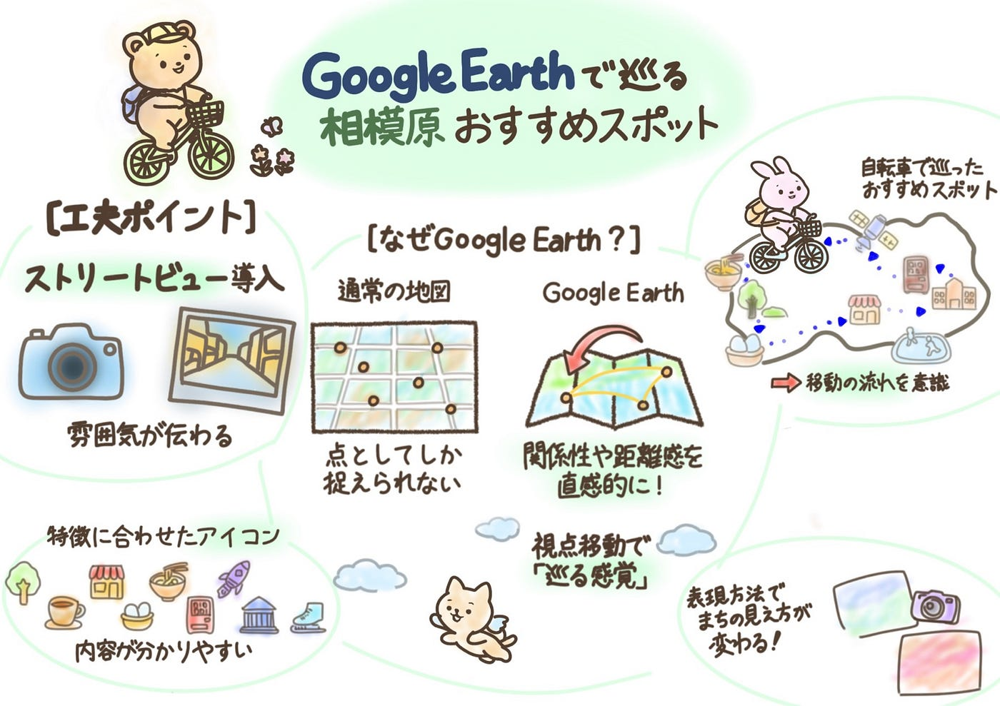

## Google Earthで巡る相模原おすすめスポット【1/6 Youth1 週報】

あけましておめでとうございます！

3年の安生です。今年もよろしくお願いします。今回は、Google Earthを使って相模原市のおすすめスポットを紹介するストーリーテリングをつくってみました。

普段私たちが通う大学の周辺には、授業や通学の中ではなかなか意識することのない、魅力的な場所が数多くあります。

そうした場所は、意外と知られていないのではないでしょうか。

そこで今回は、以前授業の中で相模原のおすすめスポットを紹介した際に訪れた場所をもとに、Google Earthを使ってストーリーテリングとして再構成してみました。

#### **Google Earthでストーリーテリングを行う理由**

今回使用したのは、Google Earthのストーリーテリング機能です。

通常の地図では、点としてしか捉えられない場所同士の関係性や距離感も、視点を移動しながら表現することで、より直感的に伝えることができます。

また、視点の高さや移動の流れを調整することで、実際にその場所を巡っているような感覚を生み出せる点も、Google Earthならではの特徴だと感じました。

#### **ストーリーテリング作品**

以上の理由から、相模原市内のおすすめスポットをGoogle Earthのストーリーテリングとしてまとめました。

今回作成した作品は**[こちら**](https://earth.google.com/earth/d/17Rsf13ZghD5LScnCmHTlY0thqsPvZQj_?usp=sharing)です。

#### **作品について**

今回作成したストーリーテリングでは、相模原市内の中でも、実際に自転車で巡ったスポットを取り上げました。

大学周辺だけでなく、公園や地域に根ざした商業エリアなど、日常の延長線上にある場所を選び、順に辿れるよう構成しています。

スポットの配置や順番は、実際の移動の流れを意識しており、地図上でも「巡る感覚」が伝わるよう工夫しました。

また、すべてのスポットにストリートビューを取り入れることで、その場所の雰囲気やイメージがより具体的に伝わるようにしました。

さらに、それぞれの場所の特徴に合わせたアイコンを選ぶことで、地図を見たときに内容が分かりやすくなるよう心がけました。

#### **作成してみて気づいたこと**

今回、Google Earthを使ってストーリーテリングを行ったことで、同じ場所の紹介であっても、表現方法を変えるとまちの見え方が大きく変わることに気づきました。

授業では、Webサイトを作成することを目的としていたため、紹介文とともに、それぞれのスポットの位置関係が分かる地図を掲載する構成になっていました。この方法は、情報を一覧として整理し、必要な情報を分かりやすく伝える点で、とても有効だったと感じています。

一方で、今回はGoogle Earthのストーリーテリング機能を用いることで、視点を移動させながら場所を順にたどり、移動の流れや空間の広がりを表現しました。その結果、同じ場所であっても、より「巡っている感覚」やまちのつながりを伝えられると感じました。

このことから、目的や伝えたい内容に応じて、適した表現方法があることを実感しました。同じ場所であっても、用いる手法によって伝わり方が変わる点が、地図表現の面白さだと感じています。

#### **おわりに**

今回の取り組みを通して、地図は場所の情報を示すだけでなく、見せ方や表現方法によって、まちの捉え方を変えられる媒体であると感じました。

Google Earthのストーリーテリングは、移動の流れや空間のつながりを視覚的に表現できる点に特徴があり、身近なまちを改めて見つめ直すきっかけになりました。

今後も、目的やテーマに応じてさまざまな地図表現を使い分けながら、地域の魅力を伝える方法を探っていきたです。

