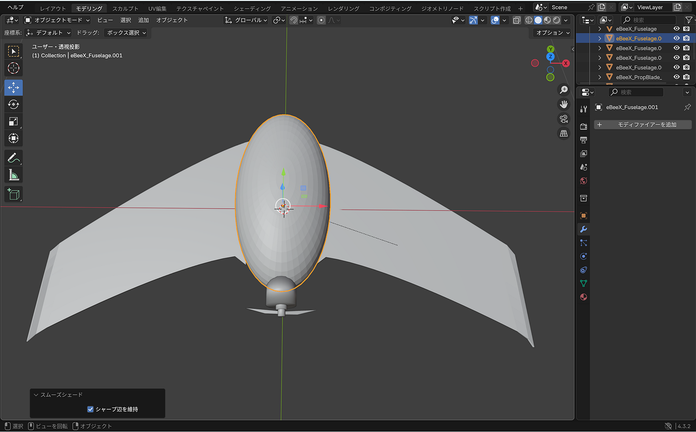
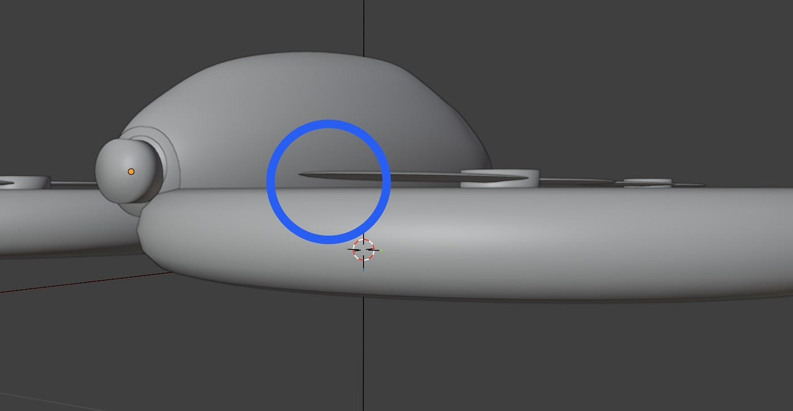
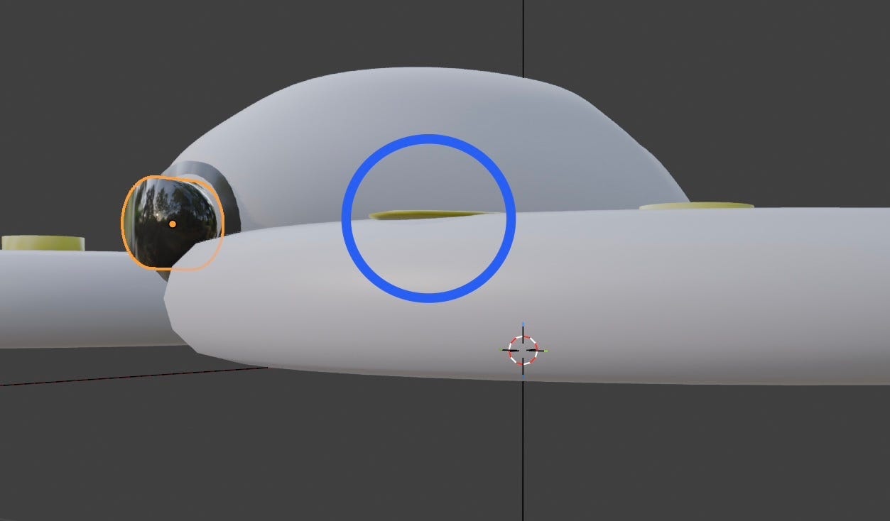
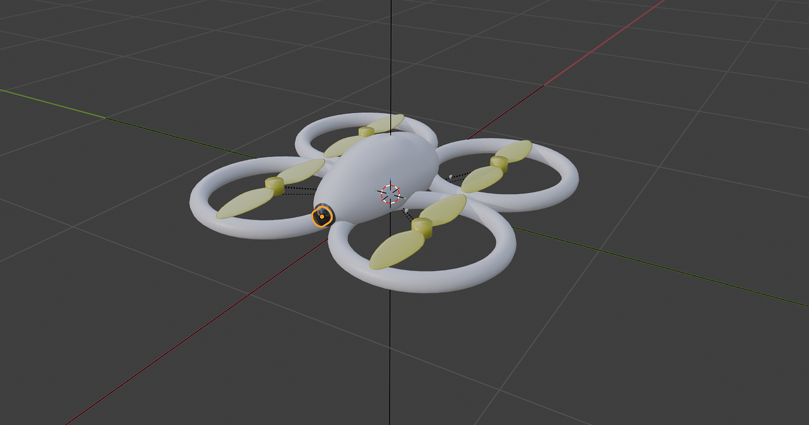
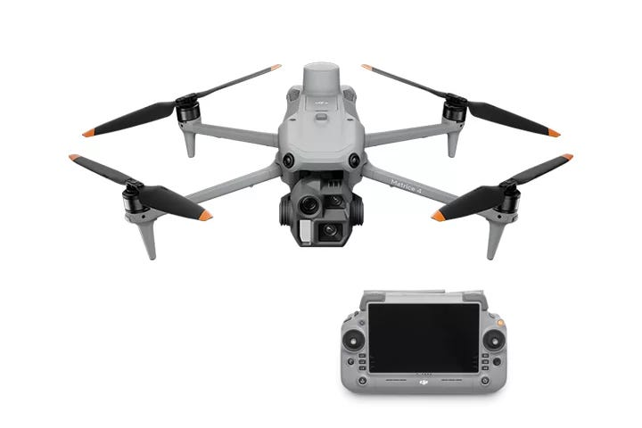
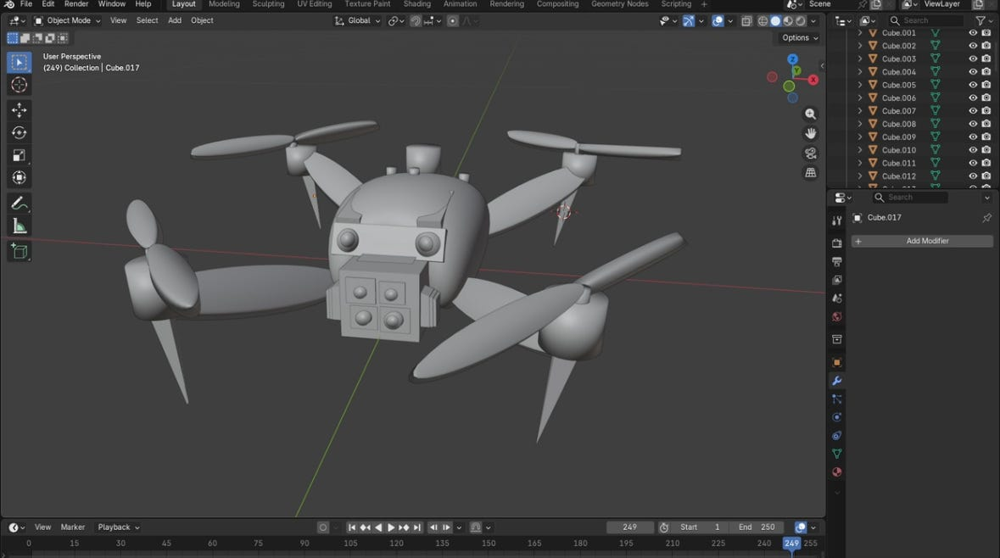
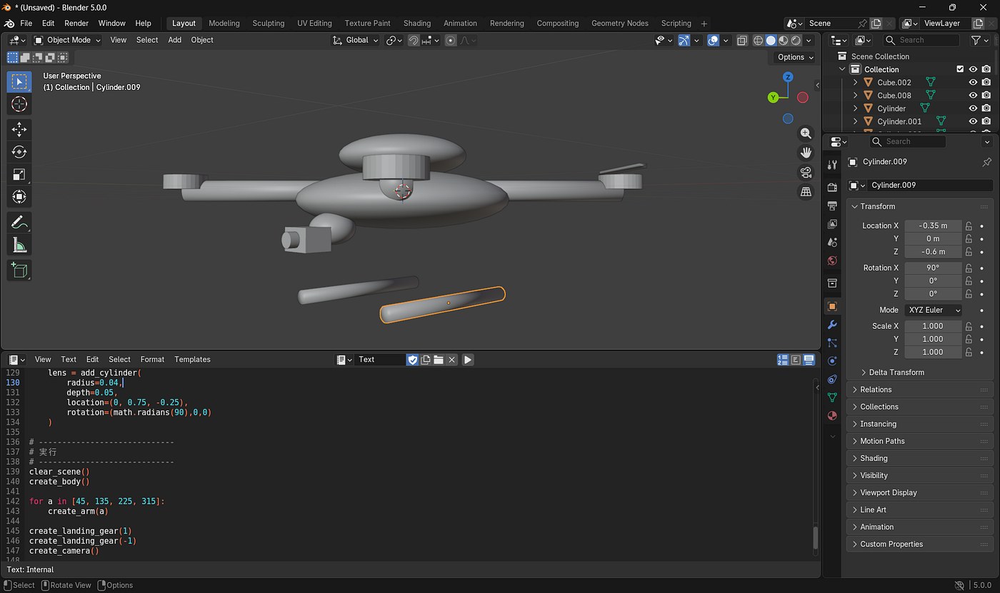
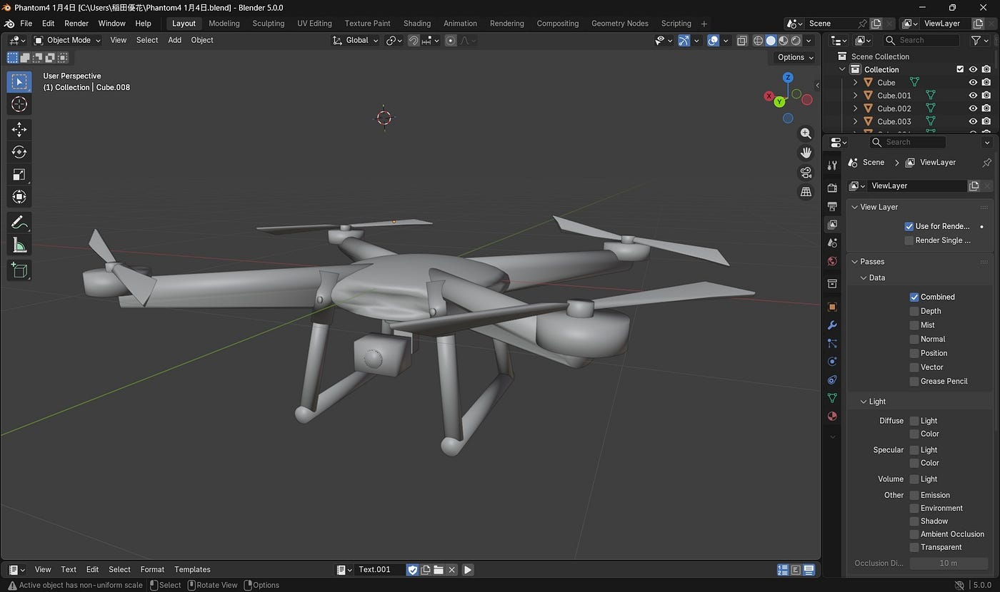
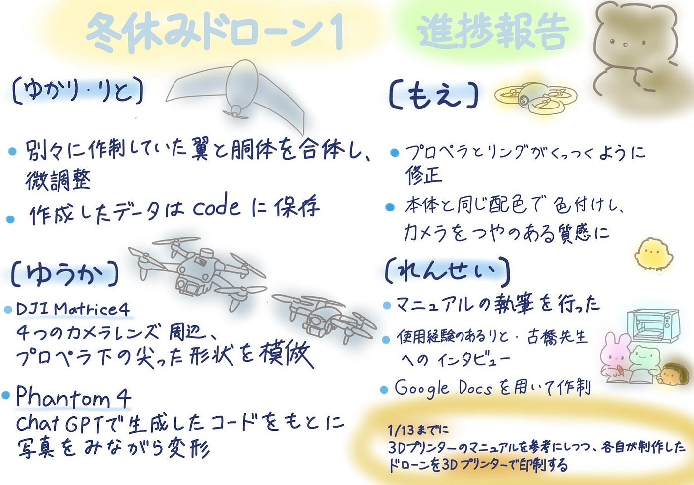

### 冬休みもコツコツ進めたドローン制作

あけましておめでとうございます！早いもので後期の授業も残り数回となりました。限られた回数ではありますが、引き続きよろしくお願いいたします。
 今回の週報では、前回同様にBlenderでのドローンモデリングと3Dプリンターのマニュアル作成について、進捗を報告します。

### 進捗報告【ゆかり・りと】

- りと、ゆかりで別々に作成していた翼と胴体を合体、その後微調整。

- 作成したデータは[code](https://github.com/furuhashilab/drone1_3dprinting_project/blob/main/drone(yukari%2Crito)%20(1).stl)に保存。

### 進捗報告【もえ】

- プロペラと丸いリングの間の隙間が空いていると、3Dプリンターで出力した際にプロペラと本体がバラバラになってしまうため、くっつくように修正した

- 本体と同じ配色で色付けし、カメラの部分はつやつやした質感になるようにした

### 進捗報告【ゆうか】

1. **DJI Matrice4は自力で作成する**

1. **Phantom4はChatGPT生成コードを土台にして改良しながら作成する**

#### 1️⃣ DJI Matrice4の作成

これまでのゼミではChatGPTの参考画像を見て作っていましたが、実物画像を検索してみると細部が異なると感じました。
 そのため、今回はより実物に近づけるために細かい部分を重点的に調整しました。

**工夫した点**

- 実物の4つのカメラレンズ周辺を見よう見まねで再現

- プロペラ下の尖った形状も模倣

#### 2️⃣ Phantom4の作成

Phantom4はChatGPTに「BlenderでPhantom4の❌のようなボディの特徴を踏まえて作りたい」と伝えてコードを生成し、それをベースに制作しました。ただし、コードを貼っただけではPhantom4には遠く、写真を見ながら変形を重ねました。

**難しかった点**

- Phantom4特有の❌型のボディをうまく再現できなかった

- 丸い形を編集モードで凹ませて調整したが、滑らかで綺麗な形にならなかった

**今後の改善点**

- 頂点変形だけでなく、Phantom4のような彎曲した立体も作れるよう練習したい

### 進捗報告【れんせー】

マニュアルの執筆を行った。
マニュアル執筆にあたり、新たに情報を追加した。

1. 使用経験のあるリトへのインタビュー（学生目線での使用方法の確認）

1. 古橋先生へのインタビュー（研究室内でのルールの確認）

先週までの情報と、今回新しく得た情報を基にマニュアルを作成した。
マニュアルの作成はGoogle Docsを用いた。
また、情報の文書化をする際にChatGPT5.2を使用した。

完成したマニュアルは[こちら](https://docs.google.com/document/d/1t0T-SoHamdoatZ8FXVx6wrBpZqoQ2hsGDJaz3j591_0/edit?usp=sharing)になります。

### 今後の流れ

1/13までに、3Dプリンターのマニュアルを参考にしつつ、各自が制作したドローンを3Dプリンターで印刷する。

### グラレコ

