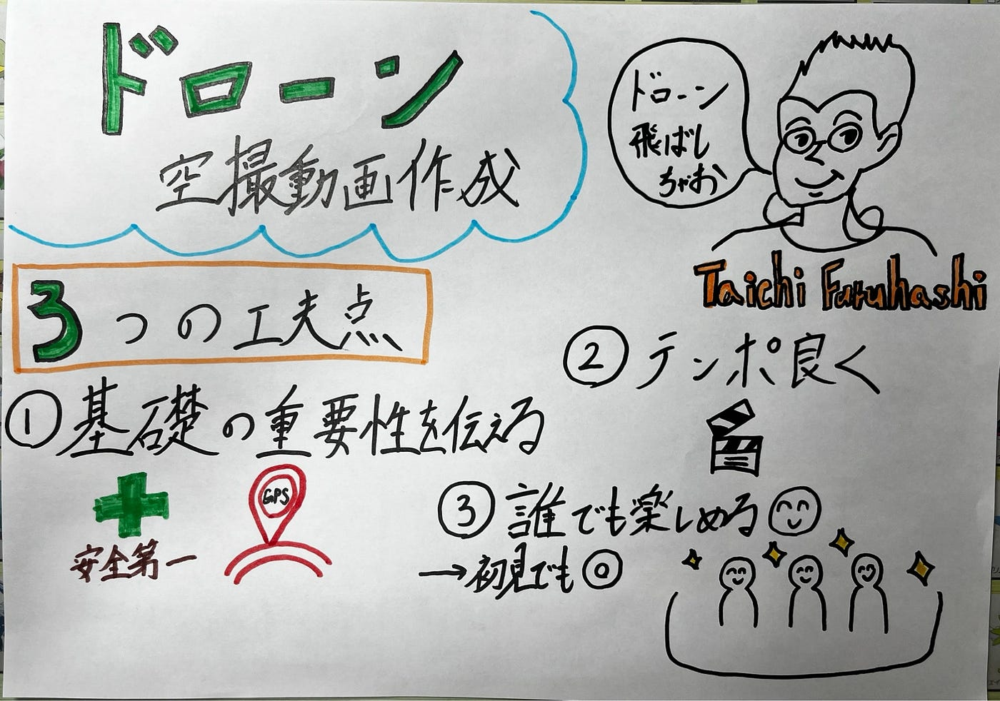

## 古橋先生のドローン空撮、動画化してみた。【V&F週報】

こんにちは。

卒論提出目前で緊張している、4年生の高井健太郎です。

今週のV&Fでは、古橋先生によるドローン空撮の様子を撮影した動画を用いて、[TikTok](http://www.tiktok.com/@furuhashilab)用ショート動画を制作しました。

今回は、視聴者が誰でも楽しめるテンポの良い流れと、ドローンを扱う上で大切なポイントが自然と伝わる動画になることを意識して制作しました。

以下に、動画リンクと動画制作の工夫点をまとめます。

> **動画リンク**

[青学キャンパスにドローン出現！？](https://vt.tiktok.com/ZS5a2gePn/)

> **工夫点**

**1.楽しめつつ、ドローン操縦の基本が伝わるように**

動画内では、ドローン離陸前にGPSのチェックを行うシーンと、離陸直前に周囲の安全を確認するシーンを取り入れました。

ドローン空撮は映像の迫力やかっこよさに目が向きがちですが、GPSの状態確認や、周囲に人や障害物がいないかを確認する工程は、安全に飛行させるために欠かせない重要なポイントだと思うので、その様子が十分に伝わるよう工夫しました。

**2. 離陸から着陸までの流れを、テンポよく**

ドローンの準備 → 離陸 → 着陸、という一連の流れが視聴者にとって直感的に理解できるよう、編集のテンポを意識しました。

特に間延びしやすい場面は不要なカットを省き、最後までスムーズに見てもらえる構成を心がけました。

**3. 誰でも楽しめるように**

今回は[GSC](https://www.aoyama.ac.jp/faculty/gsc/)10周年記念の撮影でしたが、初めて動画を見る視聴者にとっては、その背景は必ずしも重要ではないと考えました。そこで、身内向けの文脈は入れすぎず、「ドローン空撮の様子」そのものに焦点を当てた構成にしました。

研究室内外を問わず、誰でも楽しめる動画を目指しました。

> **メンバーからのコメント**

・こうな

実際に外で撮影できたのは今回が初めてで、外で飛ばす際の先生による操縦の手順がわかりやすかったです。

外で撮影された景色も楽しみながら見ることができました。

・しょーた

何本かドローンの動画を作成してきましたが、がっつり外で飛ばしているのはこれが初めてだったので、先生の操縦を動画にできて良かったと思います。

キャンパスも写っているので、研究室のコンテンツとして適切だと思いました。

・ちさと

離陸前の準備から撮影、着陸までの流れが丁寧に整理されていて初見の人にも分かりやすい。

実際にドローンで撮影した映像を見るのが楽しみになる内容で、古橋ゼミならではの視点が活かされていて良かったと思う。

> **まとめ**

今回の動画制作では、「離陸前準備の重要性」、「離陸から着陸までの流れをテンポよく」、「身内ネタに寄せない視聴者目線」

の3点を特に意識しました。

ただドローンを飛ばしているところだけを撮るのではなく、正しく・安全に扱うための基本動作も一緒に伝えられる動画になったと感じています。

今後も、古橋研究室の活動を正確に発信できるような動画を作っていきたいです。

> **グラレコ**

