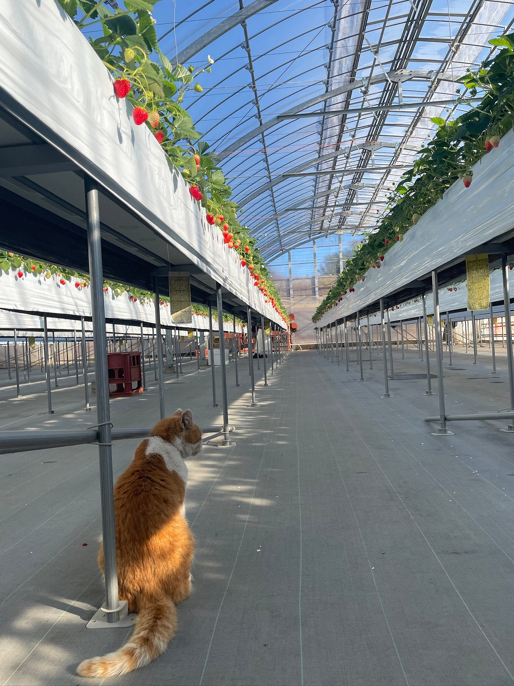
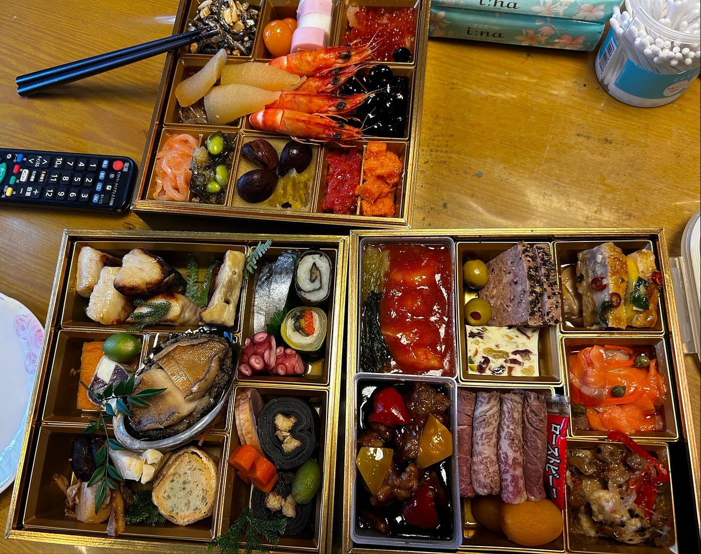
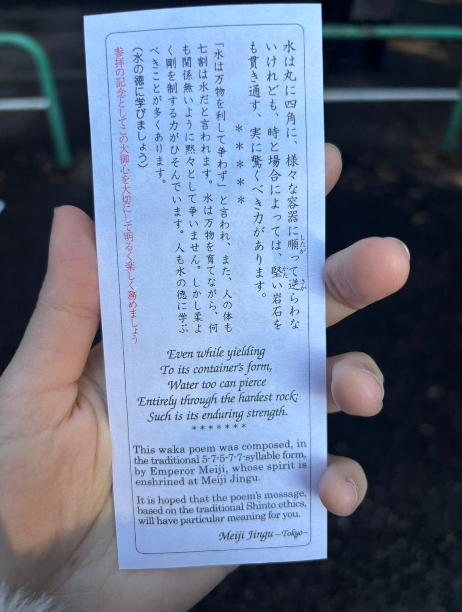
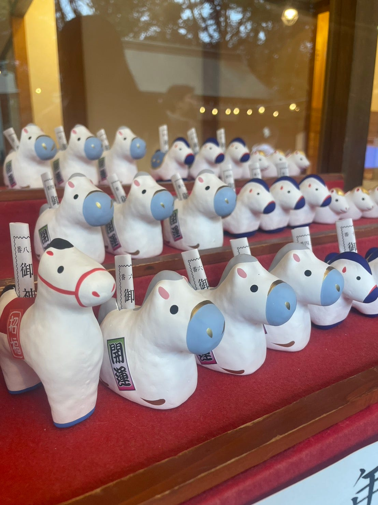
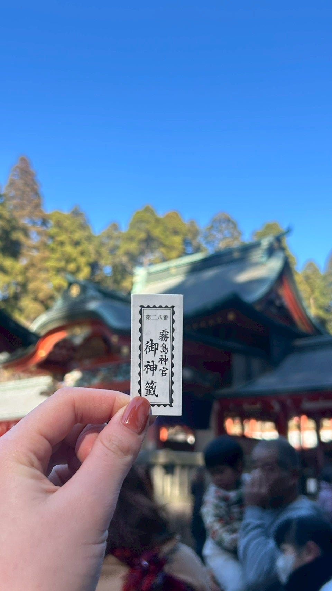
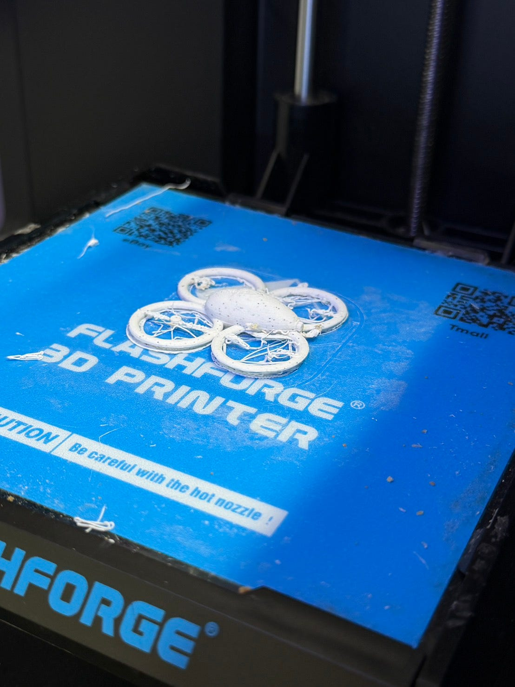
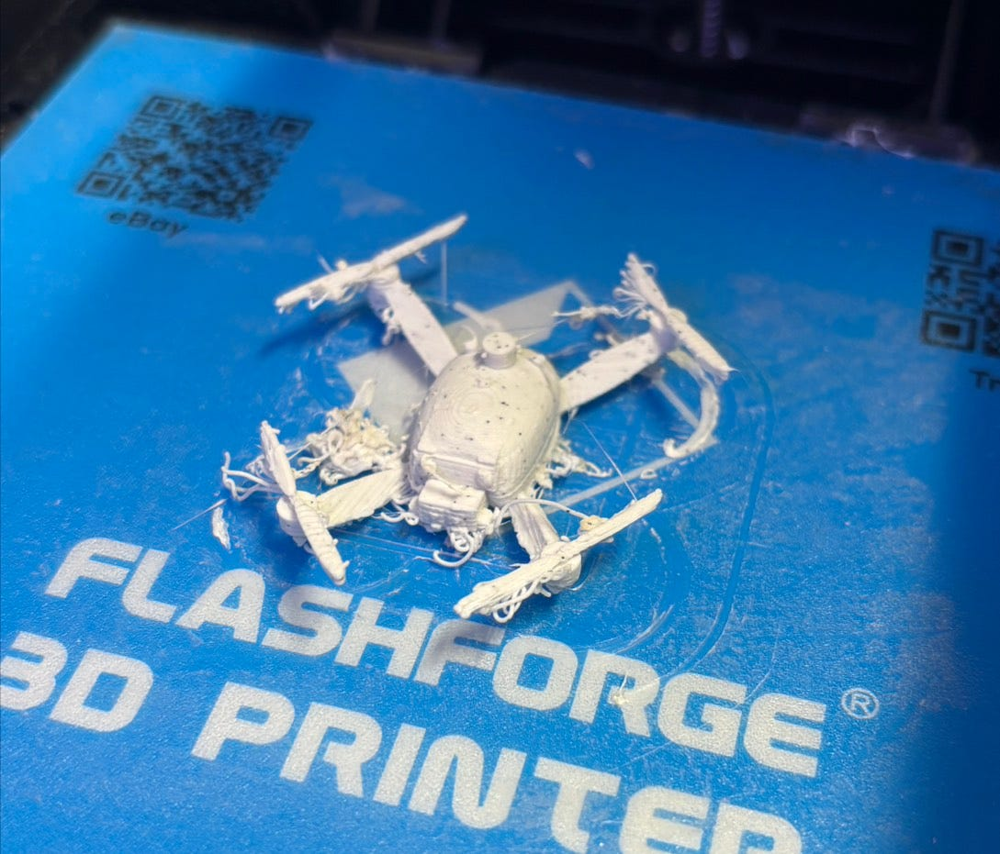
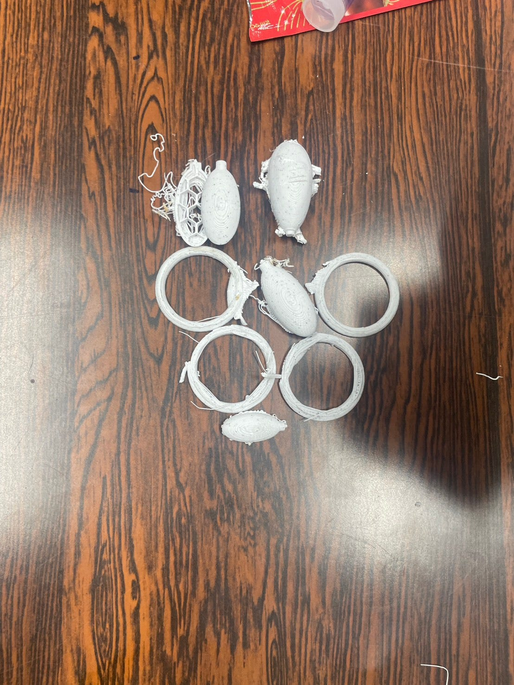
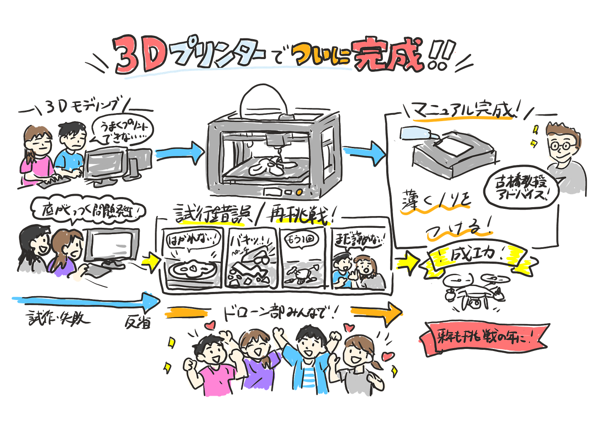

### 3Dプリンター使ってついに完成！！

こんにちは！！ドローン部１です！
今書いている時はまだ宮崎にいます、お土産を持ってくるので、皆様楽しみにしてください☺️

### お正月

どんなお正月をお過ごしになったのでしょうか、、ここで少し古橋研究室ドローン部１のお正月を振り返ってみようと思います。

**リト**

書き初めとか、初詣など、話したいことはたくさんあるのですが、私はお正月に行ったいちご狩りについて。なんとなんと、猫がいたんです！
苺テントの中は暖かいし、苺も貰えるし幸せ者だ。人懐っこくて可愛かったですo(^o^)o＼(^o^)／

**ゆかり**

今日は待ちに待ったお正月、お正月といったら御節ですよね。何から食べようかなぁって食べる前からソワソワ、 ソワソワ。やっぱり🐙が私のお気に入り！これだけは譲れません。もう来年の御節が楽しみで仕方ないです。＼(^^)／

**優香**

水の話ときたか、、、明治神宮
水には日頃お世話になっているので、文句はありません。
ここは外国からの観光客が多いので英語の翻訳や和歌の説明も含まれていて観光対策を頑張っている印象を持ちます。中も広くて、結構時間を潰せます。
Ah, so it’s about water this time… 
Well, water sustains me every day, so I have no complaints.
Since Meiji Jingu gets so many international visitors, I’m impressed by their efforts — they even provide English translations and explanations for the Waka poems. The grounds are huge, too, so you can easily spend quite a bit of time here.

**萌**

いつの間にかウマ年になっていましたね。なんかここの神社オシャレで、馬の背中におみくじを刺していくスタイルを採用していました。罰当たりなのか、罰当たらずなのか、、、、それを決めるのは運営側です。

**レンセイ**

お正月は妹がいる鹿児島に久しぶりに遠征！！鹿児島といったら霧島神宮って皆言うくらい人気の神社。おみくじなんて意味がないって思うかもしれないけど買ってしまう(*´Д｀*)結果は今年の俺をみてくれたらわかる！！ってことで注目してくれーー

### 完成しました！！

萌
[code](https://github.com/furuhashilab/drone1_3dprinting_project/blob/main/Dronestar.stl)

優香
[code](https://github.com/furuhashilab/drone1_3dprinting_project/blob/main/DJI%20%E3%83%9E%E3%83%88%E3%83%AA%E3%82%B9%E3%83%95%E3%82%A9%E3%83%BC1%E6%9C%884%E6%97%A5.stl)

失敗作 （ゆかり・リト）
[code](https://github.com/furuhashilab/drone1_3dprinting_project/blob/main/drone(yukari%2Crito)_final.stl)

#### 振り返り

今回３Dプリンターで実際に作るにあたって苦戦したのは、３Dプリンターからはがす作業です。理由はまだ判明していないのですが、なぜか下にくっついてしまうことが多くありました。
何個かは仕方なくペンチで切って部分部分で切り取って対処しました。
他に、ゆかり・リトチームは、ブレンダー上では羽と本体を結合して作成したのですが３Dプリンターで実際に作成するときは何故か本体部分しか出てこなかったそうです。

聞いたところ
「まだ諦めてはなく、せっかくここまで頑張ったのに悔しすぎる。でも挽回できないミスではないから、2月までには完成させたい」とのことでした。

### マニュアル完成！！

レンセイ
ドキュメントリンクは[こちら](https://docs.google.com/document/d/1t0T-SoHamdoatZ8FXVx6wrBpZqoQ2hsGDJaz3j591_0/edit?tab=t.0)

先週の発表から、実際に3Dプリントをすると底が引っ付いてしまう問題が浮上しました。古橋教授にお伺いしたところ、ノリを薄く塗るのが大切らしいです！それに関してのマニュアルをアップデートして完成しました！！お疲れ様☺️

#### 来年度のドローン部に関して

改めて、今年1年間ありがとうございました。
4年の林ゆかりです。ドローン部って最初は何をやる部なんだろうって思ったと思います。でもついてきてくれてありがとうございました。感無量です。さて、来年のドローン部に関してですが、今年は作ることに専念してきました。来年はどんなことをするのかドローン部１で話し合いました。

リーダーは優香、副リーダーに萌という布陣で進めていくつもりです。
こっからはリーダーがどうしたいかによると思いますが、卒業する私からの願いは、、次はもっとドローンを飛ばしてほしい
来年度からは山ッ部が始動するという噂がゼミ室内で流れていますので、ドローン部は常に挑戦する部としてゼミを今年度は引っ張っていきました。来年も挑戦を続けて欲しいと思います。
鹿島学園の監督も言っていましたが
不平不満に敏感で、幸福に鈍感な人が増えている世の中
ドローン部をはじめ古橋研究室はどうか小さな幸せにも感謝を忘れない部であって欲しいと思います。
この思いを託して、私は卒業します
ありがドローン

※というのを、先輩への感謝が先走った山崎が、先輩のご許可を得る前に、本人のドローン部に対する気持ちを勝手に想像しつつ書いています。ユカリさんもきっとこの気持ちを思っているでしょう。

### グラレコ

