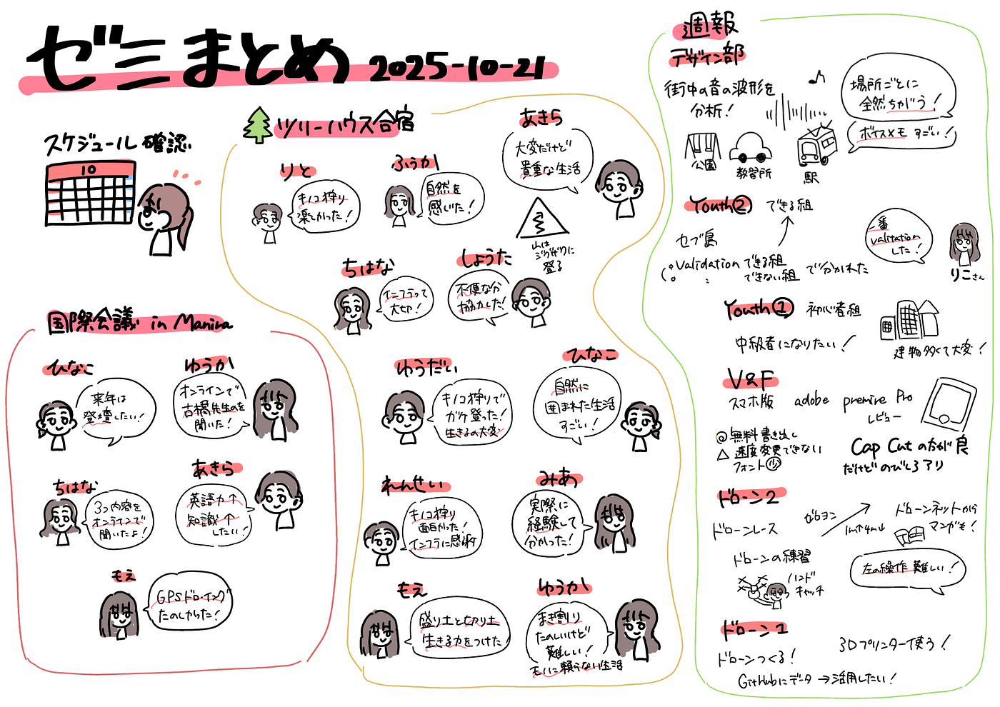
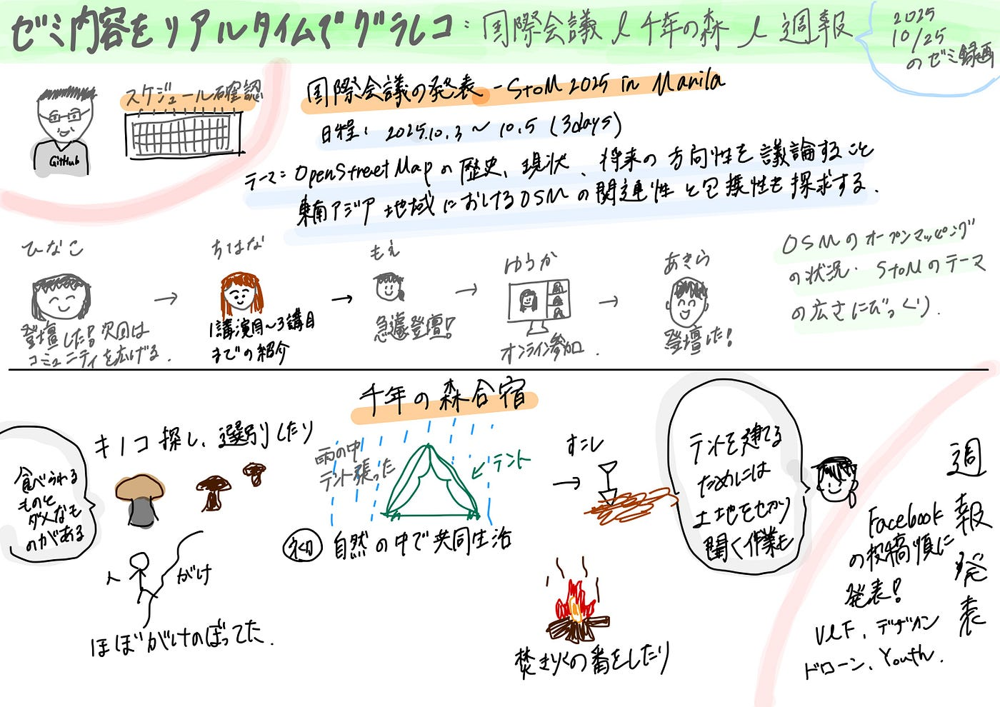
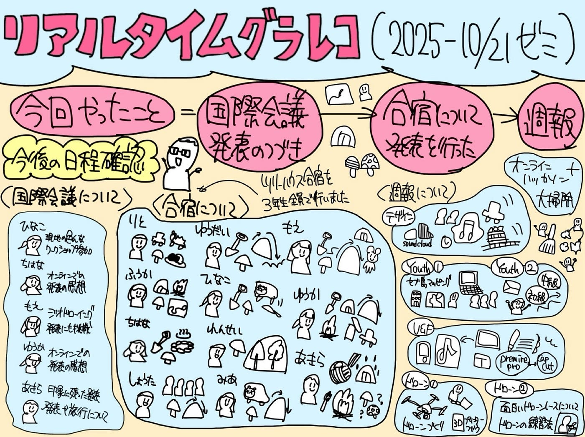
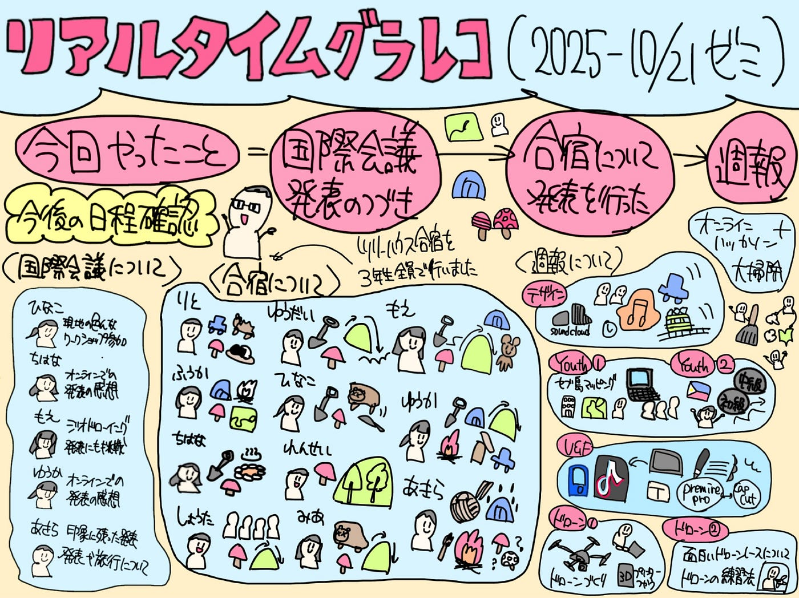

## リアルタイムでグラレコを描くことに挑戦！

こんにちは！デザイン部の稲田優花です。

今回、私たちはリアルタイムでのグラレコを描いてみることにしました。

そこで、10月21日の古橋研究室ゼミ動画を視聴しながらグラレコを描き、時間内に終わらせるという形で挑戦しました。

(限定公開動画の為今回はリンクを貼りません)

今年度、週報や合宿、国際会議、サミット参加の際に練習してきたグラレコの成果として集大成を見せられるものになると良いなと思います。

#### 実際に描いたグラレコと感想

ちはな

リアルタイムでグラレコを書いたのは今回が初めてでとても難しかったです！

いつもグラレコを書くのに1時間強かかるので、書いている時間的にはそれほど差異がありませんでしたが、情報を聞き逃すと巻き戻せないのが大変でした。

そして、情報を聞き逃さないように意識していたら文字が多くなってしまうという負のループ…

また、色を付ける時間がなく、動画が終わった後に簡単に色分けする形になりました。

グラレコのプロの方はリアルタイムで色まで付けられるのでしょうか。

プロがグラレコをリアルタイムで書く様子も見てみたいです！

こうな

今回選んだ動画は発表内容が多く、みんな早口だったので、内容を拾いながらも細かくは書けなかったです。キーワドをなるべく拾って簡単にまとめるように意識しました。

そして、今回のリアルタイムグラレコでは、途中描いててここはスペース開けすぎかなと思ってもけして書き直す時間はないことが難しかったです。今回は授業内容をリアルタイムでまだ授業内容に印象があったりしますが、実際に会議でリアルタイムに描くことはもっとプレッシャーがあるのではと想像しました。

ゆうか

10月21日のゼミはとにかく発表が多く、それぞれ同じ国際会議や合宿について話していても少しずつ言っている内容や重要そうに話している部分が異なっており、それをグラレコとして表現するのがとても難しかったです。

また、時間的なプレッシャーがあったことで、塗りつぶし機能は使ったものの、時間内に色を塗り切ることができませんでした。

動画を見終わったあとに、全ての色塗りを終えた状態と比較するとこのようになります。この塗り終えた状態に時間内に持っていくというよりも、もう少し時間を気にしながら、早めのうちに書いたところの色を塗り始めるように意識してもいいだろうと思いました。

また、今回は以前参加したゼミの内容を描いたため、どのように進むか何となく覚えているという事前情報がありました。そのため、レイアウトを考えずらい全く初めて見る動画のグラレコも描いて練習してみたいと思いました。

3人が同じ講義動画を視聴して描いても、人が描くことにより、レイアウトや描き方、文字は異なっていて、雰囲気の違うものになっています。

しかし、リアルタイムでグラレコを描こうとすると、どうしても普段の時間をかけて描くグラレコと比べて簡易的なものになってしまうという難点があり、練習の積み重ねが必要だと思いました。

沢山修正しようとすると間に合わなくなってしまうため、いかに聴きながら大切なことだけを描いていけるかが重要になってくると感じます。

前期・後期の間本当にありがとうございました。今後のゼミ論卒論の発表も頑張ります！
