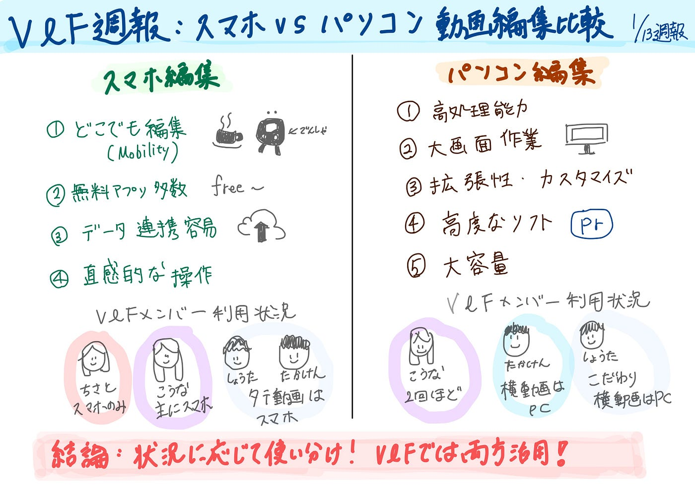

### 動画編集はスマホ、パソコンどっちを使う？

こんにちは、四年の福田です。

V＆Fでは毎週TikTokに動画をあげるように約半年続けてきました。動画は毎週担当が変わって、研究室、プライベートやインタビューなどいろんな動画を投稿してきました。

動画の内容ではなく、動画をスマホで編集しているか、パソコンなのか気になり、みんな（と言っても4人ですが、聞いてみました）

結果：

こうな⇨TikTokの動画は**スマホ**、留学中に２回パソコンを使った編集

たかけん⇨ 縦動画はスマホ、横はパソコン

ちさと⇨ スマホ

しょうた⇨基本的に縦動画はスマホ、横動画はパソコン。編集にこだわりたいときは縦動画でもパソコンを使う

このようにV＆Fではスマホとパソコンを分けて使ったりしてます。

今回の週報はスマホとパソコンの動画編集の特徴をそれぞれまとめ、どのように使うかまとめました。

#### スマホを使うメリット

**①どこでも編集可能（パソコンのデメリット）**

動画編集の必要な素材さえスマホ内に保存しておけば、公共交通機関を利用している間や、カフェで一息つく時間など、隙間時間を利用して編集作業を進められる。

実際に、隙間時間で動画を作ることが多いので共感できます。

**②無料編集アプリがパソコンより多い**

多くのアプリでは、基本的な動画編集作業、たとえば「カット」「テロップの挿入」「効果音の追加」などが無料で利用できる。

これだけでも、初心者や趣味で動画を作成している人には十分な機能です。

**③スマホにデータ多い、取り込みやすい**

スマホから直接アップロード機能を利用することで、動画の編集とアップロードの間に発生していたデータの劣化問題も解消される。

**④初心者でも操作簡単**

パソコンに比べて、スマホ用の動画編集アプリは使いやすさを重視して設計されており、誰でにでも直感的な操作がしやすいように作られている。

#### パソコンのメリット

**①処理能力の高さ**

レンダリングは動画編集における最も時間を要するプロセスであり、スピーディーなレンダリング作業は、作業時間の短縮に直結。また、複数のタスクを同時に進められるのも、動画編集をパソコンでおこなう強みである。

**②編集画面が大きい**

**③拡張性とカスタマイズ**

追加のハードウェアやソフトウェアを容易に組み込める点は、編集作業をさらに高度にできる。パソコンは自由度の高さから、個々のクリエイターが求める環境を構築しやすく、自分のクセやニーズに合った作業寛容を整えやすい。

**④高度な編集ソフトウェア**

スマホより高度な編集可能。たとえばAdobe Premiere ProやDaVinci Resolveなどのソフトウェアは、エディターが独自の視覚効果を作成したり、色補正をほどこしたりといった機能が搭載されている。（ただし、課金しないといけないものが多い）

**⑤容量が大きい**

ここまで、スマホとパソコンそれぞれの特徴をまとめました。

どっちが使いやすいかは断言できなく、状況によって選択することがおすすめです。

#### **スマホを使う場合**

①初心者で、操作にまだ慣れていない

②隙間時間を活用したい

③仲間内のイベントや趣味などの範囲で動画編集を楽しみたい方

④課金したくない

#### **パソコンを使う場合**

①精度が高く、複雑なトランジション技法の利用など、一段と高度な技術の作業をするとき

②長い動画を作成する場合詳細な編集作業を快適に行える上、細かな部分まで確認できるので、ミスの少ない編集がしやすい

③基本的な操作ができて挑戦してみたい方

必ずしもどちらかがいいというわけではなく、必要に応じて使うものを変更するのがいいと改めて感じました。実際、V＆Fのメンバーでは状況によってスマホやパソコンと使い分けています。

これまでTikTokにあげるゼミの動画はスマホを使うことが多いが、基本的な操作も身についてきて、時間に余裕がある時にはパソコンでより質の高い動画を作成したいと思います。

#### グラレコ

