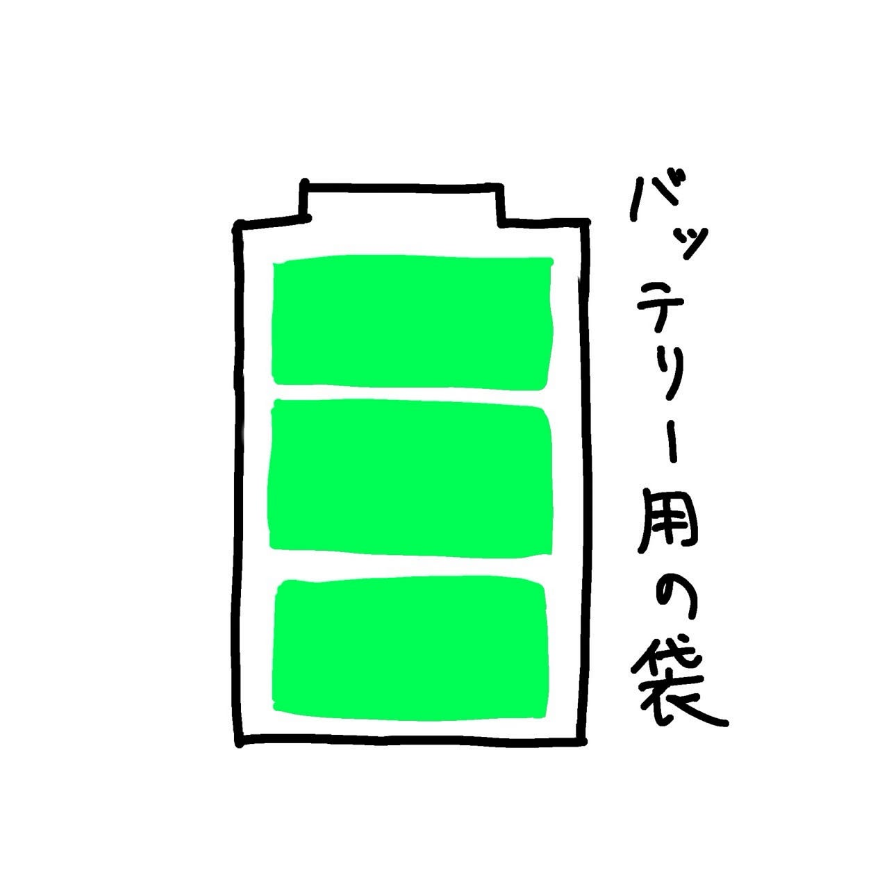
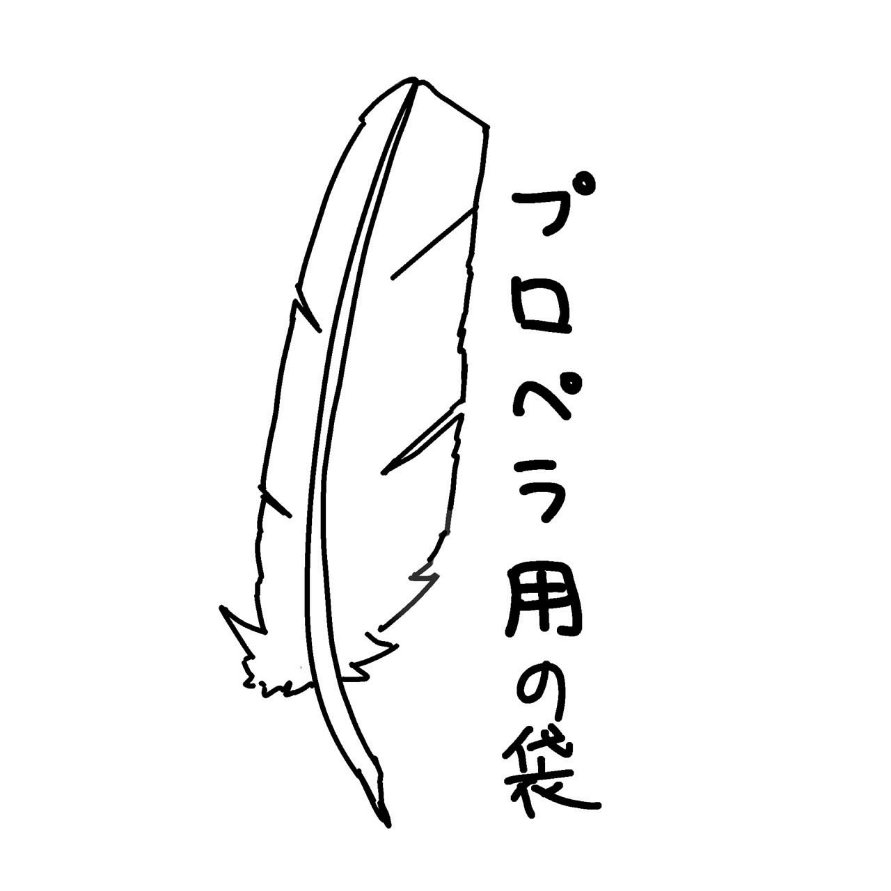
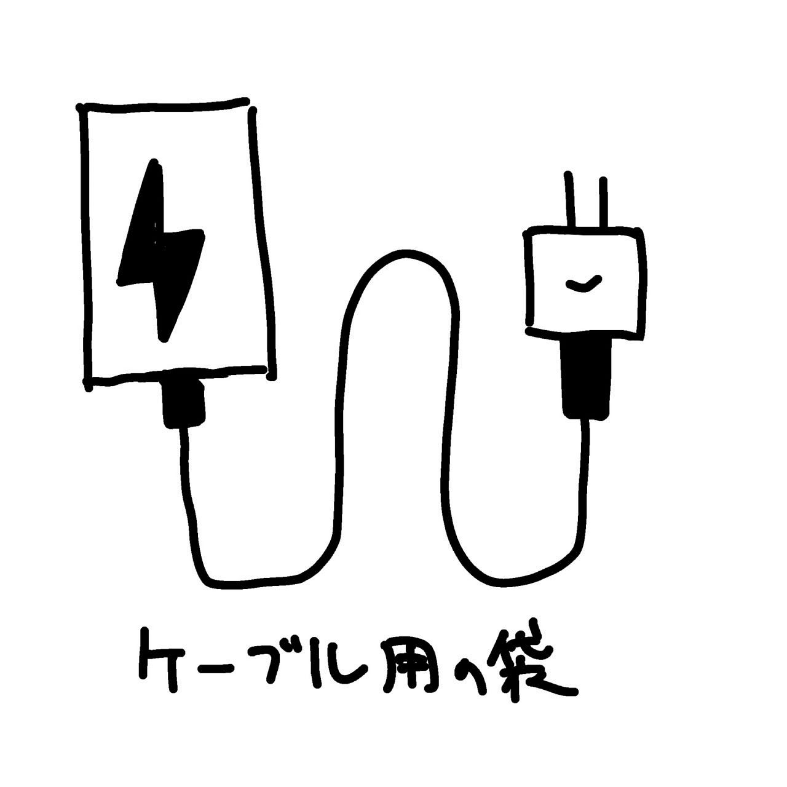
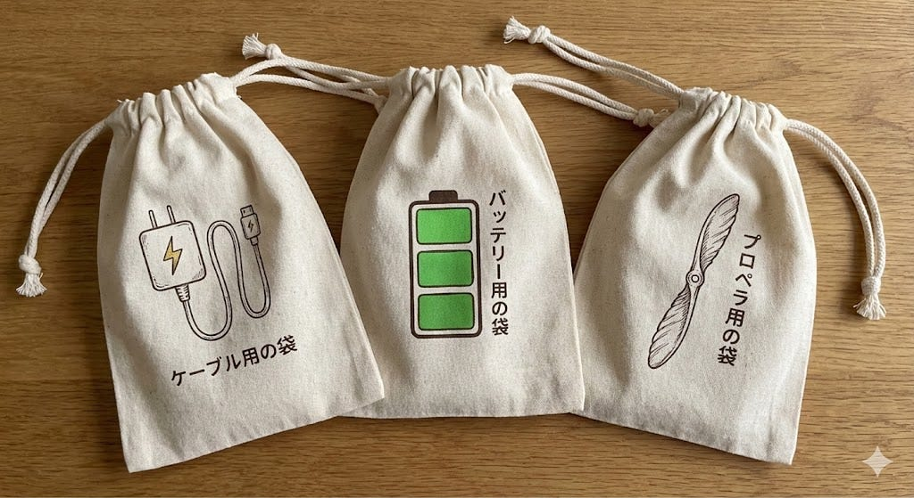
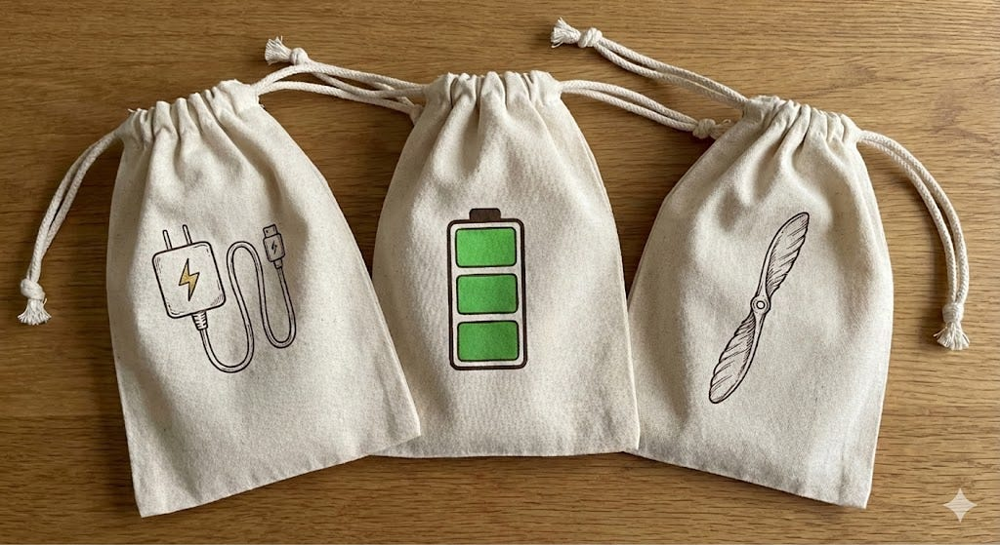
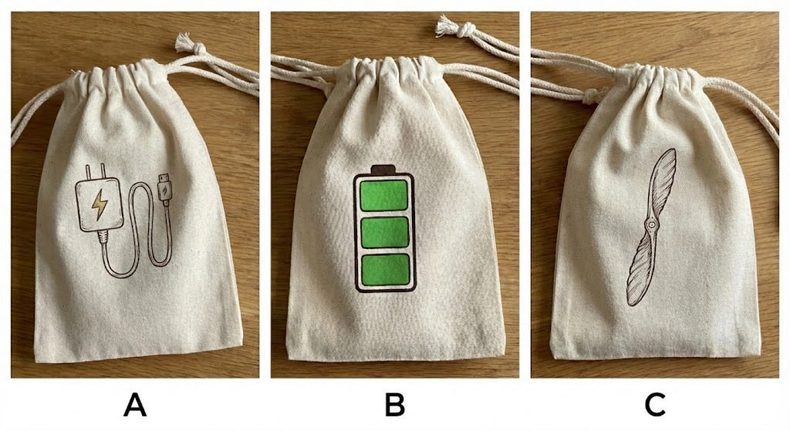
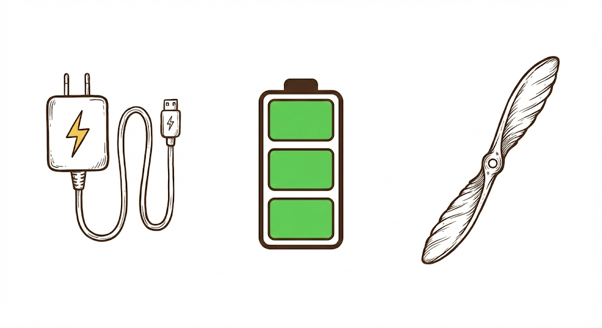
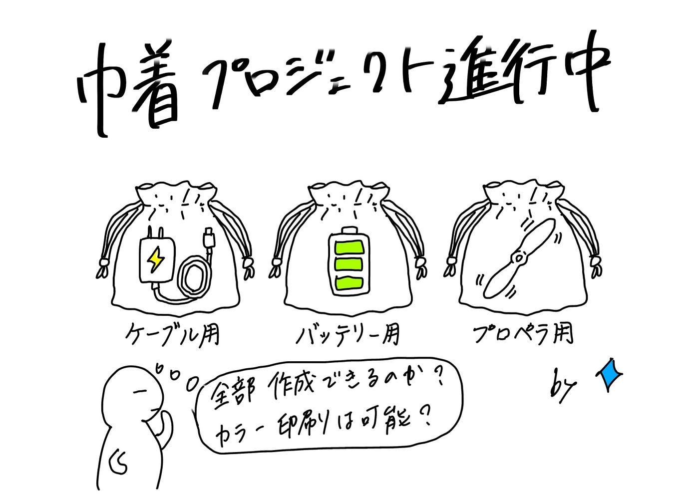

### 【1/13ドローン部2週報】巾着案まだ進めます

こんにちは。

1月も早くも半分を終えつつありますが、最近はゼミ論に頭を悩ませており、何とか2月7日までに形にして発表できるように頑張りたいです。

さて、本日の週報は「巾着案のブラッシュアップ」ということで、前回先生にご指摘いただいた

> 巾着をどのように使うか、それを明確にして、巾着のデザインをする

というアドバイスをいただき今回は巾着の使用用途を考え、nano bananaに画像生成してもらいました。

#### 巾着の使い方案

1、ケーブル（充電器）用

2、バッテリー用

3、プロペラ用

以上の3つが出た案です。

その3つのデザインをアキラが描いてくれました。

次に、アキラのデザイン案をもとにnano bananaに

> _巾着を作ろうと思っていますが、巾着を使う用途として上記の写真が案です。それらをもう少しイラスト風に改良して巾着に貼り付けた画像を生成してください_

というプロンプトで指示。

このような画像を生成してくれました。

以上が、最終巾着デザイン案です。

グラレコ

