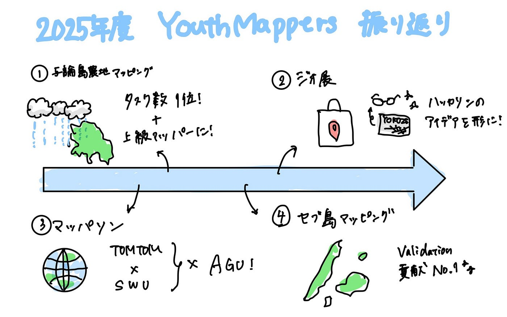

## 【Youth②週報】学生最後の週報⁉️2025振り返り

こんにちは、あけましておめでとうございます！

ついに最後の週報となりました、4年の末木です。

今年度最後のYouth②の週報を担当するということで今回は今年度の振り返りをしたいと思います！

今年度したことといえば

・与論島農地マッピング

・ジオ展

・マッパソン

・セブ島建物マッピング

などでしょうか？

他にもあった気もしますが、今回は主にこの4つを振り返っていきたいと思います。

**①与論島農地マッピング**

こちらはInternational Humanitarian Mapathon 2025の一環として行われたマッピングでした。

以下が概要です。

> ※以下、HOT Tasking Manager プロジェクトページ（#19113）より引用　https://tasks.hotosm.org/projects/19113

> 沖縄県与論町では2024年11月に記録的な大雨の影響で１時間に90ミリ、３時間で145.5ミリの雨を観測した。いずれも11月の観測史上１位。午後４時までの24時間で190.5ミリの雨量を観測し、甚大な豪雨災害が発生しました。本タスクプロジェクトは、与論島の方々との連携により、今後の災害に備えた OpenStreetMap の充実と、災害時の迅速な情報共有を目指したベースマップ整備を目標に、青山学院大学 古橋研究室、Salon de AManTo 天人、YouthMappers AGU、YouthMappers Reitaku University、International Humanitarian Mapathon、NPO法人クライシスマッパーズ・ジャパンが中心となって企画したものになります。

わたし個人としては「タスク数1位」と「上級マッパー」を目指して取り組み、見事それを成し遂げました。

**②ジオ展**

今回のジオ展は先生が不在だったため、学生のみで準備を進めました。発表はまゆ、ゆかり、しょうたが務めてくれました。展示物作成は私末木と、しょうた、ゆうだいで行いました。例年通りメガネクリーナーやトートバッグをガーメントプリンターを使用して作成しました。デザインはハッカソンで案を出し合って決め、それが形になった瞬間はとてもうれしかったです。来年度からは発展させてまた新たなものを作成してくれることを願ってます🌟

**③マッパソン**

こちらはTomTomとシーナカリンウィロート大学の学生と合同でHOTTaskingManagerを行いました。

2024年12月に行われたFOSS4G Asiaで知り合った学生と協力し合っていくことで、ネットワークを築いていくと同時に、今後のYouth Mappers AGU マッパソンのさらなる発展を目指したもので、昨年度から準備を進めていました。

昨年度はマッパソン開催の準備段階として新入生を対象に企画をし、今年度は海外の方々とも交流しながらマッパソンを実施しました。

準備としてはわからないことがありすぎて日々大変でしたが、無事終えることができてよかったです。来年度もぜひ企画してくれればなと思います。

**④ セブ島建物マッピング**

2025年9月30日にフィリピンのセブ島近海で発生したマグニチュード6.9の地震に対するクライシスマッピングのプロジェクトが立ち上がったため、そちらにYouthMappers AGU全体として勢力を上げて取り組みました。

以下のプロジェクトで取り組みました。

[https://tasks.hotosm.org/projects/32511](https://tasks.hotosm.org/projects/32511)

検証作業はJOSMを使用したものだったため、少し慣れないものでしたが、昨年度の知識をフル回転させて頑張りました。私個人としては全体で1番Validationに貢献できたので良い成果を得れたと思います。

こんな感じで2025年度は様々なことに取り組みました。できなかったこともいくつかあるので来年度はそちらを中心にを進めていってほしいです！

いいゼミ生活でした！

