### ついに今年度最後のハッカソン、、武甲山をモチーフにしたガチャデザインを考えてみた！

こんにちは。

気づけば、あっという間に最後の授業、そして毎月恒例だったハッカソンも、ついに最終回を迎えました。それでは、ドローン1ラストハッカソンの成果報告をしていきます。

**//ここからの序章は暇な時にお読みください笑//**

ちなみにですが、みなさんはどのハッカソンが1番好きでしたか？

ちなみに、我らドローン部1部員のりとくんは、

「ジオ展のガチャアイデアを考えてた回が一番楽しかった！」とのこと。

それはよかったです。笑

ハッカソンって、短時間で何かしらの成果を出さないといけない、なかなかハードなイベントですよね。

ドローン1は毎回火曜日にこんなふうに進めよう！と意気込むものの、気づけばあれもこれもと意見が活発化し、いつの間にか月曜日。

でもハッカソンはグループが仲良くなるきっかけにもなるし、月を重ねていくごとにこの子はこの能力に長けてるなとかわかる瞬間でもあるので面白いですね。

そして、時間に追われながらも、なんとか形にできたときの達成感は、もはや締切がくれたご褒美みたいなものだなと感じています。笑

まぁ、そんなことは置いといて、最後の週報は、ハッカソンの成果報告をします。

### [ハッカソン概要](https://github.com/furuhashilab/README/issues/40#issuecomment-3742009165)

[芦ヶ久保・A_Sta.ba](https://maps.app.goo.gl/m9whoKjNy27hnrVA6) に設置されている1,000円ガチャ(75mm?たぶん)の景品として、[入浴剤](https://medium.com/furuhashilab/%E7%96%B2%E3%82%8C%E3%82%92%E7%99%92%E3%81%99%E3%83%90%E3%83%96%E4%BD%9C%E3%82%8A-c936784f75aa)の型(ガチャガチャ景品として同梱)を3DプリントできるSTLデータとして作成する。1,000円出す価値のあるプロダクトになるように創意工夫する。

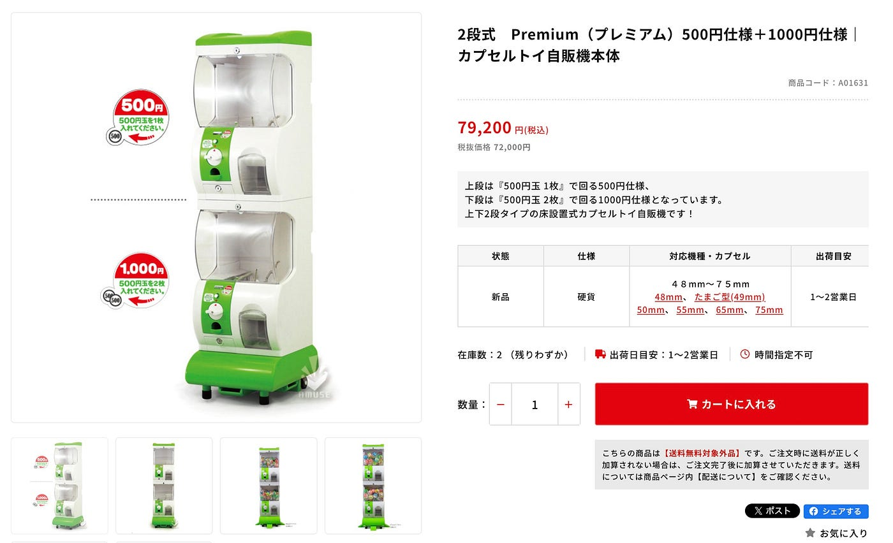

#### 詳細

- [地理院地図3D機能](https://maps.gsi.go.jp/index_3d.html?z=16&lat=35.951616471429325&lon=139.09772872924805&pxsize=2048&ls=std#&cpx=-87.493&cpy=133.089&cpz=70.254&cux=-0.269&cuy=0.233&cuz=0.935&ctx=0.847&cty=-2.262&ctz=-5.671&a=1&b=0&dd=0)を用いて、武甲山の3D形状STLデータをダウンロードする(解像度や範囲は創意工夫する)。

- Blender を用いて、75mmガチャガチャに収まる型をモデリング([ブーリアン](https://youtu.be/ZI37h3mvo4w?si=_khqtZ607-tHNeAc)等)する。

- 入浴剤を使った後の、同梱された武甲山型の二次利用方法を１つ提案(1000円の価値を感じられるもの)する。

- 成果物は [MtBUKO3D4capsule リポジトリ](https://github.com/furuhashilab/MtBUKO3D4capsule/) /data フォルダ内に、それぞれのチームごとのフォルダを作成して、STLファイルなどを格納すること

### **最終的に出来上がった形！！**

今回のBlenderで作成した形はこちらになります。

外周の円形枠＋内側の武甲山地形を組み合わせた型になります！

見た目は一体化していますが、山の部分と底は分離できる設計にしています。この切り抜いた山の部分で入浴剤の型を取ります。

ひとまず最終形態の形を説明した上で、この形に至った経緯を２次利用方法の部分も合わせてお話しします。

#### データ格納場所

[MtBUKO3D4capsule/data/Drone1/Mt.BUKO_final.stl at main · furuhashilab/MtBUKO3D4capsule](https://github.com/furuhashilab/MtBUKO3D4capsule/blob/main/data/Drone1/Mt.BUKO_final.stl)

※外周の円形枠部分と武甲山の方の部分を分けたデータもありますが、今回は両方合わせたものをお見せします。

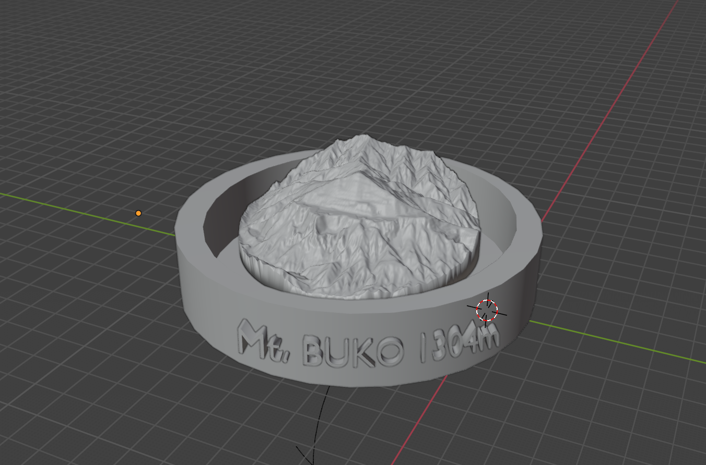

### 二次利用方法を考えよう！

まず最初に、各メンバーが「二次利用アイデア」を1つ以上出し、Blenderでデザイン案のデータを共有する、もしくはAI生成画像などでイメージを共有しました。

- （ゆうか）小物入れ

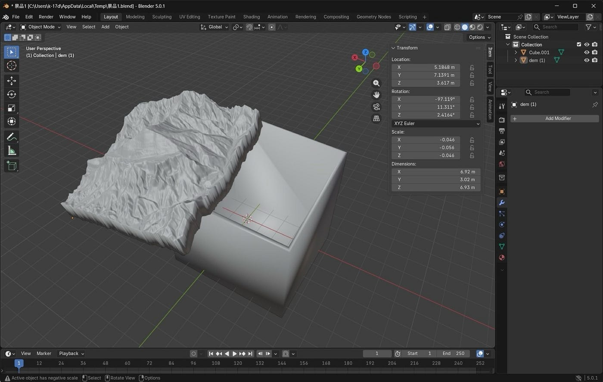

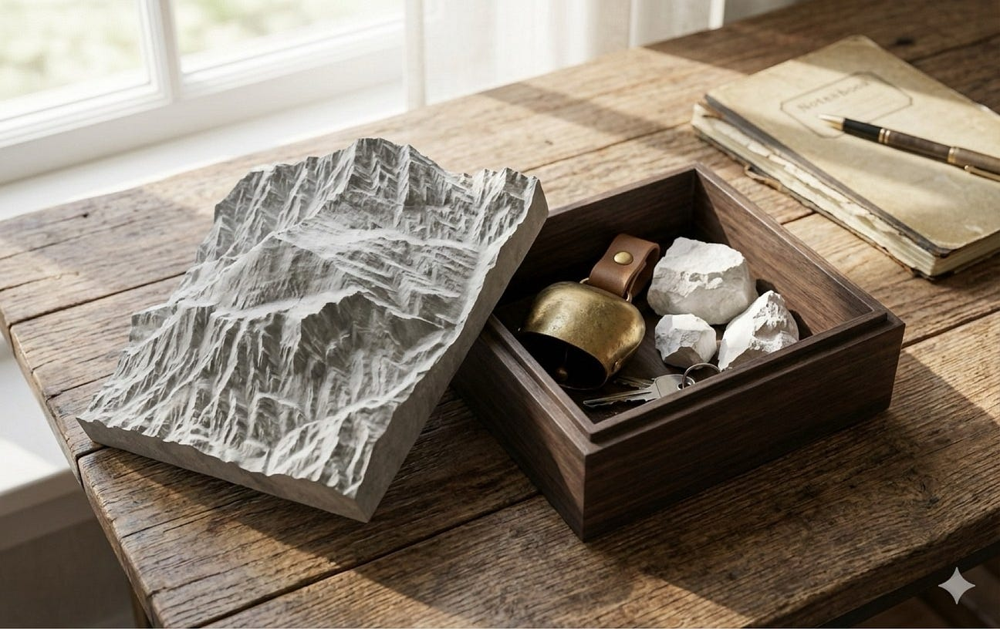

- （もえ）小物置き

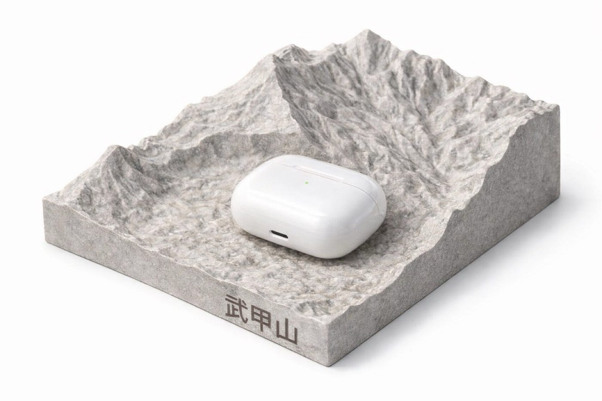

- （ゆかり）キーケース／アクセサリーケース

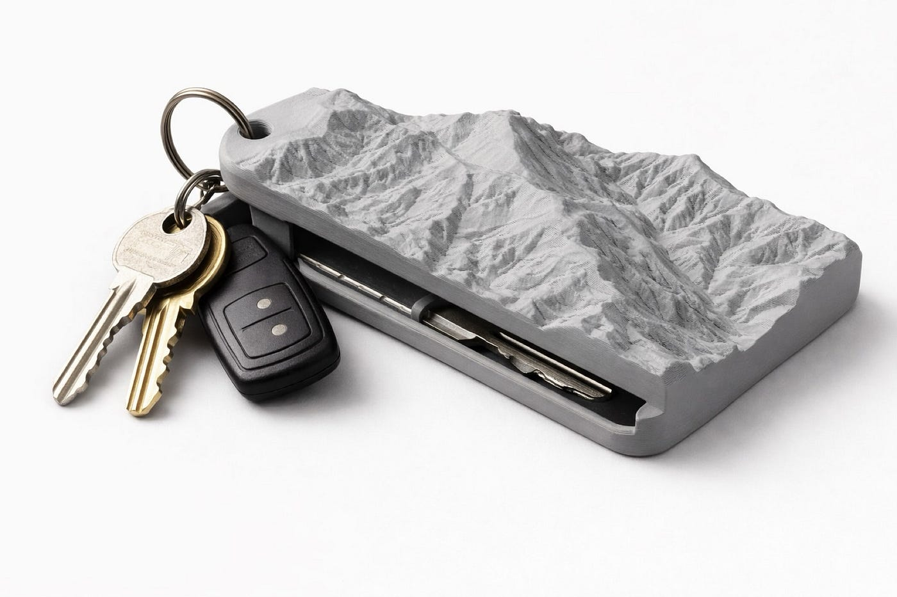

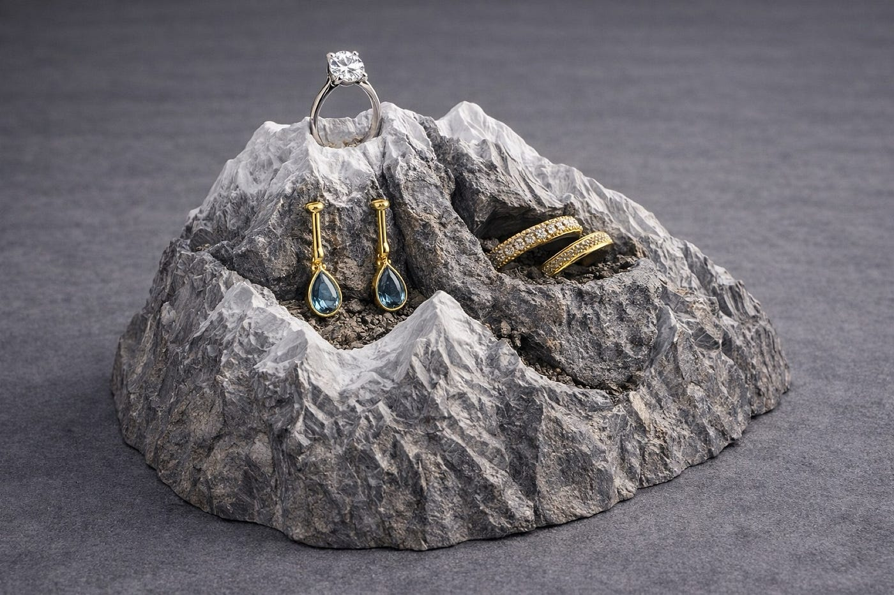

- （りと）ライト／栽培キット／コード収納

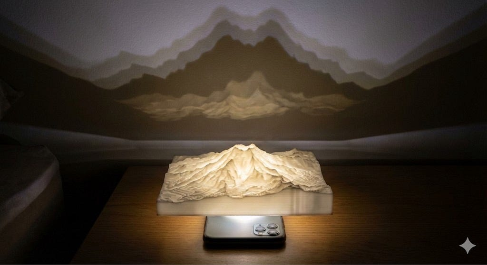

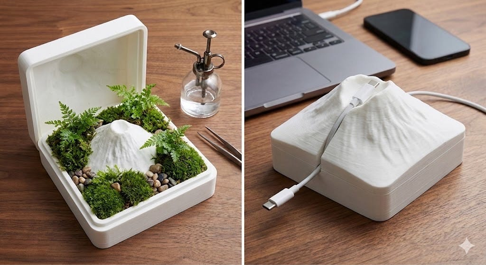

- （れんせー）アロマストーン

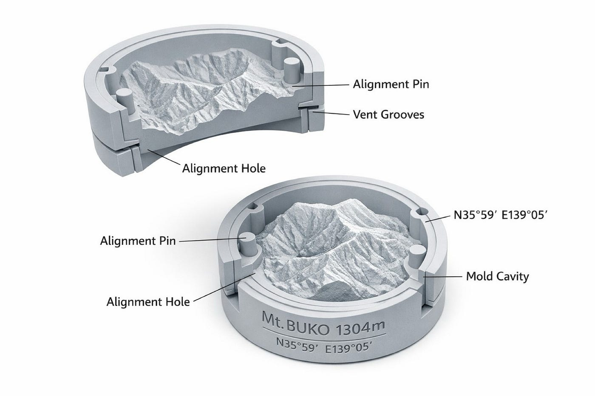

### 採用案：栽培キットにもなる“小物置き・インテリア”

投票と意見交換の結果、「栽培キットとしても使え、使わない場合は小物入れ・インテリアにもなる形」を採用しました。

#### 採用理由

プラスチックという無機質なものに生命を宿らせる楽しさ、そして、入浴剤として使い終わった後も、時間とともに長く変化を楽しめる点に価値があると考えました。

#### このデザインをどう活かすか

イメージとしてはこのような感じです！！

山と枠の間に作った隙間部分に、土を敷き、種をまく、そして育った植物が山の周りを囲むようにできればという感じです。

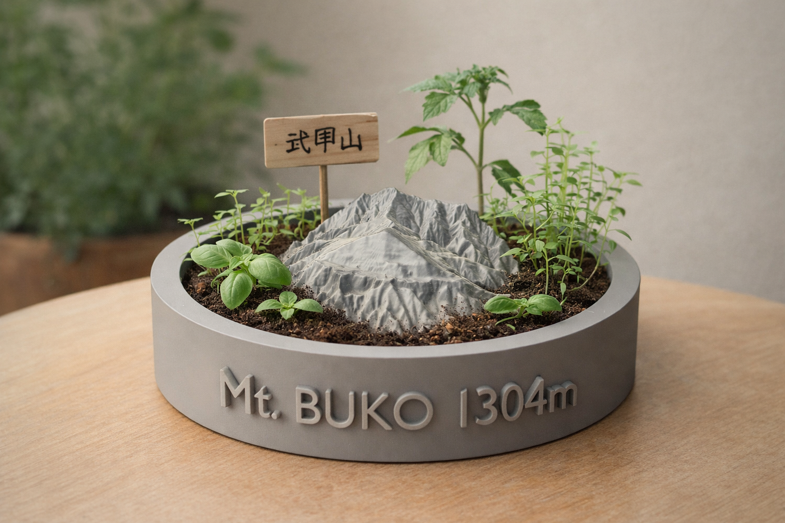

#### 栽培キットとして成立させるための付属品案と費用感

栽培キット化には追加コストが発生しますが、既存のガチャ栽培キットを参考にすると、最低限以下が同梱されていれば成立しそうです。

- 種：2〜4粒

- 培養土（少量）

費用感は植物の種類で変動するため、今後は

・植物よりも苔の方が栽培しやすいのか？

・低身長のハーブや草花（発芽の確実性、育成期間）など候補を絞り、失敗しにくいものを検討

#### コスト感（目安）

植物の種類によって変動しますが、概算としては

- [種（バジルの場合）](https://sakata-netshop.com/shop/g/g11000005/?utm_source=chatgpt.com)：**約1500粒 / 275円**

＝1粒単価：275 / 1500 ≈ **0.18円/粒**

＝2〜4粒：**0.37〜0.73円**

- [観葉植物の培養土](https://www.komeri.com/shop/g/g958352/?utm_source=chatgpt.com) ：**10L = 698円**なので、**1Lあたり 69.8円**

＝0.10L（100mL）= **6.98円**

＝0.20L（200mL）= **13.96円**

- 苔の場合：数百円程度

詳細な費用調整は今後の検討事項とします。

#### 想定されるデメリットと対策

デメリットは、**1000円払って育てたのにうまく育たない可能性**がある点です。そのため、栽培はあくまで「お楽しみ要素」と位置付け、育たなかった場合でも

- 入浴剤付き

- 小物置きとしての活用

- インテリア（武甲山オブジェ）

として価値が残る点を売りにしたいと考えています。

#### 参考

実際に300～500円程度で栽培キットのガチャガチャが過去に販売されていることを発見しました。

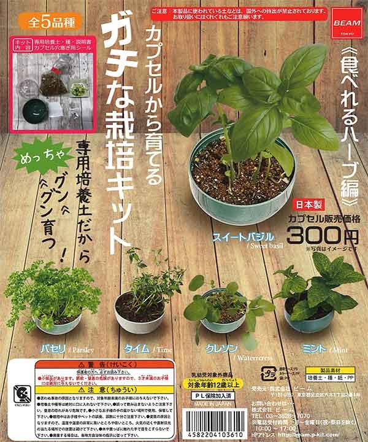

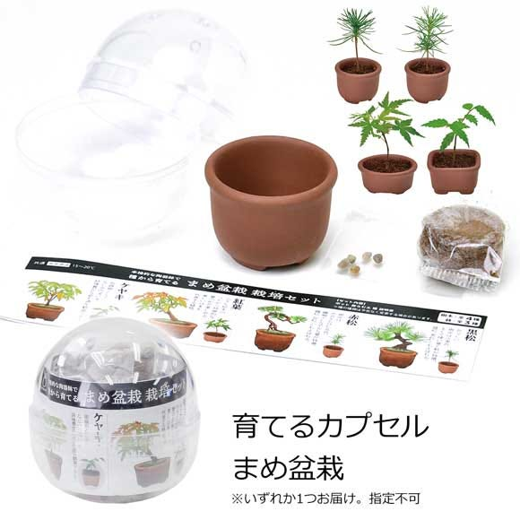

「ガチャの栽培キットは本当に育つのか？」については、ブログで実際に育成記録を載せている事例があり、**発芽自体は十分起こりうる**と判断しました。

・[【ディル栽培記録】ガチャガチャのハーブ栽培キットで家庭菜園 ｜ トドログ](https://todoetan.com/dill/)

・[トゲトゲ育ててみる？ガチャガチャのサボテン栽培セットの成長記録 | ミガルナ文庫](https://migaruna.com/saboten/)

#### 最後に

ごめんなさい、ゆかりに最後を任されたのですが、全然思いつきません。

締めと言われても、緩みまくったドローン部１を締めることなんて不可能だろう。そんなことを言うとユカリーが悲しんでしまいます。

これは本当に読んでも読まなくてもいいです、完璧な自己満足締め言葉。

昆布みたいにね ふっふっふっ。

私たちドローン部１の活動時間は1日中です。まず山﨑は大体7時くらいには起きて、LLMと朝のおしゃべり、優香は12時くらいに起きてblender達人に、萌は健康的な生活、レンセーはサッカーをする毎日、ゆかりは夜中になると返信をし始める迷惑者（リーダーが遅いので、朝起きるとやることが変わっているなんてことが多々）

今グループラインをみて、いつからユカリーに敬語を使わなくなったのかなってみてみたら4月29日、だいぶ早くてびっくり

敬語使わない≠リスペクトをしていない

リーダーの人柄に影響を受けたんだろうと思います

多分だけど、ちょうど鹿沼公園で夜にピクニックをした後くらいだったのかなぁ？あの時は、あまりよく知らなかったマユと一緒に帰ることになって良いレベルの気まずさを経験した。
どんなことにも始まりがあって、今では皆とも仲良く話しているけど、最初はそんなことばっかり。でもでも、気まずいからとか、居心地が悪いからって目を背けるのは良くないのかもしれませんね。

ゼミ室に行くのが結構好きなやまさき、話すのが好きだから。みんなの邪魔をしたいとかではないのです。村上先生の言葉を引用すると、相手と話すことは自分を知ることになる。ゼミ室は特に、古橋先生をはじめとして皆やりたいことを各々やっていて、知らない世界だらけ。

**家とか図書館にこもるのは、確かに進捗という面では良いのかもしれないけど、実際に考えてみると、話した方が新たな視点を得ることにもつながり、それが自分の研究とかにも生きたりするから、私は話すためにゼミ室に入り浸っている。**

この太字の部分、ブラインドタッチの次のレベル、寝ながらタッチです。
最近、パソコンを触りすぎているのか知らないけど、スクリーンを見るのが疲れてしまう、ここで対策をうとうと考えて編み出したのが、寝ながらタッチ。これは本当に下を向きながらタッチをすることで極限までスクリーンを見る時間を減らすことを目的としている。

眠すぎる、続きは明日書こうかな。おやすみなさい、、、

おはようございます。これで終わりです。

#### 締めの締めのコメントbyゆかり

コミュニティの中で「後輩」という存在を、みなさんはどう捉えていますか。新参者、守るべき存在、育成すべき存在、、、いろいろな見方があると思います。

私が考える後輩とは、自分に刺激をくれる存在だと考えます。

それに加えて、我々ドローン部1の後輩は異質なのです。

なぜかというと、後輩が率先して先輩を支えてくれるからです。普通、先輩側が後輩を支えるのが当たり前なのではないでしょうか、、笑

今日の朝、ハッカソンを進める中で致命的な欠損が見つかり、私は朝から大焦りでした。1限の授業中にりとくんにすぐさま電話して相談したところ、驚くほど冷静に「これはこうすればいい」と最適解を提示してくれました。そして、その通りに直そうとしても操作がわからず詰まってしまったとき、Blenderが得意な優香様に連絡して、1から丁寧に操作方法を教えてもらいました。さらに今回は発表者の力量で成果の良し悪しが決まるとのことでしたので、もえちゃんに本気で頼み、それをれんせーくんが盛大に応援して、発表後もすかさず連絡を入れてくれる。

気づけば私は、そんな後輩の存在に支えられてきた1年間でした。
こんなすっっばらしい後輩たちと出会えたことを、私は奇跡だと感じています。

そうですね、これ以上言葉にするのはやめておきます。あとは直接感謝を伝えようかな、、ありがとね。

グラレコ

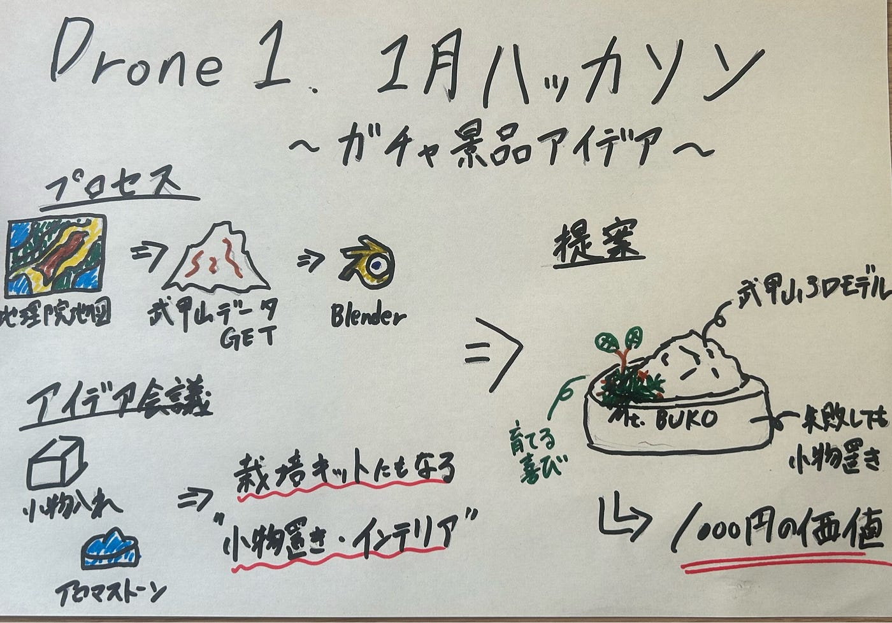
