### 【V&F週報】2026 Jan 武甲山3Dプリント型・ハッカソン

### 今回のハッカソン概要

今回のハッカソンでは、**[芦ヶ久保・A_Sta.ba](https://www.google.com/maps/place/Ashigakubo_StationBase%EF%BC%9CA_Sta.Ba+-%E3%82%A2%E3%82%B9%E3%82%BF%E3%83%90-%EF%BC%9E/@35.9769729,139.1366711,15z/data=!4m6!3m5!1s0x601ecd8a4a05a40f:0x99709b38246f36a5!8m2!3d35.9770306!4d139.1367002!16s%2Fg%2F11ssb45vx4?entry=ttu&g_ep=EgoyMDI2MDExMy4wIKXMDSoASAFQAw%3D%3D) に設置されている1,000円ガチャの景品**として提供することを前提に、武甲山の地形データを用いた **入浴剤用3Dプリント型（STLデータ）** の制作を行った。

想定サイズは **75mm ガチャカプセルに収まる大きさ**とし、「1,000円を出す価値のあるプロダクト」であることを目標に、造形・用途の両面から検討を行った。

### 制作条件・使用技術

- **地理院地図 3D機能**を用いて、武甲山の3D形状STLデータを取得

- **Blender** を使用し、ガチャサイズに収まる入浴剤用の型をモデリング

- 入浴剤使用後の **二次利用方法を1案以上提案（**1,000円の価値を感じられる用途であること）

- V&F [GitHubリポジトリ](https://github.com/furuhashilab/MtBUKO3D4capsule/tree/51e8bd5690c2cf6253a4af1b37d6ae5f9b5886d9/data/V%26F)

### 提案1｜立方体から山をくり抜く型

外観は立方体とし、底面側から見ると**武甲山の形状がくり抜かれている構造**の入浴剤用型。

作成した物⇩

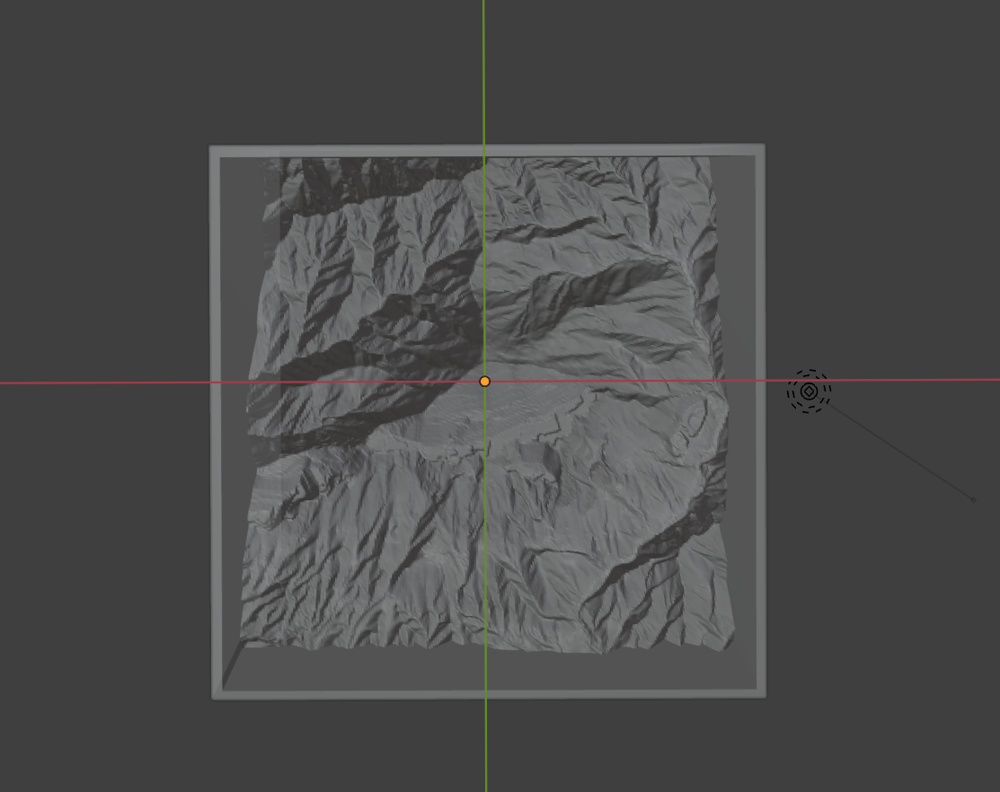

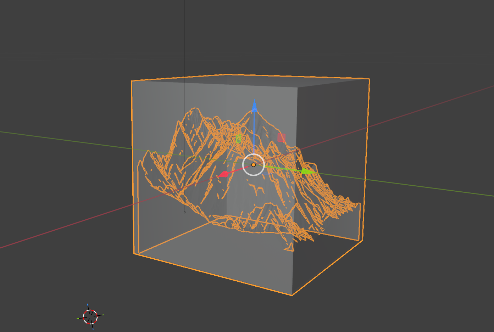

- **工夫点**

高低差の倍率を2倍に設定することで、迫力のある作品に仕上げました。また、立方体にすることで型として使う際の安定性を意識しました。

- **メリット**

安定感があり、型として使いやすい。

- **デメリット**

外からの見た目が地味。

### 提案2｜山の中身をくり抜く型

外観から武甲山のシルエットが明確に分かる形状を維持しつつ、内部を空洞化する型。

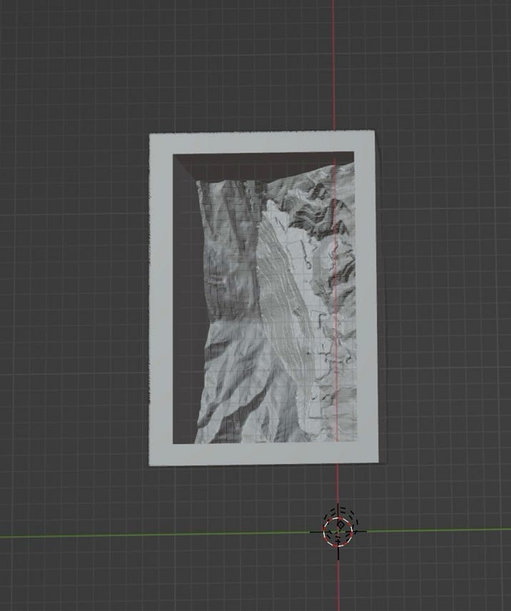

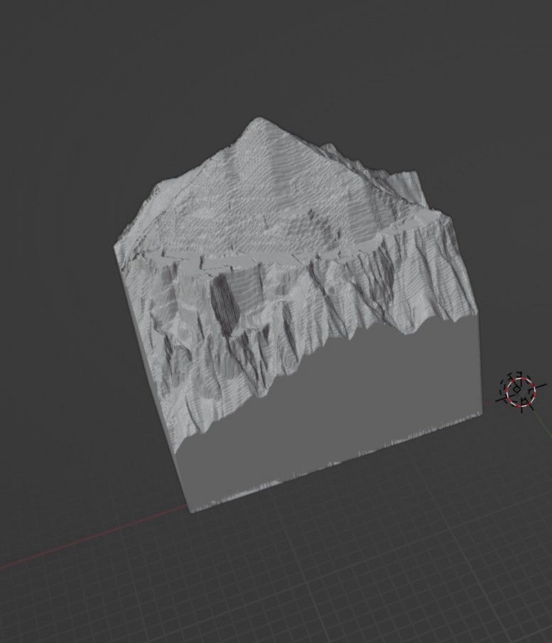

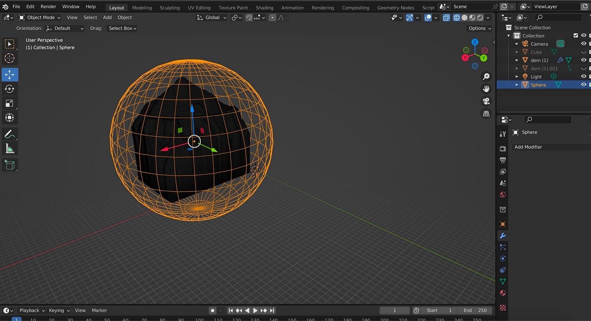

地理学院地図3d機能でstlダウンロードした武甲山▶︎[武甲山3d](https://maps.gsi.go.jp/index_3d.html?z=15&lat=35.95433415113211&lon=139.0978448605165&w=596&h=406&ls=std#&cpx=-26.112&cpy=-11.793&cpz=181.472&cux=-0.800&cuy=-0.008&cuz=0.600&ctx=0.000&cty=0.000&ctz=0.000&a=1.9&b=0&dd=0)

- **工夫点**

山の形がはっきりわかるように、地理院地図3dでstlダウンロードの時、1.9倍の高さでやりました。また、実際に型を作る際には、液体が漏れないように下の部分は囲むように作りました。

- **メリット**

外から見てすぐに武甲山だとわかる。

山の形がわかりやすいため、置物にしても変ではない。

- **デメリット**

3Dプリンターで印刷する場合、サポート剤の処理など、手間がかかる

### 入浴剤使用後の二次利用案

**用途：氷（ウイスキーのロックグラス）**

登山後や武甲山を訪れた思い出とともに、武甲山の形をした氷を入れたお酒を飲むことで、その体験をもう一度思い出すような時間をつくれるのではないかと考え、提案しました。

この案が実際に成立するかどうかを確かめるため、3Dプリンターを用いてプロトタイプを作成し、自宅で実際に氷を作る検証を行いました。

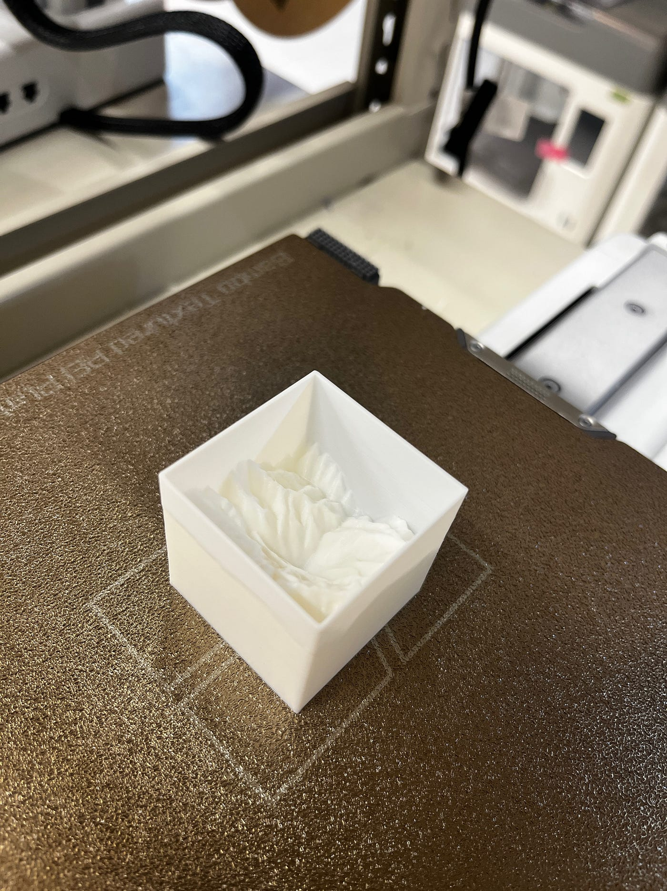

こちらは、提案1の立方体から山をくり抜く型です。

これを利用して、一晩家で氷を作ってみました。

そして完成品がこちらです

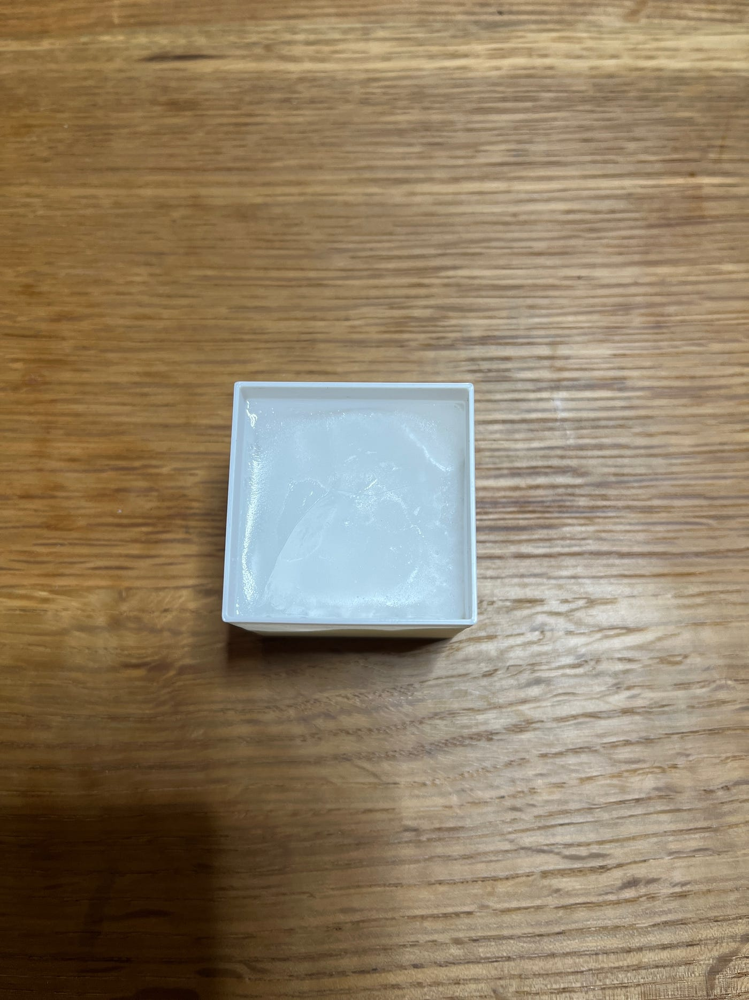

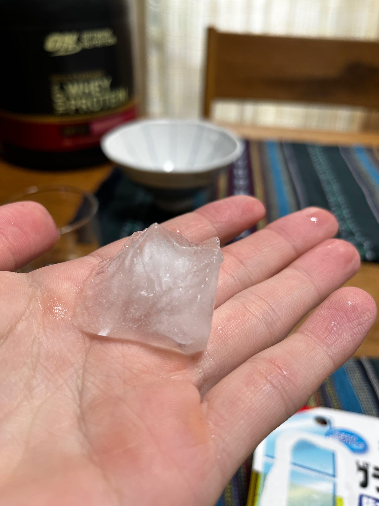

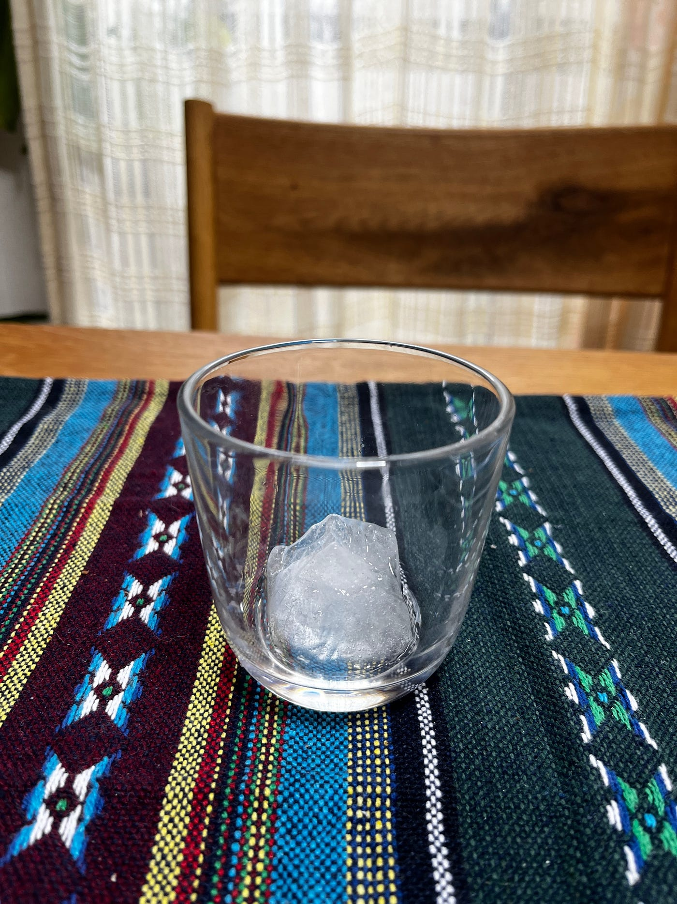

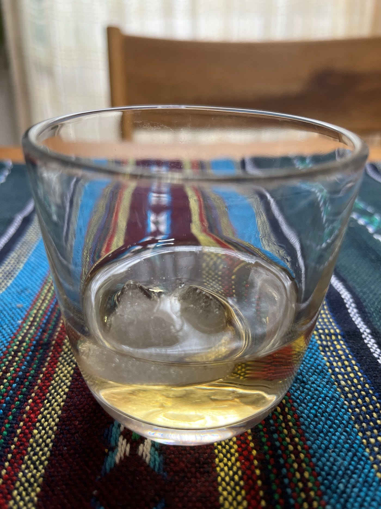

形自体は比較的きれいに再現できたものの、ガチャカプセルのサイズ制約の影響で、1つの氷としてはやや小さく感じられるという課題が見えてきました。

一方で、通常の氷をグラスに入れた後、仕上げとしてこの武甲山型の氷を上に浮かべることで、見た目としてのアクセントや「おしゃれさ」を演出できる可能性も感じました。(この実験は、時間の関係上できませんでした)

また、氷の膨張を想定して水を入れる前にサラダ油を内側に軽く塗ってから凍らせてみたのですが、それでも氷を型から取り出すのに10分ほどかかってしまいました。

なので、3Dモデルを原型として液状シリコーンで型取りを行い、柔軟性のあるシリコン素材を用いた型の使用についても、今後検討したいと考えています。

### **グラレコ**

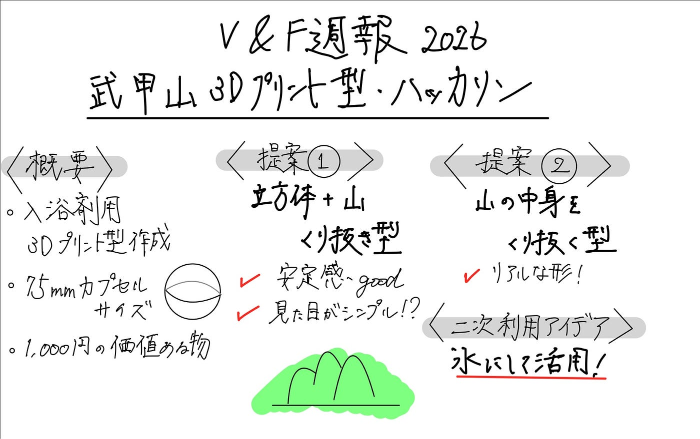
