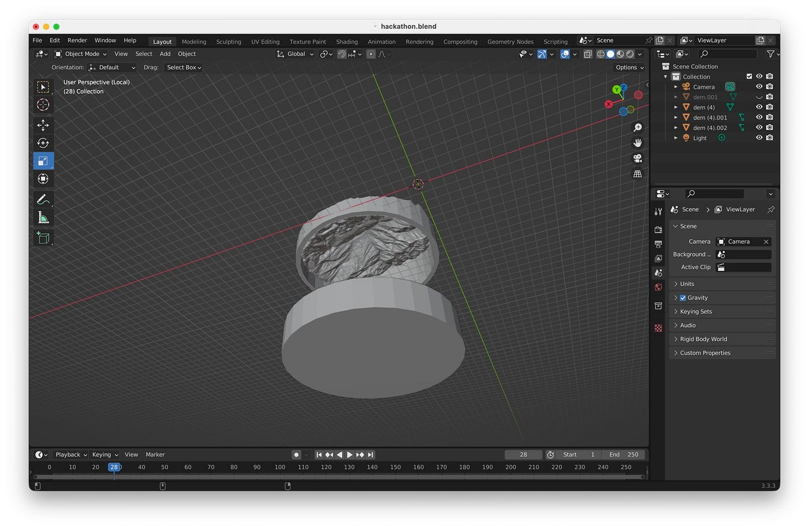
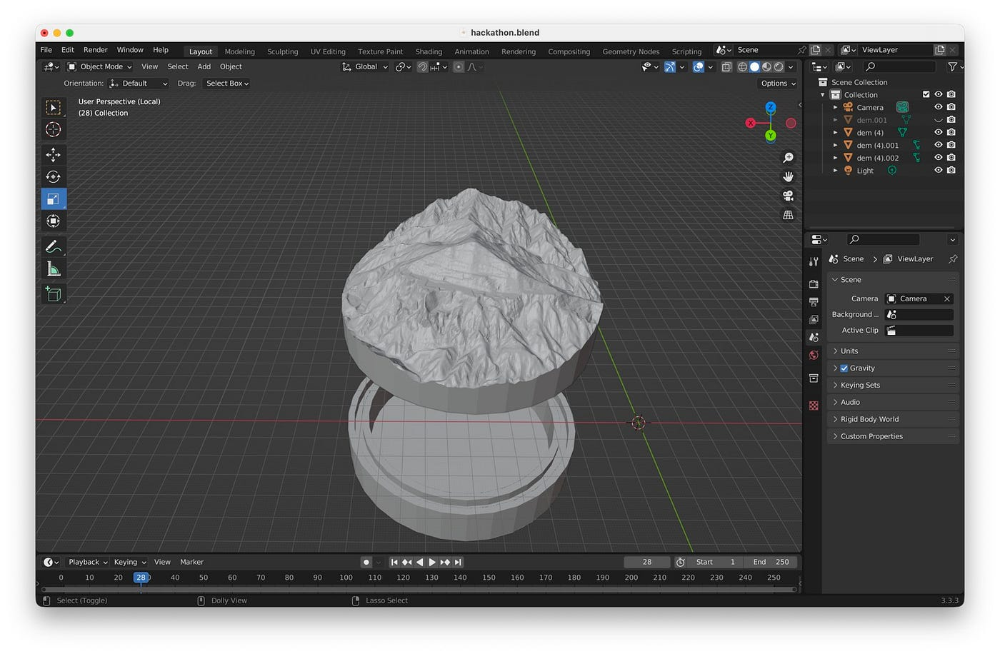
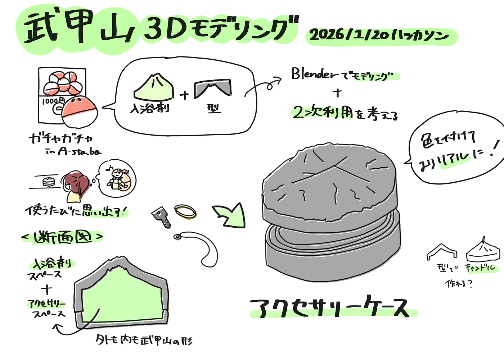

### 今年度最後！武甲山の型のモデリングをしました【ハッカソン報告】

こんにちは、臼井です。

時の流れは早いもので、もう今年最後の授業となってしまいました。

ゼミに入ってから色々な事がありましたが、自分的には良い方向に成長できたのではないかと思っています。

個人的な話ですが、ハッカソンはいつも週報を書いているメンバーとは異なるグループで行うので、毎回ちょっと新鮮で楽しかったです。

それでは、さっそく今回のハッカソンについて説明していきます。

#### **ハッカソンの概要**

芦ヶ久保にある[A-sta.ba](https://maps.app.goo.gl/m9whoKjNy27hnrVA6)に置くガチャガチャの景品として入浴剤＋その型を入れることが決まったので、今回のハッカソンでは、その型を二次利用と共に考えつつモデリングすることが目標になります。

**詳細**

- [地理院地図3D機能](https://maps.gsi.go.jp/index_3d.html?z=16&lat=35.951616471429325&lon=139.09772872924805&pxsize=2048&ls=std#&cpx=-87.493&cpy=133.089&cpz=70.254&cux=-0.269&cuy=0.233&cuz=0.935&ctx=0.847&cty=-2.262&ctz=-5.671&a=1&b=0&dd=0)を用いて、武甲山の3D形状STLデータをダウンロードする(解像度や範囲は創意工夫する)。

- Blender を用いて、75mmガチャガチャに収まる型をモデリング([ブーリアン](https://youtu.be/ZI37h3mvo4w?si=_khqtZ607-tHNeAc)等)する。

- 入浴剤を使った後の、同梱された武甲山型の二次利用方法を１つ提案(1000円の価値を感じられるもの)する。

- 成果物は [MtBUKO3D4capsule リポジトリ](https://github.com/furuhashilab/MtBUKO3D4capsule/) /data フォルダ内に、それぞれのチームごとのフォルダを作成して、STLファイルなどを格納すること

↓概要は以下からも確認できます。

[古橋研究室オンラインハッカソン2025-2026 · Issue #40 · furuhashilab/README
2025 Apr "International Humanitarian Mapathon"github.comる](https://github.com/furuhashilab/README/issues/40#issuecomment-3742009165)

#### **成果物**

成果物は[GitHub](https://github.com/furuhashilab/MtBUKO3D4capsule/tree/51e8bd5690c2cf6253a4af1b37d6ae5f9b5886d9/data/Youth%26Design)から確認できます。

二次利用をいろいろ考えたのですが、最終的に私たちは二次利用の方法としてアクセサリーケースを考えました。

持ち運ぶ用途ではなく、家に置いてアクセサリーや鍵を入れるイメージです。下に入れる容器があり、武甲山がフタになります。

ポイントは、型として必要な中の部分だけでなく外からも武甲山の形が分かるようにしたことです。今は色がありませんが、色をつければよりリアルになると思います。

家を出る時や帰った時など日常的に使うことになり、使うたびに武甲山に行ったことを思い出せるのではないでしょうか。

小物入れのほかにキャンドルを作るのにも使えるかも？と考えましたが、耐熱性に不安があったので没にしました……

詳しくないので分からないのですが、耐熱性のある素材があれば実現できるかもしれないです。

以上、小物入れにつかえる武甲山の3DデータをBlenderでモデリングしました。

ガチャガチャが実現する日が楽しみです！

#### グラレコ

