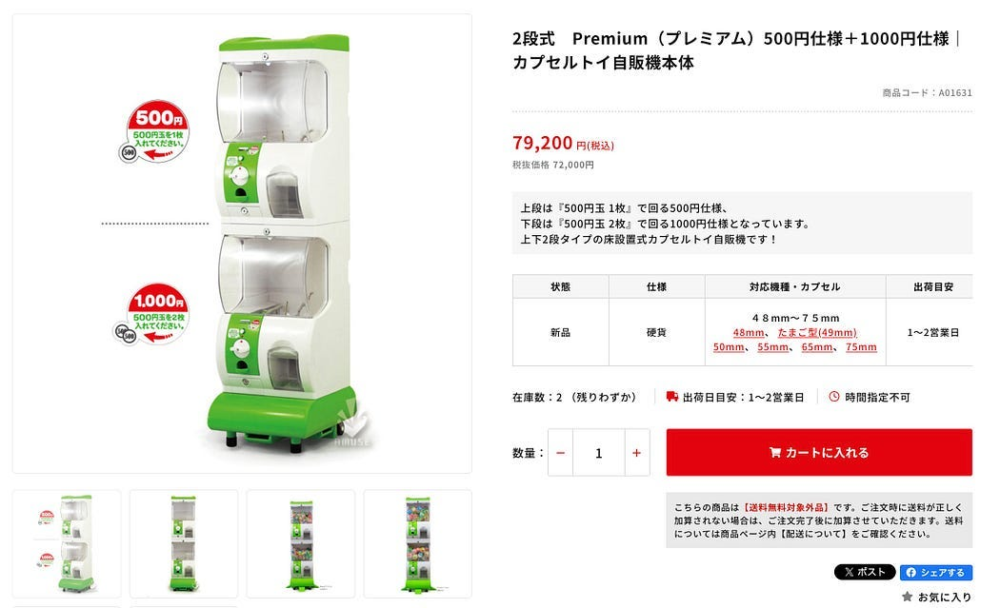
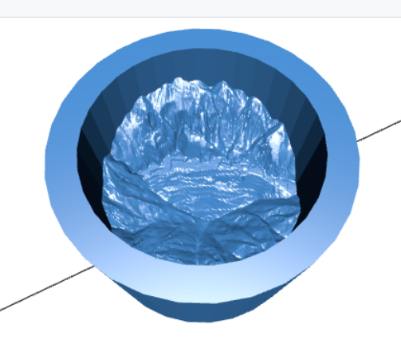
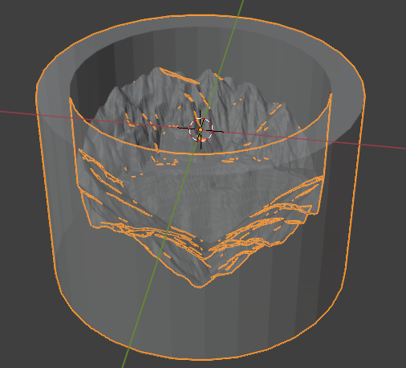
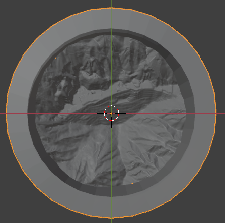
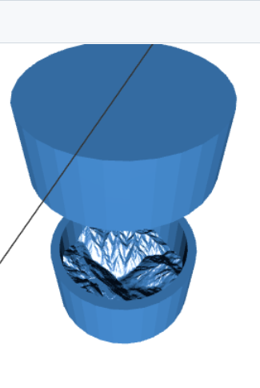
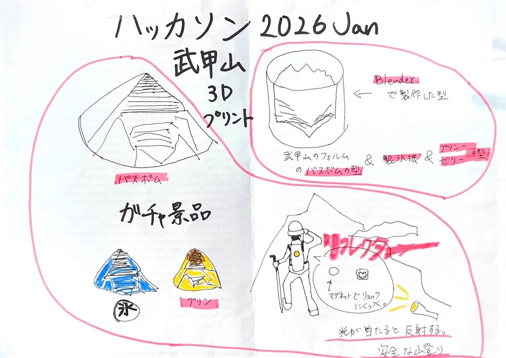

### 登山客を満足させろ！ガチャ景品【年内ラストハッカソン成果報告】

ドローン2です！年内ラストのハッカソンの成果報告をします。

### 2026 Jan 武甲山3Dプリント型・ハッカソン

[芦ヶ久保・A_Sta.ba](https://maps.app.goo.gl/m9whoKjNy27hnrVA6) に設置されている1,000円ガチャ(75mm?たぶん)の景品として、[入浴剤](https://medium.com/furuhashilab/%E7%96%B2%E3%82%8C%E3%82%92%E7%99%92%E3%81%99%E3%83%90%E3%83%96%E4%BD%9C%E3%82%8A-c936784f75aa)の型(ガチャガチャ景品として同梱)を3DプリントできるSTLデータとして作成する。1,000円出す価値のあるプロダクトになるように創意工夫する。

### 詳細

- [地理院地図3D機能](https://maps.gsi.go.jp/index_3d.html?z=16&lat=35.951616471429325&lon=139.09772872924805&pxsize=2048&ls=std#&cpx=-87.493&cpy=133.089&cpz=70.254&cux=-0.269&cuy=0.233&cuz=0.935&ctx=0.847&cty=-2.262&ctz=-5.671&a=1&b=0&dd=0)を用いて、武甲山の3D形状STLデータをダウンロードする(解像度や範囲は創意工夫する)。

- Blender を用いて、75mmガチャガチャに収まる型をモデリング([ブーリアン](https://youtu.be/ZI37h3mvo4w?si=_khqtZ607-tHNeAc)等)する。

- 入浴剤を使った後の、同梱された武甲山型の二次利用方法を１つ提案(1000円の価値を感じられるもの)する。

- 成果物は [MtBUKO3D4capsule リポジトリ](https://github.com/furuhashilab/MtBUKO3D4capsule/) /data フォルダ内に、それぞれのチームごとのフォルダを作成して、STLファイルなどを格納すること

### **成果物**

ドローン2の成果物は、[GitHub](https://github.com/furuhashilab/MtBUKO3D4capsule/tree/main/data/Drone2)からも見れます。
Blenderを使用し、入浴剤の型【図１】を作成しました。デザインは、武甲山の象徴である石灰採掘が見えるようにくり抜きました。

### **二次利用方法**

#### 超軽量・リフレクター

図1の型の「素材感」と「形状による乱反射」を活かした安全グッズ案。

**どんなもの？** 型の内側（山肌の裏面）に、リフレクタースプレーをかける。

[Amazon | アサヒペン 塗料 ペンキ 光反射スプレー 300ml 白(半透明で下地は透けて見る) 反射 スプレー 1回塗り 光が当たると塗膜が輝く 夜間の視認性アップ ガス抜きキャップ付き 日本製 | 塗料缶・ペンキ](https://www.amazon.co.jp/%E3%82%A2%E3%82%B5%E3%83%92%E3%83%9A%E3%83%B3-%E5%8D%8A%E9%80%8F%E6%98%8E%E3%81%A7%E4%B8%8B%E5%9C%B0%E3%81%AF%E9%80%8F%E3%81%91%E3%81%A6%E8%A6%8B%E3%82%8B-%E5%85%89%E3%81%8C%E5%BD%93%E3%81%9F%E3%82%8B%E3%81%A8%E5%A1%97%E8%86%9C%E3%81%8C%E8%BC%9D%E3%81%8F-%E5%A4%9C%E9%96%93%E3%81%AE%E8%A6%96%E8%AA%8D%E6%80%A7%E3%82%A2%E3%83%83%E3%83%97-%E3%82%AC%E3%82%B9%E6%8A%9C%E3%81%8D%E3%82%AD%E3%83%A3%E3%83%83%E3%83%97%E4%BB%98%E3%81%8D/dp/B0CR1HSZ3Y/ref=sr_1_1?crid=37V7SCCXSY2YG&dib=eyJ2IjoiMSJ9.zEWahYJF9A5htttV6PZROnZts3vt0h72R84oCquW7i8zWZJmOL8OXwtDzwJbHoFCpxT8QnGblfYwI4-MsHNo1DKTJdvWkETU6q16HG-tWh93d5fZ-fE258AHJW_7iVLQhc9ejCUpvdsA1Ogd1EKMcotii2LZmQj0GPT_e76A0Hz__ONAYZ2m6fNTf5IRH38mBVh2nBdhCqsxvEA_JLu74D32G60tDXB6hGvkWQP6yCLxt2zW7WKENhs1_Wt7oT7oi_ub2N8qNKjwznitU5LhnKl4F4QRNLMSnkF3psbDeeE.c4id31A2zR5Psv5g9NjeYADFss339zbACoze5B2ZuHA&dib_tag=se&keywords=%E3%83%AA%E3%83%95%E3%83%AC%E3%82%AF%E3%82%BF%E3%83%BC+%E5%A1%97%E8%A3%85&qid=1768805150&sprefix=%E3%83%AA%E3%83%95%E3%83%AC%E3%82%AF%E3%82%BF%E3%83%BC+tos%2Caps%2C215&sr=8-1)

**登山中どう使う？** ザックにマグネットでくっ付ける。
蓋と本体にマグネットを付けて、リュックに付けれるようにする。

**・視認性向上:** 後ろを歩く仲間や、車道歩きでの車からの視認性を高めるリフレクターとして機能する。
**・緊急時の合図:** 万が一の遭難時、太陽光を反射させてヘリコプターや遠くの救助者に居場所を知らせる「シグナルミラー（の簡易版）」として使えることを目指す。武甲山の複雑な凹凸が光を乱反射させ、キラキラと目立つ。

**1000円の価値**
登山には荷物をなるべく減らしたいと思うが、安全グッズはもっておきたい。そんなときに、軽量で自分の居場所を知らせるリフレクターがあれば、ちょっと安心できるかもしれない。

### その他案

武甲山フォルムの
・製氷機
・ゼリーの型
・プリンの型

### **グラレコ**

