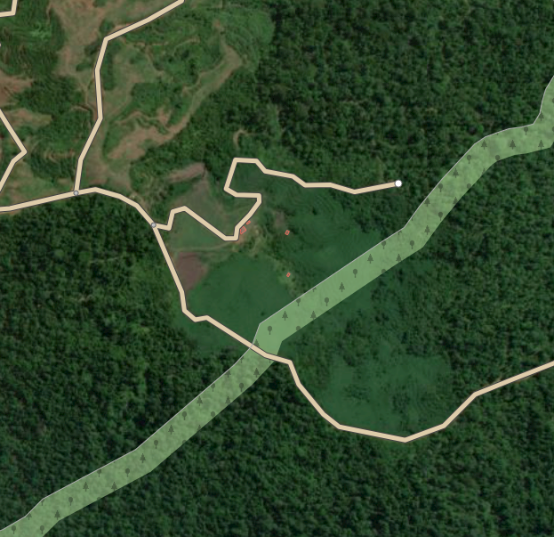
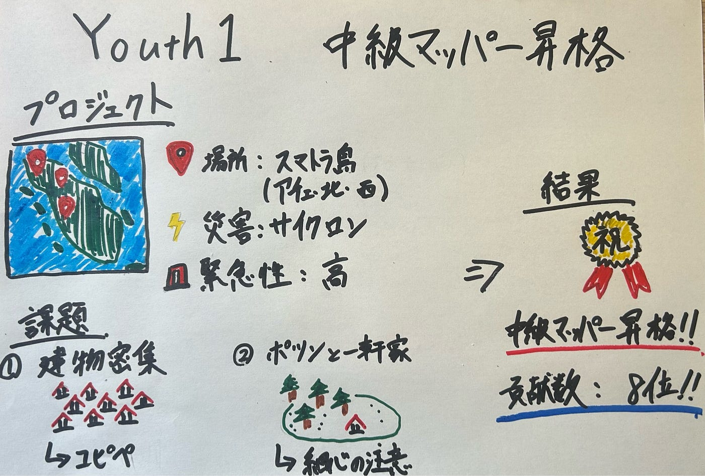

### 【Youth１週報（2026/01/13）】遂に卒業！

こんにちは、3年の井上です。年を越してから寒さが厳しくなってきていて、南国出身の自分にはそろそろ耐えられなさそうです。冬といえば白い息が連想できますが、薄壁の我が家では暖房をつけないと家の中でも白い息を見ることができます…風邪ひかないように気を付けます。

さて、今回は皆さんお待たせいたしました

”HOT Tasking Manager～中級マッパー昇格編～ 最終話” です！

古橋研究室に入ってもうすぐ一年が経ちますが、いまだに初級マッパーを卒業できていない状態が続いていました。周りのみんなが早々と中級マッパーとして活躍していく中、自分だけは一人置いてけぼり。流石にそろそろまずいと危機感を覚え、今回こそは必ず中級マッパーに昇格してみせると気合を込めて挑みました。

今回の挑戦を共にしたプロジェクトはスマトラ島のプロジェクトです。

> _プロジェクト概要_

プロジェクト名：[Building Mapping: Aceh, Sumatera Disaster Response](https://tasks.hotosm.org/projects/37362#description)

概要：The National Disaster Management Agency (BNPB) has updated the number of victims affected by the massive flash floods and landslides in Aceh, West Sumatra, and North Sumatra. As of Thursday afternoon (December 4, 2025), 836 fatalities have been confirmed, according to Abdul Muhari, Head of BNPB’s Disaster Data, Information, and Communication Center. This figure highlights the severity of the disaster and underscores the urgent need for accurate information to support emergency response and recovery operations.

In response, the OpenStreetMap (OSM) community calls on contributors to help map buildings in the affected areas across Aceh, North Sumatra, and West Sumatra. Updated maps are crucial for search-and-rescue teams, humanitarian workers, and local authorities to understand on-the-ground conditions, plan evacuation routes, and distribute aid effectively. Anyone can participate whether beginners or experienced mappers because every contribution at any skill level helps speed up the availability of reliable spatial data during this emergency.

（プロジェクトの説明欄から引用）

2025年の12月1日にインドネシアを襲ったサイクロンによる鉄砲水や地滑りの被災地の建物の地図を作成するプロジェクトである。具体的な地域はアチェ、北スマトラ、西スマトラである。2025年12月4日（木）午後現在、836人の死亡が確認されており、緊急対応と復旧活動を支援するための正確な情報の緊急の必要性を強調している。こちらの災害に関するニュース記事は[こちら](https://www.bbc.com/japanese/articles/c79x8g2rj5yo)になります。

建物のマッピングは今までたくさん経験していて慣れているという点と、緊急性の高いプロジェクトであるという点からこのプロジェクトを選定しました。

> _作業内容_

被災地の建物をひたすらにマッピングしました。

マッピングを進めていくうちに二つの点に苦労しました。

一つ目は**建物が密集している**という点でした。

ご存じの通り、東南アジアの住宅街は建物同士が密着していて数がとてつもなく多いです。これを一つずつやるのはかなり骨が折れる作業でかなりきつかったです。

今回の作業では積極的にコピー＆ペーストを使って時短することを心がけました。同じ形が続く住宅街ではかなり効果的だったのでこれからも積極的に活用しようと思います。

二つ目は**ポツンと一軒家が多い**点でした。

下の写真のように、森の中に突如建物が現れるというケースが非常に多かったように感じました。見逃さないように細心の注意を払いました。

> _結果発表_

今回はかなりのタスクを作業できました。

[貢献数](https://tasks.hotosm.org/projects/37362/contributions)では全体で8番目で個人的にはかなり満足してます。

そしてお待ちかねの中級マッパー昇格チャレンジの結果は…

見事250セットを達成し、**中級マッパー昇格**です！

> _まとめ_

何とか滑り込みで中級マッパーに昇格出来て達成感というより、安心感の方が大きいです。慢心せずこれからも精進し続けて上級マッパー昇格を目指します！

最後にグラレコになります。

