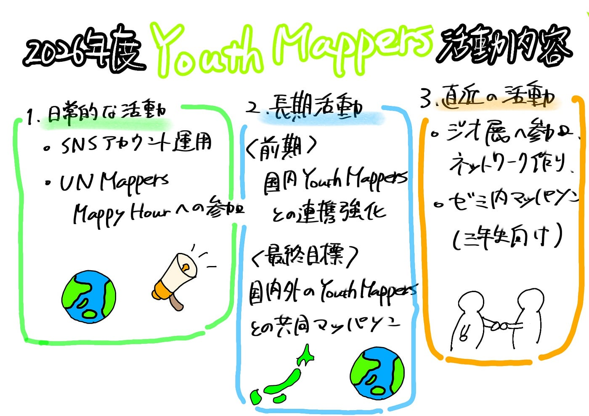

### 【4/21】Youth 1: 2026年度も始まりました

### 自己紹介

ひなこ：青学の管弦楽団に入ってました！今年は社会人オケや先輩オケに参加予定。ドローンは少し飛ばせます。今、街歩きのインターン中でもし興味ある人がいればぜひ一緒に歩きましょ～‼今年は、Youthの活動や国際会議なども控えていおり、積極的にいろいろ挑戦したいです！

ふうか

4月に入ってから、欠かさず朝ウォーキングをしています。

今年はYouthMappersに絞ったので、HOT Tasking Managerでのマッピングやバリデーションに継続的に取り組んで、中級マッパーとしてしっかり貢献しつつ、上級マッパーを目指します。

また、いろんな人と連携しながらマッパソンの企画や運営にも関わって、活動を活発にしていきたいです。まずは、ゼミ内で、3年生向けのマッパソンを開催したいです。

みなと

3年の田邊です

フィールドワークが好きで、GoogleMapを見るのも好きなので古橋ゼミを選びました！

インカレでスキューバダイビングのサークルに入っていることもあり、海図にも興味があります。伊能忠敬超えを目指してます。

さくら

三年の中溝さくらです！

出身は東京の大田区で「Cairns」というスキューバダイビングのサークルに入ってます🤿🩵

Mapperとしてのスキルが全くないので、Youthの活動を通して、身につけられるように頑張りたいです🙌🏻

### 今年度の活動内容

### 1. 日常的な活動

- **YouthMappers の SNSアカウント運用**

- 活動内容やイベント情報を発信する

- YouthMappers の認知度を高める

- メンバー間の情報共有にも活用する

- **UN Mappers Mappy Hourへの参加**

- 国外の YouthMappers の活動やイベントを知る

- 他大学・海外のメンバーとのつながりを広げる

- 今後の共同活動のきっかけを作る

### 2. 長期的な活動

- **前期の目標：国内 YouthMappers との連携強化**

- 国内の YouthMappers と協力関係を作る

- 他大学と日程調整を行い、マッパソン開催を目指す

- 開催時期は **7〜8月頃** を目標とする

- **最終目標：国内外の YouthMappers との共同マッパソン**

- 国内だけでなく、海外の YouthMappers とも連携する

- FOSS4G などのイベントで YouthMappers 関係者を見つける

- 将来的には、国際的なマッパソンの実施を目指す

### 3. 直近の活動・イベント

- **ジオ展への参加**

- YouthMappers に関心を持つ人を見つける

- 新たな出会いやつながりを作る

- 今後の活動につながるネットワークづくりを行う

- ゼミ内マッパソンを三年生向けに開催したい。日程は未定。

質問

- **23日・24日のイベント確認**

### 4. 今年度の全体目標

- SNS発信を通して YouthMappers の活動を広げる

- 国内 YouthMappers との連携を強化する

- 7〜8月頃を目標にマッパソンを開催する

- FOSS4G やジオ展を通して国内外のつながりを作る

- 将来的には、国内外の YouthMappers と共同で活動できる体制を目指す

グラレコ

