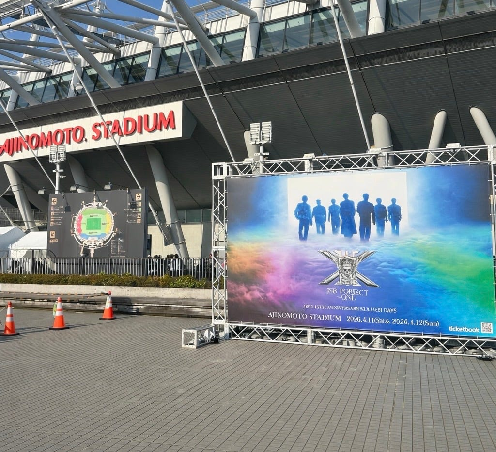
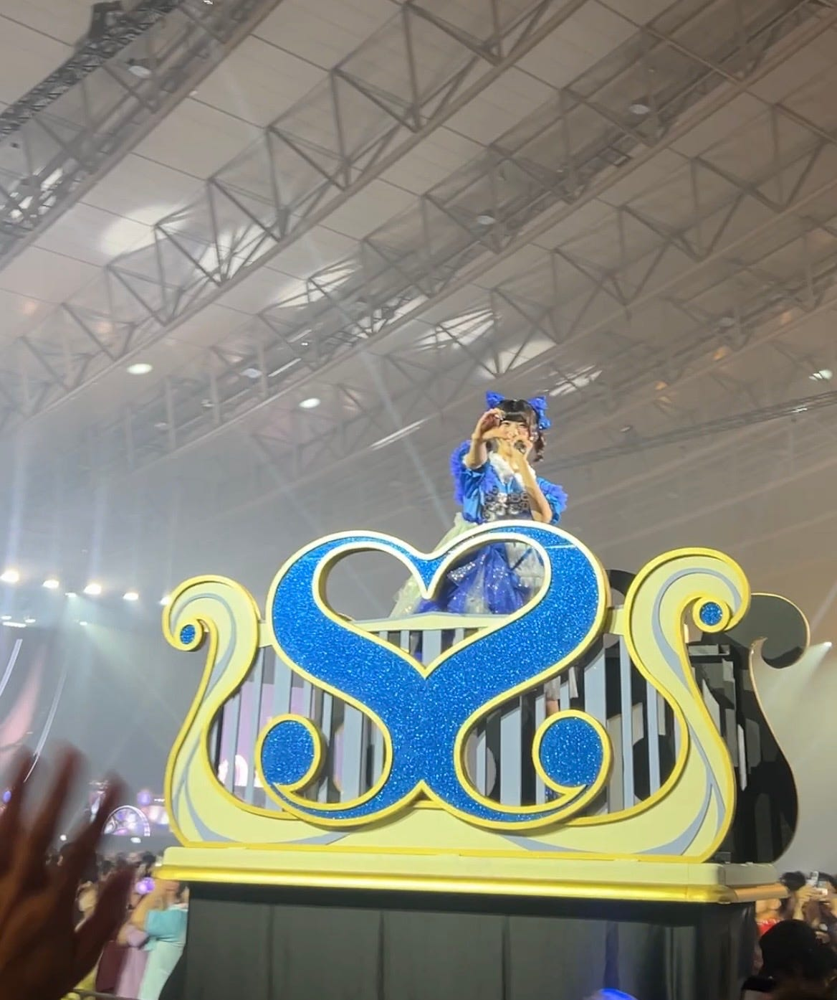
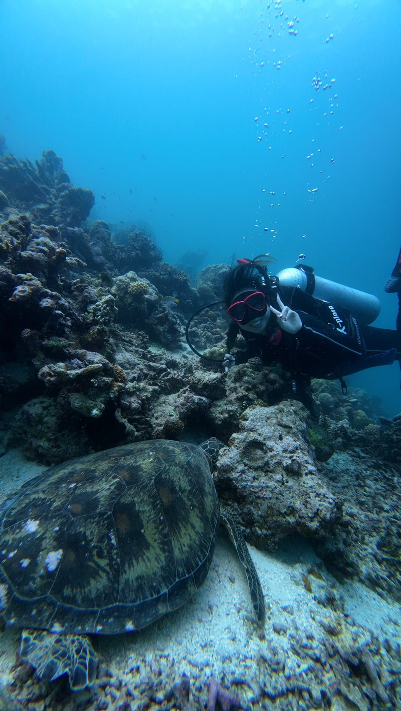
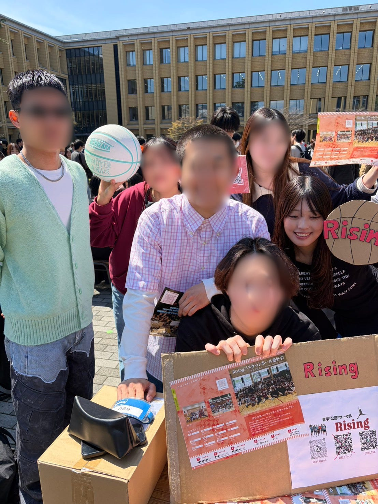
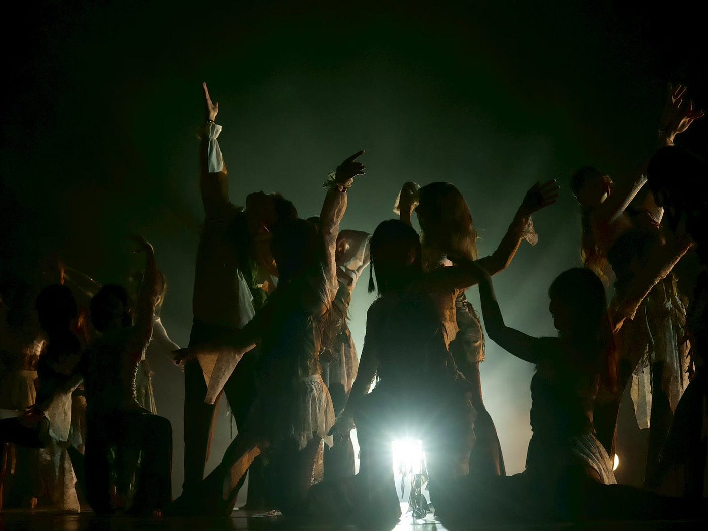
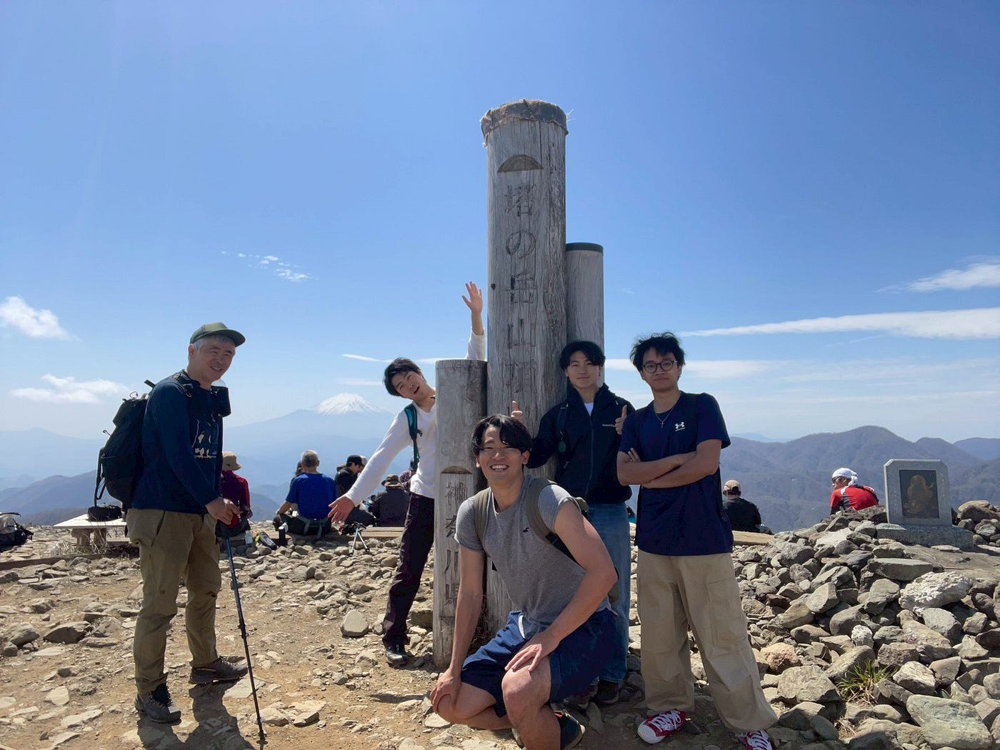
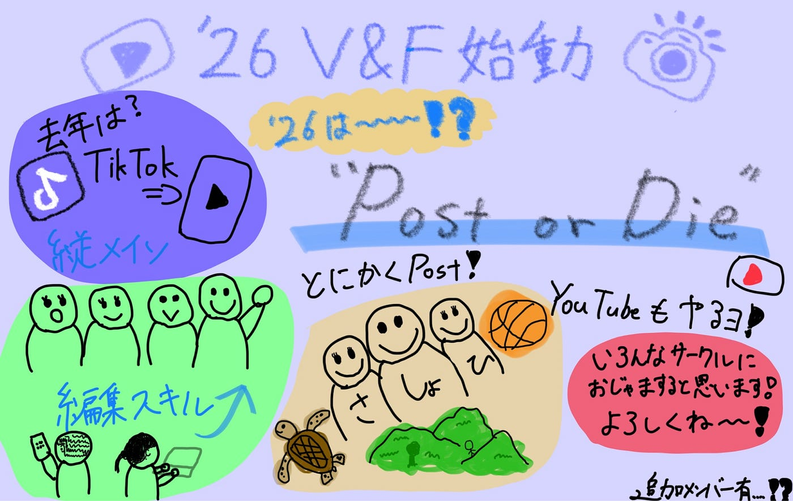

### 【4/21 V&F週報】2025年度1人賛否& “Post or Die”

こんにちはー！ボッチサークル、VFと言いつつ個人アカウント運営どちらも回避できて嬉しい荒川です。始まりましたねー4月。4月に入ってもう2回ライブにいったり山登ったりしてルンルンな生活をしております。

今回は新年度一発目の週報ということで去年の振り返りと、今年の方向性を喋ります。

> 2025年度VF一人賛否

去年はVF4人でした。我らがリーダーたかけんを筆頭に4人でTikTokの運用にチャレンジしたり、撮影に出かけたり、4月の頃からは4人とも編集スキルが上がったのかなと思います。投稿した動画の再生数やいいねから動画の分析して「おーちゃんとVFっぽいことやってんねー」なんてこともありました。

#### たぁ～だぁ～

縦動画だけ？古橋研の活動ちゃんと発信できてた？そもそもTikTok動き出したの遅くない？って感じで反省もあります。それでもやっぱTikTokのアカウント開設だったり、編集スキルが付いたり、私にとってとっても大切で学びがあった1年だったなと思います。ありがとうね、チサトさん、こうなさん、たかけん。

> 2026年度VFなにやる？

それを踏まえてですよ。なにやる？ってお話を新メンバーのひまりとさくらとZoom繋いで話しました。でもやっぱ最初過ぎたので、これ！って感じの明確なヴィジョンは決まっておらず、、、。でも目標をカッチリ決めすぎないほうが柔軟に面白いことできるのかなーって考えるThe ENFPなので私。まあでも、定期的にお話ししていろんなことにチャレンジしていきましょう！

でもスローガンは考えました私。

### Post or Die

これで行きます今年のVFは。2人になんも相談なしに勢いで書いています4月16日木曜日の夜です。これで行くわよ、ひまりさん、さくらさん。いくら良い動画でも発信してなかったら誰にも届かないですからねー。サッカーやってた時言われましたいくら良いシュートでも入んなきゃ意味ねーよって。父親に説教された思い出が蘇ります。

そんな感じで、今年はどんどん動画出していきたいなと思ってます。失敗から学んでいこうな。私がたまに上げてた3分ぐらいで撮ったような動画でもいいので、とにかく投稿していきましょう。あでも、ライセンスとか著作権には気を付けようね。

動画投稿するSNSは、去年に引き続きTikTokとそして、

#### V&FのYouTubeアカウントを開設します！

これだねー今年は。やっぱ横動画の編集スキルを伸ばさないとなと思いますあらしょうは。古橋研のチャンネルに投稿する案もあるんですけど、他の講義動画等に埋もれてしまうので、V&Fのアカウントを新しく作ろうと思います。どんな動画上げていこうかーだったり、投稿頻度の話はまだこれからですが、週一回投稿できたらいいなーなんて思っています。それぞれのSNSの良いとこ取りして3人で頑張ろうねー！

そんなところで、荒川のおしゃべりパートはやめにします。ここからは新メンバーの2人に自己紹介してもらおうと！思います！拍手！

#### さくら

はじめまして！3年の中溝さくらです🙌🏻
出身は東京都大田区で、「Cairns」というスキューバダイビングのサークルに所属しています🤿🩵
VFではこれまでリール動画しか作ったことがないため、今後は横動画にも挑戦し、動画制作の技術を高めていきたいです🙌🏻

#### ひまり

はじめまして！3年の野中ひまりです！
群馬県出身で、今は淵野辺で一人暮らしをしています😌
バスケサークルとダンスサークルに所属していています！⭐️
動画制作は短い動画を友達のために作るなどといったレベルのことしか経験がないので、VFの活動を通して技術を磨いていきたいです✨️✨️

#### しょうた

忘れてました私も自己紹介します。

偉大なる埼玉県出身で、今は矢部に一人暮らしです。気づいたらアイドルにハマっていて、いろんなグループのにわかファンです。アニメとかも好きで、ジョジョが一番です。今年はいろんなサークルに顔出して動画取りに行くのでみんなよろしくねー！

以上！これから1年間よろしくお願いします！

来週はジオ展ですねー！さくら・れあら・ひまりの3人が発表するのでバッチリ動画に収めますよー！頑張ってくれ！

