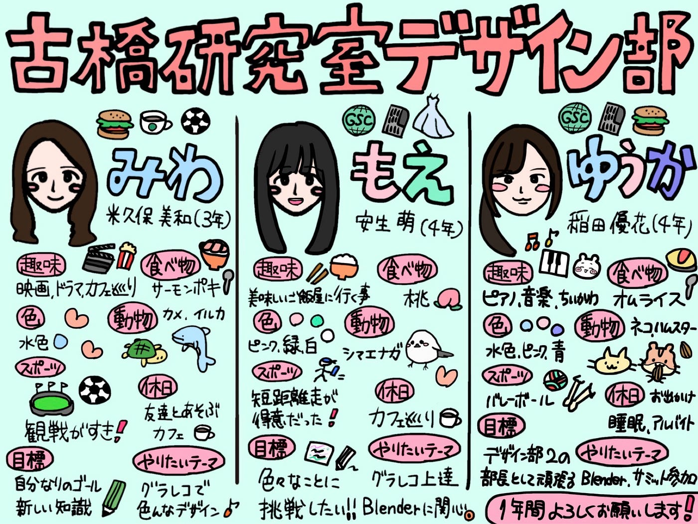

こんにちは！4年生になりました安生です。
今年度もよろしくお願いします！

早速、今年のデザイン部2のメンバーを紹介します！

### **みわ**

3年の米久保美和(よねくぼみわ)です！♩
理工サッカー部でマネージャーをやっていて、バイトはシェイクシャック🍔というハンバーガー屋さんとスターバックスを掛け持ちしてます！☕️★

【趣味】
映画やドラマを観ることと、お散歩しながらカフェ巡りをするのが好きです💖

【好きな食べ物】
サーモンポキが好きです

【色】
水色が好きです♩

【動物】
カメとイルカが好きです🐢🐬♡

【スポーツ】
全般出来ないんですけど、サッカーとかの観戦が好きです！

【休日の過ごし方】
友達と遊んだり、カフェに行きます♡

【古橋研究室内の目標】
自分なりのゴールを見つけて、新しい知識を身につけたいです❣️

【デザイン部でやってみたいテーマ】
絵を描いたり、デザインを生み出すのが凄く好きなので、グラレコの知識を取り入れてもっと色んなデザインを描いてみたいです！♡

### **ゆうか**

4年の稲田優花（いなだゆうか）です！
部活やサークルはニュース部と学生連合でアルバイトはマクドナルドをしています🍔🍟

【趣味】
ピアノと音楽を聴くこと、ちいかわ集め

【好きな食べ物】
オムライス

【色】
水色、ピンク、青

【動物】
ねこ、ハムスター

【スポーツ】
バレーボール

【休日の過ごし方】
お出かけや睡眠、アルバイト

【古橋研究室内の目標、やりたいこと】
今年はデザイン部2の部長として頑張ります！
グラレコや Blenderを上達させたいです✏️

【デザイン部でやってみたいテーマ】
Blenderでクマ以外にも動物やモノを作りたい
ピクト一覧表に無いピクトグラムを作りたい
グラレコスタッフとしてサミットに参加したい

### **もえ**

4年の安生萌（あんじょうもえ）です！
地球の学生連合とニュース部に入っていて、ブライダルスタッフのアルバイトをしています💍

【趣味】
美味しいご飯屋さんに行くこと🍙

【好きな食べ物】
桃🍑

【色】
ピンク、緑、白

【動物】
シマエナガ

【スポーツ】
高校の頃までは短距離走が得意でした笑

【休日の過ごし方】
カフェ巡り☕️

【古橋研究室内の目標、やりたいこと】
デザイン部での活動は今年が初めてなので、色々なことに挑戦して頑張りたいです！

【デザイン部でやってみたいテーマ】
もっと上手にグラレコを描けるようになりたいのと、Blenderで何か好きなものをつくってみたいです🎨

今年度のデザイン部2は以上の3人で活動していきます！
みんなで協力しながら、楽しく取り組んでいけたらと思っています。
これから1年間よろしくお願いします！

