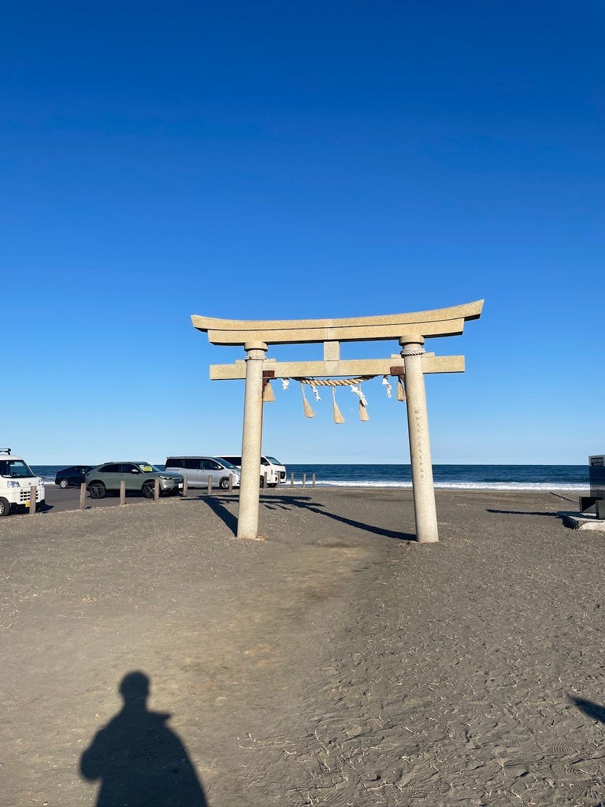
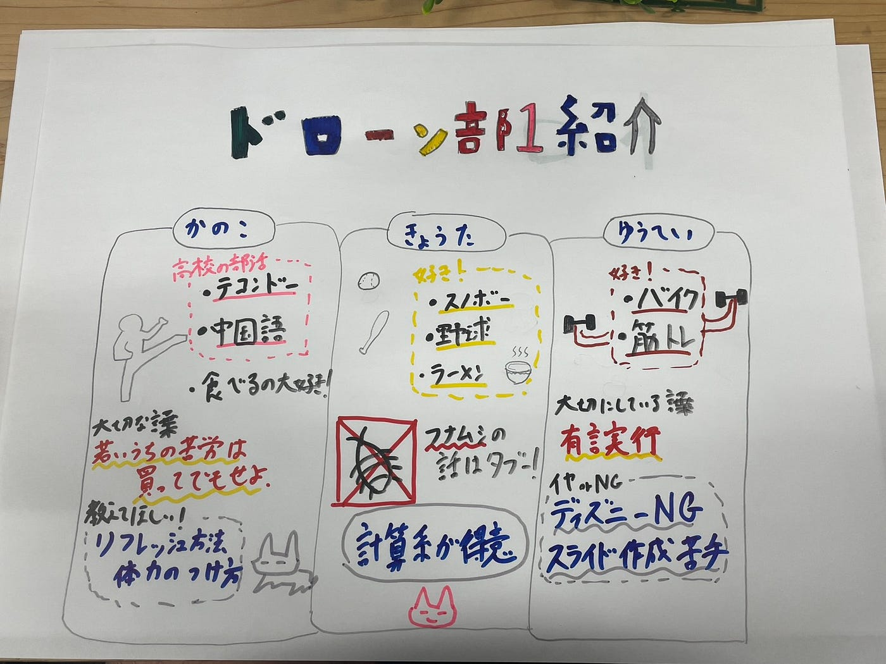

### ドローン部がまた始まるよん

こんにちは、今年度もよろしくお願いします。
楽しかった春休みが終わって、新年度が始まりました。
最後の１年何をしてやろうかとワクワクしていて、ワクワクしているだけで何もしないで終わるんじゃないかって心配すらしています。

### ドローン部所属決定

ゼミ一週目で３年生のドローン部志望がとても多いぞ、、、ありがたいです。

実はまだ３年生の顔と名前が**全然一致していない**ので、いっぱい喋りたいです！

去年のドローン部は何をしたのか、飛ばした記憶がありません。
ドローン部１は３Dプリンターでドローンを作るという、デザイン部のようなことをしていました。
今年は前期から先生がいらっしゃるのでドローンを外で飛ばせるようで楽しみ！！

どんなドローンを買えばいいのかな、自分は旅行とか行った時に飛ばせたらいいなって思っている🙂‍↕️

今年のドローン部の方針は、前年度は１と２で全く異なることをしていたのですが、今年は一緒に行っていこうと考えています（やることは一緒で、分担していこうみたいな）
ドローンはみんなで飛ばした方が絶対楽しいでしょ！！ってアキさんと決めました。

### ドローン部１のメンバー紹介

ここからは我らがドローン部１のメンバー紹介をしてみます。

#### **カノコ**

え、すご高校でテコンドー部入ってたのか、イブラヒモビッチじゃんとか一人でテンションあがる。
得意な作業の欄を見てみると

**【得意な作業】^_^**

なんて回答を披露してくれました。普通だったら、パソコン打つのが早いです！とか書くものだと勝手に自分の中で決めつけていたのですが絵文字で回答するという、新たな手法を発見することができました。これから私も使わさせていただきます(⌒▽⌒)

食べることが大好きらしいです。
自分は甘いものが大好きなので、太らないように筋トレしています。
疲れているそうなので、いいリフレッシュ方法があったら教えてください。自分は、自転車漕いだり猫と遊んだり、好きに過ごす日を1週間に１日作っています。
GiftHubアカウント→[ここだよん](https://github.com/Kanoko4)

#### **キョウタ**

左利きか、、、ドローン操縦は左利きが難しいなんて話もあったりなかったり。ラーメンが大好きなのか、自分はうどんが大好きです。休日の朝はうどんを食べています。
できれば控えたい話に苦手な生き物の話（フナムシの話は絶対にやめてください）と回答をしていたのですが、逆にどうやったらフナムシの話に行くんだって１にやけを贈呈します。今、フナムシって何だっけって思って、調べてみたけど、あいつか。
本当は画像を貼って皆様にも共有したのですが、それではハラスメントとかでドローン部１を追放されるのでやめます。

GiftHubアカウント→[これ！](https://github.com/Kyotakatada)

**知りたい人はここを[クリック**](https://ja.wikipedia.org/wiki/%E3%83%95%E3%83%8A%E3%83%A0%E3%82%B7)

へー腐ったものを食べるから海のお掃除やさんって呼ばれてるんだ
感謝します
自分は、どっちかっていうとゴキブリの方が苦手です
ホステルにゴキブリがずっといたのはいい思い出
なんで苦手な人って多いのかな？
すっごい昔に嫌なことされて遺伝子レベルで拒絶しているとか？
話が外れすぎたのでここで次の紹介に行きます。

#### **ユウヘイ**

あれ、ちょっとしたこだわりにカップ麺とかは食べませんとか書いています。
自分はハワイに滞在中、食費を抑えるためにカップ麺やレンチンのお米を持っていったのに😢 多分そんな自分をユウヘイ君は軽蔑した目で見るのでしょう。あ、アキラが話していたバイク好きな子ってゆうへいくんのことかって自己紹介文を読みながら思いました。
バイク好きな人って、音聞いただけで種類？みたいなことまで分かるのすごいですよね。アキラと翔太とツーリングとか行ってみたらいいかもね🙂‍↕️
でき**れば控えたい話にデ**ィズニーって書いていました。全然知らないらしいから控えたいって書いていたので自分とは違う理由だった‼️
自分は待つことができないのでディズニー・ボウリングとか自分の順番を待つ系のやつが嫌いです。
ずっと動いていたいのかな？わかんない！！！
ボウリングは待つ以外にも、あの自分以外の人が投げて、おーー上手い！とか言ったりする、あの時間が好きじゃないです。

なんかの記事でディズニーが変わったという話を見ました。
昔と変わって、スマホとかで待ち時間を見れるようになったことで体験としてのディズニーという魅力が減ったという話もあるらしいです。
これが自分がディズニーにいる時に入りきれない理由なのか！！なんてもっともらしい理由を見つけて、正当化したいと思います。

ディズニーかボウリングかって言われたら、ディズニーの方がまだマシなのかもしれない

👆
これら個人的な意見で、そして確固たる意思のもと言っているので、意見があっても何も言わないでください
去年はドローンイベントの帰りに、ゼミ内屈指のディズニー好き翔太くんにディズニーの電車？みたいなやつを一緒に何周も回らされるという地獄みたいな経験をしました。

GiftHubアカウント→[ここ！！！](https://github.com/Yuhei-8)

こんな感じで紹介は終了！！

山﨑はなんでも
1年間よろしくお願いします😤

ドローン部 今年の目標
全然思いつかない、でも飛ばしたい
飛ばすだけじゃなくて、ドローンで伐採とかしてみたい
どうしたいかも含めて話し合っていきます。

わーー大変！みたいなこともあると思うけど、全部楽しんでいこ！！
ドローン部１のキャプテンとして頑張っちゃうんだから！

自分も全然わからないこと多いので、助けてください。

改めて、よろしくお願いします！！

#### グラレコ

