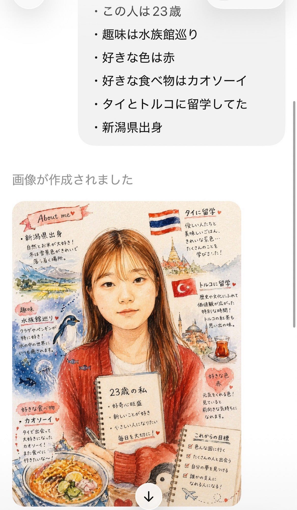
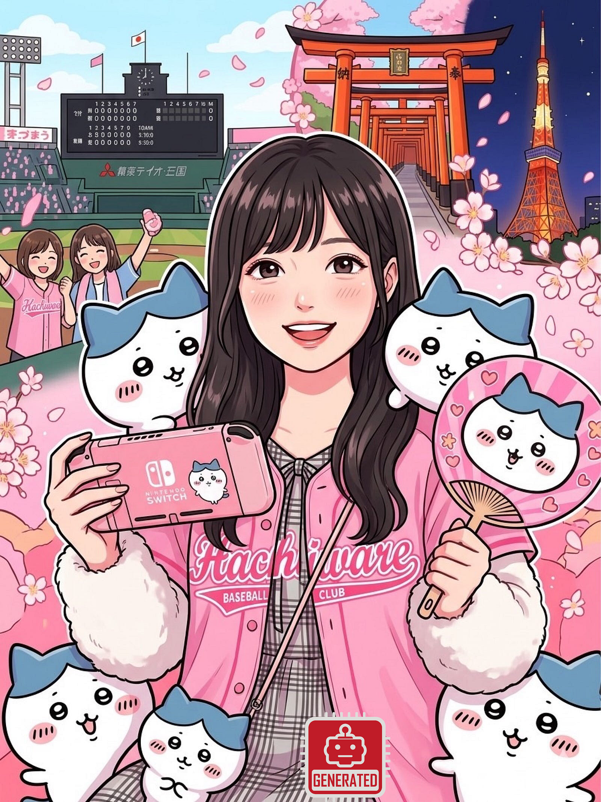
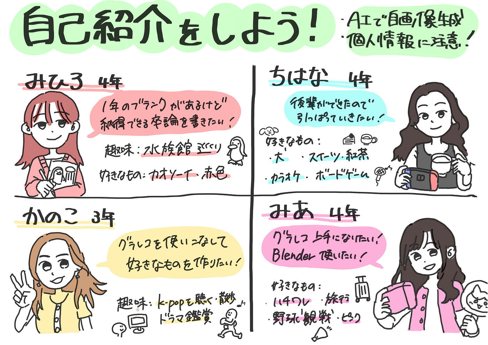

### **[初めまして!デザイン部週報]**

みなさんこんにちは！お久しぶりです！👋

1年のトルコ留学から帰国しました4年の滝沢です！🇹🇷

今年度もデザイン部として1年活動することとなりました！何卒よろしくお願いします☺️

昨年度のメンバーとは変わりまして、2026今年度は以下の4人のメンバーで活動します！今回は初回のデザイン部としての週報なので各々自己紹介をしてもらいました！単なる自画像と自己紹介の文章ではなく、より**リアルにその人の特徴捉えるため、AIに自画像の生成をお願いしました！**

以下のポイントで自己紹介をしてもらいます！

💡自**己紹介のポイント💡**

- 生成AIによって自画像を作成してもらう

- 自分の顔写真を生成AIに投げ、自分の趣味や特技、など自分の特徴を自由にAIに指示する

- Mediumに記事を投稿するにあたり、個人が特定できるような細かい情報は書かない

- 使用した生成AIのツールと使用した日時を記載する

- 生成した画像にはAI Generated のアイコンを埋め込む(これはちはなちゃんがやってくれました!)

例

自分の特徴(好きな色、趣味など)を投げる⇨AIを自画像を生成してくれる！

▶︎自己紹介

①滝沢

学年: 4年(1年休学してました)

名前: 滝沢未広(たきざわみひろ)

趣味: 水族館巡り

好きなもの:カオソーイ、赤色

意気込み: 1年ブランクがありますが、2年間の集大成として自分の納得できる卒論を完成させたいです！

似顔絵作成時の指示:

「この顔写真を元に、自画像を生成して。この人は23歳、趣味は水族館巡り、好きな色は赤、好きな食べ物はカオソーイ、タイとトルコに留学してた、新潟県出身」

②藤原

学年: 3年

名前: 藤原かのこ

趣味: k-popを聴くこと、散歩、ドラマ鑑賞

意気込み: いつかグラレコを使いこなせるようになって自分の好きなものを作るです！

似顔絵作成時の指示:

「この人は21歳日本人で、k-popの音楽が好きで特にRIIZE っていうグループが大好き💖他にも食べることも大好きで大食い！アクティブなことも好き！色は黄色とかパステルカラーの明るい色が好き！」

③臼井

学年:4年

名前: 臼井千瑛（うすいちはな）

意気込み:今年は学年が上がって３年生が新しく入って来たので、デザイン部でも今年は引っ張る側として頑張りたいです！

似顔絵の作成経緯:

好きなもの（以下）の要素を含めて似顔絵を出力しました。

・犬（写真を提示）

・ゲーム（Switch、PCゲーム最近スレスパ2にハマっているのでタイトル画面を提示）

・食べ物（最近は紅茶にハマっている、美味しいスイーツと一緒に紅茶を飲むのが好き）

・カラオケ（ヒトカラで歌いまくると気分がスッキリする）

・ボードゲーム（ボドゲカフェとか行きます）

④小崎

学年:4年

名前: 小崎実亜(こざきみあ)

意気込み:去年はドローンとyouthに入っていて、せっかくならやったことないサークルに入りたかったので今年はデザインに入りました！グラレコとか上手に書けるようになりたいです。個人的にはBlenderを趣味で触ったことがあるので何か作りたいなと思います。

似顔絵作成時の指示:「この人は21歳日本人で、ハチワレというちいかわのキャラクターが大好きで、ぬいぐるみを沢山集めています。野球観戦も趣味です。他には、Nintendo Switchをよくやっています。あとは、友達と旅行に行くことも好きです。色はピンクが好きです。」

**▶︎生成AIで似顔絵を作成した感想(**滝沢)

想像以上に特徴を捉えた可愛らしい似顔絵で、とても良かったです。ゼミ生が多く覚えるのが大変ですが、この似顔絵のおかげで一人ひとりの印象が残りやすくなった、、？かな？☺️このメンバーで1年間デザイン部として活動していくのが楽しみです〜✨🙇‍♀️

#### **グラレコ**

グラレコはちはなが書いてくれました！とても上手ですね☺️
