## 山ッ部⛰️ Hike or Die

こんにちは！

四年の本吉です。

今回は前々から決めてあった計画を実行に移してきたのでそれを自慢します。

### 出発

僕が4：30に家を出て湯口さんの家まで行き、そこからみんなを拾いながら山を目指します。今回は湯口さん、リト、ショータ、アキラ、留学生のダンテで向かいます。

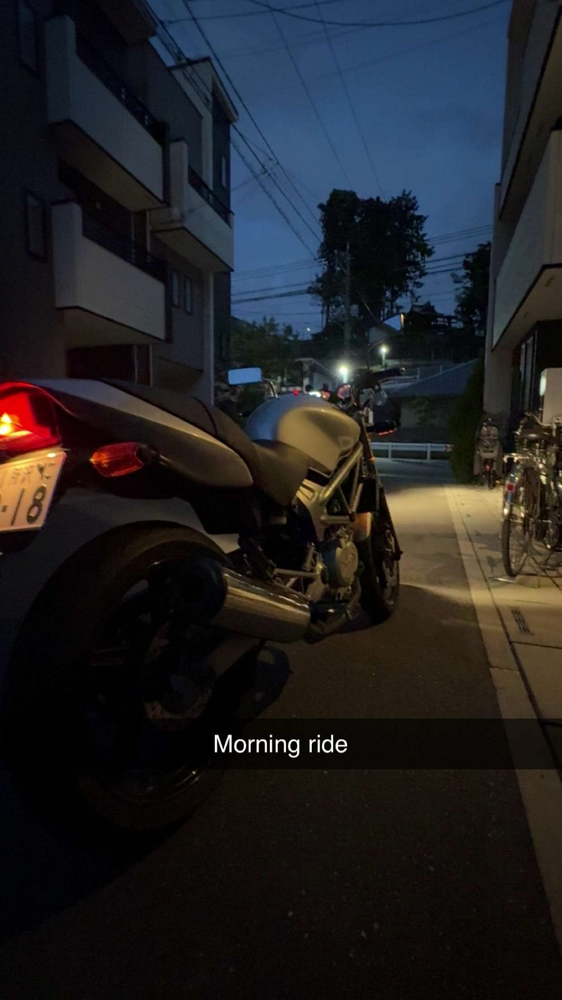

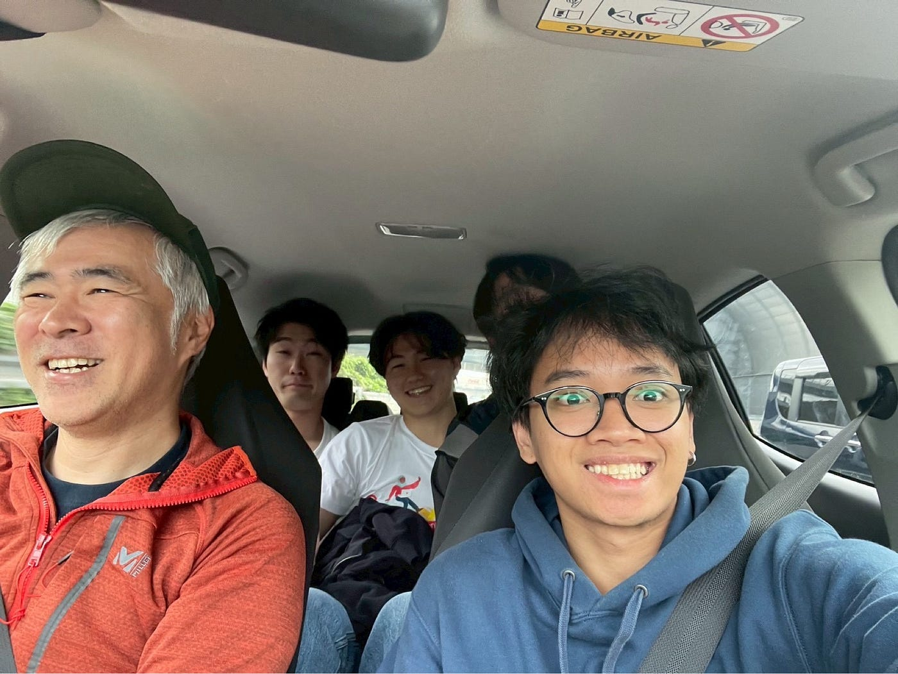

### いざ、登山⛰️

今回登る山は塔ノ岳。塔ノ岳は神奈川県の丹沢山地にある標高1,491mの山です。表丹沢の最高峰です。山頂からは富士山や相模湾を望めます。

桜が咲いている道を登ります。登山口で拾った良さげな枝を手にして、ショータ君もゴキゲン🎵です。

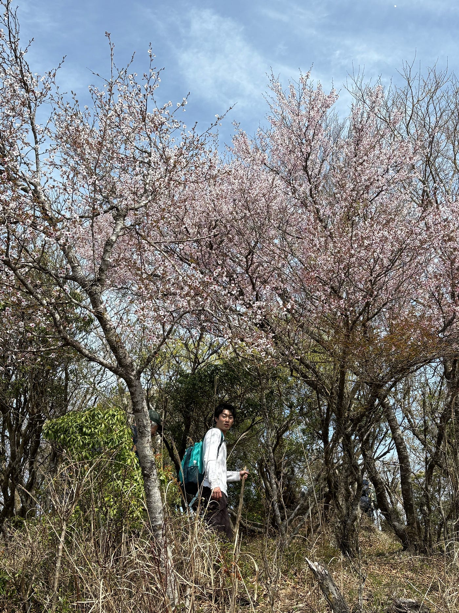

尾根沿いに歩きます。チェックポイントはニノ塔、三ノ塔、烏尾山、行者ヶ岳、政次郎の頭、新大日、木ノ又大日と非常に多く、基本的に丹沢山系を見下ろしながら歩くことができるので気分はとてもいいです。

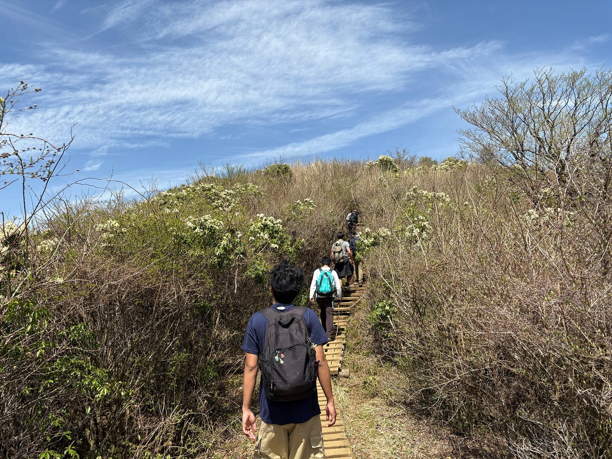

鎖場も多く、斜面も急な箇所が多く、登りがいのあるコースに苦戦します。

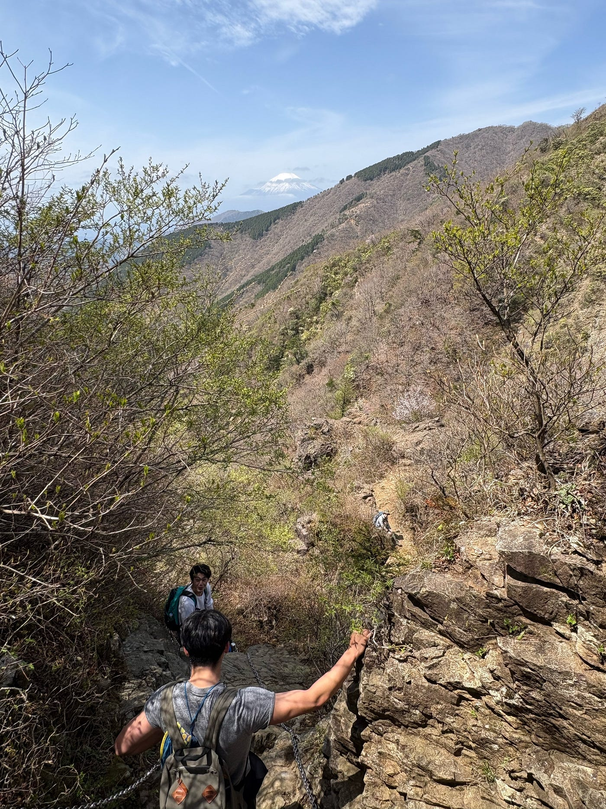

時間が経つにつれ、雲が薄れて富士山が顔を出し始めました。やる気が出る！

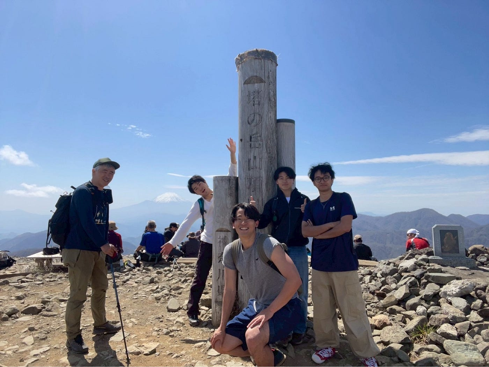

そして遂に山頂へ！すごく眺めがいい！

足はプルプルですがとても気持ちいいです。湯口さんの教えでハムケツを使いながら登ろうとみんなが意識する中、リトは脚力がありすぎてふくらはぎだけでひょこひょこと登りました。

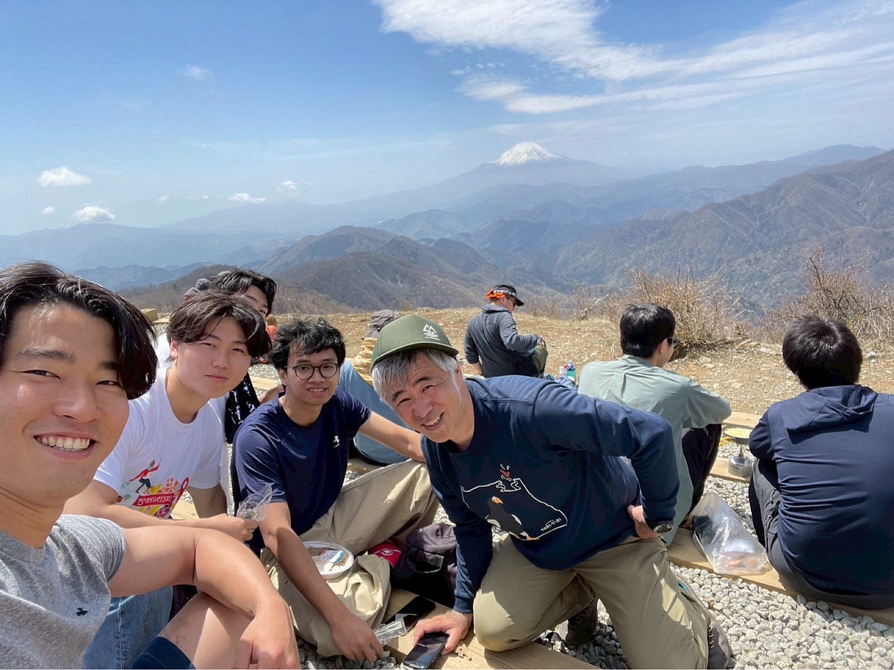

山頂でご飯も食べました。

さて、残るは下山だけです。複数の山を通ってきたので下だけではなく登りももちろんありますが、それでもかなりのペースで降りることが出来ました。

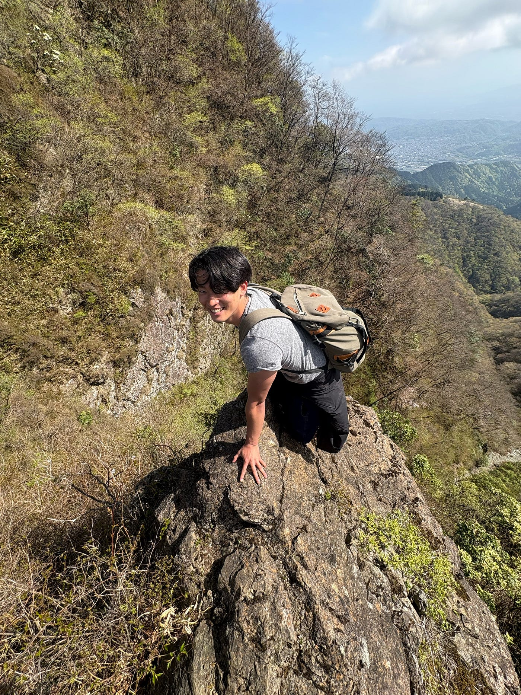

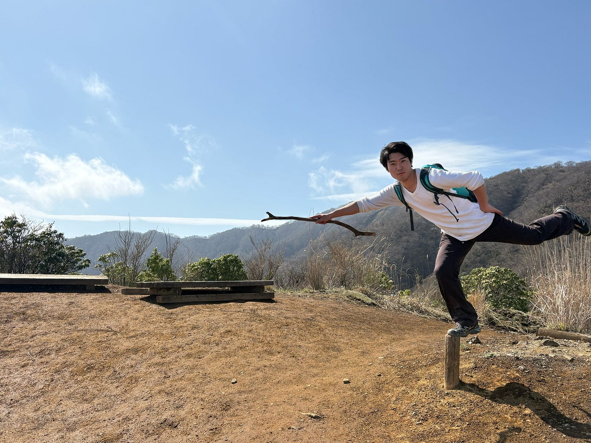

楽しかったね！

そして無事下山。

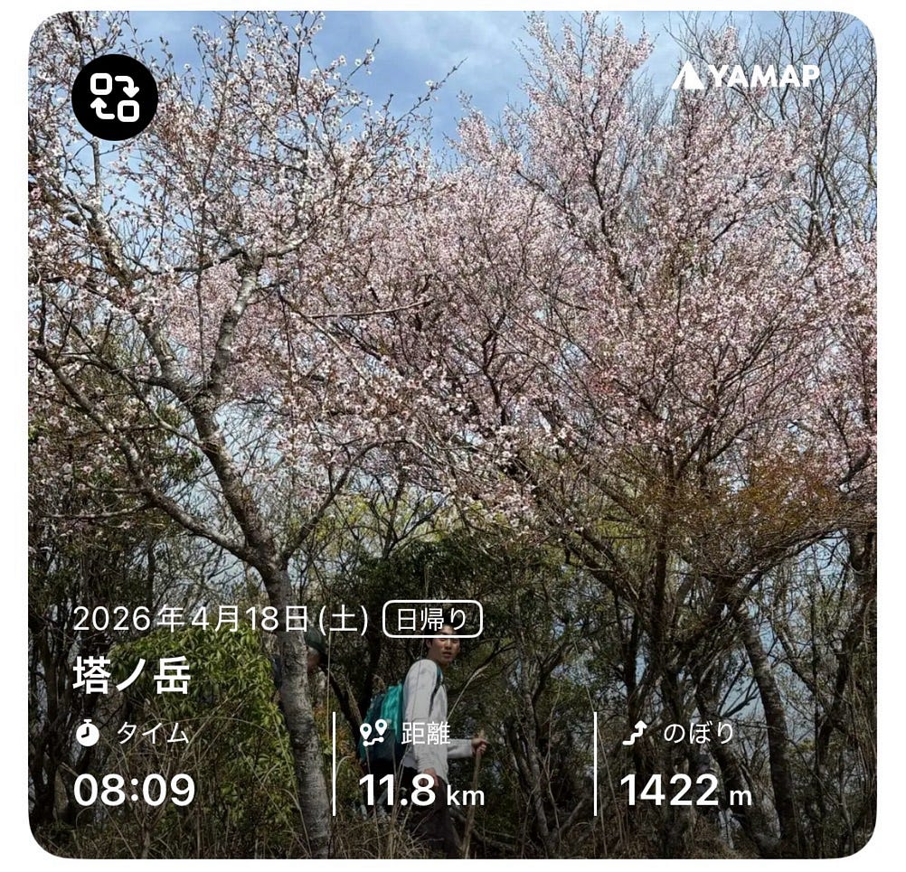

[https://yamap.com/activities/47537310](https://yamap.com/activities/47537310)

なかなかのハイペース登山だったため、予定より遅く出発して早く下山することが出来ました。

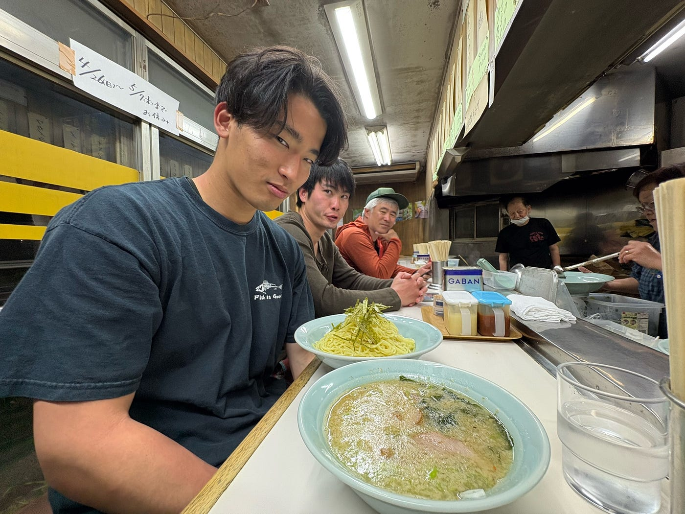

最後は温泉とラーメン。温泉が恥ずかしいダンテも強制同行です。

ハードではありましたが、とてもリフレッシュできた1日でした。

### おつかれ山‼︎

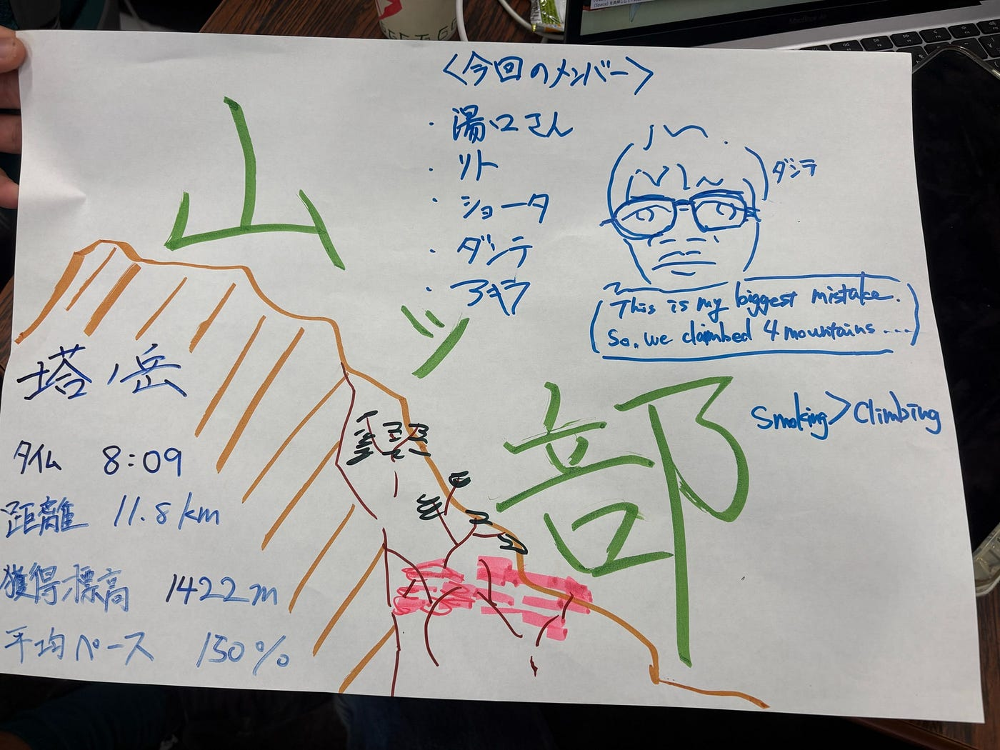
