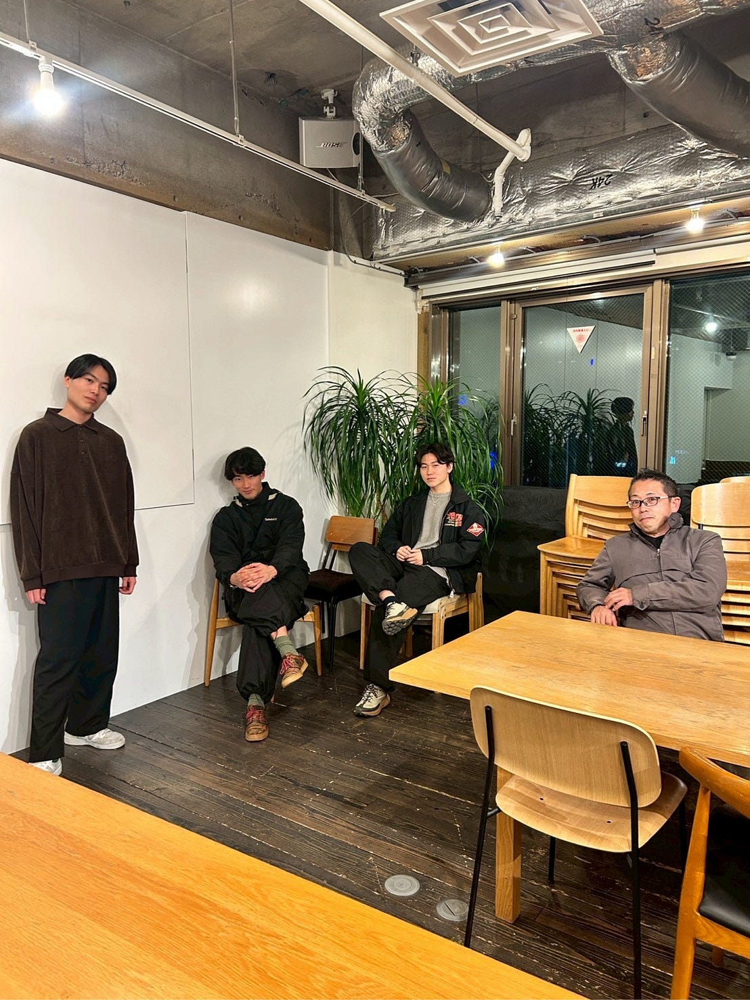
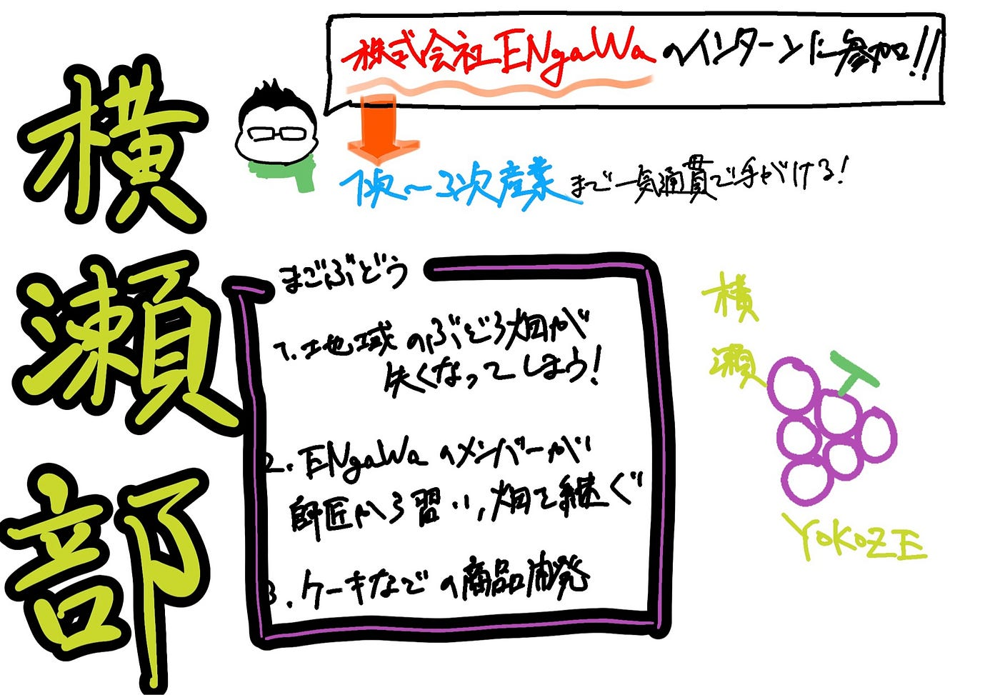

## 横瀬部始動！【横瀬部　週報】

こんにちは。4年になりました本吉です。これまで事あるごとに横瀬にいっていた我々ですが、遂に正式に部として始動することになりました。今回はこの部が一体何をするのかについて説明していこうと思います。

### 一体何をするのか

主に我々の活動は以下のとおりです。

- 横瀬での町おこしインターン

- 横ラボ大会議への提出

- A_Sta.Baへのガチャガチャ

今週はこの中からインターンについて前提知識を調べてみました。

### インターンについて

> [横瀬町では地域に新たな経済循環を生み出すことを掲げる地域商社「株式会社ENgaWA」で地域おこし協力隊と一緒に活動していただける地域おこし協力隊インターン生を募集しています。](https://www.iju-join.jp/cgi-bin/recruit.php/9/detail/61278)

これは「日本一チャレンジする町」「日本一チャレンジする人を応援する町」を掲げて、横瀬町の地域復興を促進する活動の一環です。

### 株式会社ENgaWA

そんなインターンを募集している株式会社ENgaWAとはどんな会社なのでしょうか。簡単に調べてみました。

> １次産業（農林業）⇒２次産業（農産物加工・商品開発）⇒３次産業（販売・体験・店舗運営）を一気通貫で手がける、いわゆる6次産業化に取り組んでいます！！

具体的な内容としては以下のとおりです。

> ◆1次産業：ぶどうやお米、野菜、メープル採取など

> ◆2次産業：ジャムなどの商品化・農産物加工

> ◆3次産業：店舗運営、体験ツアー、イベント出店、PRなど

引用:[https://www.iju-join.jp/cgi-bin/recruit.php/9/detail/20519](https://www.iju-join.jp/cgi-bin/recruit.php/9/detail/20519)

実例紹介します。

#### まごぶどう🍇

秩父・横瀬町で85歳の農家さんが引退を考え、消えかけていたブドウ畑。

そこへ「地域の味を守りたい！」と、地元の若者たち（ENgaWA）が立ち上がりました。

四苦八苦しながらも、師匠の指導を受けて立派なブドウが収穫。孫世代の愛が詰まった「まごぶどう」として見事に復活を遂げました。

さらに、形が不揃いな実も無駄にしないよう、温泉道場とコラボして「湯あがりミルクチーズケーキ（ぶどう味）」を開発！

参考: [https://chichibu.keizai.biz/headline/543/](https://chichibu.keizai.biz/headline/543/)

#### 活動内容

主な事業内容は四つです。

- 1農作物の生産・商品企画・製造・販売

- 店舗経営

- イベント企画、交流拠点の運営

- 地域プロジェクト

店舗経営の中にはAshigakubo_StationBase(通称A_Sta.Ba -アスタバ-)という無料休憩所もあります。そしてそこはまさしく！我々が武甲山のガチャガチャをおこうとしようとしている場所であります。

今回我々が参加を考えているインターンはこの地域プロジェクトの一環です。

以上が株式会社ENgaWAの概要になります。

### 関係ない写真

ここまで週報を書きましたが、写真がなくてつまらなかったのでここで写真を入れて華を添えます。

### 今日の俳句

去年より

横瀬で沢山

遊びたい

### グラレコ

