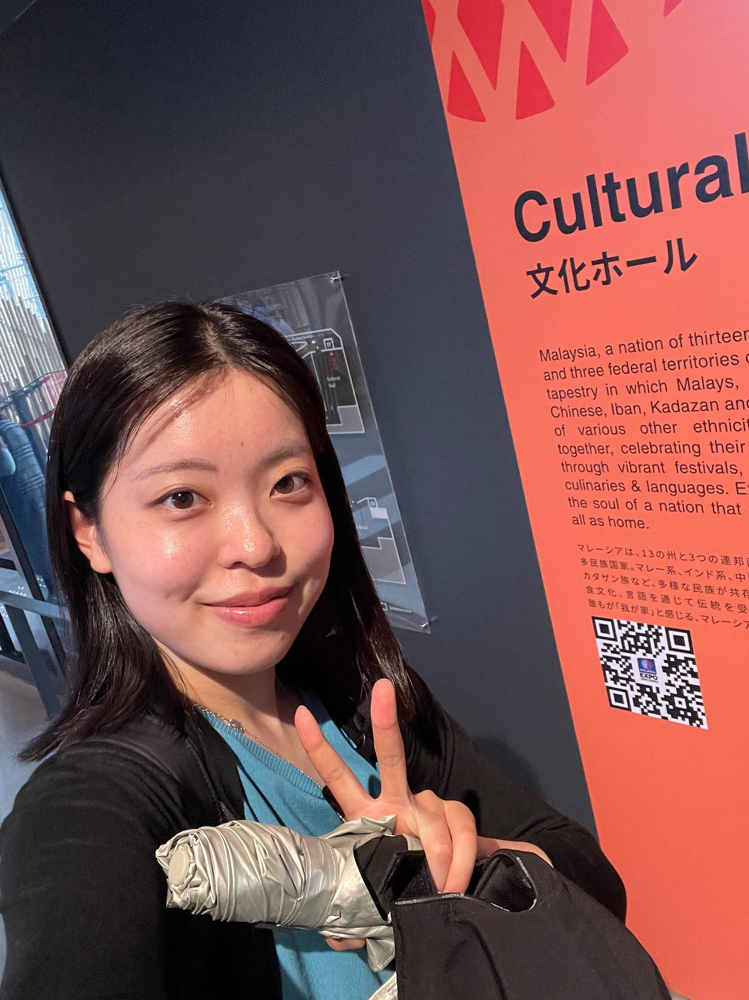
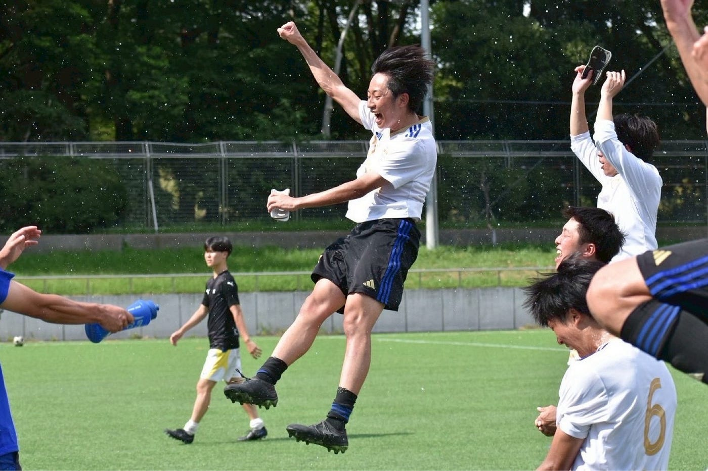
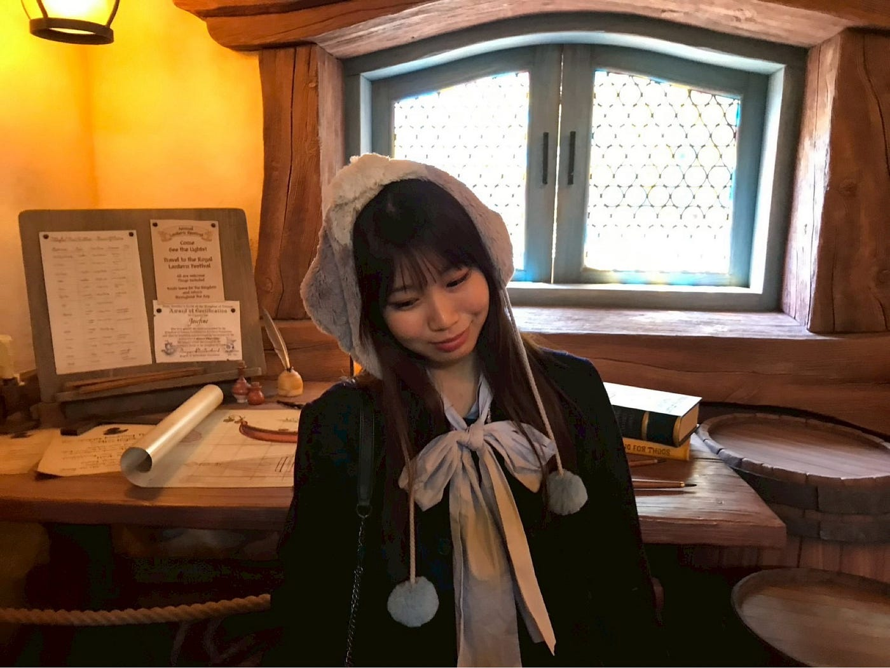
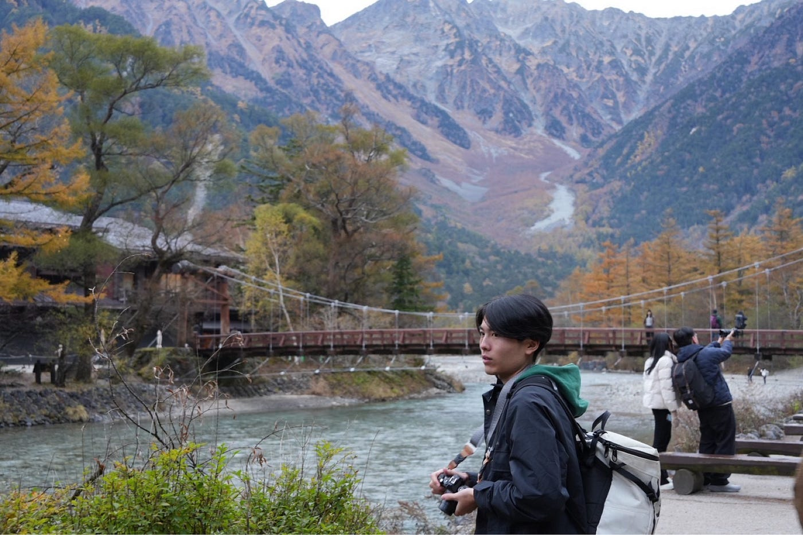
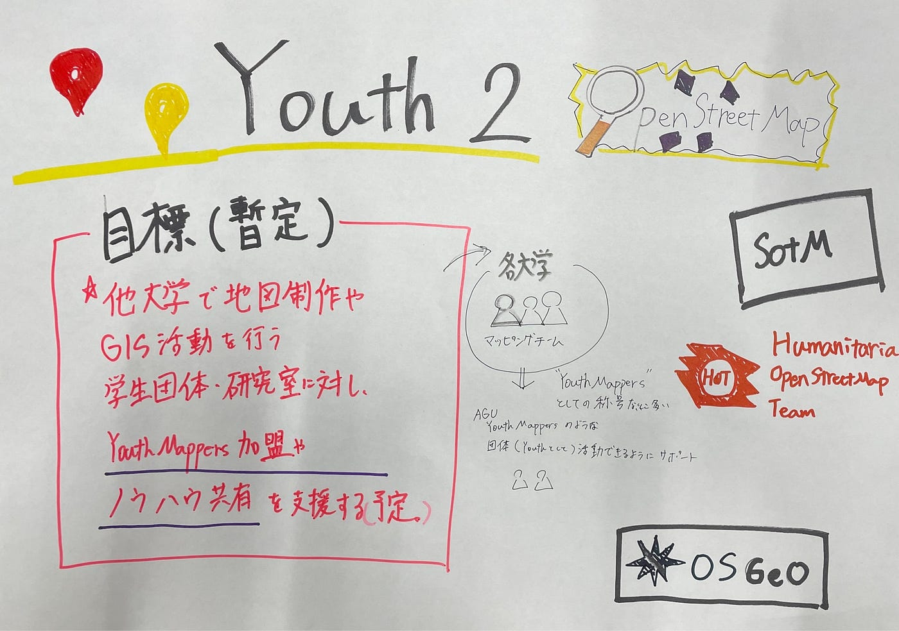

### Youth2自己紹介

こんにちは！！Youth2の4年生佐藤愛妃です！

ことしのチームメンバーを紹介していきます。

目標はグラレコでまとめています。よろしくお願いいします！

#### 佐藤愛妃

・大切にしていること

【大切にしている時間】

自由な時間 海外に行ったり、好きなことをしたり

【大切にしている言葉】

チャレンジ

【ペットや家族について】

兄弟なし、ひとりっこ

【ちょっとしたこだわり】

寝るときは必ず左向き

・影響をうけたもの

【本】

Stephen Curyの自伝

【映画】

ロッキー

【漫画】

あしたのジョー

【アニメ】

スラムダンク

【スポーツ】

格闘技・バスケ・サッカー

・好きなもの

【好きな食べ物】

ふぐ

【旅先】

どこか

【色】

黒

【動物】

ライチョウ

【スポーツ】

格闘技・バスケ・サッカー

【休日の過ごし方】

旅

・知っておいてほしいこと

【高校・大学の部活・サークル】

バスケ部（高校まで）

【得意な作業】

特になし

【苦手な作業】

単純作業（リフレッシュできればいい）

【できれば控えたい話題】

ないかなー

【自分とやりとりするときに知っておいてもらえるとうれしいこと】

・古橋研究室内の目標、やりたいこと

国家資格の申請をさぼってやってなかったので、急いでやります

大学院受からないとやばいので、研究進めてます

・ゼミ論研究テーマ(現時点で書ける人のみ)

UNVTportable

・自由記述

よろしくお願いいたします

#### 井上連成

・大切にしていること

【大切にしている時間】　家族､友達と話す時間

【大切にしている言葉】　“おかげさまで”

・好きなもの

【好きな食べ物】　寿司､春巻き､チキン南蛮

【映画】　ナイトミュージアム

【動物】　圧倒的に犬🐶

【スポーツ】　サッカー

【休日の過ごし方】　サッカー観戦と御朱印集め

・知っておいてほしいこと

【高校・大学の部活・サークル】　サッカー部､大学は青山学院大学理工サッカー部（青理）

【得意な作業】　1人じゃなくて誰かと一緒に作業すること

【苦手な作業】　手先の器用さが求められる作業

【自分の取り扱い注意ポイント】　合宿の2日目とかはテンション下がり気味ですが､そっちの方が通常運転なので気にしないでください。

・古橋研究室内の目標、やりたいこと

今年はこれを達成しました‼︎って何か１つ言えるようにしたい

・自由記述

みんなで協力しながら､最高の1年にしていきましょう‼︎

あと､今年の合宿でも本場のチキン南蛮作ろうと思うのでぜひ食べてください🙏

#### 加藤麗杏羅

【名前の由来】　美しく優しく、良いご縁に恵まれるように

【出身地】　神奈川県

【出身高校】　神奈川学園

・大切にしていること

【大切にしている時間】　散歩

【大切にしている言葉】　一期一会

・好きなもの

【好きな食べ物】　うに

【映画】　トイストーリー

【動物】　ねこ🐈

【スポーツ】　バレーボール

【休日の過ごし方】　バイト、友達とごはん

・知っておいてほしいこと

【高校・大学の部活・サークル】　中高バレーボール部のマネージャーやってました！

【得意な作業】　地道な作業

【苦手な作業】　マルチタスク

【自分の取り扱い注意ポイント】

ちょっと人見知りなので、最初は静かですが慣れると多分よく話します。

・古橋研究室内の目標、やりたいこと

国際会議やキャンプとか新しいことに少しずつ挑戦していきたいです！

・自由記述

1年間、皆さんと協力しながら頑張りたいです！よろしくお願いします！

多分船の免許取れたので山だけじゃなくて海も行きましょう！笑

#### 加藤祐大

【名前の由来】神様に見守られ、心の広い人になれるように

【出身地】神奈川県相模原市

【出身高校】相模原弥栄高校（淵野辺駅から徒歩20分）

・大切にしていること

【大切にしている時間】音楽を聴く、音楽をする

【大切にしている言葉】迷ったら心躍る方へ

・好きなもの

【好きな食べ物】トマト🍅

【音楽】ONE OK ROCK中心に邦ロック大好き人間です🎸

【動物】圧倒的にねこ🐈

【スポーツ】サッカー

【休日の過ごし方】バイト（ライブとかのイベントスタッフしてます！）ライブ鑑賞、スポーツ観戦、たまにカメラ

・知っておいてほしいこと

【高校・大学の部活・サークル】高校は軽音楽部でベースをやってました！サークルには入ってませんが今でも一人で永遠とベースを弾いてます！

【得意な作業】縁の下の力持ちな作業

【苦手な作業】単純な作業

【実は〇〇】こう見えて実は熱い気持ちを持ってたりする

・古橋研究室内の目標、やりたいこと

学生生活最後の一年なので、研究室をフル活用してやりたいこと全部やります！卒論完成させる！

・自由記述

僕といえば相模原。相模原といえば[Alexandros]。今年も[Alexandros]が相模原でフェスをやるみたいです。去年はチャリで行きました。今年もチャリで行く予定です。ちなみに僕の大尊敬する[Alexandros]のボーカル川上洋平さんは高校、大学の先輩です。

ただの音楽バカな相模原市民なので邦ロック好きな方、音楽に熱い情熱を持っている方、相模原市民、一緒に語り合いましょう。

#### グラレコ

