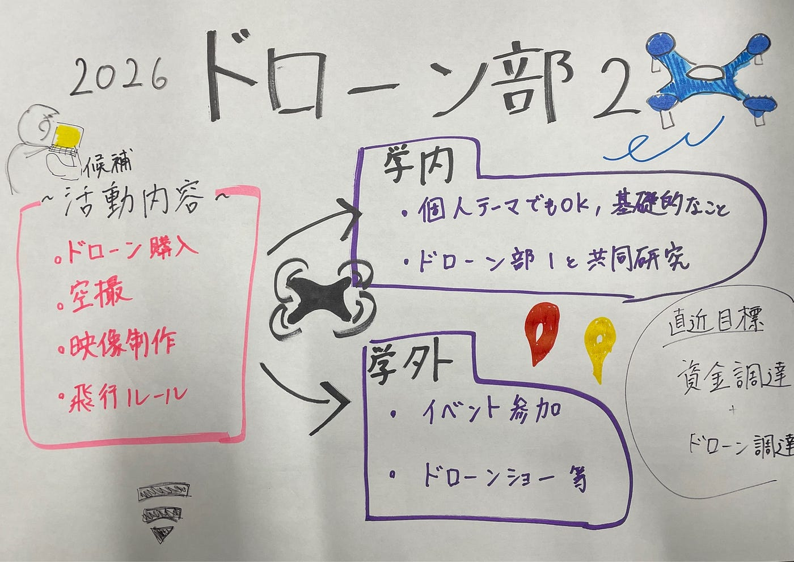

### 自己紹介ドローン部2

こんにちは、ドローン部4年生の佐藤愛妃です。

今年のドローン部メンバーを紹介します！

#### 愛妃

・大切にしていること

【大切にしている時間】

自由な時間 海外に行ったり、好きなことをしたり

【大切にしている言葉】

チャレンジ

【ペットや家族について】

兄弟なし、ひとりっこ

【ちょっとしたこだわり】

寝るときは必ず左向き

・影響をうけたもの

【本】

Stephen Curyの自伝

【映画】

ロッキー

【漫画】

あしたのジョー

【アニメ】

スラムダンク

【スポーツ】

格闘技・バスケ・サッカー

・好きなもの

【好きな食べ物】

ふぐ

【旅先】

どこか

【色】

黒

【動物】

ライチョウ

【スポーツ】

格闘技・バスケ・サッカー

【休日の過ごし方】

旅

・知っておいてほしいこと

【高校・大学の部活・サークル】

バスケ部（高校まで）

【得意な作業】

特になし

【苦手な作業】

単純作業（リフレッシュできればいい）

【できれば控えたい話題】

ないかなー

【自分とやりとりするときに知っておいてもらえるとうれしいこと】

・古橋研究室内の目標、やりたいこと

国家資格の申請をさぼってやってなかったので、急いでやります

大学院受からないとやばいので、研究進めてます

・ゼミ論研究テーマ(現時点で書ける人のみ)

UNVTportable

・自由記述

だれか、一緒に化石堀に行きましょう。

[https://github.com/akidinosaurs](https://github.com/akidinosaurs)

#### 麗杏羅

初めまして！ドローン部の加藤麗杏羅（かとうれあら）です！

・大切にしていること

【大切にしている時間】

毎日のお散歩

タイでほぼ毎日散歩してたら日課になってました。音楽聞きながら歩くの好きです！

【大切にしている言葉】

一期一会

【ペットや家族について】

意外にも三人兄妹の真ん中で、猫ちゃん2匹います🐈3人と2匹で大賑わい

【ちょっとしたこだわり】

極寒でも飲み物はアイスがいい‼️

・影響をうけたもの

【本】

最後に読んだ本も覚えていない

【映画】

トイストーリー

【漫画】

進撃の巨人

【アニメ】

フルーツバスケット

【スポーツ】

バレーボール

・好きなもの

【好きな食べ物】

うに

【旅先】

北海道

【色】

ピンク

【動物】

猫

【スポーツ】

バレーボール

【休日の過ごし方】

バイト、友達と遊びに行く！

・知っておいてほしいこと

【高校・大学の部活・サークル】

中高バレーボール部のマネージャーやってました！

【得意な作業】

同じ作業を続ける

【苦手な作業】

マルチタスク

一つのことしかできません

【できれば控えたい話題】

ない

【自分とやりとりするときに知っておいてもらえるとうれしいこと】

たくさんかまってくれたら嬉しい☺︎

・古橋研究室内の目標、やりたいこと

ドローンについて学びつつ、国際会議やキャンプにも参加して、新しいことに少しずつ挑戦していきたいです！

・ゼミ論研究テーマ(現時点で書ける人のみ)

・自由記述

無事船の免許取れそうなので海行きましょう！

https://github.com/rea2610

#### 中川幸咲

・自己紹介

中川幸咲です！スキーが得意なので、いきましょー

・大切にしていること

【大切にしている時間】

ナイトルーティーン

【大切にしている言葉】

なんくるないさ〜

【ペットや家族について】

姉と妹に挟まれた5人家族

【ちょっとしたこだわり】

スマホを毎日洗浄しています

・影響をうけたもの

【本】

伊坂幸太郎作の小説

【映画】

国宝

【漫画】

NARUTO

【アニメ】

NARUTO

【スポーツ】

ソフトボール

・好きなもの

【好きな食べ物】

納豆卵かけご飯

【旅先】

埼玉

【色】

🟦

【動物】

トカゲ🦎

【スポーツ】

ソフトボール

【休日の過ごし方】

大食いする

・知っておいてほしいこと

【高校・大学の部活・サークル】

高校:ソフトボール部

大学:航空部

【得意な作業】

メッセージの即レス

【苦手な作業】

長時間の事務作業

【できれば控えたい話題】

ネガティブな話題

【自分とやりとりするときに知っておいてもらえるとうれしいこと】

たくさん褒めてください

・古橋研究室内の目標、やりたいこと

無人航空機操縦士資格取りたい🧑‍✈️

・ゼミ論研究テーマ(現時点で書ける人のみ)

未定

・自由記述

よろしくお願いします🙇

#### トモヤ

・自己紹介

初めまして、ドローン部のあいこうともやです!みなさんと仲良く活動していきたいです！よろしくお願いします！

・大切にしていること

【大切にしている時間】

音楽を聴く時間(宇多田ヒカル、m-flo、相対性理論、RADWIMPS、サカナクション、洋楽、hiphop)なんでも聴きます語りましょう

【大切にしている言葉】

頭のノートと心のノート

【ペットや家族について】

4人家族6歳上の兄、2匹の猫がいる

【ちょっとしたこだわり】

ビールはSAPPORO(札幌出身だから

・影響をうけたもの

【本】

FACTFULNESS

【映画】

余命10年

【漫画】

宇宙兄弟

【アニメ】

メジャー

【スポーツ】

野球、ラクロス

・好きなもの

【好きな食べ物】

とまと、たこやき、うどん、ラーメン

【旅先】

スウェーデン(ガムラスタン)

【色】

青

【動物】

絶対に猫、猫しかありえない

【スポーツ】

野球、ラクロス、サッカー

【休日の過ごし方】

好きな音楽聴きながらごらごろ

・知っておいてほしいこと

【高校・大学の部活・サークル】

小中で野球して高校はバド部で大学1年生の間だけ男子ラクロス部に所属してました

【得意な作業】

物を操作すること

【苦手な作業】

計算、論理立てて説明すること

【できれば控えたい話題】

NGなし

【自分とやりとりするときに知っておいてもらえるとうれしいこと】

人見知りで控えめだけど本当はみんなと話したい。話しかけられたらめっちゃ嬉しいです(´；ω；｀)

・古橋研究室内の目標、やりたいこと

ドローンを操作出来るようになりたい。QGISの勉強も将来使いこなせるように勉強する。なにか地元札幌に貢献できることをしたい。

・ゼミ論研究テーマ(現時点で書ける人のみ)

https://github.com/mapbytomoya

・自由記述

一人暮らしで自炊のレパートリー飽きてきたので会った時に適当にメニュー言ってくれたらとても助かります(?)

#### ユウト

自己紹介
初めまして、ドローン部、3年の渡辺優斗です

・大切にしていること

【大切にしている時間】
ご飯大好きで、一人暮らしで自炊よくするので、作る時間と食べる時間です

【大切にしている言葉】
「10秒数えたらやる」
怠惰すぎて課題や片付けなどが全然出来ないので、嫌でも10秒数えたら始めるに心がけています

【ペットや家族について】
三人兄弟の真ん中で姉と弟がいます。実家では犬を飼ってました、最近は猫を飼っているらしいです。

【ちょっとしたこだわり】
 家に誰もいなくても帰った時にただいまと言っています

・影響をうけたもの

【本】
勝海舟の伝記

【映画】
モンスターストライク THE MOVIE はじまりの場所へ

【漫画】
ハンターハンター

【アニメ】
スラムダンク

【スポーツ】
サッカー

【好きな食べ物】
サーモン

【旅先】
温泉街（雪降ってたらなおよし）

【色】
黒

【動物】
犬

【スポーツ】
サッカー

【休日の過ごし方】
スマホでゲームしています
音楽をずっと聴いています

・知っておいてほしいこと

【高校・大学の部活・サークル】
高校はバドミントン同好会ってので友達と遊んでました。ルールすら分かりません。
大学は1年の時だけジャグリングサークルに入っていましたが、やめちゃいました。

【得意な作業】
論理思考や正確さが求められるもの

【苦手な作業】
スケジューリングなど、自己管理が必要なもの

【できれば控えたい話題】
特になし

【自分とやりとりするときに知っておいてもらえるとうれしいこと】
初めは静かだけど仲良くなったら沢山話すので、話しかけてくれると嬉しいです

・古橋研究室内の目標、やりたいこと
ドローンの操縦うまくなって、資格をとる

・ゼミ論研究テーマ(現時点で書ける人のみ)
まだ決まってません

【Github】
[https://github.com/YutoKyoto](https://github.com/YutoKyoto)

・自由記述
夜勤たくさんしてるので、あまり喋らなかったら、疲れてるんだろうなと思ってください

グラレコ

