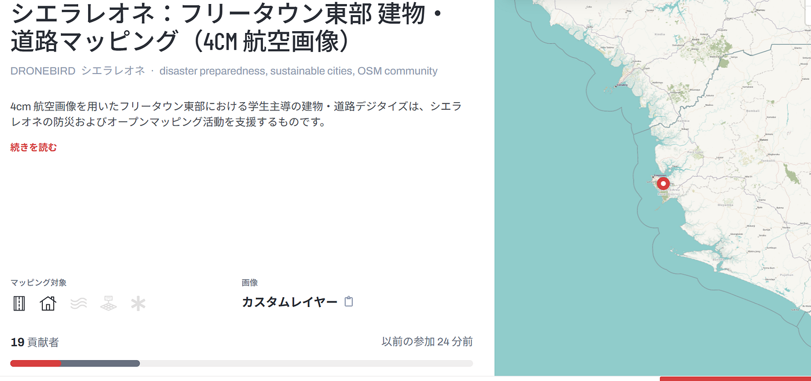
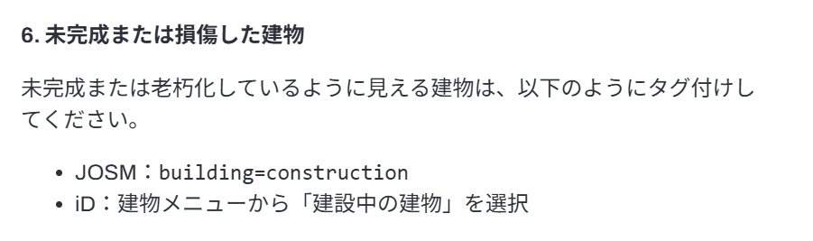
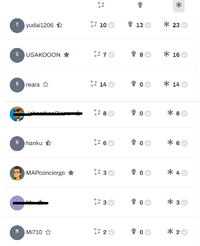
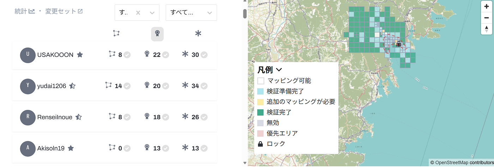
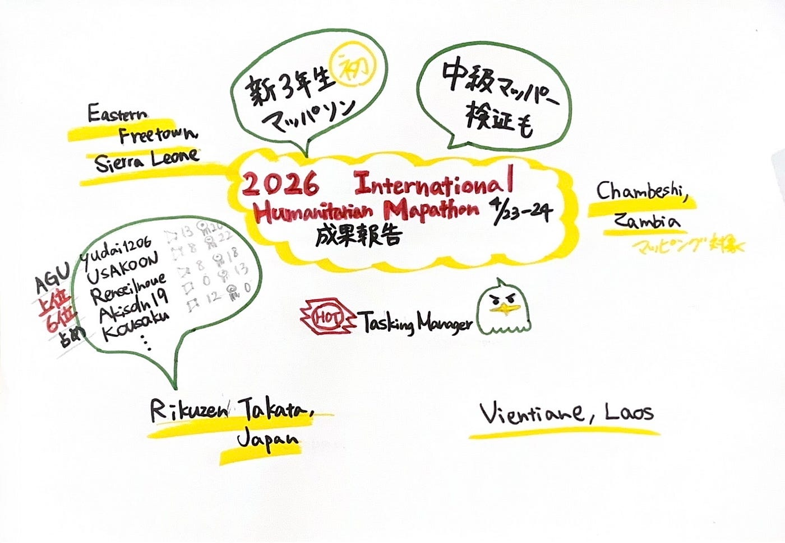

### 【Youth①】2026 International Humanitarian Mapathon取り組み報告

こんにちは。岡村です。
今回の週報では、4月23、24日行われた2026 International Humanitarian Mapathonに参加したので、その取り組みをまとめました。
The Map Challenge として二つ課題がありましたが、そのうちの一つ「Tasking Manager Project」に参加しました。

#### Tasking Manager Projectとは

[HOT Tasking Manager](https://tasks.hotosm.org/)を通して、クライシスマッピングを行い地図を整備するものです。

今回のマッピング対象は以下の４つでした。

・Rikuzen-Takata, Japan:
[#49143: 東日本大震災からの復興更新マッピング | 陸前高田市, 岩手県 — HOT Tasking Manager](https://tasks.hotosm.org/projects/49143)

・Vietiane, Laos:
[#44787: Vientiane Historic Core & Chao Anouvong Studium — Walkability & Inclusion — HOT Tasking Manager](https://tasks.hotosm.org/projects/44787)

・Easten Freetown, Sierra Leone:
[#44589: シエラレオネ：フリータウン東部 建物・道路マッピング（4cm 航空画像） — HOT Tasking Manager](https://tasks.hotosm.org/projects/44589)

・Chambeshi, Zambia:
[#48780: Zambia Floods response 2026: Chambeshi priority 2 — HOT Tasking Manager](https://tasks.hotosm.org/projects/48780)

Youth1としては、新3年生を迎え、初めてのマッパソンだったので、基本的な建物や道路のマッピングが多くできるシエラレオネを中心にやり方を確認しながらマッピングしました。

シエラレオネの特徴として、建設中or老朽化の建物が多く見られました。マッピング注意事項に記載の通り、適切なタグ付けを心掛けました。

#### Youthの貢献

Youthメンバーの中級マッパー勢は、マッピングに加え、検証も行いました。

#### 最後に

PadletにYouthメンバーの名前と集合写真を共有できいませんでした、、
加えて、「青学がマップした」というタグをつけ忘れている箇所が多々あります。これは反省です。

まだまだ、マッピングする箇所があるので、引き続き行っていきます！

