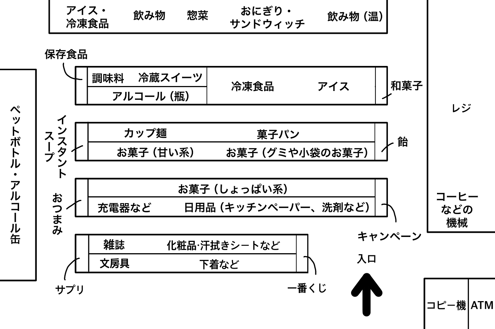
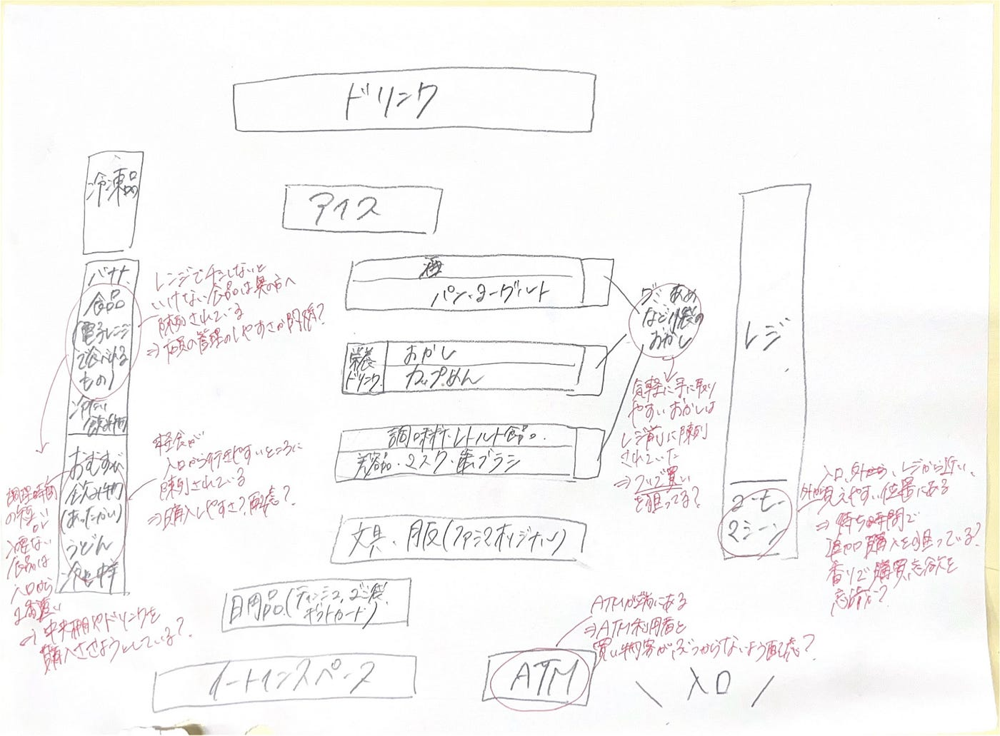
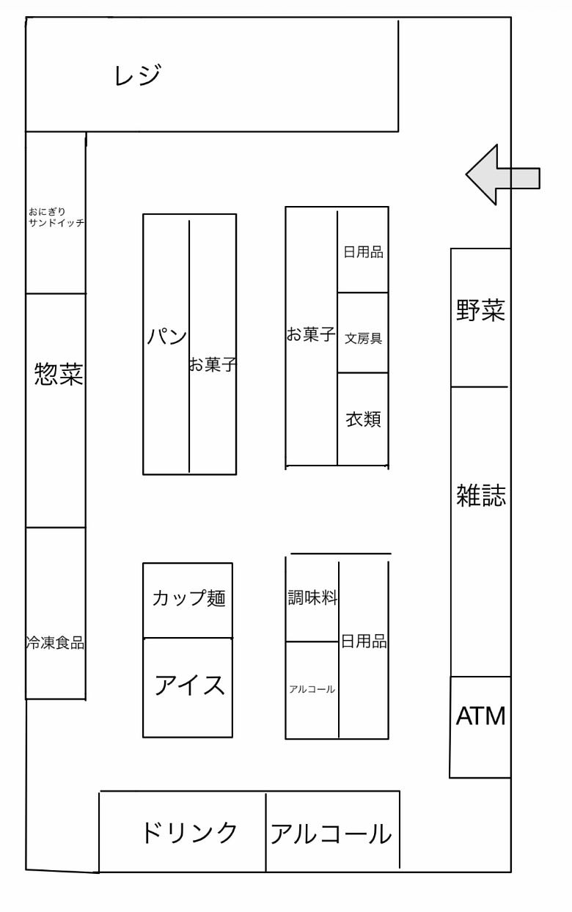
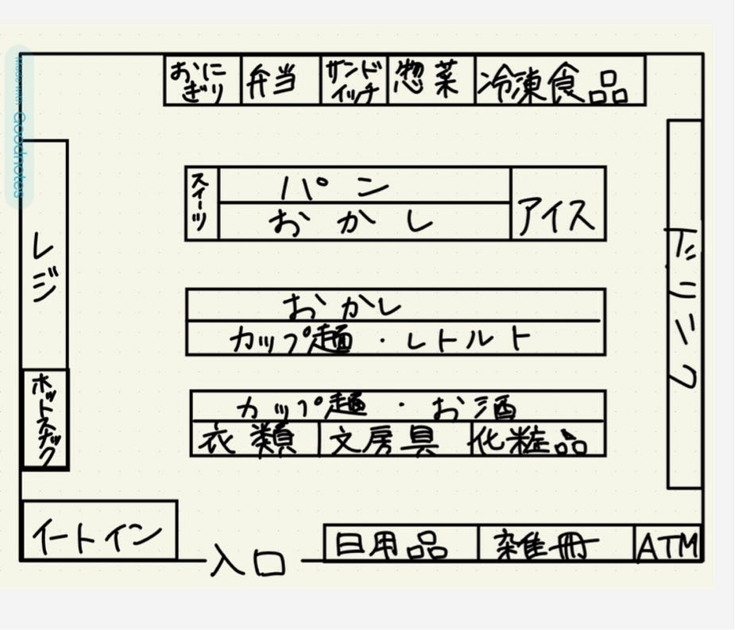

### コンビニの商品配置を観察してみた！【デザイン１週報】

こんにちは、臼井です。

今週、私たちはコンビニの商品配置を観察してみました。方法としては、それぞれコンビニに行き、何がどこに置いてあるか簡単に図に起こして分析をしました。今回はファミマで揃えて調査を行いました。

普段何気なく利用しているコンビニですが、お客さんが商品を見つけやすい工夫や、商品が売れやすい配置があるのではないでしょうか？

早速見ていきましょう！

**ちはな**

店内の商品配置を図に起こしたものがこちらです。

まず、入り口近くから見ていきます。入ってすぐのところには一番くじやコラボキャンペーンの商品が置いてあります。

これらは入ってすぐに見える位置に置くことで、これを目的としている人以外にも買ってもらいやすいという効果があるのかなと考えました。

また、レジ周辺には和菓子・飴・お菓子やアイスなどの商品があります。レジに並んでいる時などに目に入りやすい位置にあり、お会計前のプラス一品を狙っているように思えます。

店内全体を見ると、奥に食べ物・飲み物が多く配置されています。思えばコンビニに入るときは飲食物を買う目的で入店することが多い気がするので、その手前に雑貨などを置くことで目的の品以外にも必要なものにお客さんが気づきやすい＝買ってもらいやすいようにしているのかなと思いました。

コーヒーマシンがレジから入り口に向かう位置に配置されているのも含め、人の流れを考えて商品の配置を考えていることが今回の観察によって理解できました。

配置とは違った話になりますが、汗拭きシートなど夏に向けて商品を用意しているのかなという印章も受けました。また違う時期に調べたら発見がありそうです……！

**みひろ**

私は八王子アイロード店のファミリーマートに行きました。

この店舗の商品配置についての考察は以下の通りです。

① レジ前は“ついで買い”ゾーン

レジ前には、グミや飴、チョコなどの子袋に入ったお手頃価格のお菓子が配置されていました。

これは、会計前の「ついで買い」を狙っているのではないかと考えました。

②コーヒーが店に立ち寄るきっかけに

コーヒーマシーンが外から見える、レジ近くに置かれていました。これは、香りで購買意欲を刺激できる、会計やレジに並んでいるときにコーヒーの追加購入が起きることを期待しているのだと考えました。朝の出勤前にコーヒーを購入する人が多いかと思いますが、店の外からコーヒーマシーンが見えるので、客が購入しやすく、コンビニに立ち寄るきっかけになっていると思います。

③ATM利用者への配慮

図のように、ATMは端の方に設置されていました。これは、 ATM利用者と買い物客がぶつからないよう、邪魔にならないように配慮されているのではと考えます。また外から見えるため、防犯の効果もあるかと思いました。

④コンビニは“導線設計”の塊

今回のレイアウトから感じたのは、「目的の商品だけを買わせない」という工夫です。調理時間の短いまたはない、手軽に食べることができるおにぎりやスイーツ、ドリンクなどが入り口から１番遠い場所に陳列されていました。これは購入者に目的の商品だけを購入させるので半句、わざと歩かせ、購入するつもりのない商品を見せ、購買意欲をそそる効果があると考えました。これにより、自然に追加購入が起こるようになっています。

**みあ**

GWで実家に帰省していたので、実家近くのファミリーマート(世田谷成城通り店)へ行きました！

他の店舗と違う所は、入って1番近くに野菜が売られてる所です。スーパーのような形で野菜そのまま置いてありました。他にも、調味料や惣菜のコーナーの場所が広く取られています。

この配置になってる背景として、この店舗の周りは住宅街且つファミリー層が多い場所なので、料理する時に必要なものが置いてあるのかなと思いました。

**かのこ**

今回私は家の近くのファミリーマートへ行き、店内の配置を観察してみました。

まず、入り口からすぐ入って右側には日用品や雑誌、ATMの順番で配置されていました。ATMは比較的奥の方に配置されていました。

次に店の中央へ進んでいくと、カップ麺やレトルト食品、お菓子などの棚が3列並べられていました。また、ドリンクコーナーは店の奥側に配置されていました。

ATMやドリンクなどはコンビニを訪れる多くの人々の利用目的となっており、それらをあえて奥に置く配置になっているのは、店内を歩かせることにより、ATMやドリンクを利用または買うついでにプラスで他の商品を買うようにあえて新作商品やお菓子の棚近く、全ての商品棚を覗ける場所に配置するなど、その途中で他の商品も見てもらうという工夫を感じました。

またレジの横にはホットスナックが置かれ、ファミチキなどの揚げ物コーナーが広く取られており、「揚げたて」「50円引き」など大きく宣伝されていました。会計前に商品を見せることで、ついで買いを最後の最後まで行う工夫も見れました。

今回私が調査したのはファミリーマート亀戸6丁目店です。

いかがだったでしょうか？

今回コンビニの商品配置を観察してみて人の流れを重視して商品を置いている印象を持ちました。コンビニを運営する中で売り上げが上がるように、最適な位置になるように調整されてきたのではないでしょうか。

今回はファミリーマートに絞って観察を行ったので、他のコンビニも観察し、比較したら面白そうだと感じました！

#### **グラレコ**
