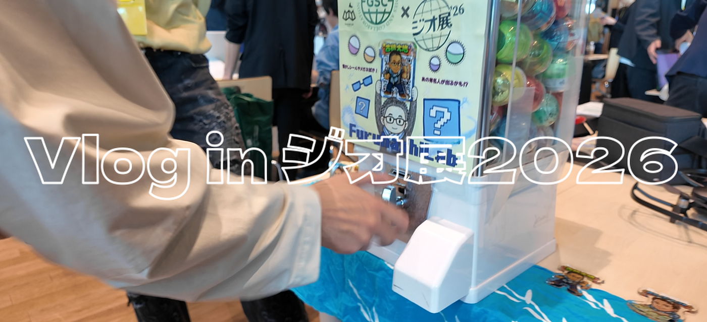
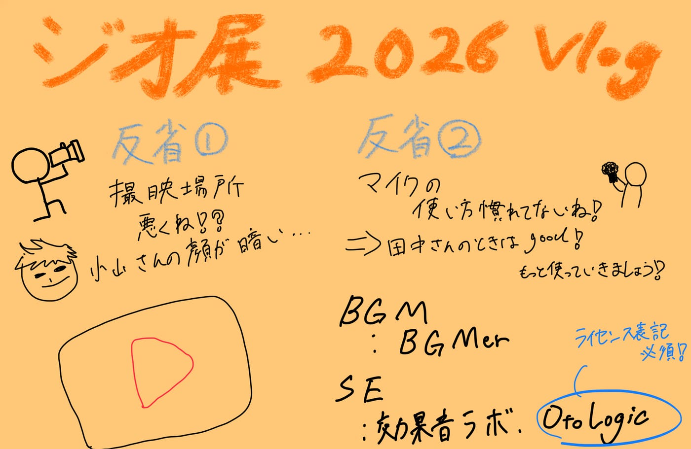

### ジオ展2026を動画にしてみたよ

ゾス！VFの荒川です。最近は、新しく動画編集のアルバイトを始めようと思い、いろいろ面接を受けています。なんかもしかしたらホストクラブのSNS担当をすることになるかもしれません。知らない世界過ぎてワクワクです。

ってことで今回は！VFらしくジオ展の日の様子をVlog動画にまとめてみました。いろいろと撮影の時点で反省点はあったのですが、まあ今年はPost or Dieを掲げているので、めげずに頑張ります。

#### 使用したBGM・SE

BGM：[BGMer](https://bgmer.net/)

SE：[効果音ラボ](https://soundeffect-lab.info/)、 [OtoLogic](https://otologic.jp/)

#### それぞれの利用規約

[BGMer](https://bgmer.net/terms) 、[効果音ラボ](https://soundeffect-lab.info/agreement/)、 [OtoLogic](https://otologic.jp/free/license.html)

BGMer、効果音ラボに関しては商用利用無料・クレジット表記必要なしですが、**OtoLogicに関してはクレジット表記が必須**となっています。正しく表記されていれば商用利用も可能です。

#### 撮影での反省点

> _撮影場所_

特に小山さんへのインタビューシーンで、顔が暗く映ってしまいました。ソフトで何とか調整を試みましたがやっぱ暗い！大反省です

> _マイクの使い方_

また小山さんのシーンで、なぜかマイク2つあったのに1つしか使わずに変な画になってます。恥ずかしい。そのあとの田中さんのシーンでは2つ使いました。やっぱあるものはフルで使います。

#### まとめ

（ゼミで発表できてるかな？）今年度投稿する最初の動画がジオ展という、なんとも古橋研らしいコンテンツになって良かったです。去年の活動で撮影にフォーカスを当てる機会が少なかったため、今回のような反省が生まれたかなと思います。今年はたくさん動画撮って投稿するので、その過程で撮影にもフォーカスを当ててもっと良い動画を発信できるように頑張ろう！

ps. VFのYouTubeアカウントなんだけど、アイコンどうしよう？誰かいい案あったら教えてーあとやっぱアイキャッチ的なのあった方がいいよね？作ろうか！

