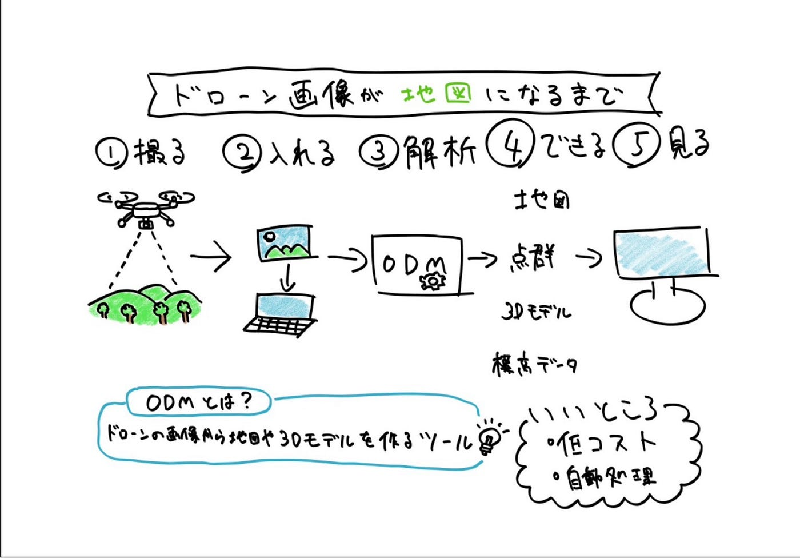

## ドローン部②週報ドローン撮影データのODM処理について

こんにちはドローン部3年の加藤です。

ドローン部の前期の目標が横瀬防災訓練でドローン撮影 → ODM処理→ QGISで確認という基本の流れを身につける！に決まりました！！

横瀬防災訓練まで1ヶ月前後なので、まずは基礎的な知識とドローンとGISがどこでリンクするのかインプットしていきます。知らない単語も多いので、週報を通して理解を深め用と思います。

ということで今回、ドローンで取得した写真データを ODM（OpenDroneMap） を使って処理する流れを確認しました。3年生だけでやってみました。

### Open Drone Mapとは

OpenDroneMap は、ドローンで撮影した複数枚の画像から、地図や3Dモデルを自動生成できるオープンソースの写真測量ツールです。

画像同士の特徴点を解析し、位置関係を計算することで、以下のような成果物を生成できます。

・オルソ画像（上空から真下を見たような地図画像）

・点群データ

・3Dモデル

・DSM / DTM（標高データ）

ODMは、撮影した画像を入力すると、自動的に解析・合成を行い、測量や地形確認に利用できるデータへ変換します。

### 処理の基本的な流れ

1、ドローンで対象エリアを撮影

2、撮影画像をPCへ取り込み

3、ODMへ画像を入力

4、画像解析・位置合わせを実施

5、地図データや3Dモデルを生成

という流れになります。

ODMはDocker環境で動作させるケースが一般的で、画像フォルダを指定して実行します。

### 特徴・メリット

オープンソースのため導入コストを抑えられる

自動処理で広範囲データを効率的に生成可能

3Dモデルや測量用データ作成に活用できる

Linux / Windows / Mac に対応

また、GUI版として「WebODM」も存在し、コマンド操作なしでも扱いやすい構成になっています。

最後にグラレコです。

参考：

OpenDroneMap公式サイト

OpenDroneMap GitHub

[（初心者むけ）OpenDroneMapを使ってDSMと点群データ（LAS形式）をつくる - Qiita
はじめに 目的 ドローン等の画像から、DSMや点群データを作成したいと思い、オープンソースソフトウェアのOpenDroneMapを使ってデータ作成の実験をしてみました。結果をここにメモします。…qiita.com](https://qiita.com/T-ubu/items/727f50b978031861ea02)
