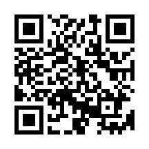
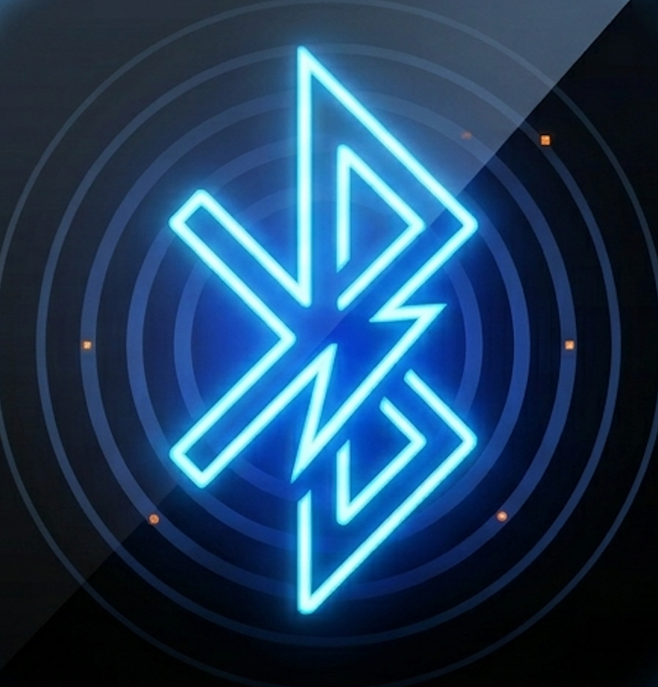
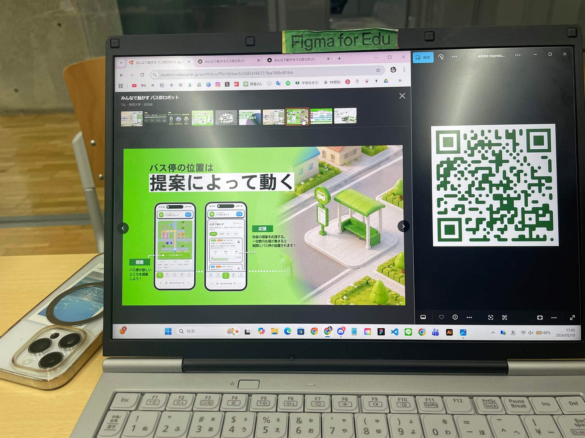
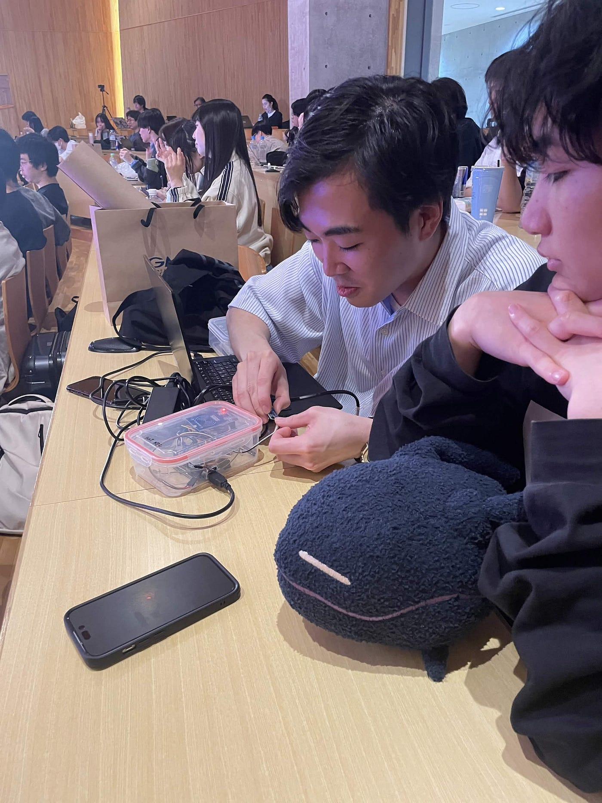
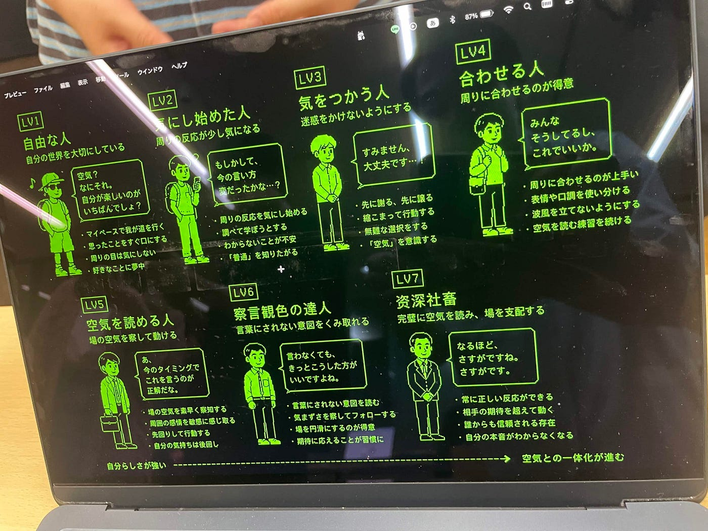
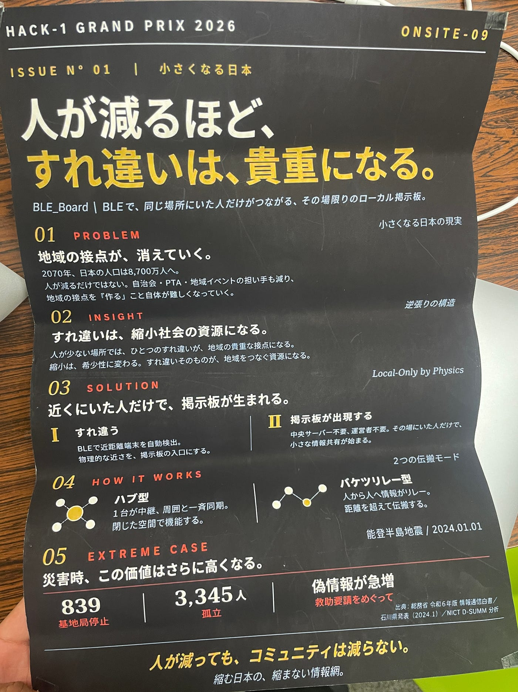

### ハッカソンに参加したよ

こんにちは！ドローン部１の山﨑です！今日は、日曜日まで参加していたハッカソンと作ったプロダクトに関して報告をしたいと思います。

### [Hack-1グランプリ](https://hack-1.com/)

参加したハッカソンは[Hack-1グランプリ](https://hack-1.com/)
デザイナーやエンジニアを志す学生が、1ヶ月かけてアプリ・サービスをつくるイベントです。勝てなかったので悔しい😭
一緒に参加している人なんて、残高-60万円で、優勝したら-10万円になるのにってキラキラしていた目をみると悲しくなっちゃう。
大会前は、終わったら焼肉を食べに行こうって言っていたのに、サイゼリヤでお疲れ様かいを開いて解散。

### BLE_Board

テーマ
**小さくなる日本**
こんなぼんやりしたテーマから各々作品を作っていきます。自分たちは小さくなる日本から、小さくなった場合に備えるプロダクトを作ろうってなりました。
小さくなる日本⇨人口減る⇨コミュニティ形成がしづらくなる⇨コミュニティを作れるようなものがあったら面白いんじゃね？
結構安直な思考でスタート

色々アイデアを出している際に、**すれ違い通信**みたいなアプリだったら、SNSとかの興味関心で繋がるようなコミュニティ形成から、場所で繋がるコミュニティを作れるんじゃないか！！となりました。

作ったものが
**BLE_Board**
Bluetoothで繋がることができる掲示板
Bluetoothで繋がることで何がいいって、災害とかで基地局が壊れて、ネットが使えないよーーってなっても、ローカルではあるが情報共有できる

#### **ハブ型**

1台の端末が掲示板の中心になる。
イベント受付、観光案内所、避難所などで、
周囲の人と情報を同期する。

#### リレー型

はいはい、、、ここでおそらく誰かが言うでしょう、Bluetoothって繋がる範囲はせいぜい数十メートルだから意味ないでしょって
そこで入れた機能がバケツリレー。

人が投稿を持って移動する。
すれ違った端末どうしが情報を渡し合い、
掲示板が少しずつ広がる。
中心端末がなくても広がる可能性がある。

ってことで下のQRコードから興味ある人はバケツリレーで実際にどのくらい通信距離が伸びたのかを見てください

一言で違いを言うならば！！

ハブ型：場所に情報を集める。
リレー型：人が情報を運ぶ。

って感じかな

#### 将来的にやってみたいこと

同じ会場に、フィジカルAIを搭載したバス停（みんなの意見で移動するバス停）を提案していたチームから着想をもらったのですが、このアプリをNFCタグやらなんやらで繋いで、地図上でどこの地域の情報が途絶えているかを可視化してバス停がそこまで動いて情報網を作ったら面白そうなんて話したり、ヘリコプターとかを使って被災地の上から、この機能が使えるボールを落としたらカッコイイなんて思ったり。でも現実的なのは、交通の標識とかにつけるとかなのかな。

色々とこれはどうやったの？っていう質問があると思いますが
企業秘密と私がチーム二人に比べて非エンジニアすぎて何言っているか理解しきれていないので勘弁してください。
もう少しこれを広げられたら広げたい

暇があったらハッキングの練習

今日はここまで

#### グラレコではなくポスター

下のポスターはチームの会話内容をClaudeに読み込ませてポスターを作ってもらいました。

