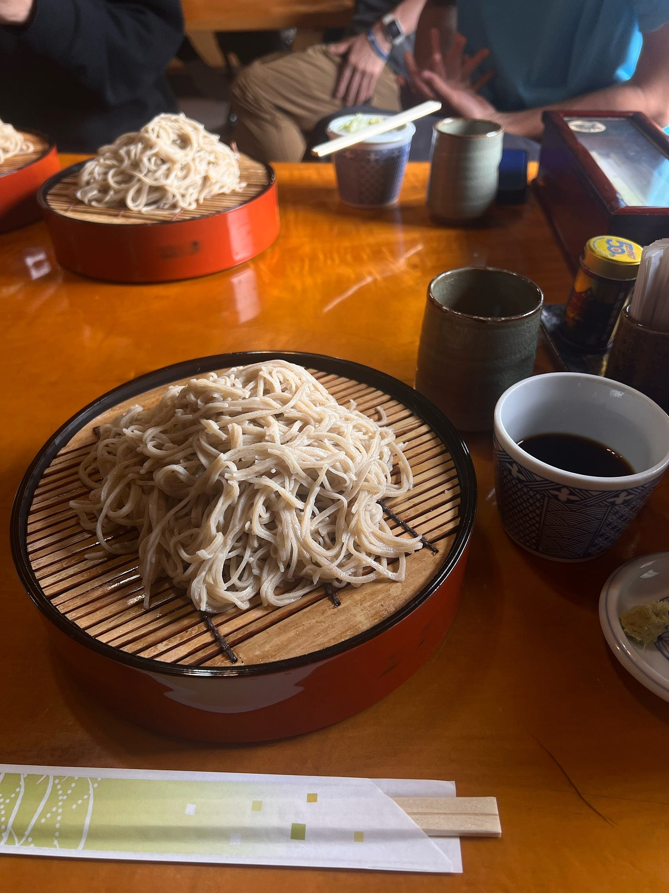
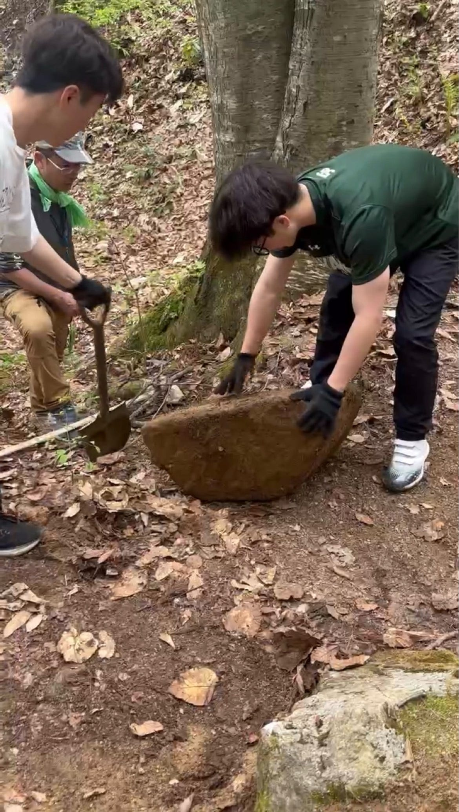
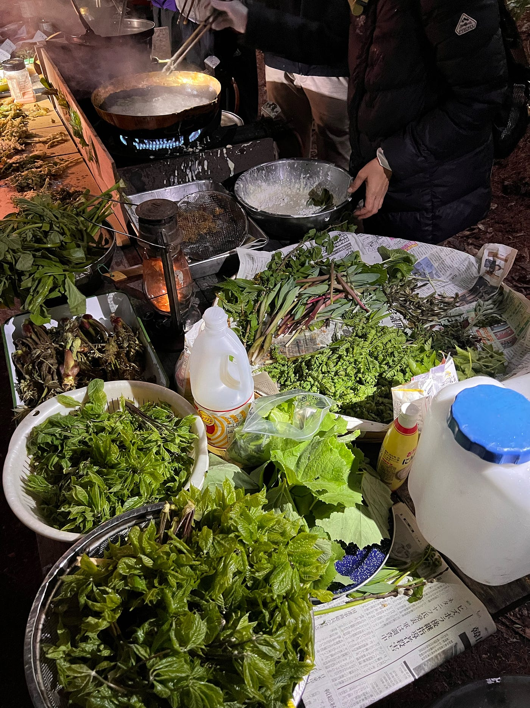
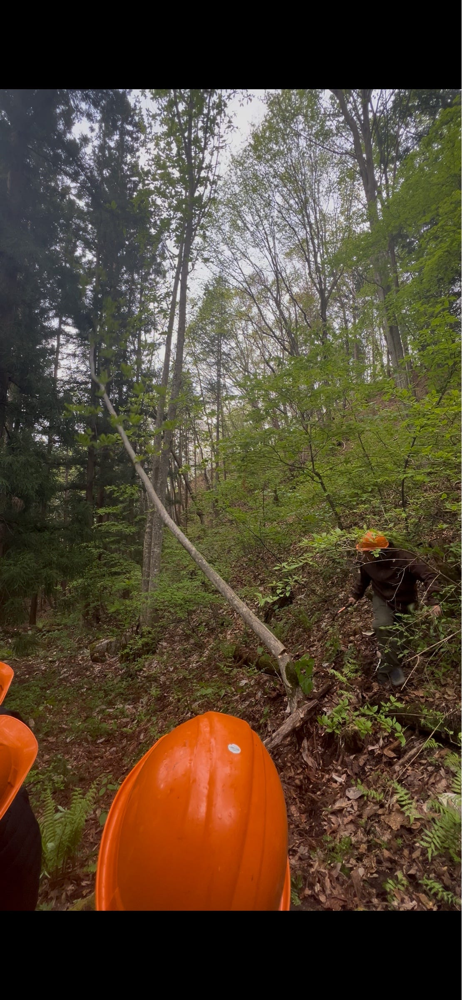
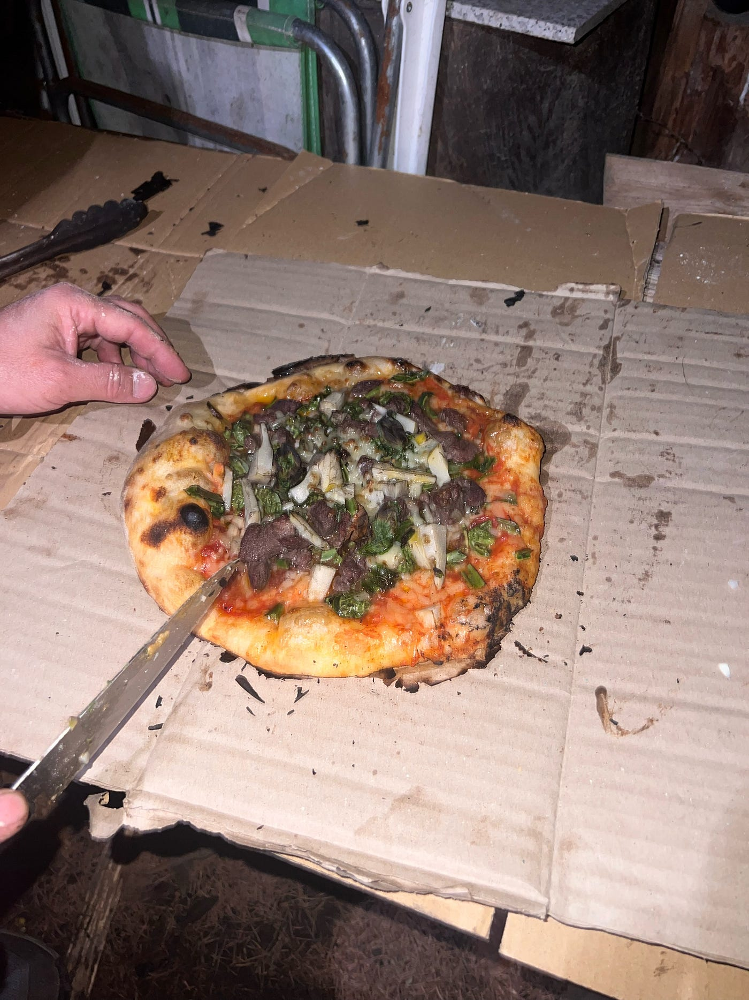
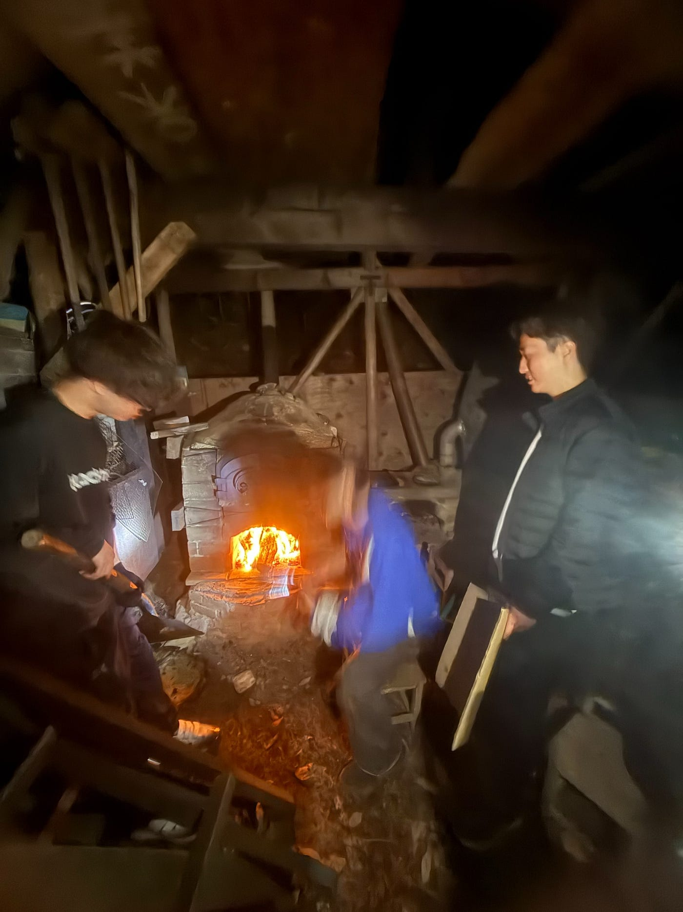
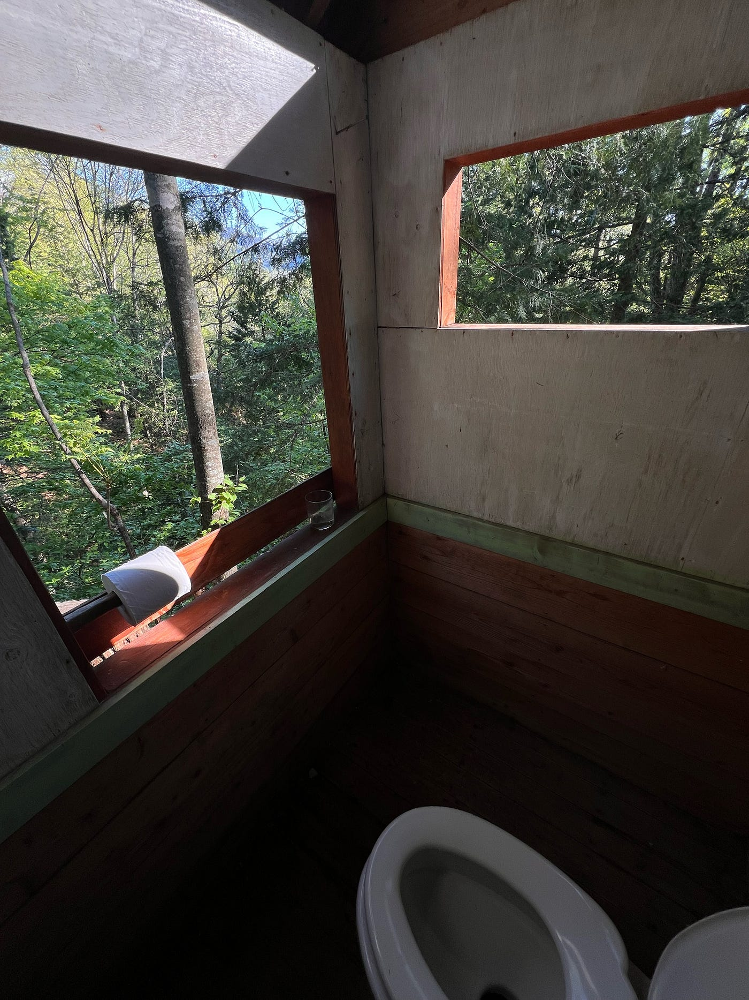

### ピザ焼き職人に成長したツリーハウス合宿＠千年の森学校

みなさんこんにちは！3年の愛甲です。
 今回はゴールデンウィーク中の5月3日から5日にかけて行われた、ツリーハウス合宿＠千年の森自然学校について報告します。

今回お邪魔したのは、長野県大町市にある千年の森自然学校です。山に囲まれた自然豊かな場所でした。道産子の私にとってホームグラウンド的な大自然に囲まれ、普段の大学生活ではなかなか味わえないような、電気・ガス・水道に頼りきらない生活を体験することができました。

### 山開きの千年の森へ

今回の合宿は、ちょうど山開きのタイミングでの訪問でした。
 春が来るのを心待ちにし、森が再び動き出すような時期で、空気も景色もどこか特別な感じがしました。

まずはわっぱらやでお昼！おいしすぎた

到着してまず感じたのは、とにかく自然が近いということです。普段生活している首都圏とは違い、少し歩けば山、見上げれば木々、耳を澄ませば鳥の声。スマホの画面を見る時間よりも、周りの景色を見る時間の方が自然と長くなっていた気がします。

### 山を整地してテント建てた！(リアルマイクラ

大人の方の雑談に混ぜていただいた時に衝撃的なことを聞いてしまった。「ここは私有地だから、事前に相談してくれれば、人が死ぬこと以外なら基本なんでもしていいよ。」

マジかよ。

そしてテントを建てるのは本当に山の斜面。歴代の古橋研の先輩が切り開いてきた斜面をさらに自分たちで開拓し、そこにテントを張るのが第一ミッション。とにかく掘って、砂を退けて、馬鹿でかい岩も掘った。

(過去の先輩は挫折したらしい^ ^)
雨が降り始める予報の午後3時までになんとか無事に全員テントを建て終わることができてみんな安心。

### **メインイベント、山菜祭り**

今回の合宿のメインは、なんといっても山菜祭りです。
 1日目の夜には、採れたての山菜を天ぷらにしていただきました。

振り返ると私自身父親の影響で山登りや山菜には小さい頃からご縁があり、今回も山菜を食べられることを密かに心待ちにしていました。

やっぱりとれたてで新鮮な山菜は美味しい、、、。
サクサクの衣の中から山菜の香りが広がり、「これが春の味か……」という気持ちになりました。私のイチオシのウド以外の山菜の名前を全部覚えられたかと言われると怪しいですが、どれも美味しかったことだけは確実に覚えています。

### 二日目は山神様へのご挨拶

二日目はみんなで朝から崖を登り、山神様へご挨拶しに行きました。
以下がStravaでの行動記録になります。

[strava.app.linktS](https://strava.app.link/G3mZFnbz32b)

途中で先生からのレクチャーもあり、ハイキングしながら自然の知識も身につき、とてもいい運動になりいい経験になりました。

### 木を切った！

夕方から、林野庁にいた方や、伐採を仕事としている方による、実際に木をどのようにして伐採しているのかを見学させていただきました。木を切る前に、大きさの確認の仕方、重心がどこにあるのか、それによってどこに倒れそうなのか、倒れる方向に他の木は重なってないか、など、１本の木を切るだけでも大量のことを気にする必要があることを学びました。林業は作業員の死亡件数が高い、というお話も、林業がここまで危険なものだと思っていなかったため、新しい知識を身につけることができました。

### 山菜ピザ、そしてピザ焼き職人へ

二日目の夜には、古橋先生特製の山菜ピザをいただきました。
先生のピザを食べるのは2月末の顔合わせ以来でとても楽しみでした。

そして今回、自分はピザ釜でピザを焼く担当になりました。
 最初はピザ焼き体験の方のピザを20枚近く焼きました。火加減や焼き加減が難しく、焦げそうになったり、逆にもう少し焼きたいなと思ったりと苦戦しました。しかし何枚も焼いていくうちに、だんだんとピザの回し方や取り出すタイミングが分かるようになり、先生のピザを焼く頃には腕前レベルが格段に上がっていました。釜の温度を高音に保ちながら待機し、ピザが完成するまで釜の温度を高音に保ち、先生の焼き加減チェックを受けながら焼き進めました。

(↑ゆうとが残像に
 山菜とピザという組み合わせは最初少し意外でしたが、食べてみると驚くほど相性が良く、尚且つ自分達で焼いたのもあり、とても美味しかったです。
おそらくこの合宿で一番ピザ釜と向き合った人間だと思います。
 次に千年の森でピザを焼く機会があれば、ぜひ自分に任せてください。

### 自然の中で生活するということ

今回の合宿では、山菜祭りやピザ作りだけでなく、千年の森での生活そのものが大きな学びになりました。
 普段の生活では、スイッチを押せば電気がつき、蛇口をひねれば水が出て、コンロをつければすぐに火が使えます。しかし、千年の森ではそうした当たり前が当たり前ではありません。

火を使うにも準備が必要で、水を使うにも量を考えなければならず、夜になれば自然の暗さを感じます。そうした環境の中で過ごすことで、自分たちが普段どれだけ便利なものに囲まれて生活しているのかを改めて実感しました。

同時に、不便だからこそ感じられる楽しさもありました。みんなで火を囲んだり、ご飯を作ったり、自然の中で過ごしたりする時間は、普段の生活ではなかなか得られないものでした。

(人生で一番開放的なトイレ。快適でした。

### 感想

今回のツリーハウス合宿を通して、自然の中で生活することの大変さと面白さの両方を強く感じました。普段の生活では、電気・ガス・水道があることを当たり前のように感じていますが、千年の森ではその一つひとつが当たり前ではありませんでした。火を起こすこと、水を使うこと、寝る場所をつくることなど、生活の基本に自分たちの手を動かして関わることで、自分たちが普段どれだけ便利な環境に頼っているのかを実感しました。しかしその反面、自然に囲まれながら暮らすことの楽しさに気づくことができた3日間だったと感じます。

また、山菜祭りや山神様へのご挨拶、木の伐採見学を通して、山はただ「自然を楽しむ場所」ではなく、人の暮らしや文化、仕事と深くつながっている場所なのだと感じました。特に林業の話では、一本の木を切るだけでも多くの判断と危険があり、自然と向き合うことの責任の重さを知ることができました。

そして個人的には、ピザ釜担当として何枚もピザを焼き続けたことがとても印象に残っています。最初は火加減も焼き加減も分からず苦戦しましたが、何度も挑戦するうちに少しずつコツをつかみ、最後にはピザ焼き職人として成長できた気がします。山菜を使ったピザを自然の中で食べる時間は、今回の合宿ならではの特別な体験でした。

千年の森での三日間は、自然の厳しさと豊かさ、そして人と山との関わりを体感できる貴重な時間でした。ただ自然の中で過ごすだけではなく、そこにある暮らしや知恵をどう次の世代につないでいくのかを考えるきっかけにもなりました。また千年の森に行く機会があれば、次はさらにレベルアップしたピザ焼き職人として参加したいです。

### グラレコ
