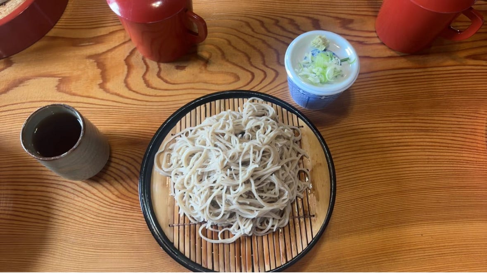
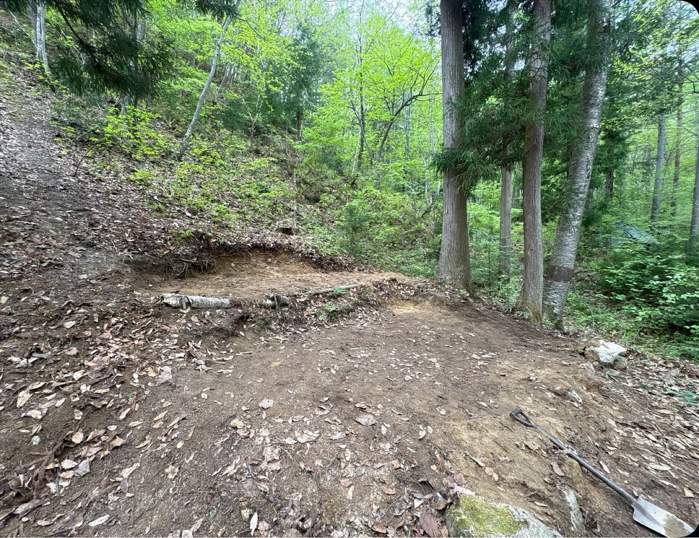
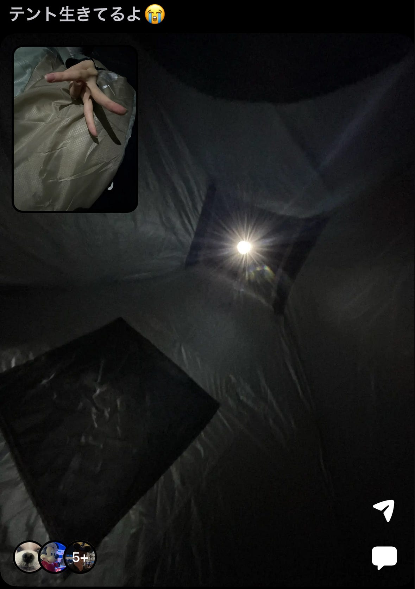
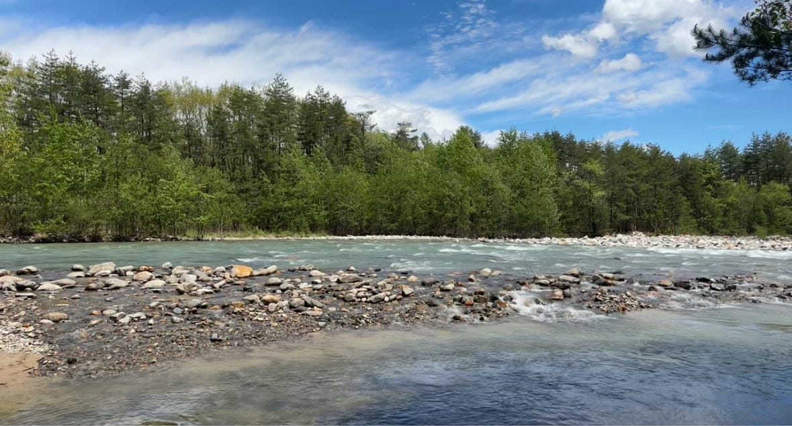
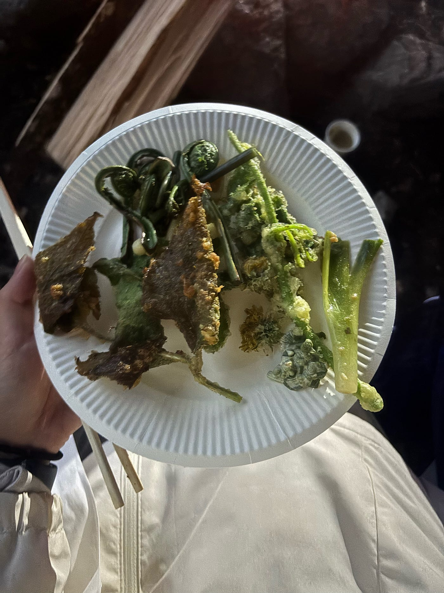
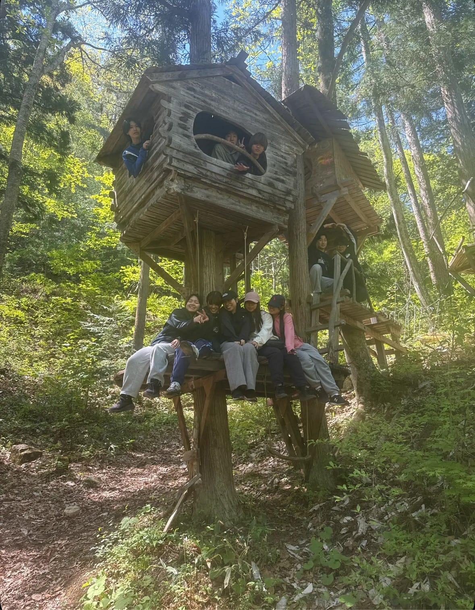
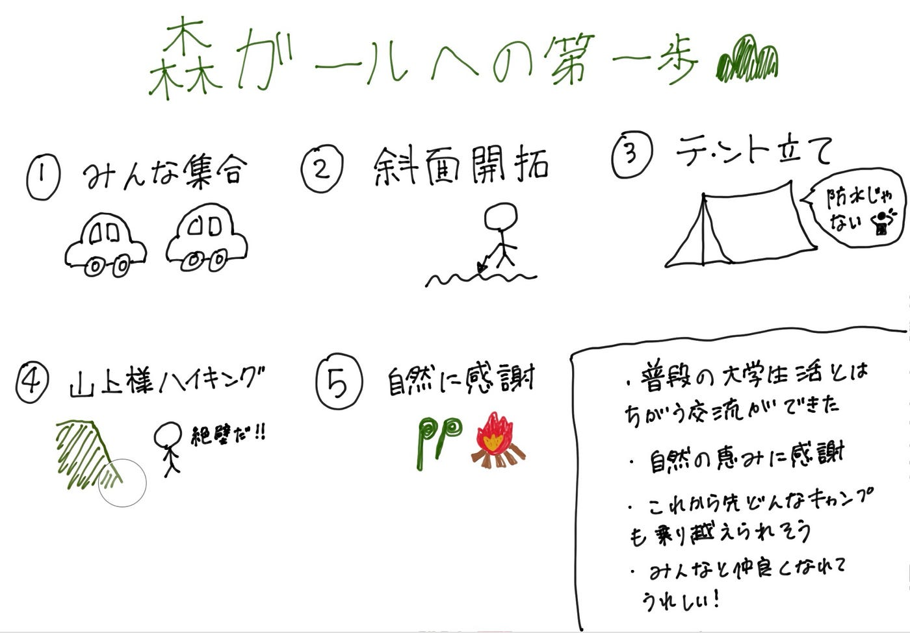

### 森ガールへの第一歩⛰👧斜面開拓から始まるGW

こんにちは！3年の加藤です。5月3～5日に行った千年の森自然学校でのことをまとめます！

### みんな集合

淵野辺組とそれ以外組で分かれて出発しました。私たちそれ以外組は深夜に出発してサービスエリアで車中泊をして過ごしました。そして古橋先生おすすめの蕎麦屋さんわっぱら屋で淵野辺組と全員集合しました。お蕎麦もちろん美味しかったのですが、ここ蕎麦湯はとろとろで美味しかったです。

### 斜面開拓

千年の森自然学校に到着して、先輩からも話に聞いていた斜面を平地にする作業が始まりました。作業しているうちに「ここも広げたい！」と思うようになり写真では分かりずらいですが、気づいたら広々としたスペースが出来上がっていました。

このようにして代々開拓されて来たのかと思うと感慨深いです。来年の後輩たちはかなり快適に過ごせるのではないかと思います。

削って平らにした土地を切土といい、土を盛って作った土地を盛土と言うことを知りました。盛土の方は地面が柔らかく不安定なため、家を購入する際には切土の方の土地を買うといいということを教えてもらいました。

### どきどきテント泊

テントを購入してから、小さく「撥水仕様ですが防水仕様ではありません」と書かれていることに気づき、天気予報を確認したら雨でした。😭買い直すとお金がもったいなかったので、防水スプレーを買って凌ぐことに決めました。

夜になって雨が降ってきてしまいましたが、テントの中に少し水たまりができた程度で済みました。森の中では樹木や葉が傘のような役割を果たすため、雨の直撃が減ったことによって浸水を防げたのではないかと考えます。防水スプレーの効き目もあったと思いたいです。

テントに関しては浸水しているメンバーが他にもいたので自分はかなりマシなほうだと安心しました。

当時のBeRealです。緊迫した状況が伝わると嬉しいです。

### 山神様ハイキング

崖みたいなところを登ると言われてとても驚きました。私が崖だと思ったそこは、崖ではなく斜面だそうです。

両手・両足の4点のうち3点を地面に着け、残り1点を動かす三点支持という技術で、大きな怪我をすることなく安全に移動することが出来ました。

関東ではなかなか見ることの出来ない透き通った川がとても綺麗でした。夏だったら水遊びがしたいと思いました。

Stravaの記録です。

[strava.app.link](https://strava.app.link/vj2WDFv4e3b)

### 自然に感謝

たくさん動いた後に食べた山菜と山菜のピザは絶品でした。

夜はとても寒かったので焚き火を囲んでみんなで談話していました。今はスイッチひとつで簡単に暖を取れるけれど、火を発見した当時の人たちは、そのぬくもりや食べ物を焼いて食べられることにどれほど感動したんだろうと想像して、勝手に原始時代を生きる気分になっていました。自然の恵みに改めて感謝した夜でした。

自然の中で過ごしたことで、スマホやインターネットから少し離れて人と直接話す時間の楽しさも感じました。焚き火を囲みながら話していると時間があっという間に過ぎ、普段の大学生活とは違う距離感で交流することができました。自然の中で協力しながら生活した経験は、とても貴重な思い出になったと思います。ゼミ活動は始まって間もないけどみんなとも先生とも仲良くなれて嬉しかったです！

今回の経験があれば、これから先どんなキャンプも乗り越えられる気がします。まだまだ初心者ですが、これからも自然に触れながら、少しずつ森ガール⛰👧を目指していきたいです！

最後にグラレコです。

