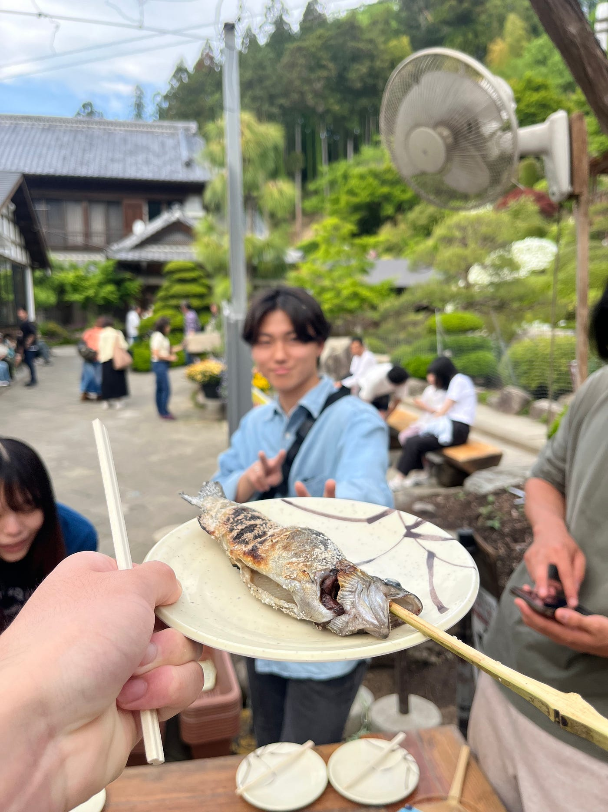
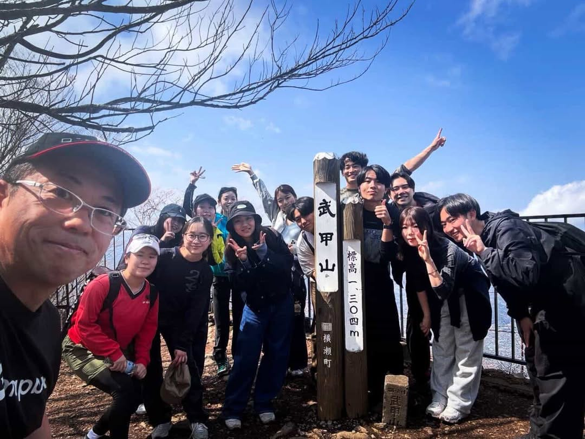
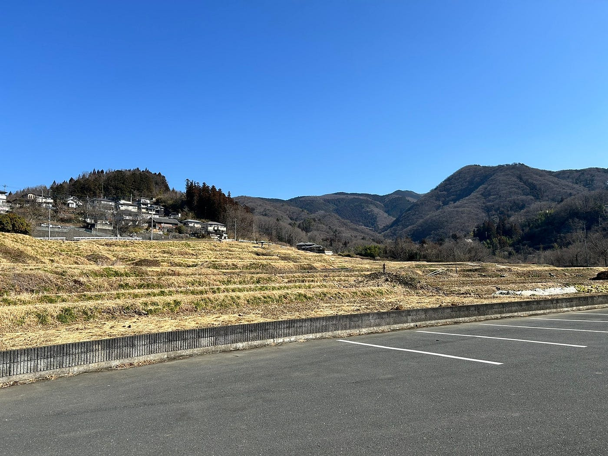
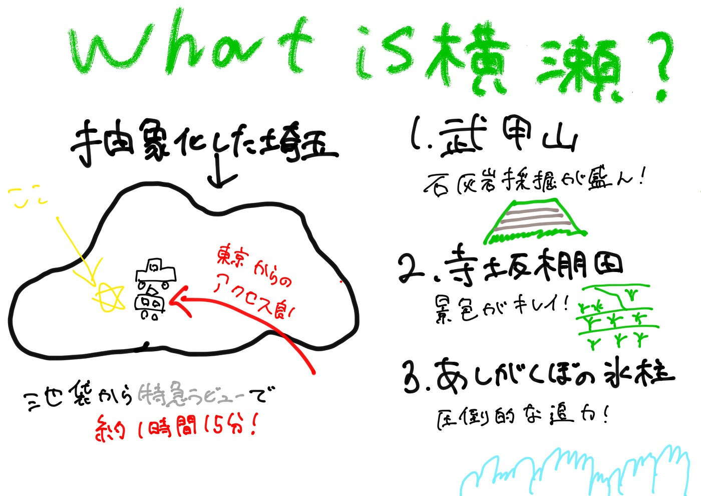

### 横瀬横瀬言ってるけど実際横瀬って一体何？【横瀬部週報】

みなさんこんにちは！淵野辺から横瀬までのルートを完全に暗記してしまった4年の加藤です！

横瀬部再始動の一員になったわけですが、じゃあ実際横瀬って何者なんですか？説明できますか？僕は淵野辺から横瀬までのルートしか説明できません。

ということで今回は横瀬町は一体何者なのかをまとめてみたいと思います。

#### What is Yokoze?

横瀬町は埼玉県の西部、秩父地方の南東部に位置しており都心から70km圏内に位置しています。総面積は49.49k㎡、東は飯能市、西は秩父市に面しています。主要道路としては国道299号線が、そして鉄道は西武秩父線が東西に走っており[横瀬駅](https://www.seiburailway.jp/railway/station/yokoze/)、[芦ヶ久保駅](https://www.seiburailway.jp/railway/station/ashigakubo/)の二駅が設置されています。[特急ラビュー](https://www.seiburailway.jp/railways/laview/)を使えば池袋駅から約1時間15分で足を運ぶことができ都心からのアクセスも抜群なのです。

主要な産業はやはり土地を活かした農林業、とりわけ果樹を主体とする観光農業が盛んに行われています。5月のこの時期はいちご狩りがめちゃ良さそう。町内には農園が複数あるのでお気に入りの農園を見つけてみては？個人的に[小松沢レジャー農園](https://www.komatsuzawa.co.jp/)は春夏秋冬四季折々の体験をすることができるのでおすすめです。

と堅苦しくまとめてみましたが、こんなことつらつら書かれたら眠くなってしまうそんなあなたに、横瀬の観光スポットを紹介してあげましょう。

#### 観光スポットまとめてみた件

#### 1.[武甲山](https://yamap.com/mountains/96)

古橋研と言ったらやっぱり山ですよね。横瀬町の西部、ANNEXの裏側に位置する武甲山は標高1304mの秩父地域のシンボル的な山。石灰岩採掘が盛んに行われておりその外観は年々変化し続けています。古橋研では今年の3月末に行われた先輩たちの追いコンで登らさせていただきました。果たして山登りで先輩たちを追い出せたのでしょうか。はたまた私たちの体力を追い込んだのでしょうか。

#### 2.[寺坂棚田](https://www.yokoze.org/tanada/)

体力に自信がないそんなあなた。山以外にも魅力はたくさんありますよ。寺坂棚田は埼玉県内最大級の棚田と言われており、全体面積は5.2ha。そのうち4.0haが水田に利用されています。ちなみに東京ドームは約4.6755ha。大体東京ドーム一個分の棚田ということになりますね。7月にはほたるかがり火まつり、9月には彼岸花まつりというイベントが開催され美しい風景を楽しむことができます。

#### 3.[あしがくぼの氷柱](https://www.yokoze.org/hyouchuu/)

横瀬町の冬といったらこれ。あしがくぼの氷柱が横瀬町を彩ります。例年1月中旬から2月下旬に開催されており高さ30ｍ,幅200ｍにわたって、壮大な氷の世界が広がります。実はこの氷柱、例年町内在住のボランティアスタッフが上流の沢水の取水し、スプリンクラーやホースで散水し、人間の力で氷柱を育て上げているのです！こりゃすごい。私も今年のよこらぼ大会議の後に足を運んだのですが、人が作り上げたとは思えない迫力で圧倒されました。

みなさん横瀬について学べましたか？これでみんなも横瀬マスター（？）ということで横瀬町の皆さん古橋研究室を今後ともご贔屓に。

#### 今日の俳句

咳をしても横瀬(自由律俳句)

